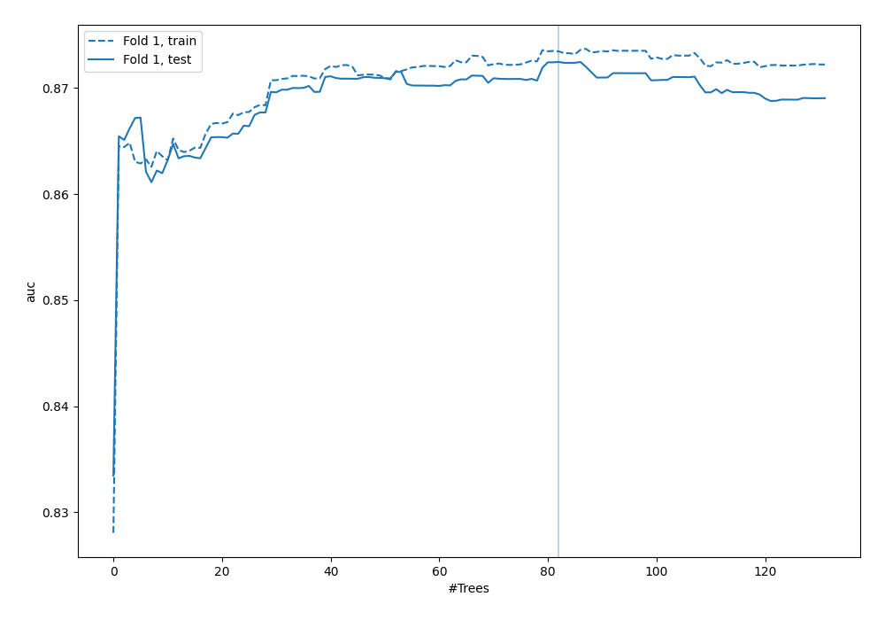
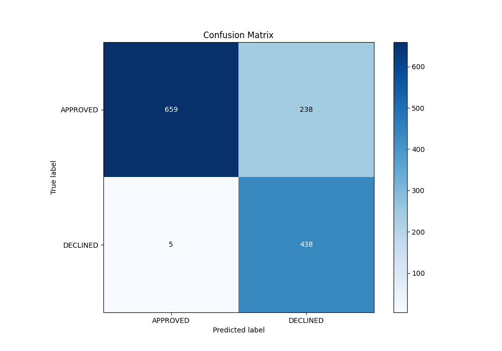
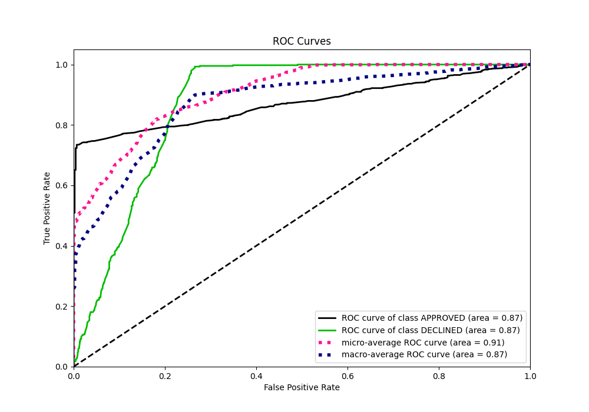
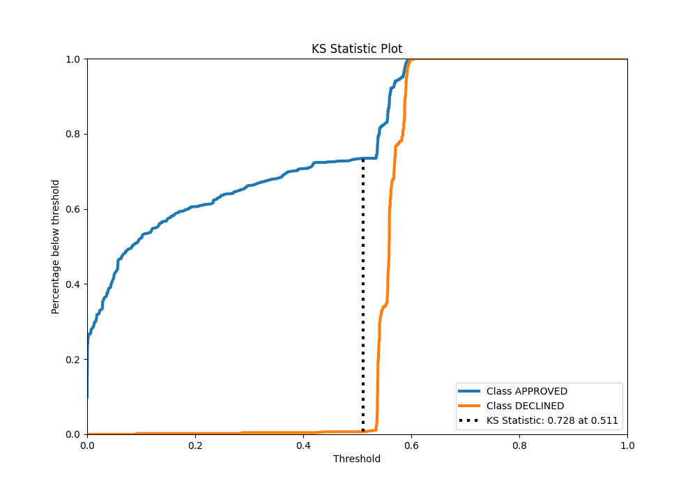
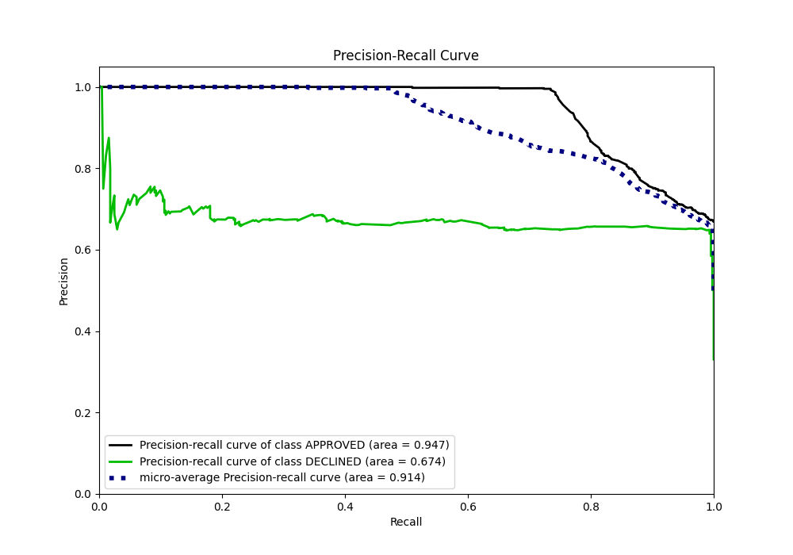
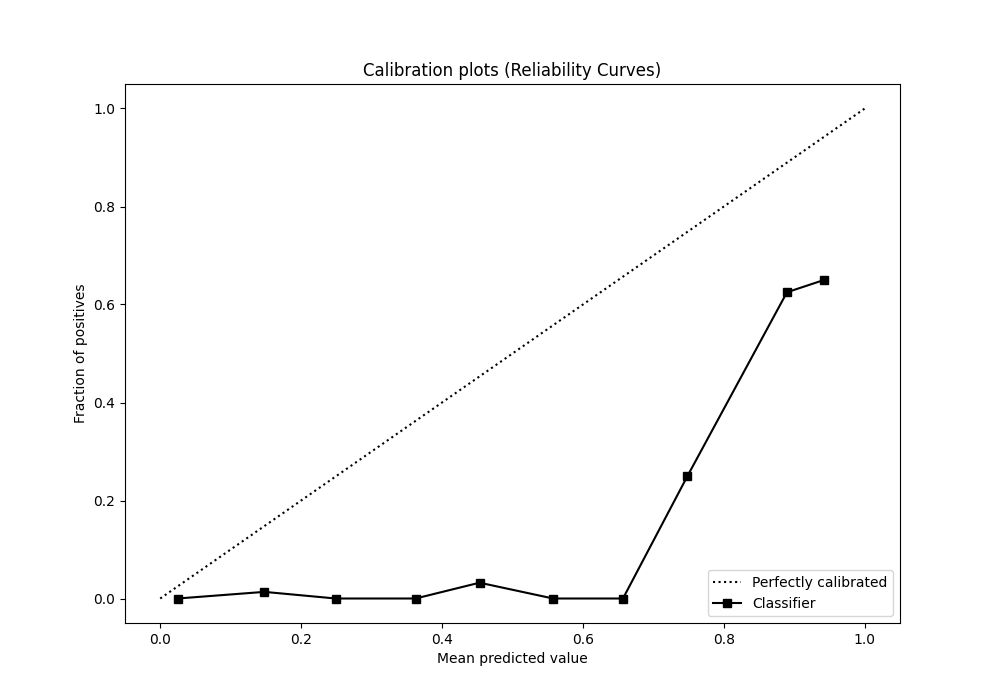
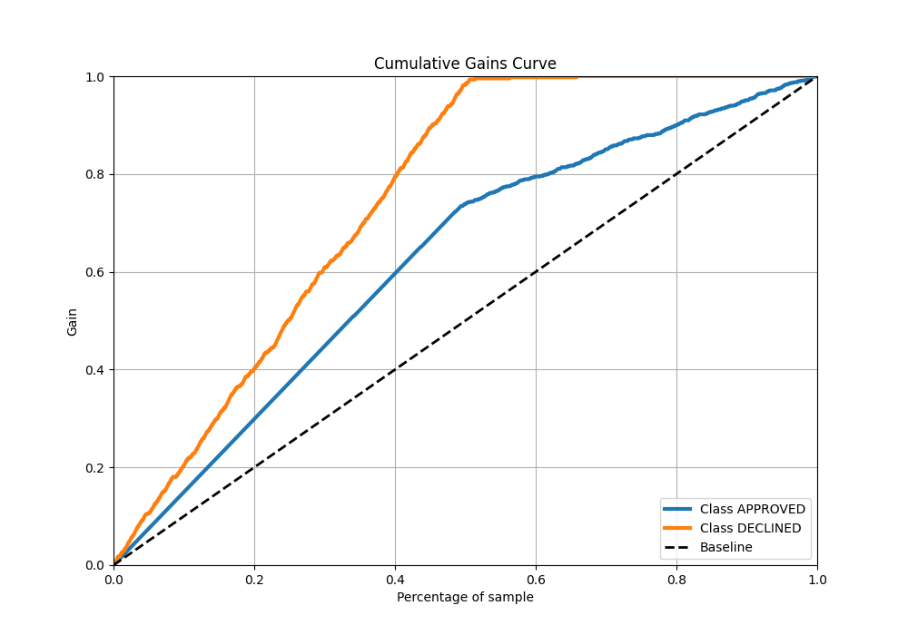
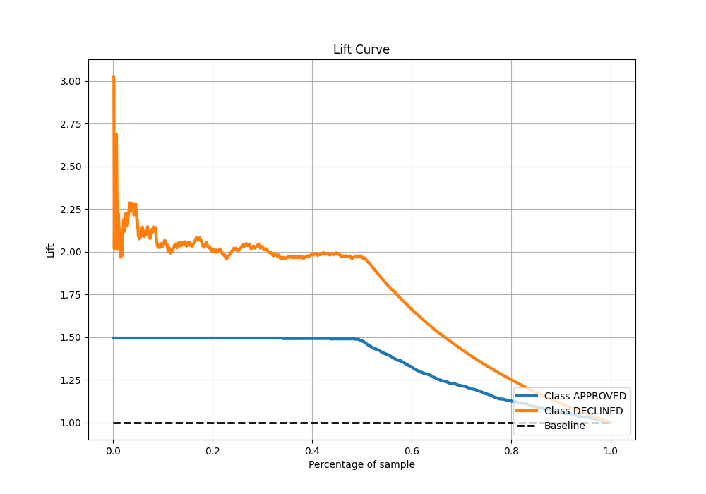

# Summary of 104_ExtraTrees

[<< Go back](../README.md)

## Extra Trees Classifier (Extra Trees)
- **n_jobs**: -1
- **criterion**: gini
- **max_features**: 1.0
- **min_samples_split**: 20
- **max_depth**: 5
- **eval_metric_name**: auc
- **explain_level**: 0

## Validation
 - **validation_type**: split
 - **train_ratio**: 0.8
 - **shuffle**: True
 - **stratify**: True

## Optimized metric
auc

## Training time

3.1 seconds

## Metric details
|           |    score |   threshold |
|:----------|---------:|------------:|
| logloss   | 0.390966 |  nan        |
| auc       | 0.872469 |  nan        |
| f1        | 0.782842 |    0.535086 |
| accuracy  | 0.818657 |    0.535086 |
| precision | 0.74     |    0.590016 |
| recall    | 1        |    0        |
| mcc       | 0.680628 |    0.535086 |

## Metric details with threshold from accuracy metric
|           |    score |   threshold |
|:----------|---------:|------------:|
| logloss   | 0.390966 |  nan        |
| auc       | 0.872469 |  nan        |
| f1        | 0.782842 |    0.535086 |
| accuracy  | 0.818657 |    0.535086 |
| precision | 0.647929 |    0.535086 |
| recall    | 0.988713 |    0.535086 |
| mcc       | 0.680628 |    0.535086 |

## Confusion matrix (at threshold=0.535086)
|                     |   Predicted as APPROVED |   Predicted as DECLINED |
|:--------------------|------------------------:|------------------------:|
| Labeled as APPROVED |                     659 |                     238 |
| Labeled as DECLINED |                       5 |                     438 |

## Learning curves

## Confusion Matrix

## Normalized Confusion Matrix

## ROC Curve

## Kolmogorov-Smirnov Statistic

## Precision-Recall Curve

## Calibration Curve

## Cumulative Gains Curve

## Lift Curve

[<< Go back](../README.md)
