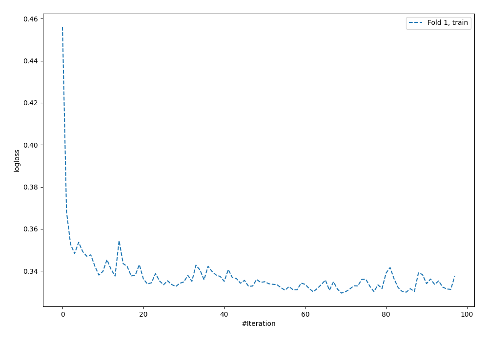
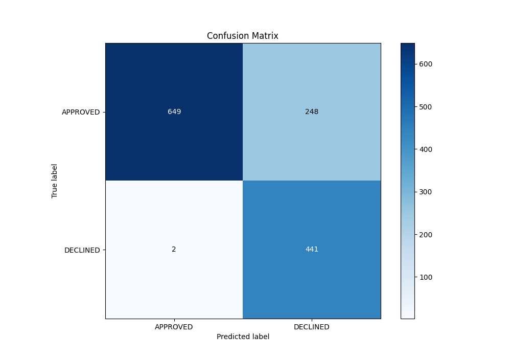
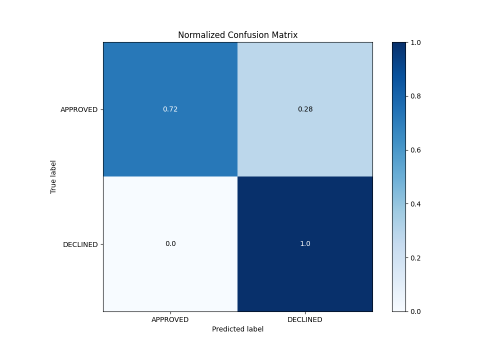
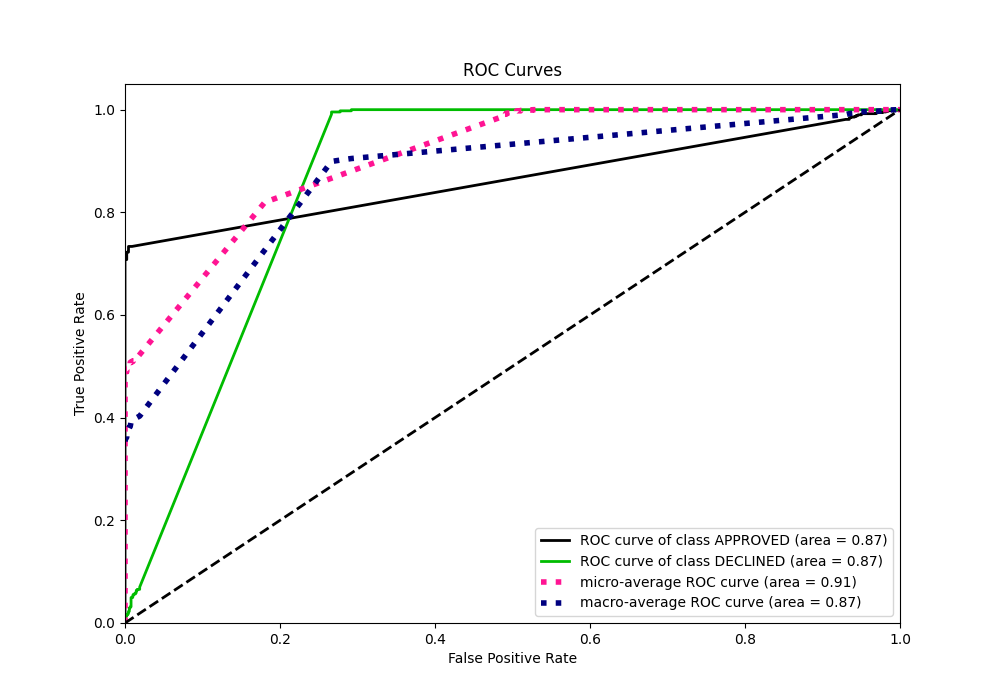
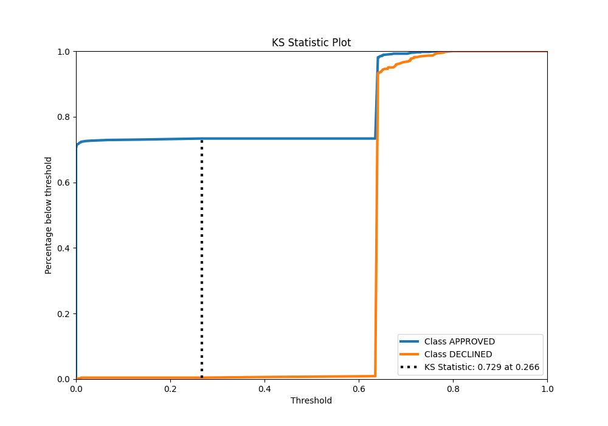
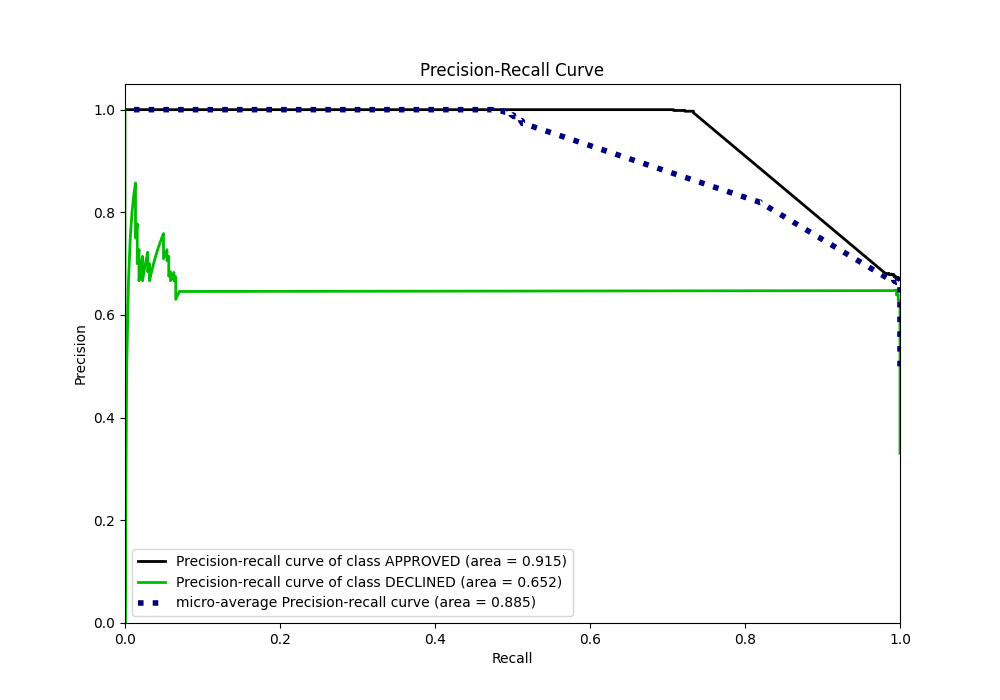
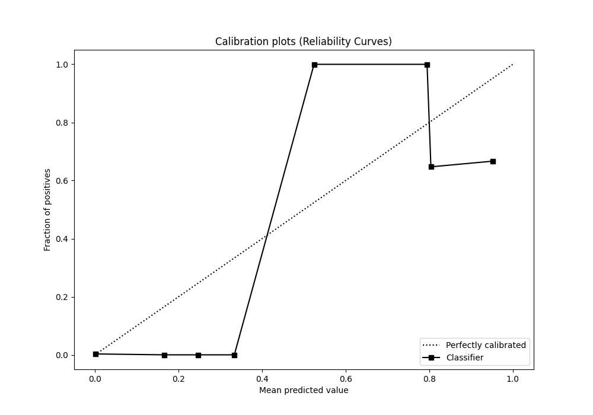
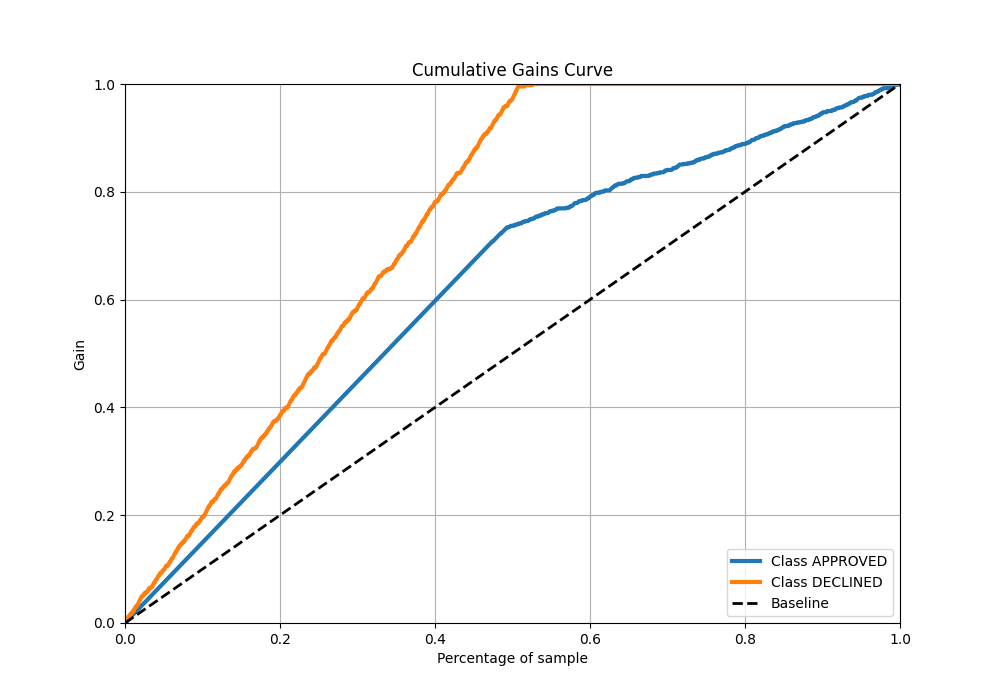
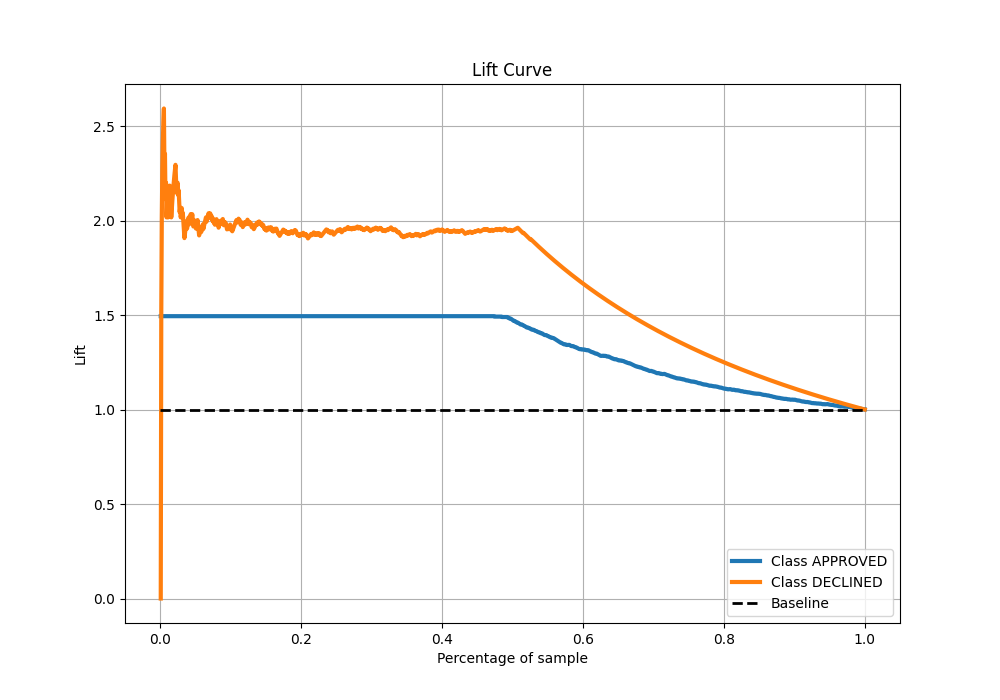

# Summary of 107_NeuralNetwork

[<< Go back](../README.md)

## Neural Network
- **n_jobs**: -1
- **dense_1_size**: 16
- **dense_2_size**: 8
- **learning_rate**: 0.05
- **explain_level**: 0

## Validation
 - **validation_type**: split
 - **train_ratio**: 0.8
 - **shuffle**: True
 - **stratify**: True

## Optimized metric
auc

## Training time

2.9 seconds

## Metric details
|           |    score |   threshold |
|:----------|---------:|------------:|
| logloss   | 0.338876 | nan         |
| auc       | 0.865559 | nan         |
| f1        | 0.779152 |   0.0132541 |
| accuracy  | 0.813433 |   0.0132541 |
| precision | 0.645833 |   0.640656  |
| recall    | 1        |   0         |
| mcc       | 0.676756 |   0.0132541 |

## Metric details with threshold from accuracy metric
|           |    score |   threshold |
|:----------|---------:|------------:|
| logloss   | 0.338876 | nan         |
| auc       | 0.865559 | nan         |
| f1        | 0.779152 |   0.0132541 |
| accuracy  | 0.813433 |   0.0132541 |
| precision | 0.640058 |   0.0132541 |
| recall    | 0.995485 |   0.0132541 |
| mcc       | 0.676756 |   0.0132541 |

## Confusion matrix (at threshold=0.013254)
|                     |   Predicted as APPROVED |   Predicted as DECLINED |
|:--------------------|------------------------:|------------------------:|
| Labeled as APPROVED |                     649 |                     248 |
| Labeled as DECLINED |                       2 |                     441 |

## Learning curves

## Confusion Matrix

## Normalized Confusion Matrix

## ROC Curve

## Kolmogorov-Smirnov Statistic

## Precision-Recall Curve

## Calibration Curve

## Cumulative Gains Curve

## Lift Curve

[<< Go back](../README.md)
