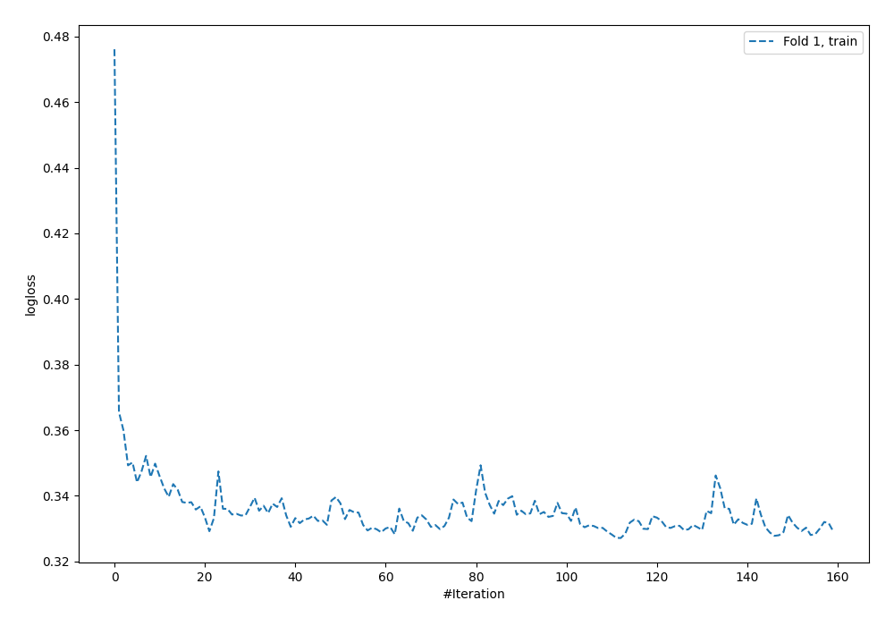
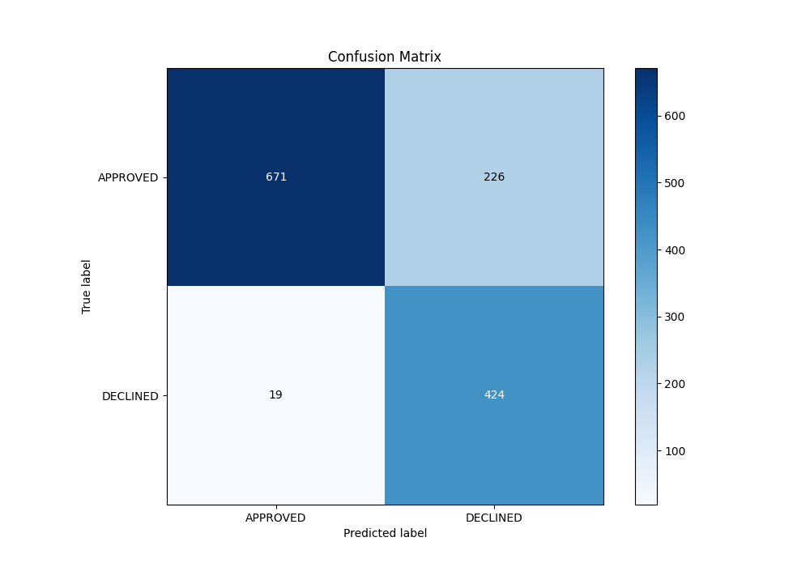
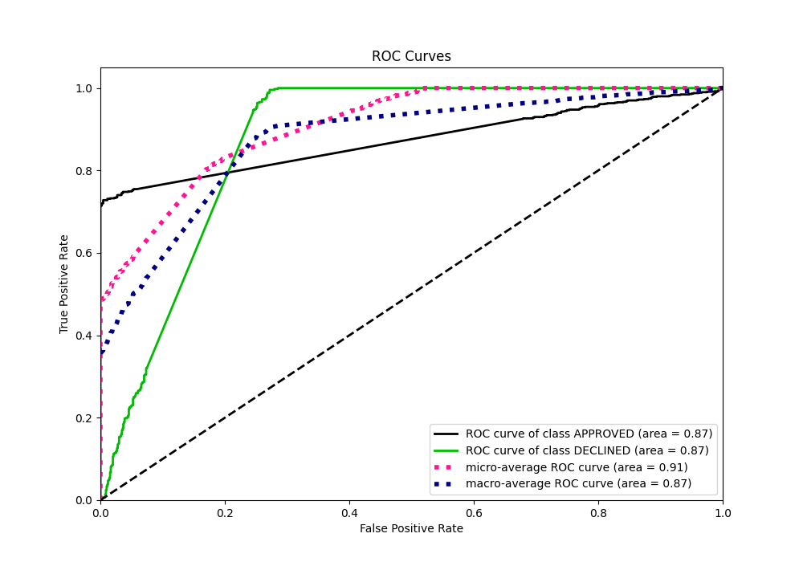
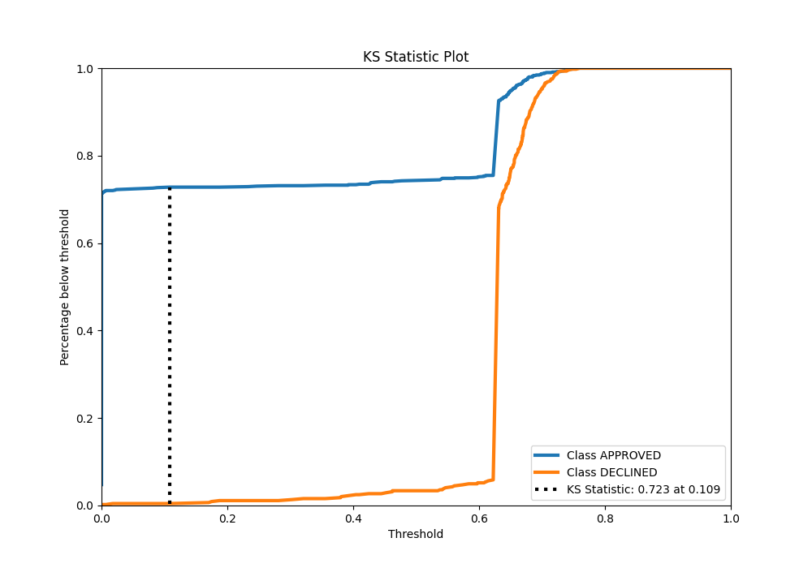
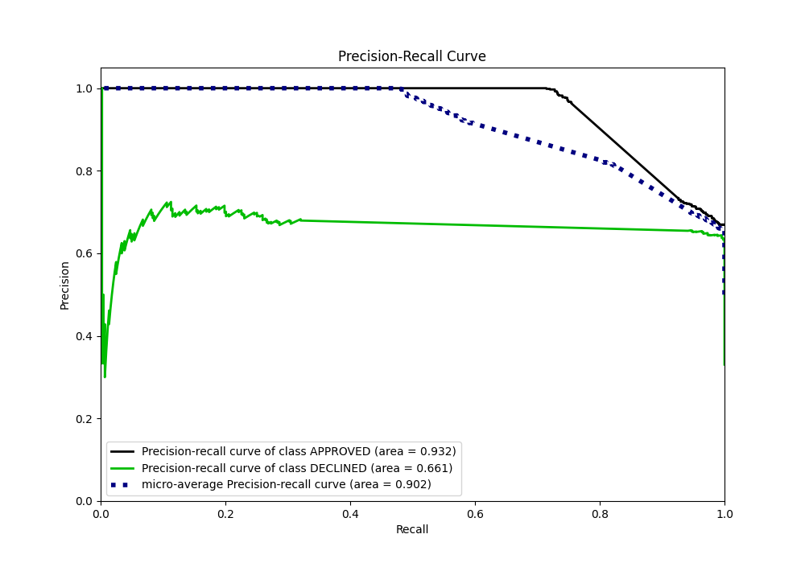
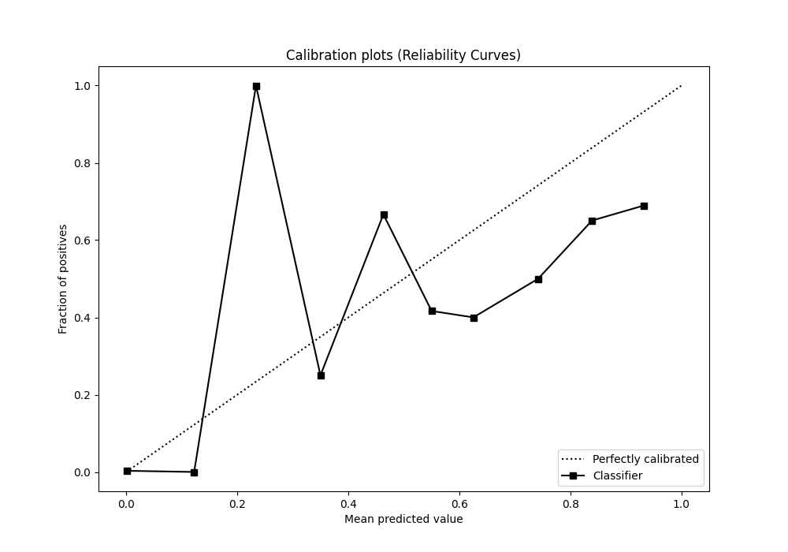
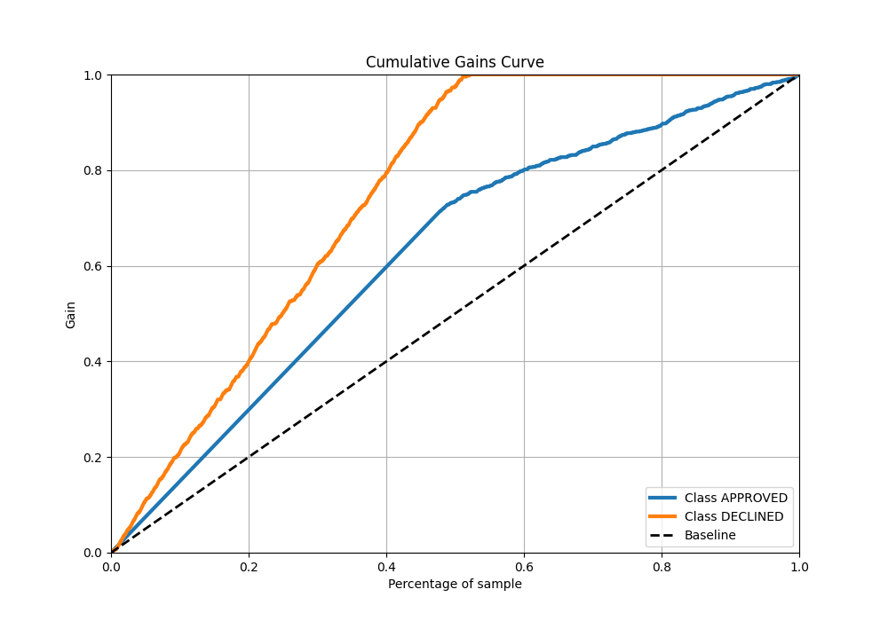
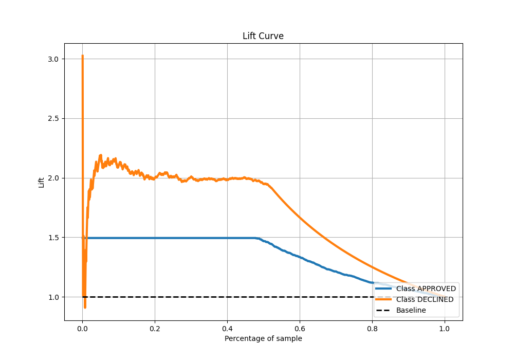

# Summary of 108_NeuralNetwork

[<< Go back](../README.md)

## Neural Network
- **n_jobs**: -1
- **dense_1_size**: 16
- **dense_2_size**: 32
- **learning_rate**: 0.05
- **explain_level**: 0

## Validation
 - **validation_type**: split
 - **train_ratio**: 0.8
 - **shuffle**: True
 - **stratify**: True

## Optimized metric
auc

## Training time

4.7 seconds

## Metric details
|           |    score |   threshold |
|:----------|---------:|------------:|
| logloss   | 0.341693 | nan         |
| auc       | 0.873801 | nan         |
| f1        | 0.779267 |   0.367657  |
| accuracy  | 0.817164 |   0.559237  |
| precision | 0.723077 |   0.679736  |
| recall    | 1        |   0         |
| mcc       | 0.676756 |   0.0515141 |

## Metric details with threshold from accuracy metric
|           |    score |   threshold |
|:----------|---------:|------------:|
| logloss   | 0.341693 |  nan        |
| auc       | 0.873801 |  nan        |
| f1        | 0.775846 |    0.559237 |
| accuracy  | 0.817164 |    0.559237 |
| precision | 0.652308 |    0.559237 |
| recall    | 0.957111 |    0.559237 |
| mcc       | 0.66375  |    0.559237 |

## Confusion matrix (at threshold=0.559237)
|                     |   Predicted as APPROVED |   Predicted as DECLINED |
|:--------------------|------------------------:|------------------------:|
| Labeled as APPROVED |                     671 |                     226 |
| Labeled as DECLINED |                      19 |                     424 |

## Learning curves

## Confusion Matrix

## Normalized Confusion Matrix

## ROC Curve

## Kolmogorov-Smirnov Statistic

## Precision-Recall Curve

## Calibration Curve

## Cumulative Gains Curve

## Lift Curve

[<< Go back](../README.md)
