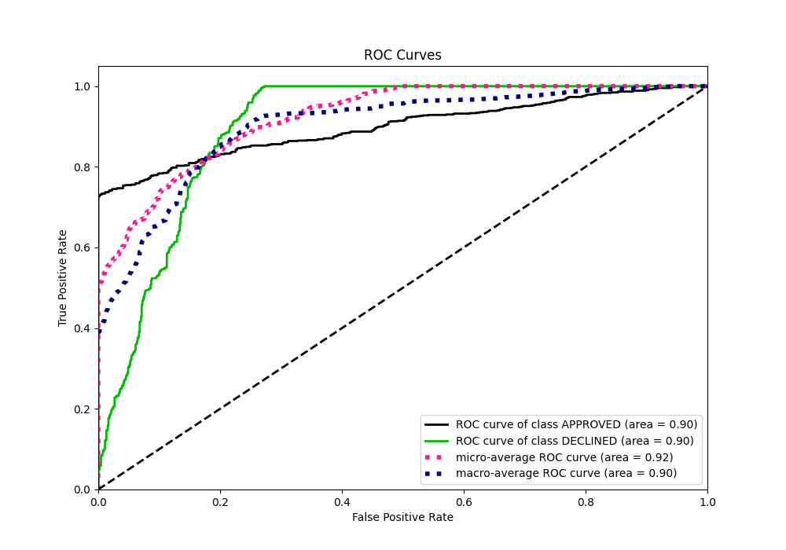

# Summary of 109_Xgboost

[<< Go back](../README.md)

## Extreme Gradient Boosting (Xgboost)
- **n_jobs**: -1
- **objective**: binary:logistic
- **eta**: 0.075
- **max_depth**: 5
- **min_child_weight**: 5
- **subsample**: 0.7
- **colsample_bytree**: 0.6
- **eval_metric**: auc
- **explain_level**: 0

## Validation
 - **validation_type**: split
 - **train_ratio**: 0.8
 - **shuffle**: True
 - **stratify**: True

## Optimized metric
auc

## Training time

2.2 seconds

## Metric details
|           |    score |    threshold |
|:----------|---------:|-------------:|
| logloss   | 0.325611 | nan          |
| auc       | 0.898537 | nan          |
| f1        | 0.783002 |   0.494231   |
| accuracy  | 0.824627 |   0.570407   |
| precision | 0.835165 |   0.722147   |
| recall    | 1        |   0.00156851 |
| mcc       | 0.683104 |   0.1103     |

## Metric details with threshold from accuracy metric
|           |    score |   threshold |
|:----------|---------:|------------:|
| logloss   | 0.325611 |  nan        |
| auc       | 0.898537 |  nan        |
| f1        | 0.768473 |    0.570407 |
| accuracy  | 0.824627 |    0.570407 |
| precision | 0.681818 |    0.570407 |
| recall    | 0.880361 |    0.570407 |
| mcc       | 0.644325 |    0.570407 |

## Confusion matrix (at threshold=0.570407)
|                     |   Predicted as APPROVED |   Predicted as DECLINED |
|:--------------------|------------------------:|------------------------:|
| Labeled as APPROVED |                     715 |                     182 |
| Labeled as DECLINED |                      53 |                     390 |

## Learning curves

## Confusion Matrix

## Normalized Confusion Matrix

## ROC Curve

## Kolmogorov-Smirnov Statistic

## Precision-Recall Curve

## Calibration Curve

## Cumulative Gains Curve

## Lift Curve

[<< Go back](../README.md)
