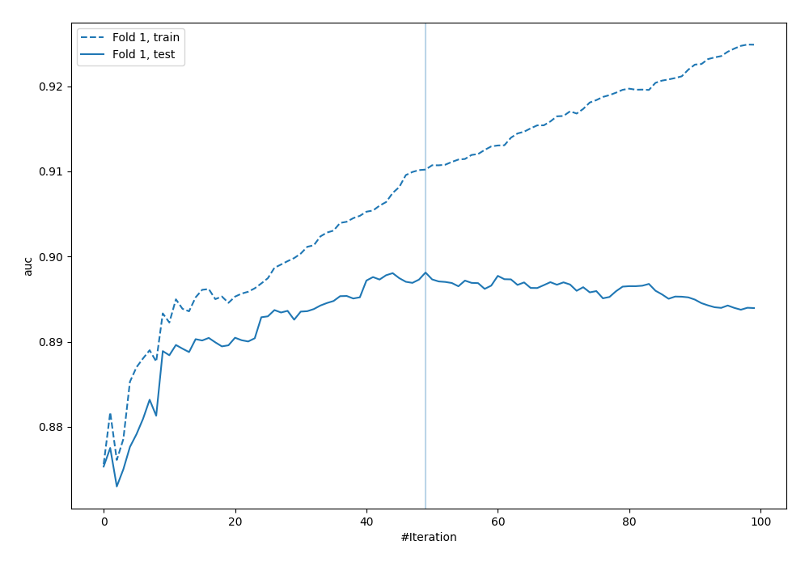

# Summary of 10_Xgboost

[<< Go back](../README.md)

## Extreme Gradient Boosting (Xgboost)
- **n_jobs**: -1
- **objective**: binary:logistic
- **eta**: 0.1
- **max_depth**: 4
- **min_child_weight**: 10
- **subsample**: 0.6
- **colsample_bytree**: 0.6
- **eval_metric**: auc
- **explain_level**: 0

## Validation
 - **validation_type**: split
 - **train_ratio**: 0.8
 - **shuffle**: True
 - **stratify**: True

## Optimized metric
auc

## Training time

1.4 seconds

## Metric details
|           |    score |    threshold |
|:----------|---------:|-------------:|
| logloss   | 0.331121 | nan          |
| auc       | 0.898115 | nan          |
| f1        | 0.784629 |   0.479364   |
| accuracy  | 0.825373 |   0.548177   |
| precision | 0.830769 |   0.710791   |
| recall    | 1        |   0.00343273 |
| mcc       | 0.683801 |   0.479364   |

## Metric details with threshold from accuracy metric
|           |    score |   threshold |
|:----------|---------:|------------:|
| logloss   | 0.331121 |  nan        |
| auc       | 0.898115 |  nan        |
| f1        | 0.783333 |    0.548177 |
| accuracy  | 0.825373 |    0.548177 |
| precision | 0.66405  |    0.548177 |
| recall    | 0.954853 |    0.548177 |
| mcc       | 0.674736 |    0.548177 |

## Confusion matrix (at threshold=0.548177)
|                     |   Predicted as APPROVED |   Predicted as DECLINED |
|:--------------------|------------------------:|------------------------:|
| Labeled as APPROVED |                     683 |                     214 |
| Labeled as DECLINED |                      20 |                     423 |

## Learning curves

## Confusion Matrix

## Normalized Confusion Matrix

## ROC Curve

## Kolmogorov-Smirnov Statistic

## Precision-Recall Curve

## Calibration Curve

## Cumulative Gains Curve

## Lift Curve

[<< Go back](../README.md)
