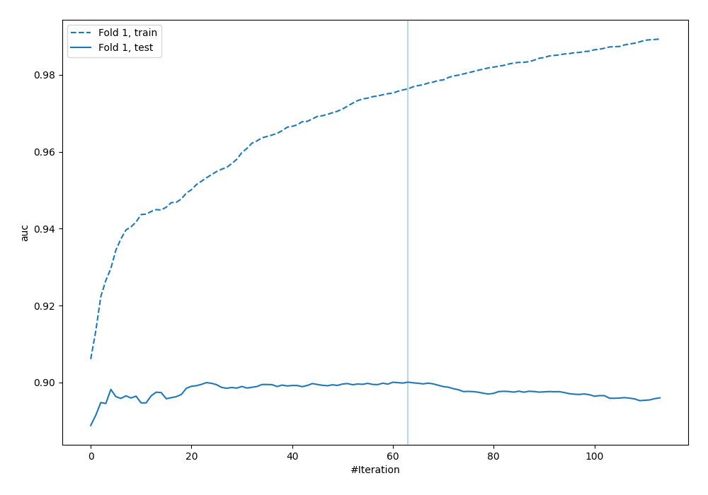
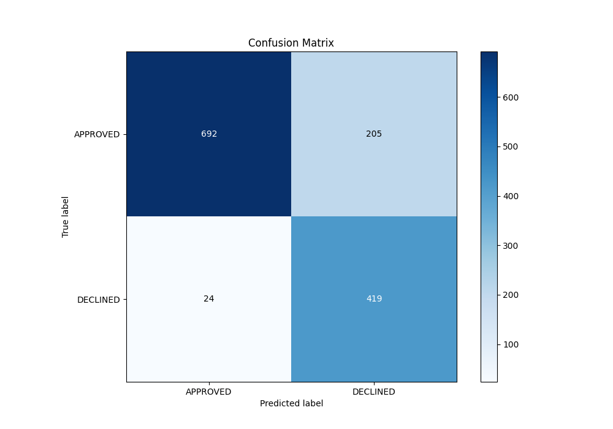
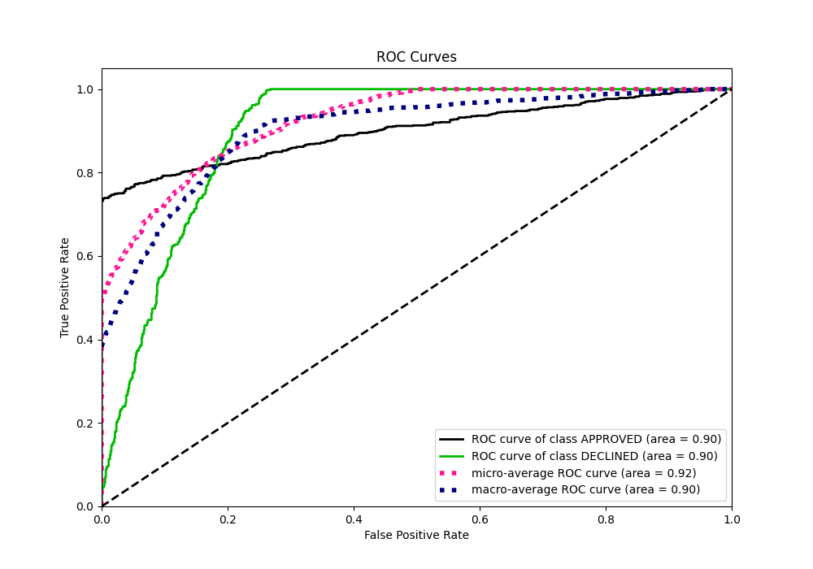
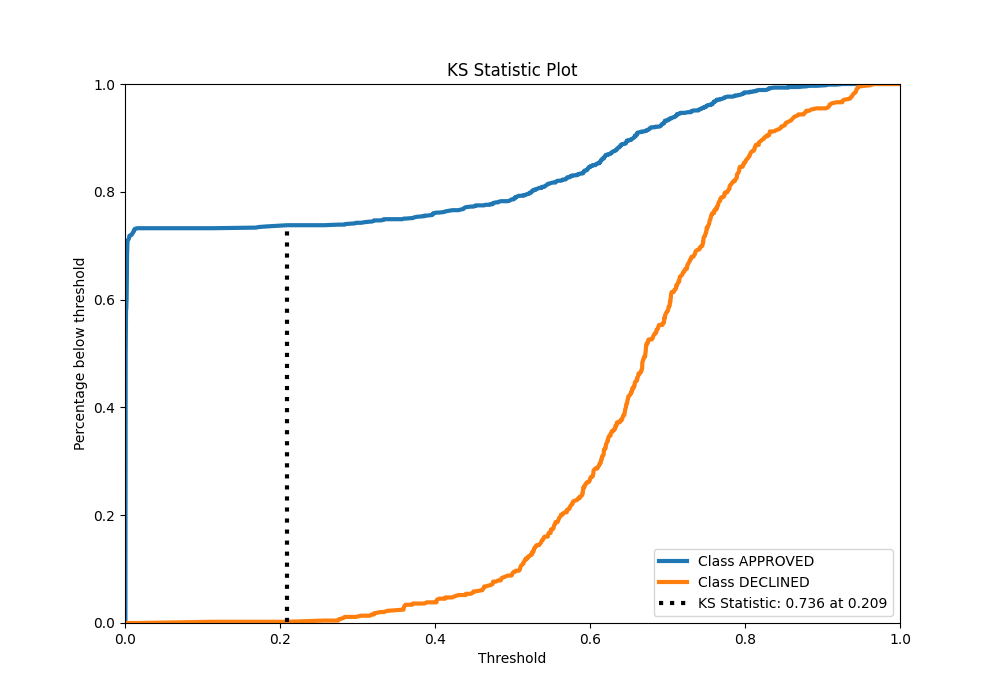
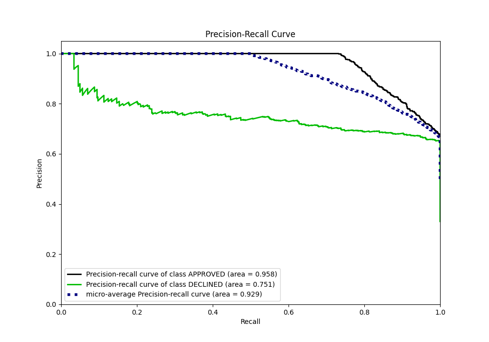
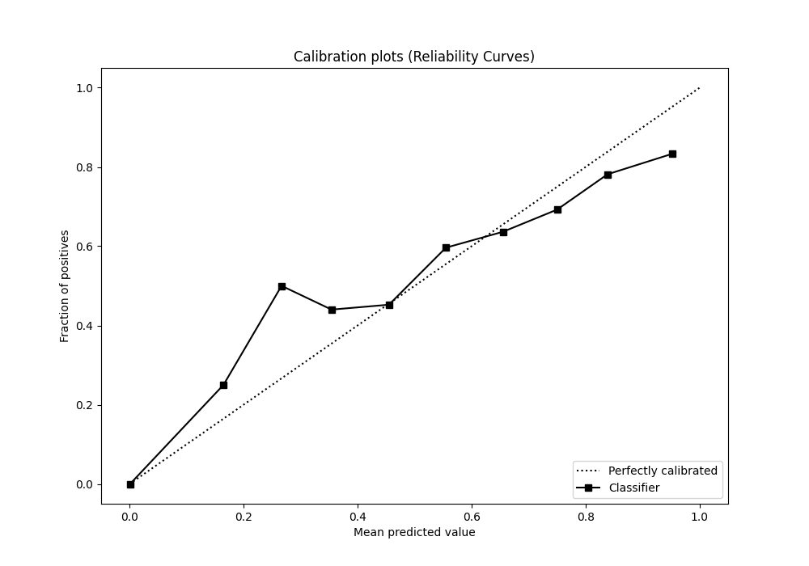
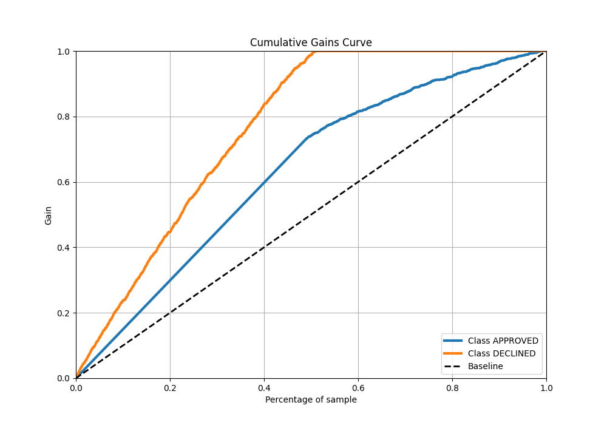
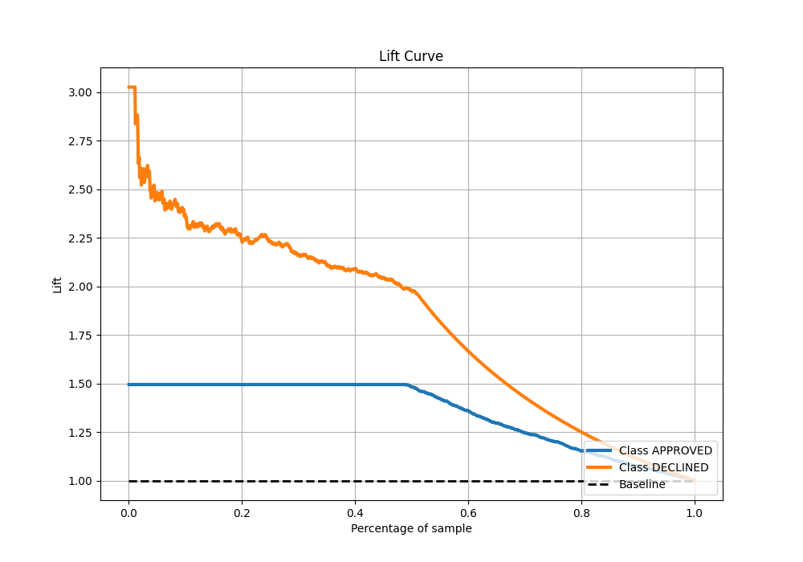

# Summary of 111_LightGBM

[<< Go back](../README.md)

## LightGBM
- **n_jobs**: -1
- **objective**: binary
- **num_leaves**: 31
- **learning_rate**: 0.1
- **feature_fraction**: 0.8
- **bagging_fraction**: 0.5
- **min_data_in_leaf**: 5
- **metric**: auc
- **custom_eval_metric_name**: None
- **explain_level**: 0

## Validation
 - **validation_type**: split
 - **train_ratio**: 0.8
 - **shuffle**: True
 - **stratify**: True

## Optimized metric
auc

## Training time

2.2 seconds

## Metric details
|           |    score |     threshold |
|:----------|---------:|--------------:|
| logloss   | 0.320738 | nan           |
| auc       | 0.900102 | nan           |
| f1        | 0.788427 |   0.321275    |
| accuracy  | 0.829104 |   0.442994    |
| precision | 0.826923 |   0.828964    |
| recall    | 1        |   0.000460531 |
| mcc       | 0.690147 |   0.266032    |

## Metric details with threshold from accuracy metric
|           |    score |   threshold |
|:----------|---------:|------------:|
| logloss   | 0.320738 |  nan        |
| auc       | 0.900102 |  nan        |
| f1        | 0.78538  |    0.442994 |
| accuracy  | 0.829104 |    0.442994 |
| precision | 0.671474 |    0.442994 |
| recall    | 0.945824 |    0.442994 |
| mcc       | 0.676458 |    0.442994 |

## Confusion matrix (at threshold=0.442994)
|                     |   Predicted as APPROVED |   Predicted as DECLINED |
|:--------------------|------------------------:|------------------------:|
| Labeled as APPROVED |                     692 |                     205 |
| Labeled as DECLINED |                      24 |                     419 |

## Learning curves

## Confusion Matrix

## Normalized Confusion Matrix

## ROC Curve

## Kolmogorov-Smirnov Statistic

## Precision-Recall Curve

## Calibration Curve

## Cumulative Gains Curve

## Lift Curve

[<< Go back](../README.md)
