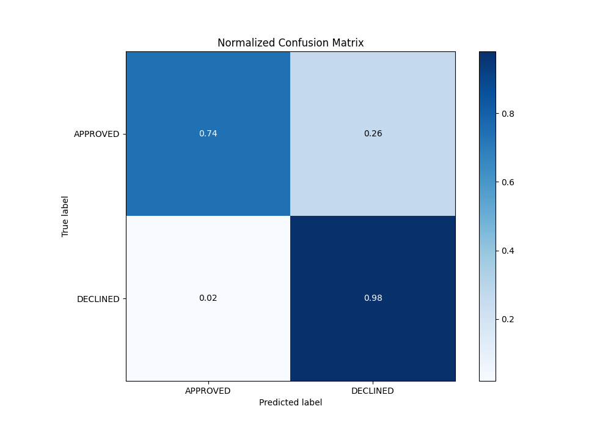

# Summary of 113_LightGBM

[<< Go back](../README.md)

## LightGBM
- **n_jobs**: -1
- **objective**: binary
- **num_leaves**: 63
- **learning_rate**: 0.1
- **feature_fraction**: 0.9
- **bagging_fraction**: 0.9
- **min_data_in_leaf**: 20
- **metric**: auc
- **custom_eval_metric_name**: None
- **explain_level**: 0

## Validation
 - **validation_type**: split
 - **train_ratio**: 0.8
 - **shuffle**: True
 - **stratify**: True

## Optimized metric
auc

## Training time

2.2 seconds

## Metric details
|           |    score |   threshold |
|:----------|---------:|------------:|
| logloss   | 0.333101 | nan         |
| auc       | 0.89431  | nan         |
| f1        | 0.786416 |   0.213803  |
| accuracy  | 0.822388 |   0.292449  |
| precision | 0.846154 |   0.849179  |
| recall    | 1        |   0.0018495 |
| mcc       | 0.686974 |   0.213803  |

## Metric details with threshold from accuracy metric
|           |    score |   threshold |
|:----------|---------:|------------:|
| logloss   | 0.333101 |  nan        |
| auc       | 0.89431  |  nan        |
| f1        | 0.78481  |    0.292449 |
| accuracy  | 0.822388 |    0.292449 |
| precision | 0.6546   |    0.292449 |
| recall    | 0.979684 |    0.292449 |
| mcc       | 0.681583 |    0.292449 |

## Confusion matrix (at threshold=0.292449)
|                     |   Predicted as APPROVED |   Predicted as DECLINED |
|:--------------------|------------------------:|------------------------:|
| Labeled as APPROVED |                     668 |                     229 |
| Labeled as DECLINED |                       9 |                     434 |

## Learning curves

## Confusion Matrix

## Normalized Confusion Matrix

## ROC Curve

## Kolmogorov-Smirnov Statistic

## Precision-Recall Curve

## Calibration Curve

## Cumulative Gains Curve

## Lift Curve

[<< Go back](../README.md)
