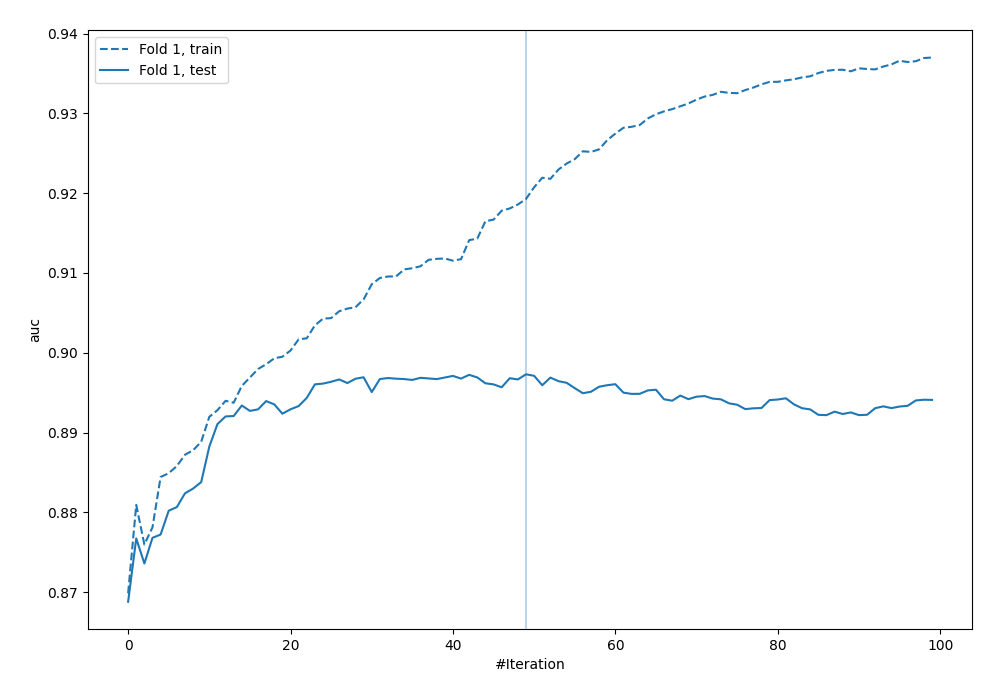
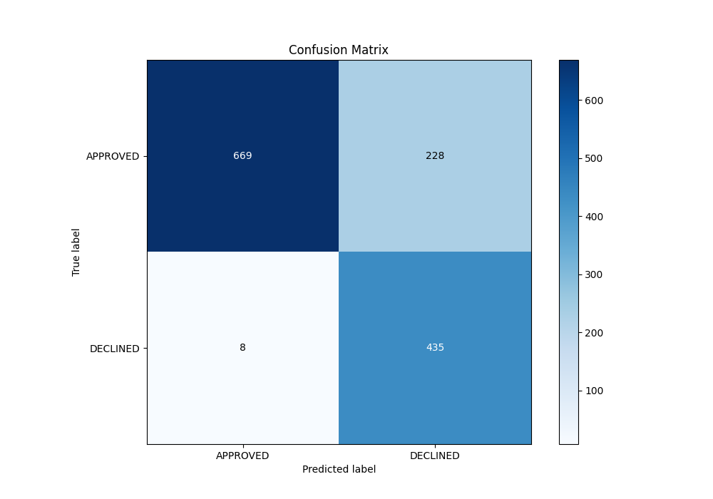
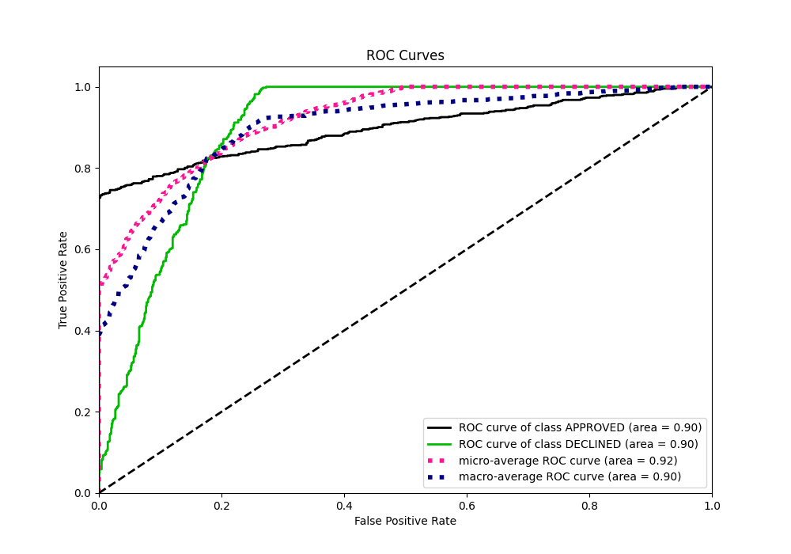
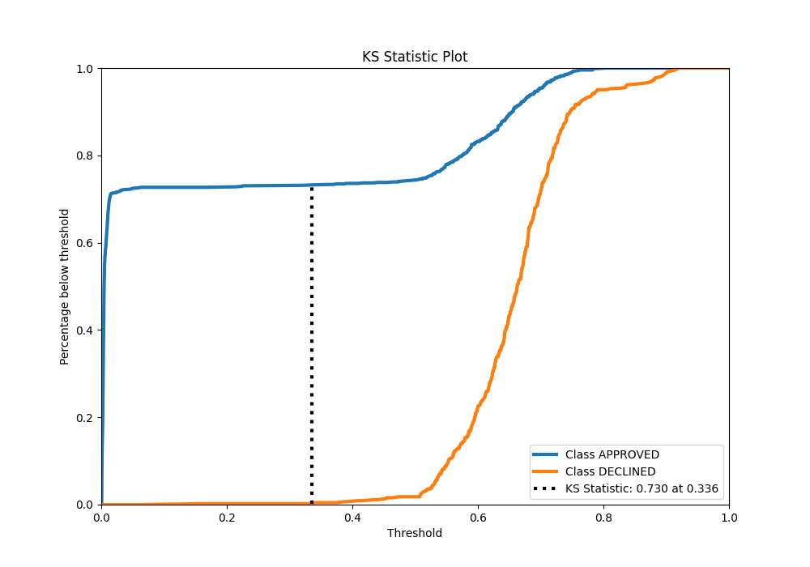
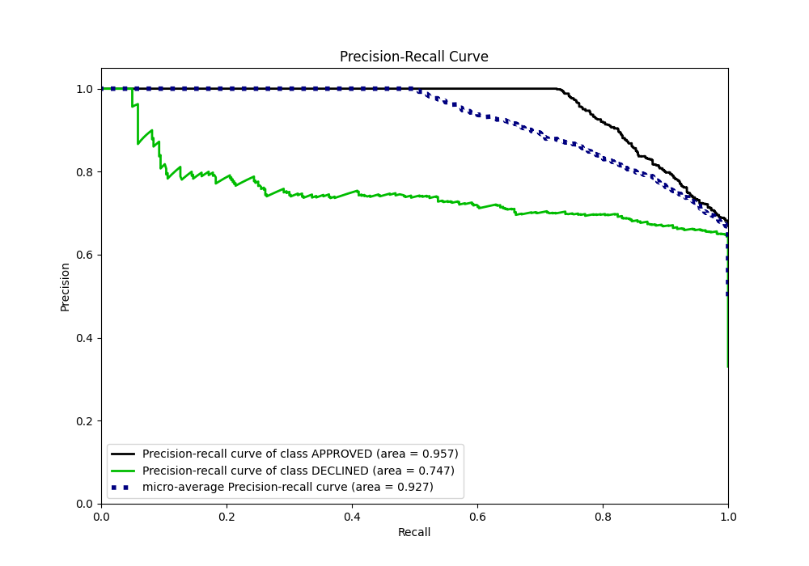
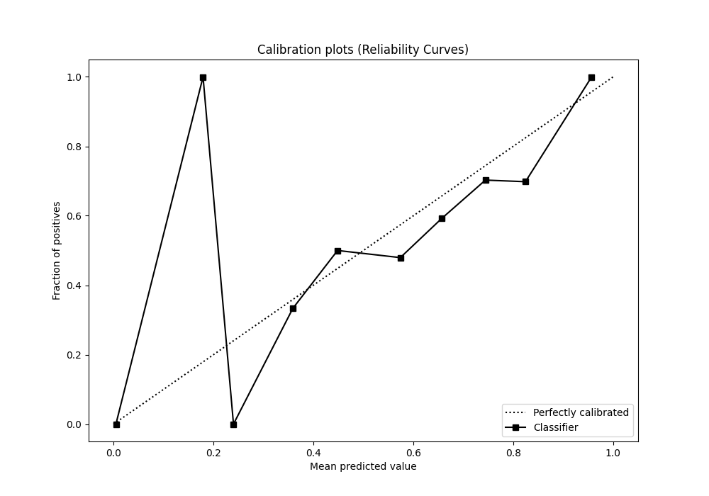
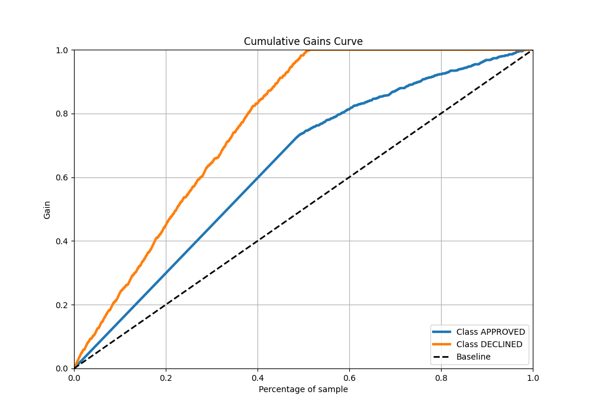
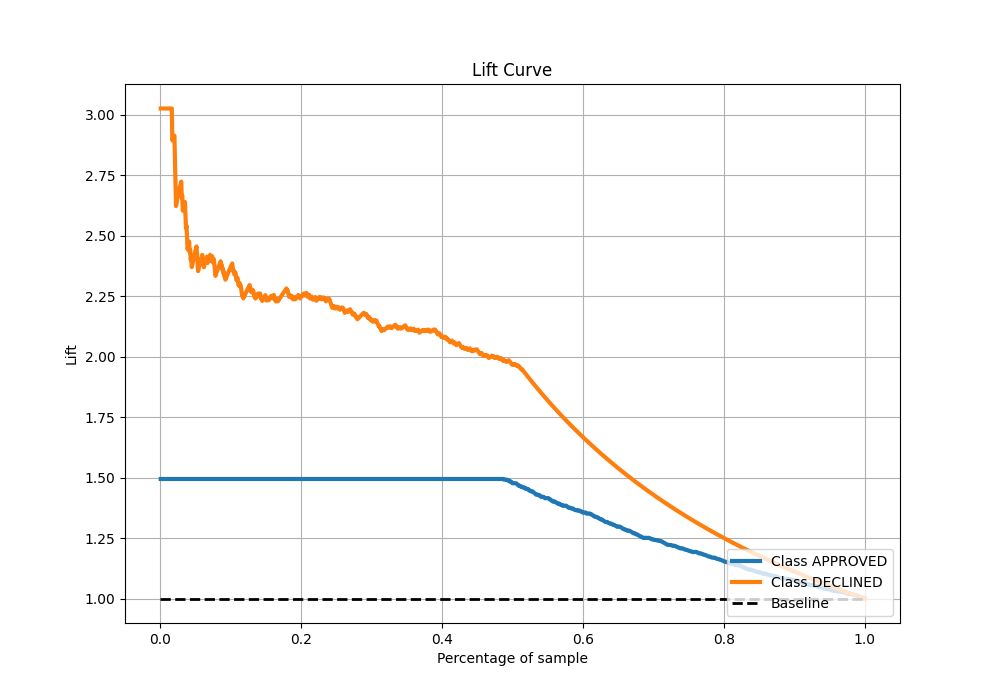

# Summary of 117_Xgboost

[<< Go back](../README.md)

## Extreme Gradient Boosting (Xgboost)
- **n_jobs**: -1
- **objective**: binary:logistic
- **eta**: 0.15
- **max_depth**: 4
- **min_child_weight**: 5
- **subsample**: 0.7
- **colsample_bytree**: 0.6
- **eval_metric**: auc
- **explain_level**: 0

## Validation
 - **validation_type**: split
 - **train_ratio**: 0.8
 - **shuffle**: True
 - **stratify**: True

## Optimized metric
auc

## Training time

2.2 seconds

## Metric details
|           |    score |     threshold |
|:----------|---------:|--------------:|
| logloss   | 0.323856 | nan           |
| auc       | 0.897303 | nan           |
| f1        | 0.786618 |   0.507477    |
| accuracy  | 0.823881 |   0.507477    |
| precision | 0.807692 |   0.749151    |
| recall    | 1        |   0.000568274 |
| mcc       | 0.684756 |   0.507477    |

## Metric details with threshold from accuracy metric
|           |    score |   threshold |
|:----------|---------:|------------:|
| logloss   | 0.323856 |  nan        |
| auc       | 0.897303 |  nan        |
| f1        | 0.786618 |    0.507477 |
| accuracy  | 0.823881 |    0.507477 |
| precision | 0.656109 |    0.507477 |
| recall    | 0.981941 |    0.507477 |
| mcc       | 0.684756 |    0.507477 |

## Confusion matrix (at threshold=0.507477)
|                     |   Predicted as APPROVED |   Predicted as DECLINED |
|:--------------------|------------------------:|------------------------:|
| Labeled as APPROVED |                     669 |                     228 |
| Labeled as DECLINED |                       8 |                     435 |

## Learning curves

## Confusion Matrix

## Normalized Confusion Matrix

## ROC Curve

## Kolmogorov-Smirnov Statistic

## Precision-Recall Curve

## Calibration Curve

## Cumulative Gains Curve

## Lift Curve

[<< Go back](../README.md)
