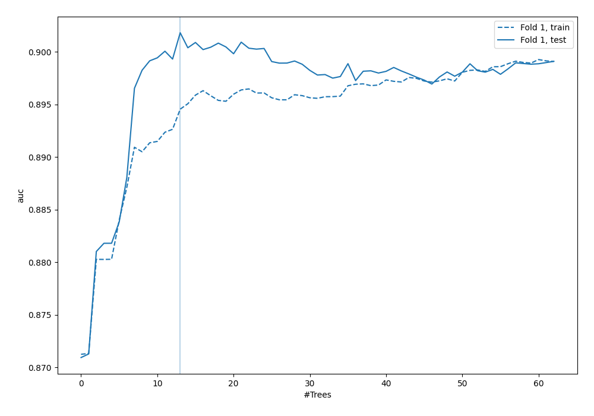
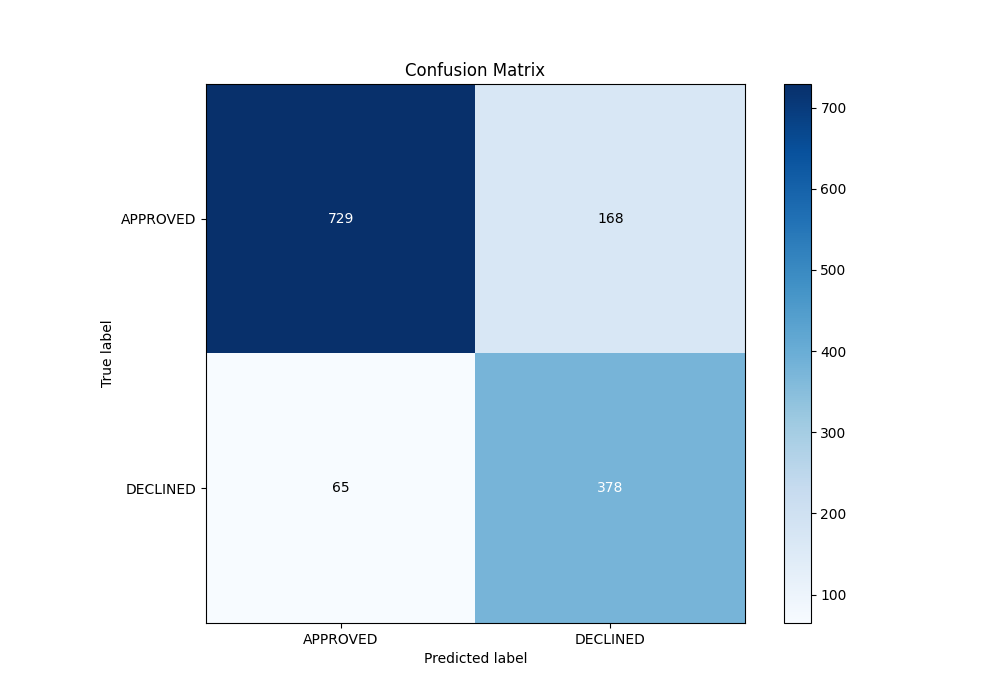
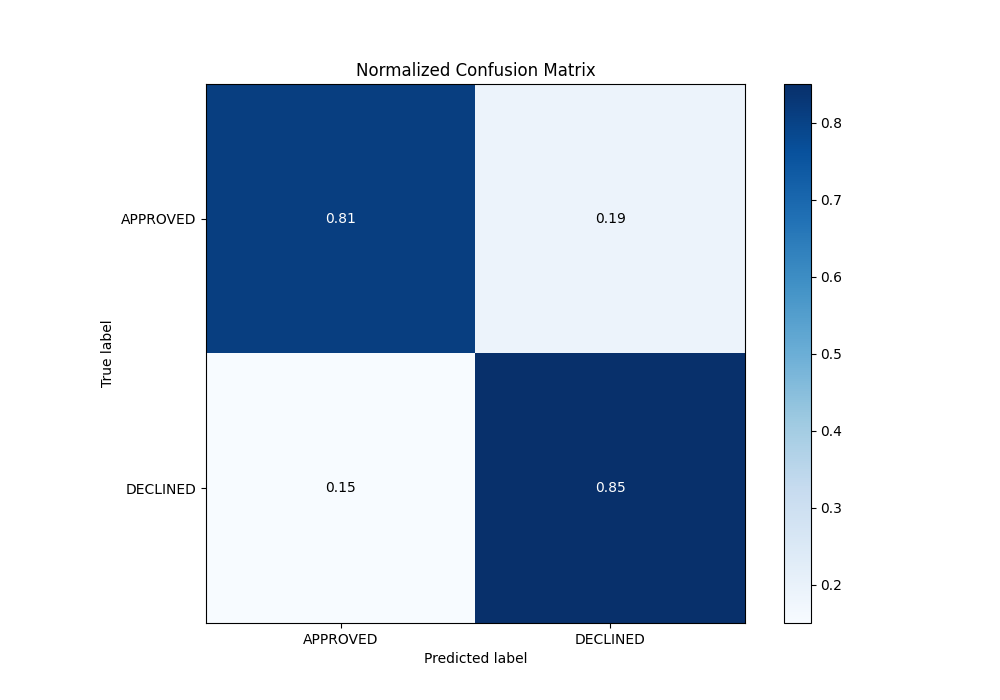
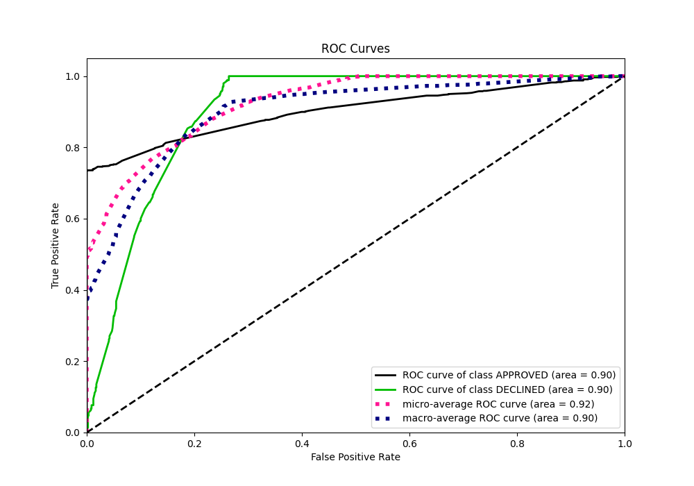
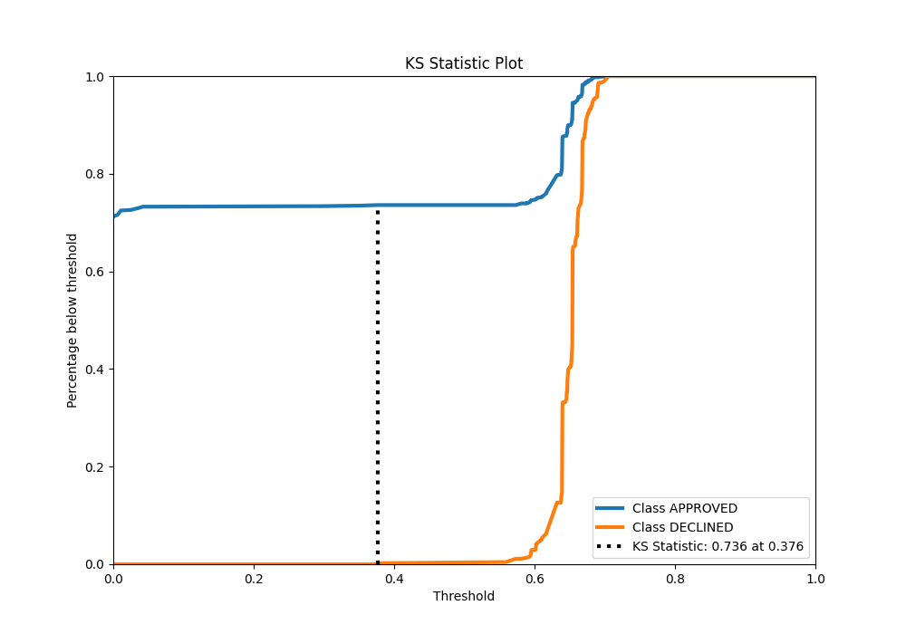
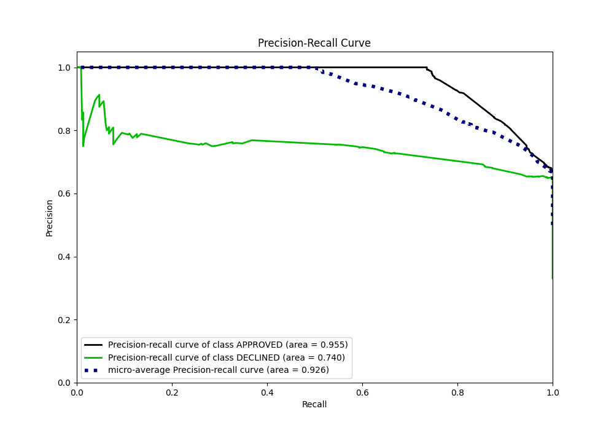
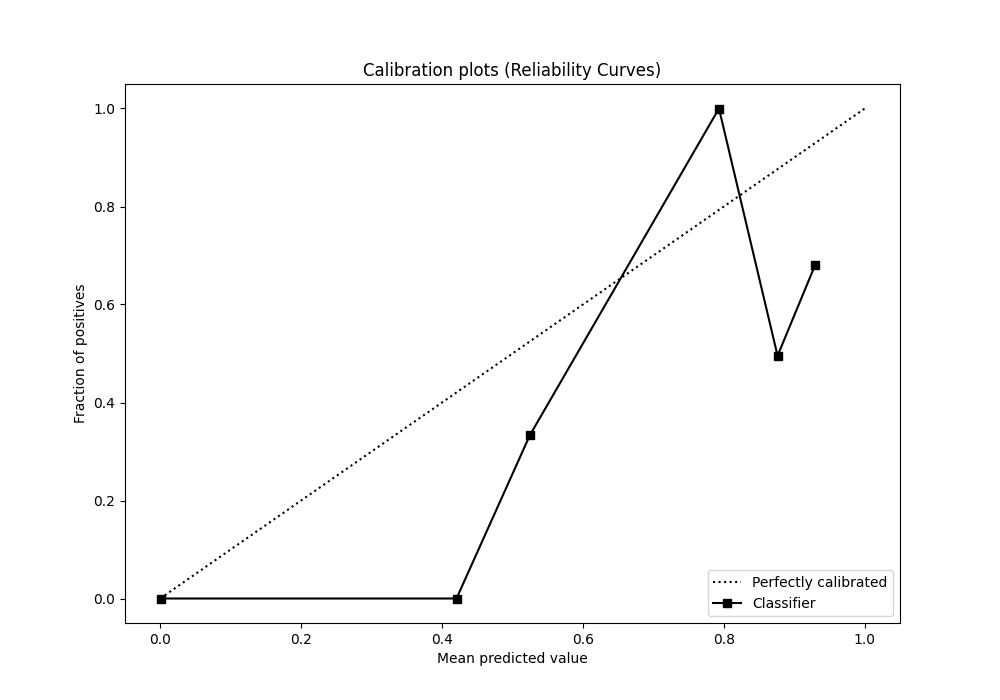
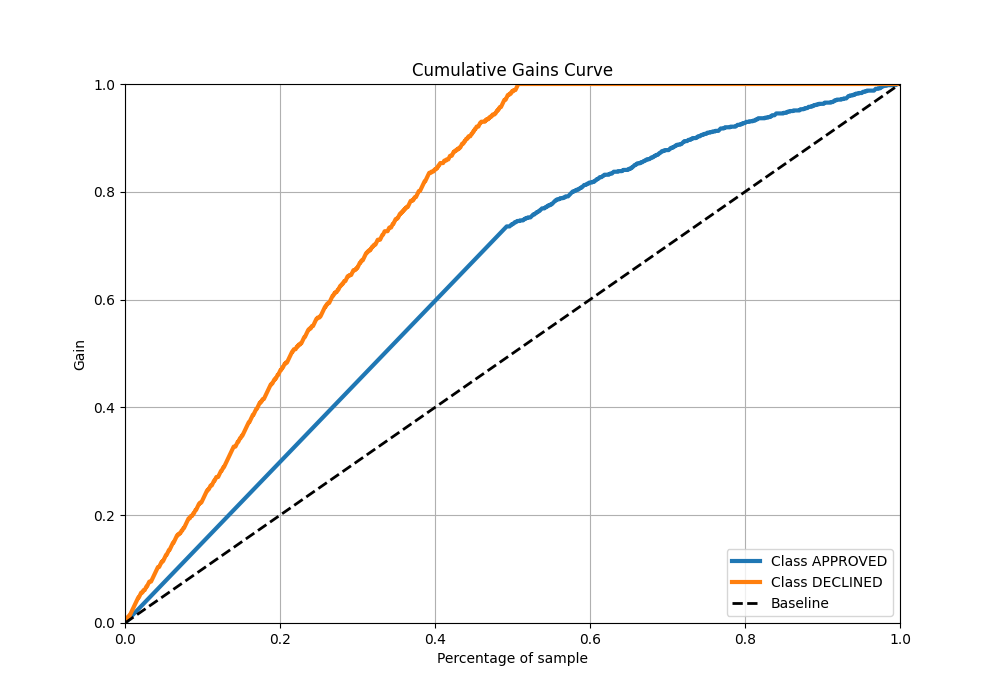
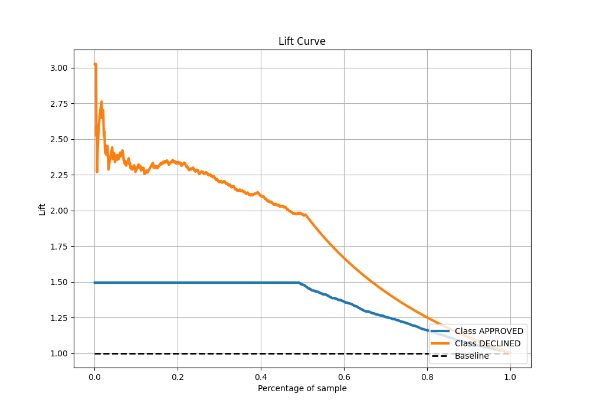

# Summary of 119_RandomForest

[<< Go back](../README.md)

## Random Forest
- **n_jobs**: -1
- **criterion**: entropy
- **max_features**: 0.9
- **min_samples_split**: 40
- **max_depth**: 5
- **eval_metric_name**: auc
- **explain_level**: 0

## Validation
 - **validation_type**: split
 - **train_ratio**: 0.8
 - **shuffle**: True
 - **stratify**: True

## Optimized metric
auc

## Training time

2.8 seconds

## Metric details
|           |    score |   threshold |
|:----------|---------:|------------:|
| logloss   | 0.326345 | nan         |
| auc       | 0.90182  | nan         |
| f1        | 0.78552  |   0.594754  |
| accuracy  | 0.826119 |   0.639362  |
| precision | 0.790323 |   0.67242   |
| recall    | 1        |   0         |
| mcc       | 0.683104 |   0.0310568 |

## Metric details with threshold from accuracy metric
|           |    score |   threshold |
|:----------|---------:|------------:|
| logloss   | 0.326345 |  nan        |
| auc       | 0.90182  |  nan        |
| f1        | 0.764408 |    0.639362 |
| accuracy  | 0.826119 |    0.639362 |
| precision | 0.692308 |    0.639362 |
| recall    | 0.853273 |    0.639362 |
| mcc       | 0.637609 |    0.639362 |

## Confusion matrix (at threshold=0.639362)
|                     |   Predicted as APPROVED |   Predicted as DECLINED |
|:--------------------|------------------------:|------------------------:|
| Labeled as APPROVED |                     729 |                     168 |
| Labeled as DECLINED |                      65 |                     378 |

## Learning curves

## Confusion Matrix

## Normalized Confusion Matrix

## ROC Curve

## Kolmogorov-Smirnov Statistic

## Precision-Recall Curve

## Calibration Curve

## Cumulative Gains Curve

## Lift Curve

[<< Go back](../README.md)
