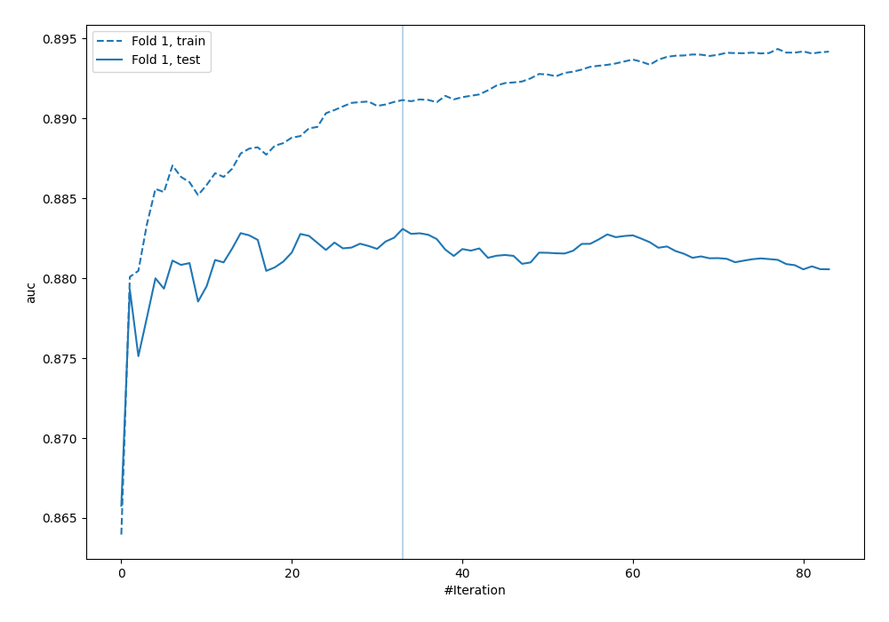
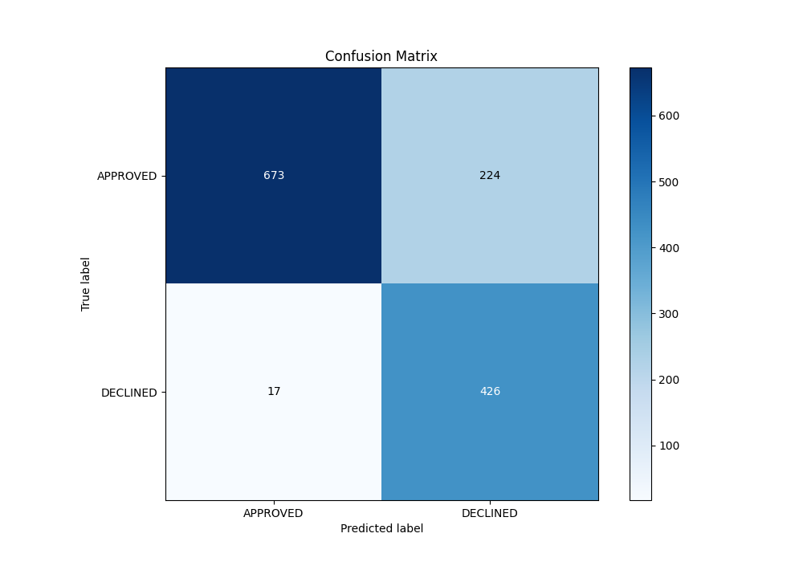
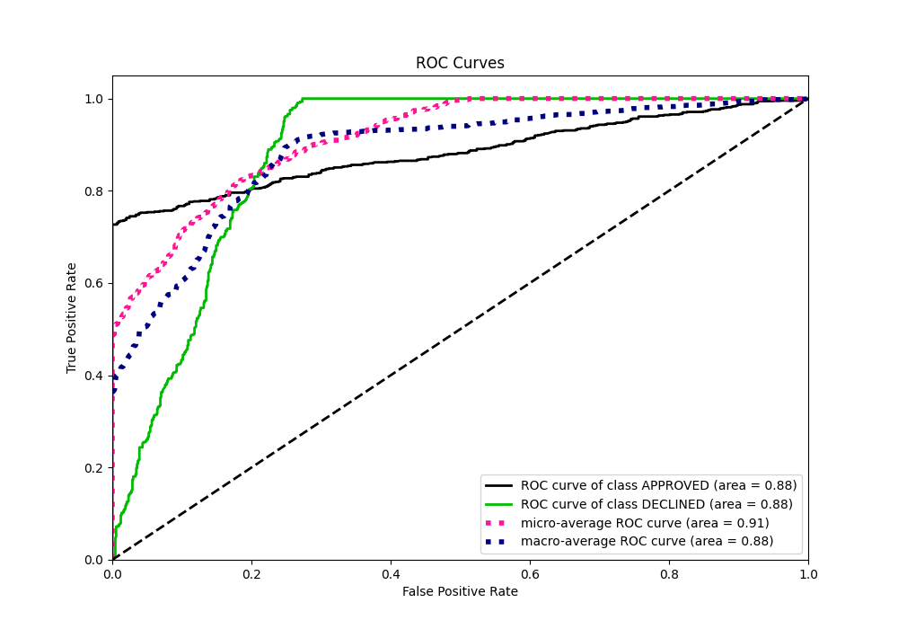
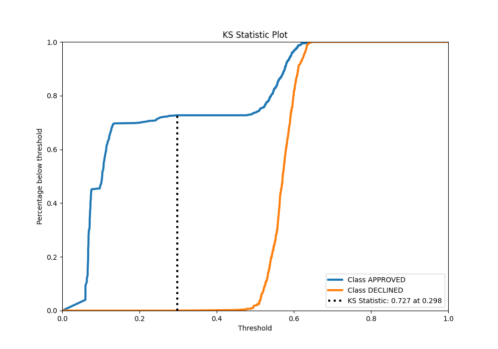
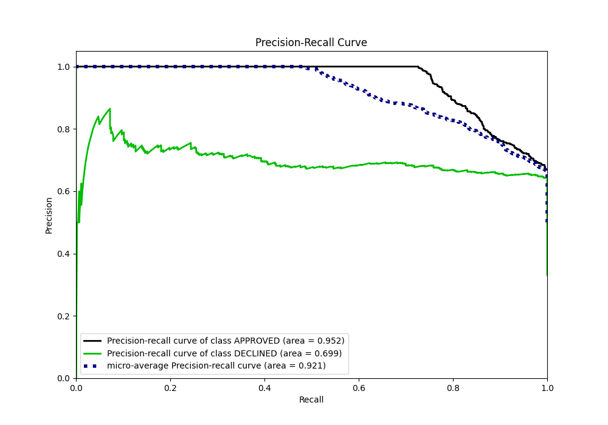
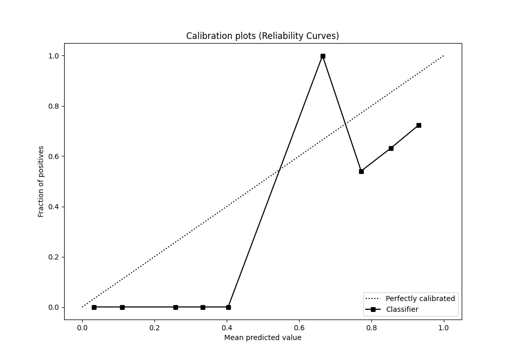
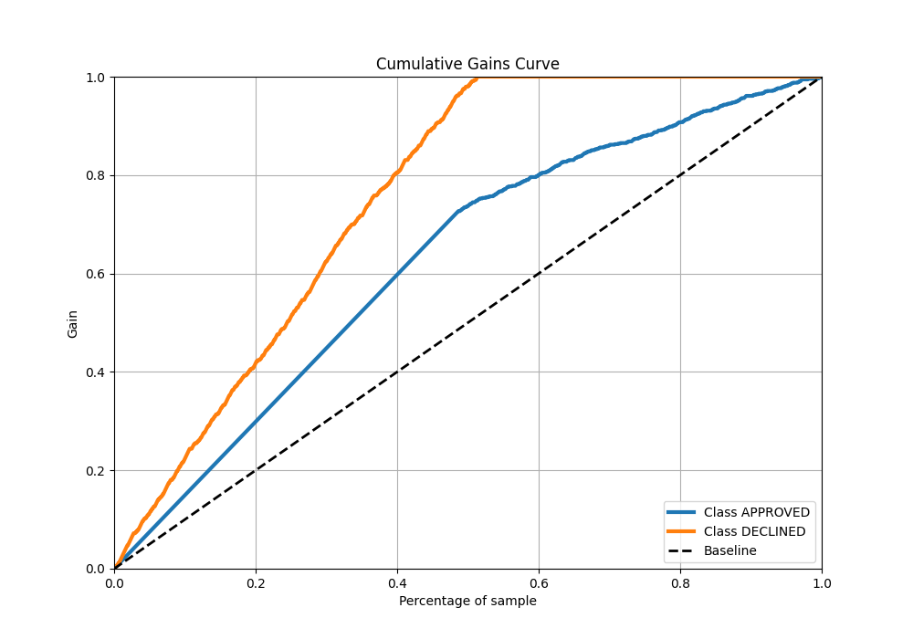
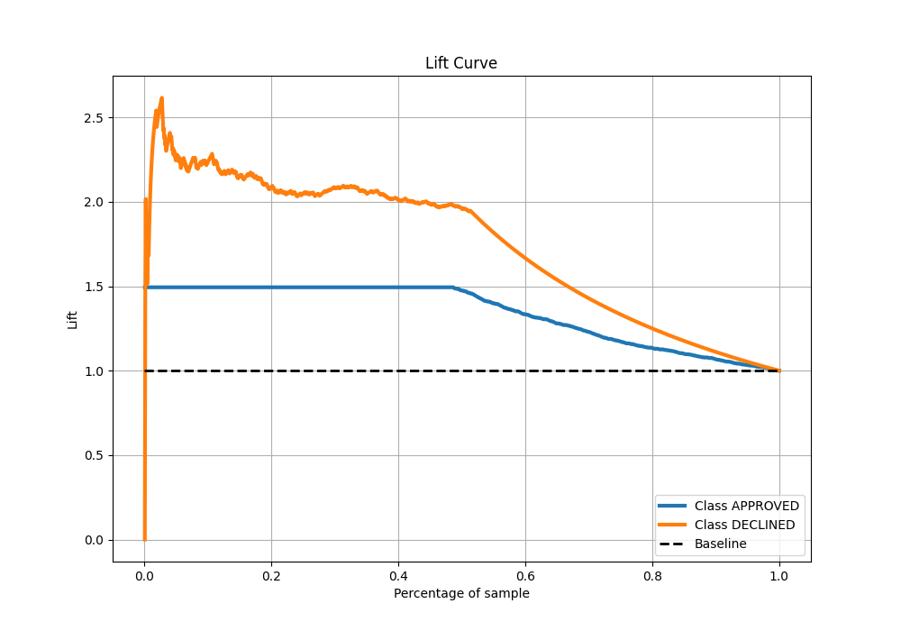

# Summary of 11_Xgboost

[<< Go back](../README.md)

## Extreme Gradient Boosting (Xgboost)
- **n_jobs**: -1
- **objective**: binary:logistic
- **eta**: 0.05
- **max_depth**: 6
- **min_child_weight**: 50
- **subsample**: 0.5
- **colsample_bytree**: 0.7
- **eval_metric**: auc
- **explain_level**: 0

## Validation
 - **validation_type**: split
 - **train_ratio**: 0.8
 - **shuffle**: True
 - **stratify**: True

## Optimized metric
auc

## Training time

1.4 seconds

## Metric details
|           |    score |   threshold |
|:----------|---------:|------------:|
| logloss   | 0.383733 | nan         |
| auc       | 0.88309  | nan         |
| f1        | 0.782842 |   0.494905  |
| accuracy  | 0.820149 |   0.513229  |
| precision | 0.788462 |   0.61217   |
| recall    | 1        |   0.0540295 |
| mcc       | 0.683104 |   0.293244  |

## Metric details with threshold from accuracy metric
|           |    score |   threshold |
|:----------|---------:|------------:|
| logloss   | 0.383733 |  nan        |
| auc       | 0.88309  |  nan        |
| f1        | 0.779506 |    0.513229 |
| accuracy  | 0.820149 |    0.513229 |
| precision | 0.655385 |    0.513229 |
| recall    | 0.961625 |    0.513229 |
| mcc       | 0.670098 |    0.513229 |

## Confusion matrix (at threshold=0.513229)
|                     |   Predicted as APPROVED |   Predicted as DECLINED |
|:--------------------|------------------------:|------------------------:|
| Labeled as APPROVED |                     673 |                     224 |
| Labeled as DECLINED |                      17 |                     426 |

## Learning curves

## Confusion Matrix

## Normalized Confusion Matrix

## ROC Curve

## Kolmogorov-Smirnov Statistic

## Precision-Recall Curve

## Calibration Curve

## Cumulative Gains Curve

## Lift Curve

[<< Go back](../README.md)
