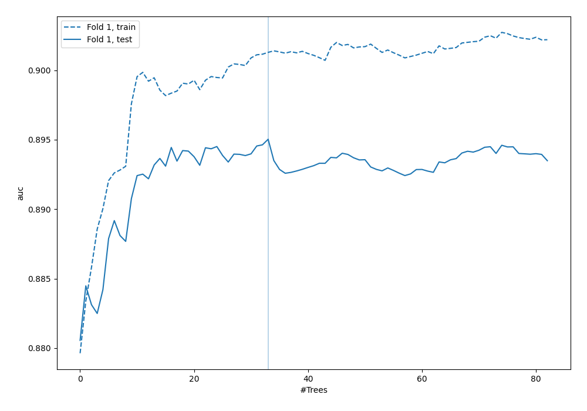
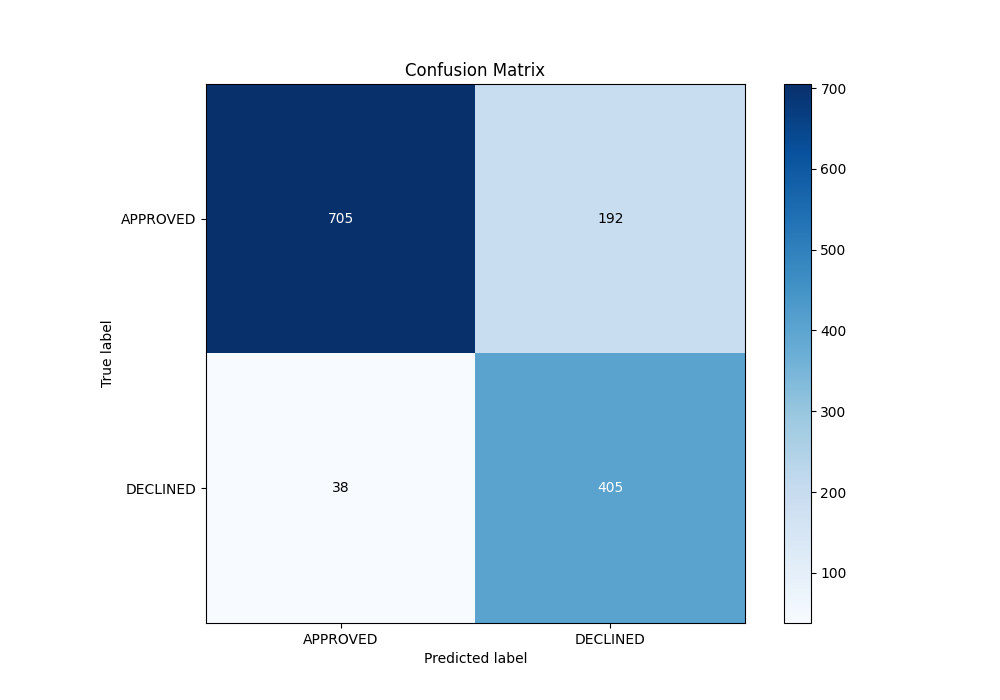
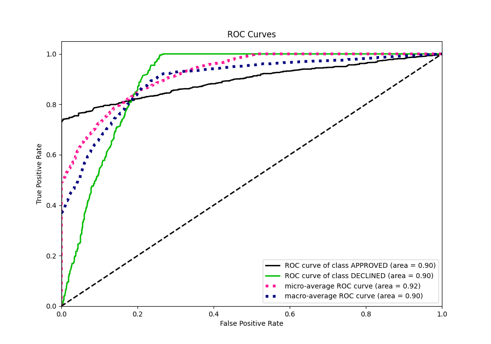
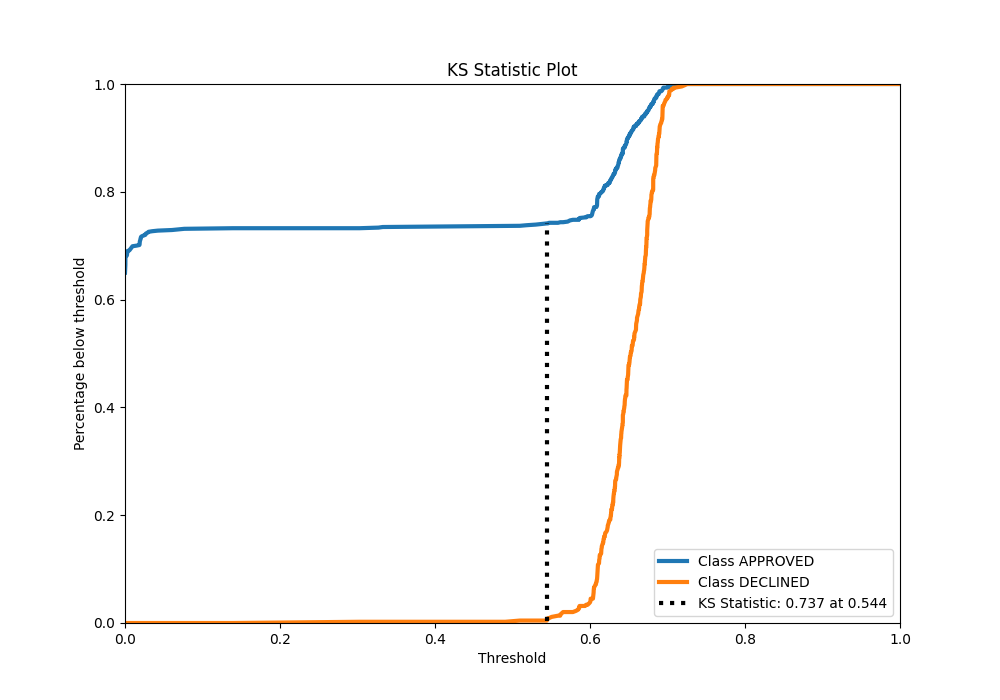
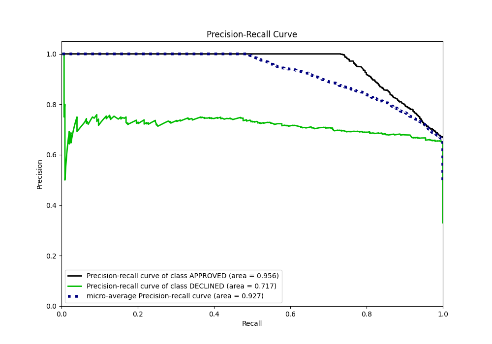
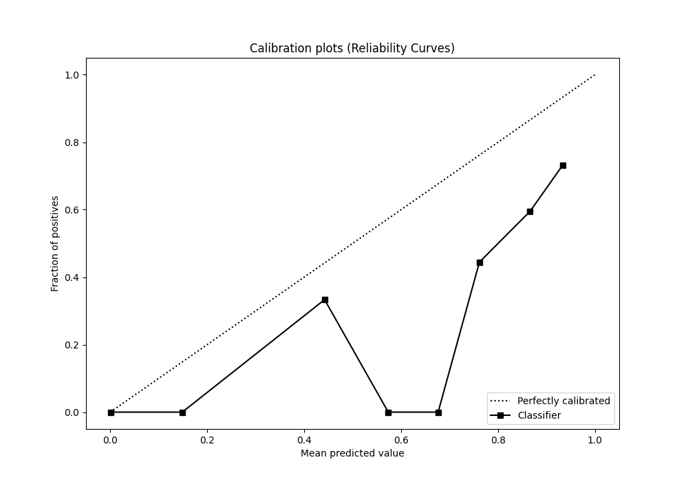
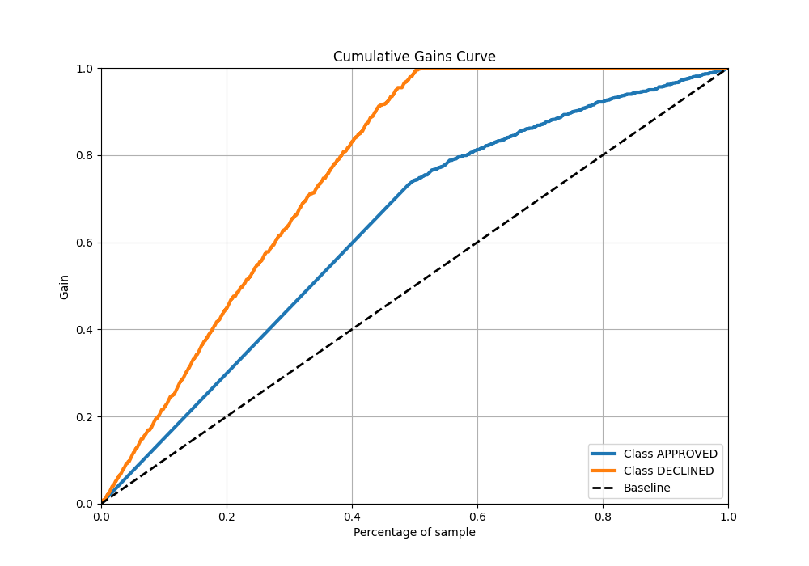
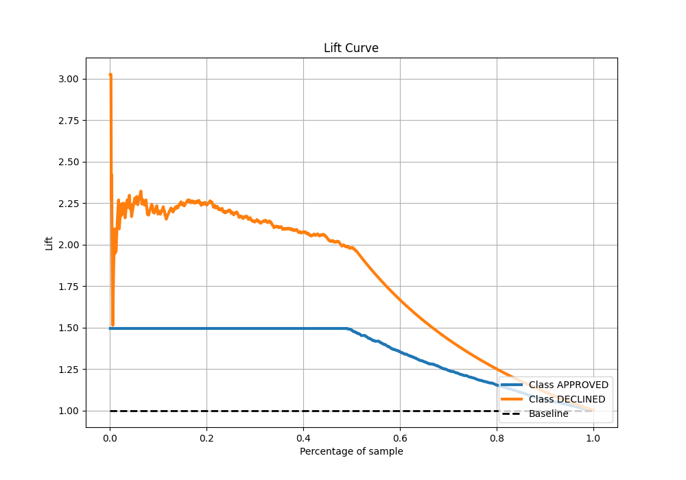

# Summary of 121_RandomForest

[<< Go back](../README.md)

## Random Forest
- **n_jobs**: -1
- **criterion**: entropy
- **max_features**: 0.8
- **min_samples_split**: 50
- **max_depth**: 6
- **eval_metric_name**: auc
- **explain_level**: 0

## Validation
 - **validation_type**: split
 - **train_ratio**: 0.8
 - **shuffle**: True
 - **stratify**: True

## Optimized metric
auc

## Training time

3.0 seconds

## Metric details
|           |    score |   threshold |
|:----------|---------:|------------:|
| logloss   | 0.325684 |  nan        |
| auc       | 0.895034 |  nan        |
| f1        | 0.788204 |    0.524096 |
| accuracy  | 0.828358 |    0.60932  |
| precision | 0.75     |    0.689633 |
| recall    | 1        |    0        |
| mcc       | 0.690147 |    0.524096 |

## Metric details with threshold from accuracy metric
|           |    score |   threshold |
|:----------|---------:|------------:|
| logloss   | 0.325684 |   nan       |
| auc       | 0.895034 |   nan       |
| f1        | 0.778846 |     0.60932 |
| accuracy  | 0.828358 |     0.60932 |
| precision | 0.678392 |     0.60932 |
| recall    | 0.914221 |     0.60932 |
| mcc       | 0.662709 |     0.60932 |

## Confusion matrix (at threshold=0.60932)
|                     |   Predicted as APPROVED |   Predicted as DECLINED |
|:--------------------|------------------------:|------------------------:|
| Labeled as APPROVED |                     705 |                     192 |
| Labeled as DECLINED |                      38 |                     405 |

## Learning curves

## Confusion Matrix

## Normalized Confusion Matrix

## ROC Curve

## Kolmogorov-Smirnov Statistic

## Precision-Recall Curve

## Calibration Curve

## Cumulative Gains Curve

## Lift Curve

[<< Go back](../README.md)
