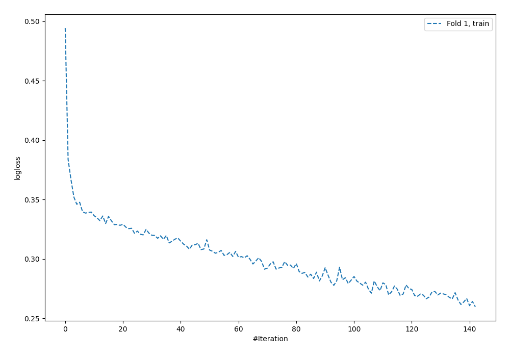
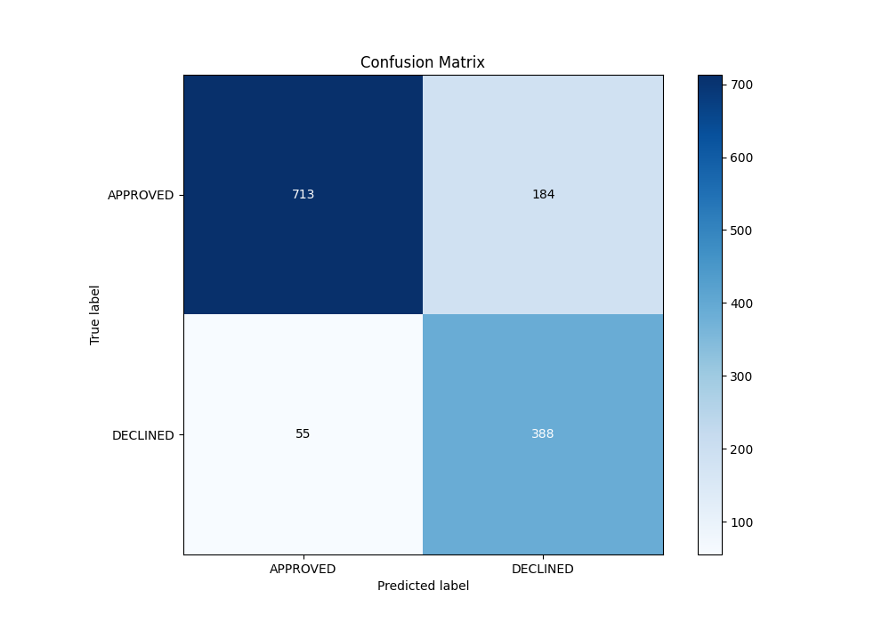
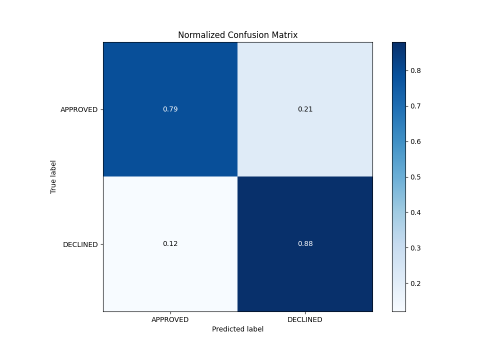
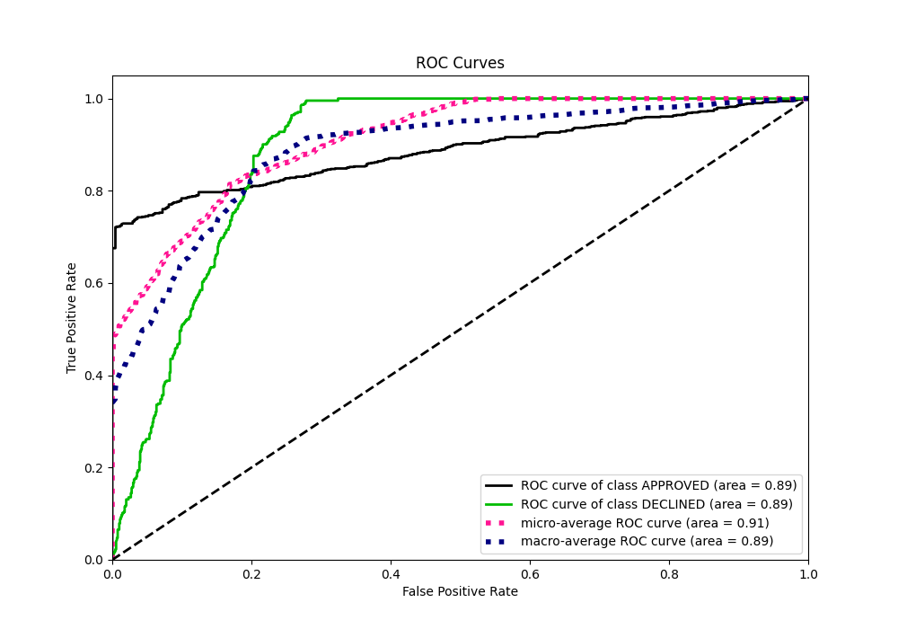
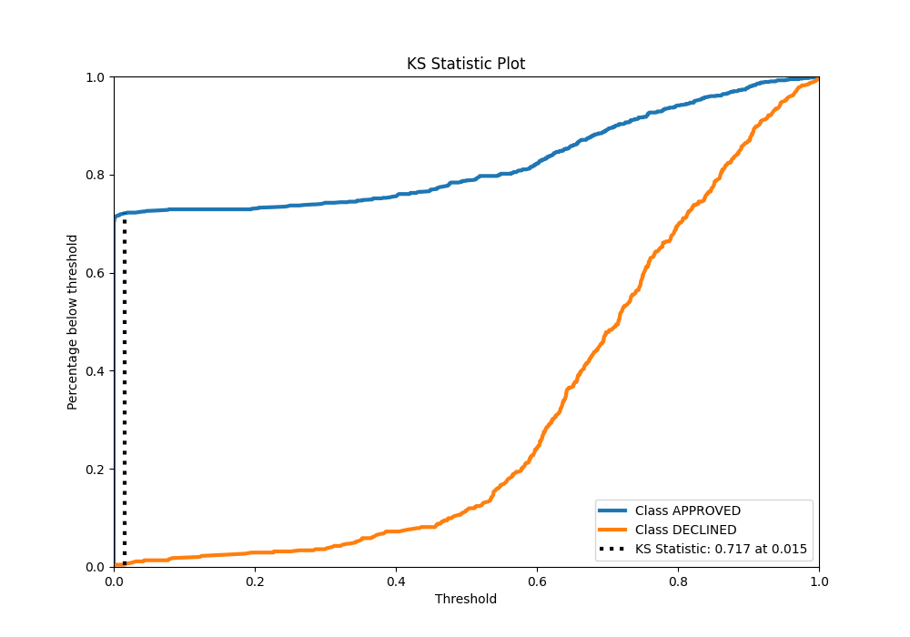
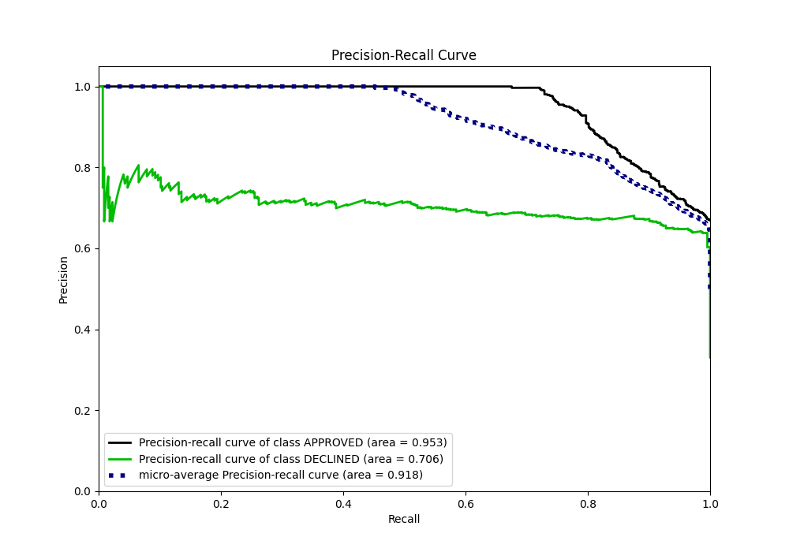
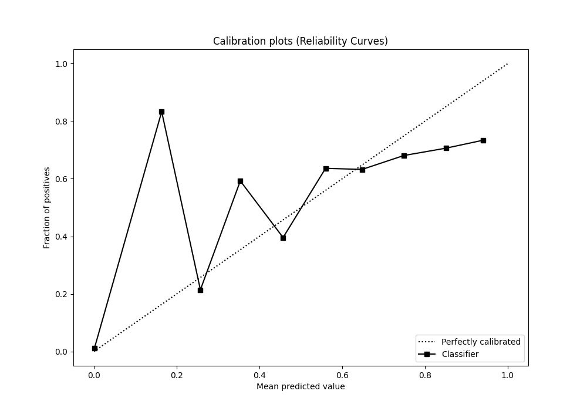
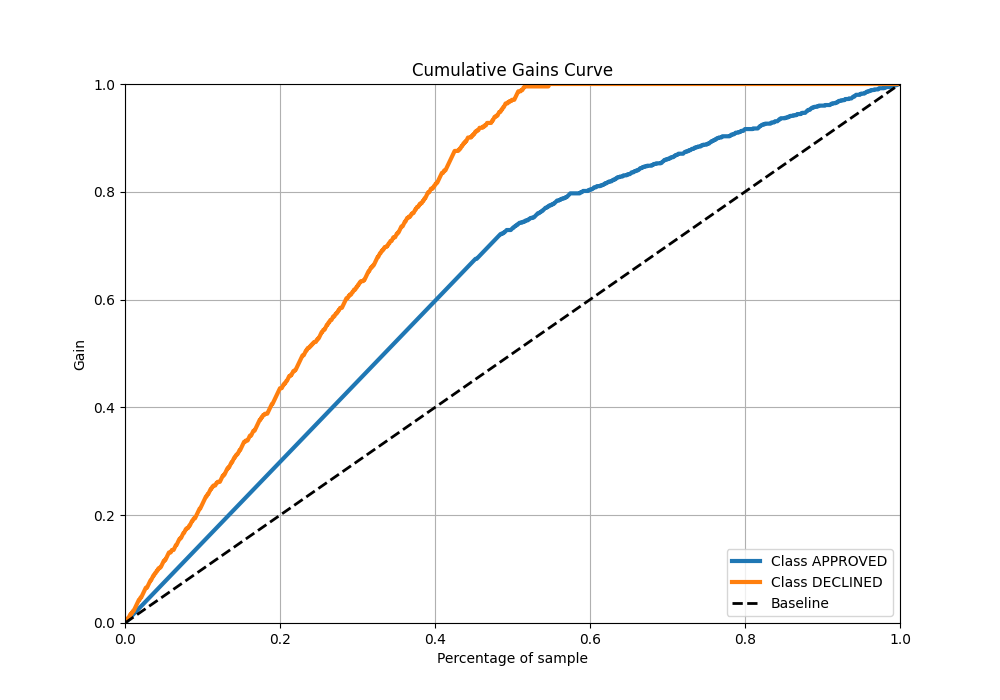
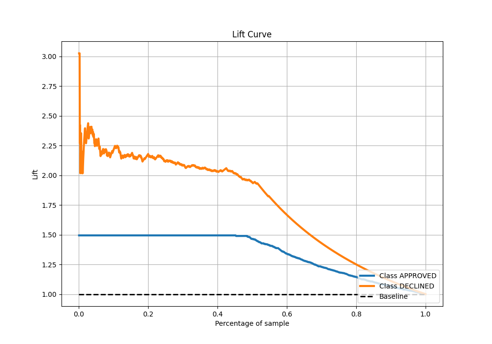

# Summary of 123_NeuralNetwork

[<< Go back](../README.md)

## Neural Network
- **n_jobs**: -1
- **dense_1_size**: 64
- **dense_2_size**: 16
- **learning_rate**: 0.01
- **explain_level**: 0

## Validation
 - **validation_type**: split
 - **train_ratio**: 0.8
 - **shuffle**: True
 - **stratify**: True

## Optimized metric
auc

## Training time

5.2 seconds

## Metric details
|           |    score |   threshold |
|:----------|---------:|------------:|
| logloss   | 0.389694 | nan         |
| auc       | 0.886236 | nan         |
| f1        | 0.777385 |   0.0227692 |
| accuracy  | 0.821642 |   0.518088  |
| precision | 0.788462 |   0.91788   |
| recall    | 1        |   0         |
| mcc       | 0.673582 |   0.0227692 |

## Metric details with threshold from accuracy metric
|           |    score |   threshold |
|:----------|---------:|------------:|
| logloss   | 0.389694 |  nan        |
| auc       | 0.886236 |  nan        |
| f1        | 0.764532 |    0.518088 |
| accuracy  | 0.821642 |    0.518088 |
| precision | 0.678322 |    0.518088 |
| recall    | 0.875847 |    0.518088 |
| mcc       | 0.63791  |    0.518088 |

## Confusion matrix (at threshold=0.518088)
|                     |   Predicted as APPROVED |   Predicted as DECLINED |
|:--------------------|------------------------:|------------------------:|
| Labeled as APPROVED |                     713 |                     184 |
| Labeled as DECLINED |                      55 |                     388 |

## Learning curves

## Confusion Matrix

## Normalized Confusion Matrix

## ROC Curve

## Kolmogorov-Smirnov Statistic

## Precision-Recall Curve

## Calibration Curve

## Cumulative Gains Curve

## Lift Curve

[<< Go back](../README.md)
