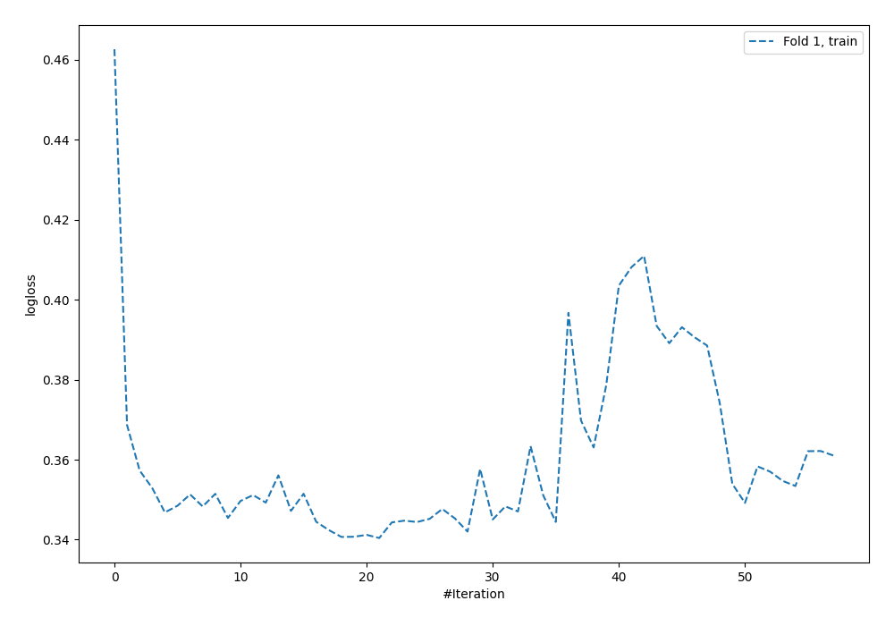
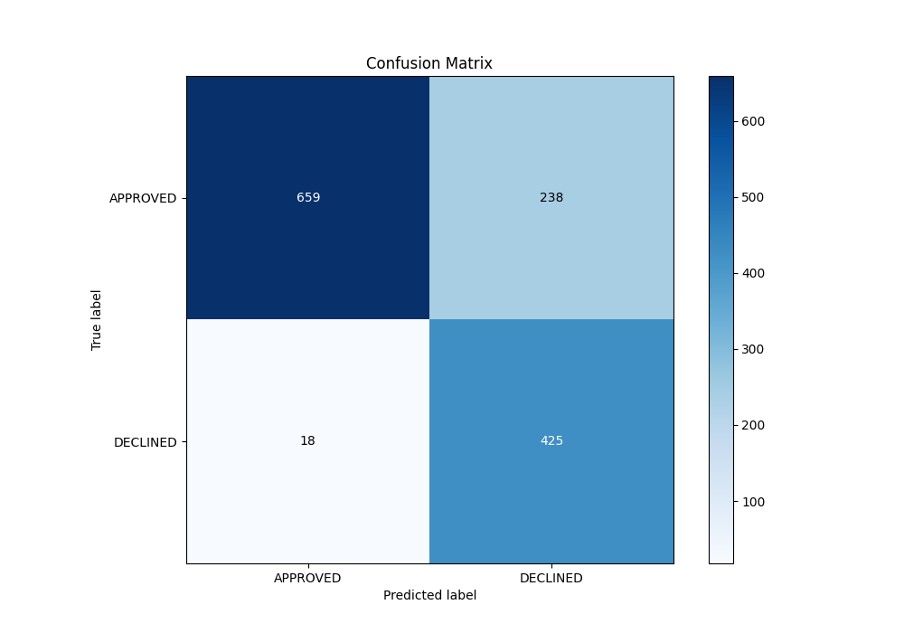
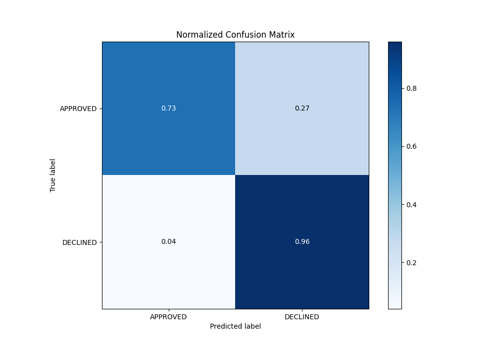
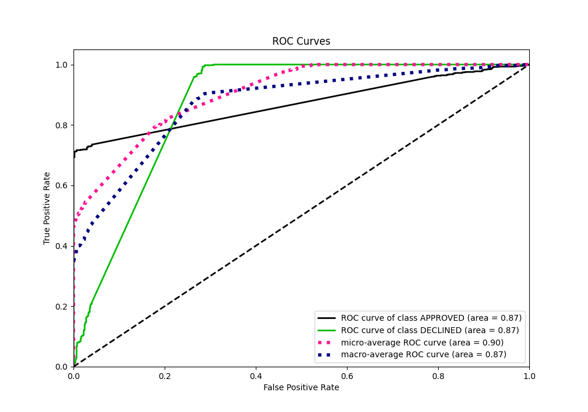
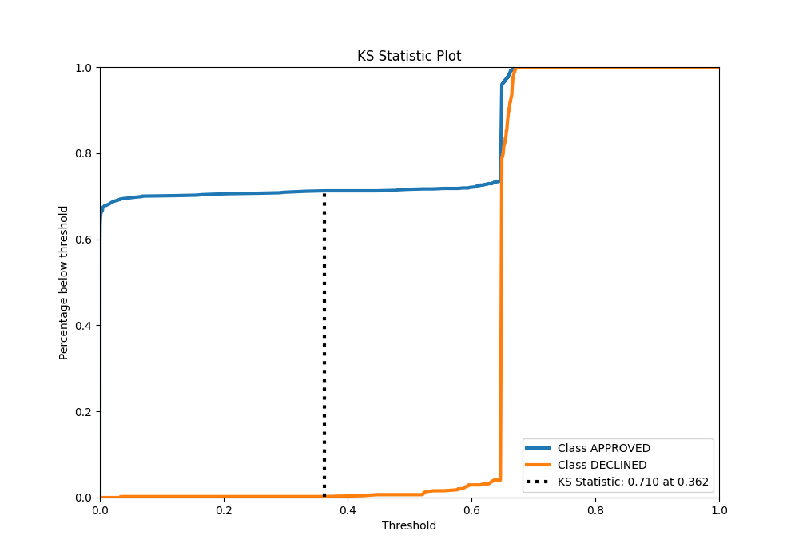
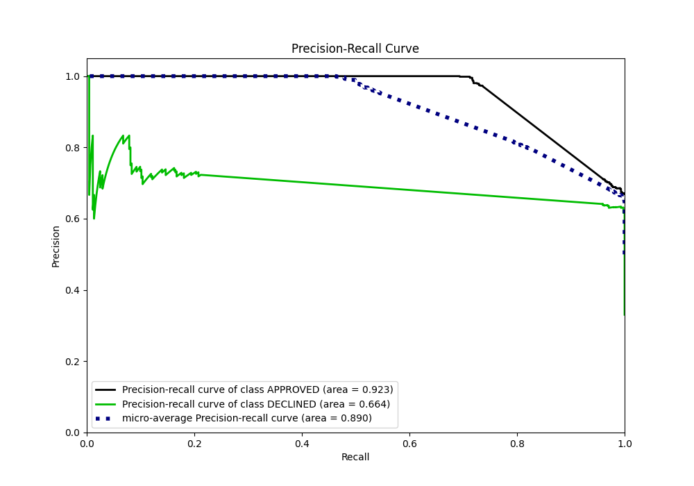
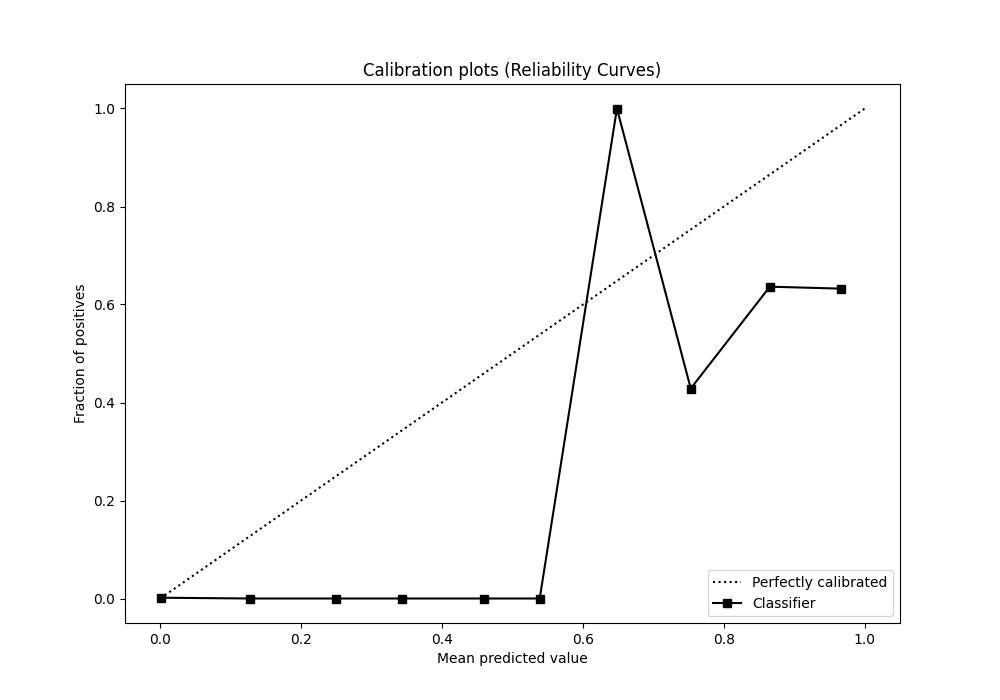
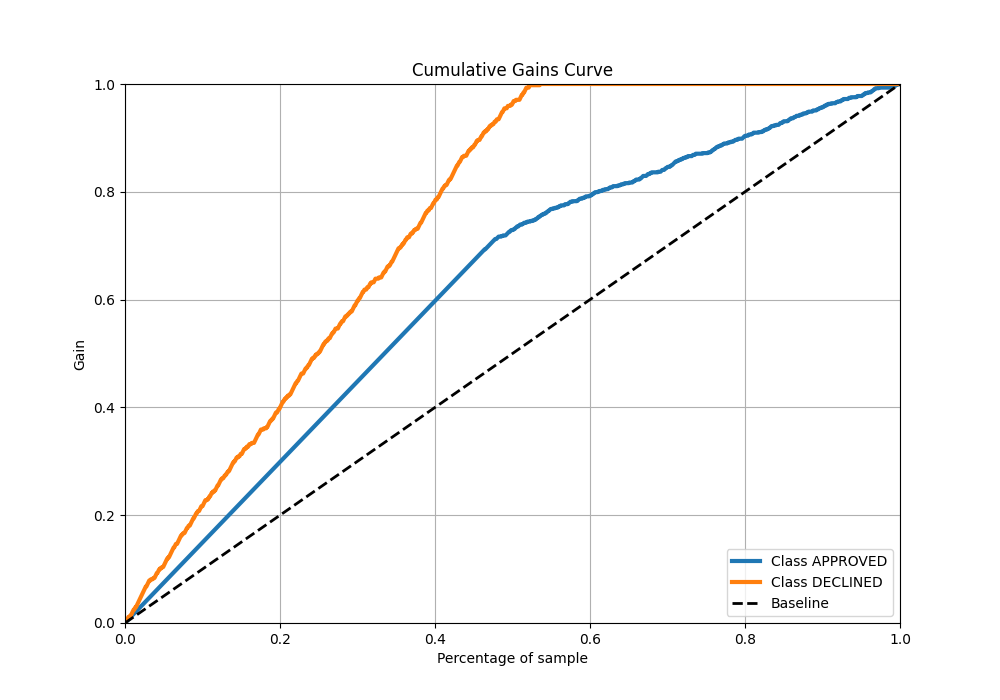
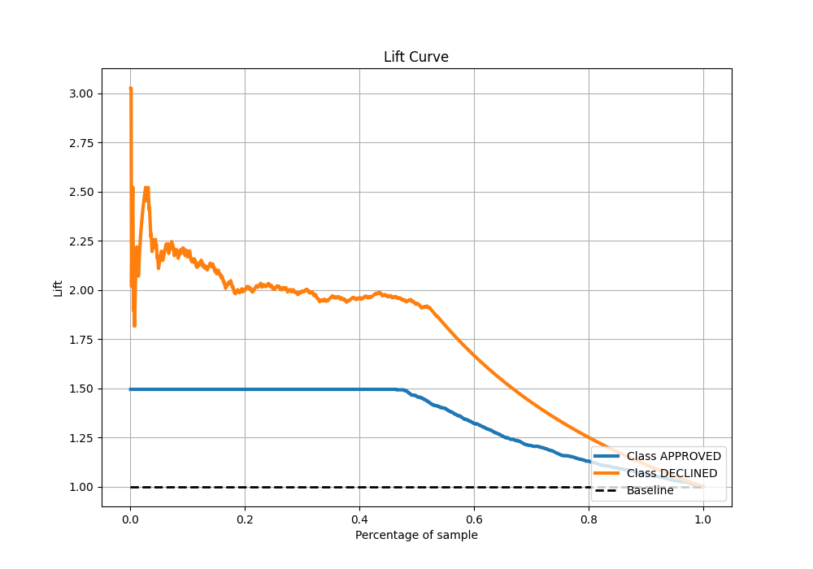

# Summary of 124_NeuralNetwork

[<< Go back](../README.md)

## Neural Network
- **n_jobs**: -1
- **dense_1_size**: 64
- **dense_2_size**: 16
- **learning_rate**: 0.08
- **explain_level**: 0

## Validation
 - **validation_type**: split
 - **train_ratio**: 0.8
 - **shuffle**: True
 - **stratify**: True

## Optimized metric
auc

## Training time

3.4 seconds

## Metric details
|           |    score |     threshold |
|:----------|---------:|--------------:|
| logloss   | 0.348863 | nan           |
| auc       | 0.870594 | nan           |
| f1        | 0.772052 |   0.323901    |
| accuracy  | 0.808955 |   0.646266    |
| precision | 0.730769 |   0.661959    |
| recall    | 1        |   5.29144e-71 |
| mcc       | 0.666781 |   0.323901    |

## Metric details with threshold from accuracy metric
|           |    score |   threshold |
|:----------|---------:|------------:|
| logloss   | 0.348863 |  nan        |
| auc       | 0.870594 |  nan        |
| f1        | 0.768535 |    0.646266 |
| accuracy  | 0.808955 |    0.646266 |
| precision | 0.641026 |    0.646266 |
| recall    | 0.959368 |    0.646266 |
| mcc       | 0.653027 |    0.646266 |

## Confusion matrix (at threshold=0.646266)
|                     |   Predicted as APPROVED |   Predicted as DECLINED |
|:--------------------|------------------------:|------------------------:|
| Labeled as APPROVED |                     659 |                     238 |
| Labeled as DECLINED |                      18 |                     425 |

## Learning curves

## Confusion Matrix

## Normalized Confusion Matrix

## ROC Curve

## Kolmogorov-Smirnov Statistic

## Precision-Recall Curve

## Calibration Curve

## Cumulative Gains Curve

## Lift Curve

[<< Go back](../README.md)
