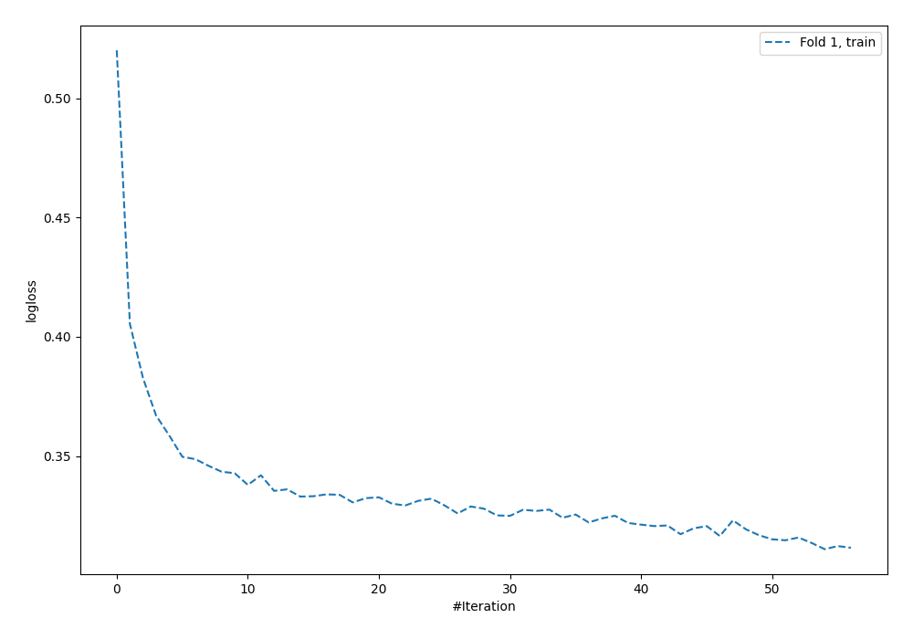
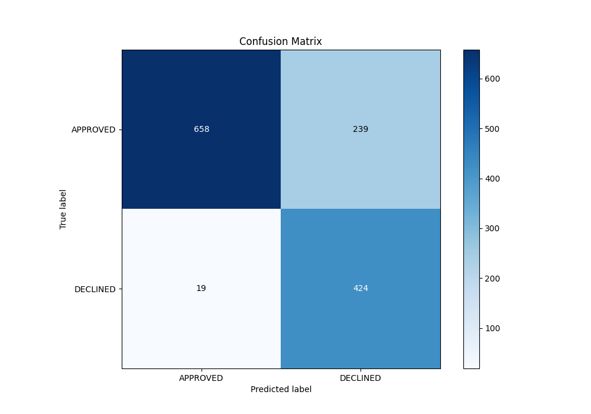
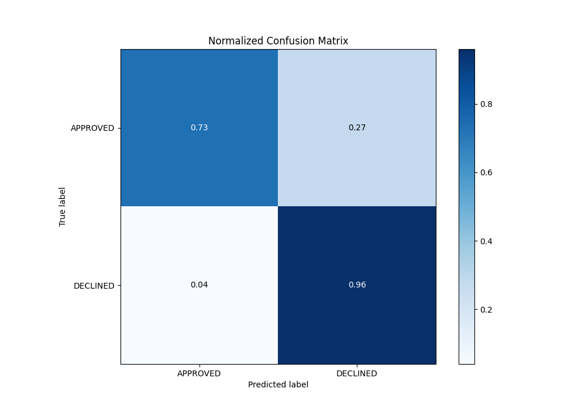
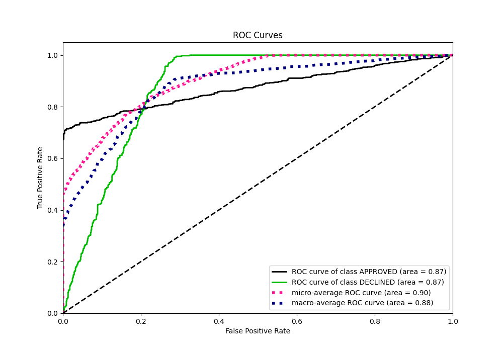
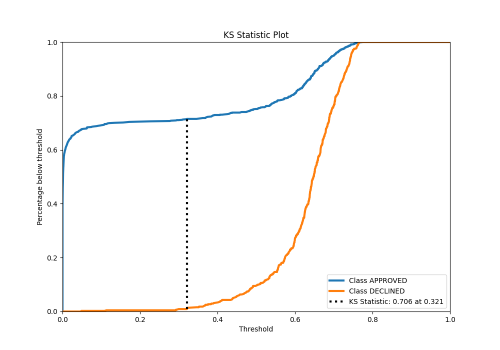
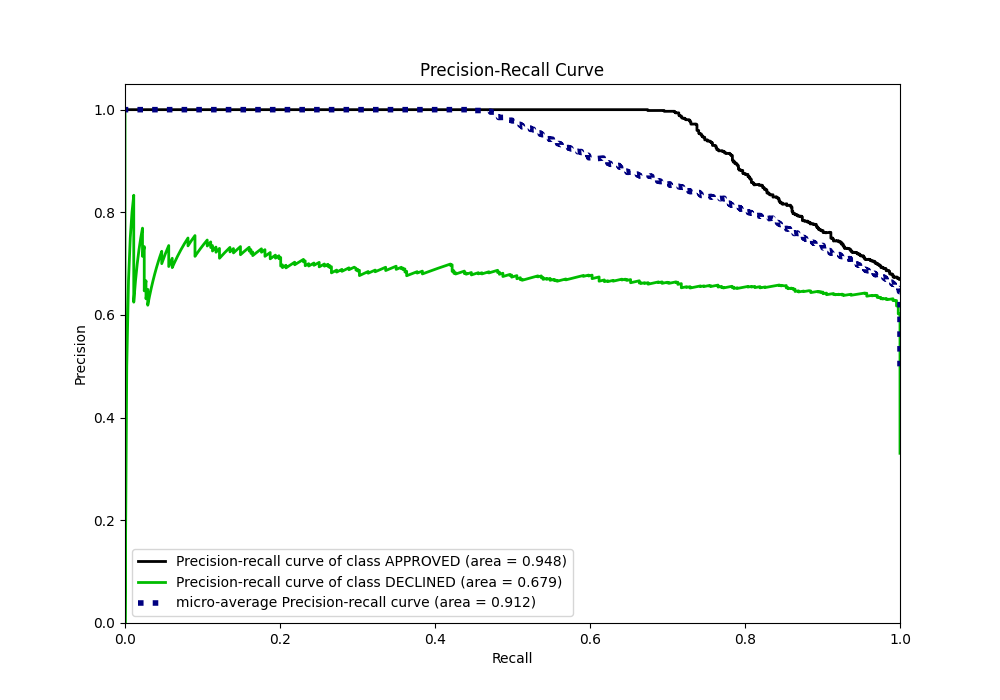
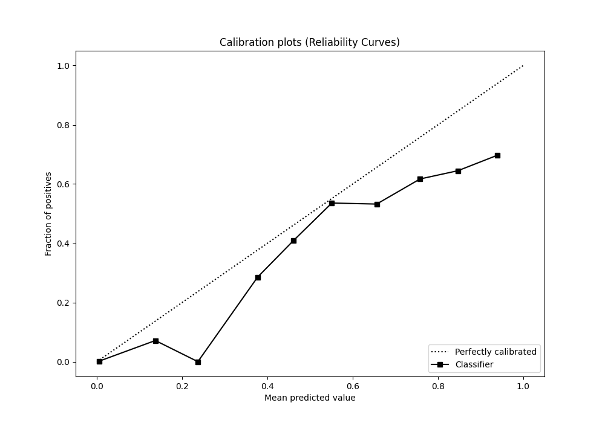
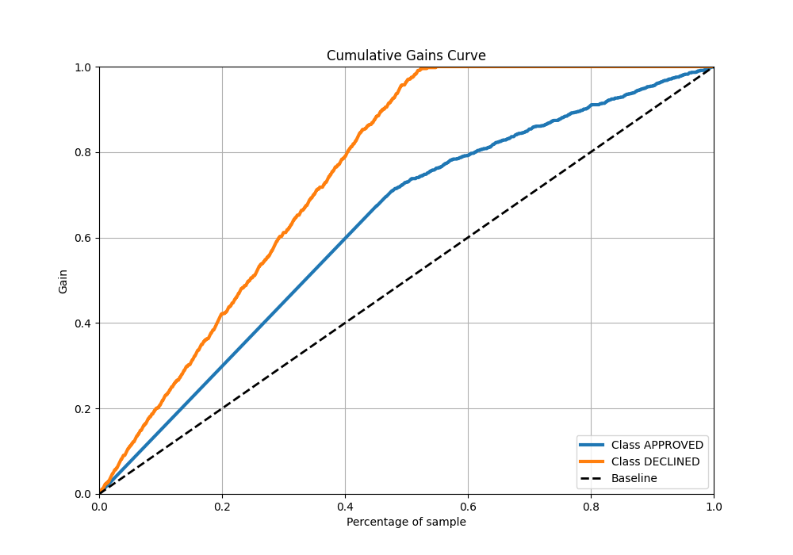
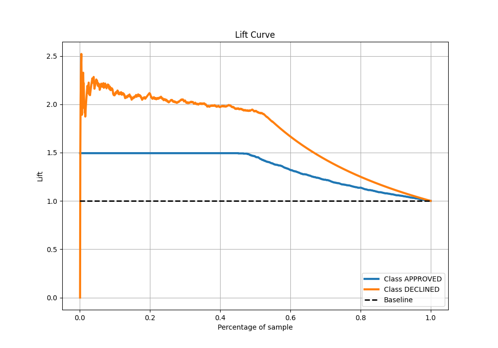

# Summary of 125_NeuralNetwork

[<< Go back](../README.md)

## Neural Network
- **n_jobs**: -1
- **dense_1_size**: 32
- **dense_2_size**: 16
- **learning_rate**: 0.01
- **explain_level**: 0

## Validation
 - **validation_type**: split
 - **train_ratio**: 0.8
 - **shuffle**: True
 - **stratify**: True

## Optimized metric
auc

## Training time

3.3 seconds

## Metric details
|           |    score |    threshold |
|:----------|---------:|-------------:|
| logloss   | 0.351087 | nan          |
| auc       | 0.874474 | nan          |
| f1        | 0.770306 |   0.292677   |
| accuracy  | 0.807463 |   0.43062    |
| precision | 0.75     |   0.738586   |
| recall    | 1        |   2.7893e-22 |
| mcc       | 0.663605 |   0.292677   |

## Metric details with threshold from accuracy metric
|           |    score |   threshold |
|:----------|---------:|------------:|
| logloss   | 0.351087 |   nan       |
| auc       | 0.874474 |   nan       |
| f1        | 0.766727 |     0.43062 |
| accuracy  | 0.807463 |     0.43062 |
| precision | 0.639517 |     0.43062 |
| recall    | 0.957111 |     0.43062 |
| mcc       | 0.649854 |     0.43062 |

## Confusion matrix (at threshold=0.43062)
|                     |   Predicted as APPROVED |   Predicted as DECLINED |
|:--------------------|------------------------:|------------------------:|
| Labeled as APPROVED |                     658 |                     239 |
| Labeled as DECLINED |                      19 |                     424 |

## Learning curves

## Confusion Matrix

## Normalized Confusion Matrix

## ROC Curve

## Kolmogorov-Smirnov Statistic

## Precision-Recall Curve

## Calibration Curve

## Cumulative Gains Curve

## Lift Curve

[<< Go back](../README.md)
