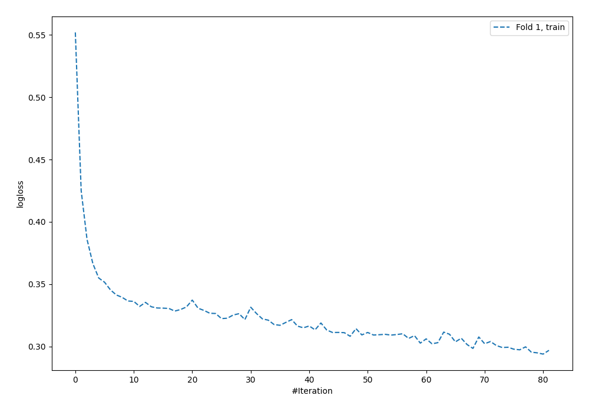
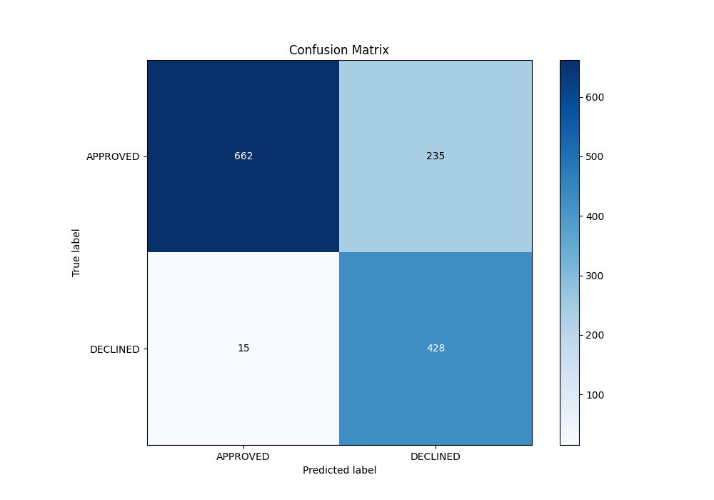
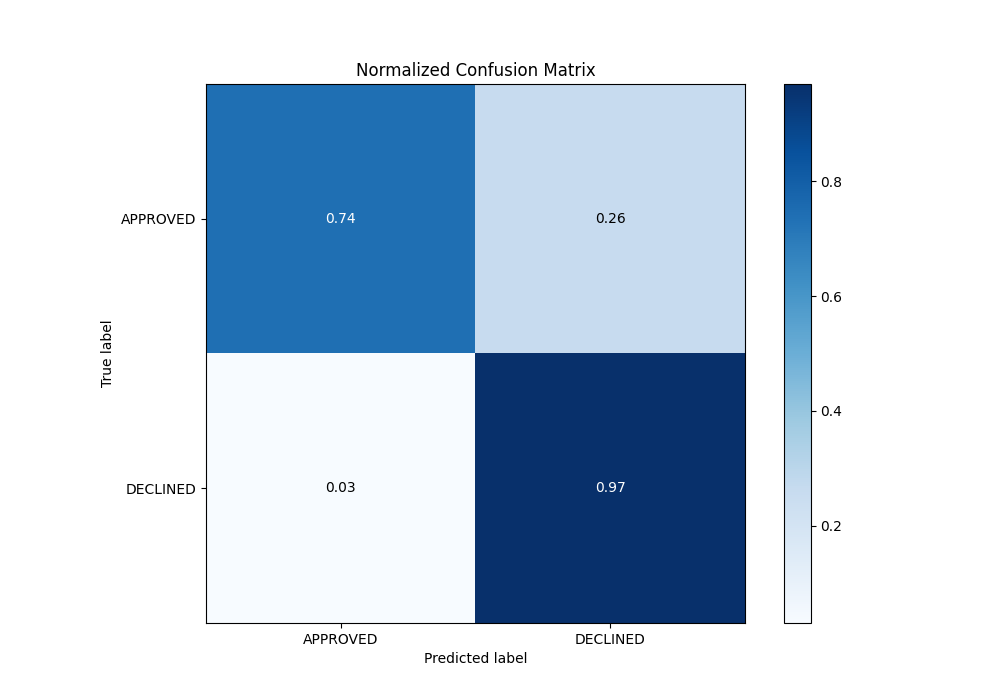
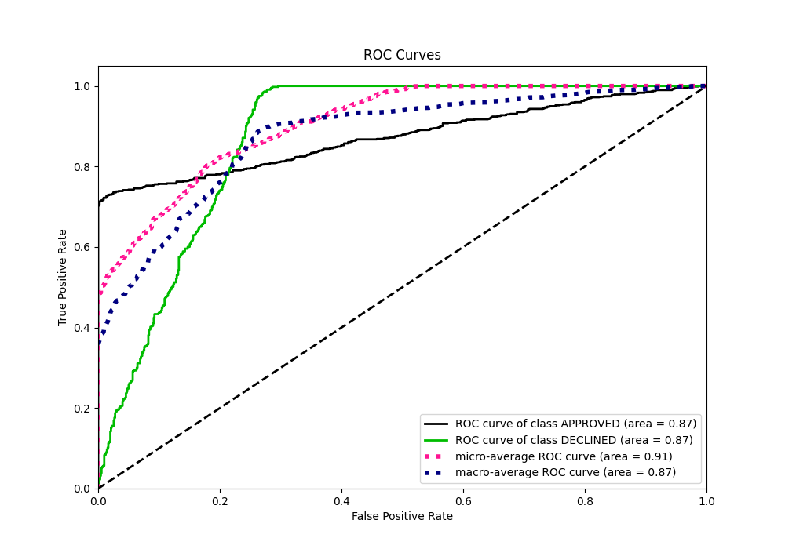
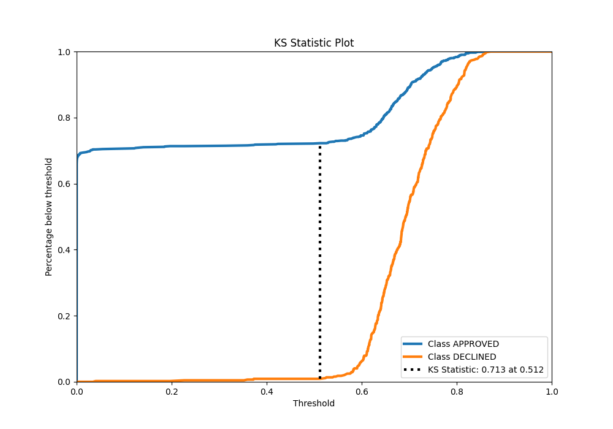
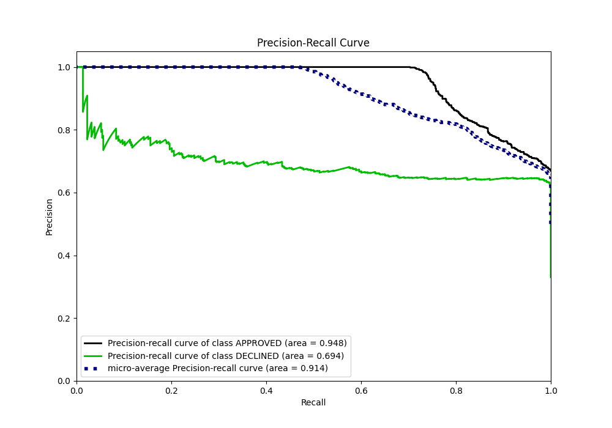
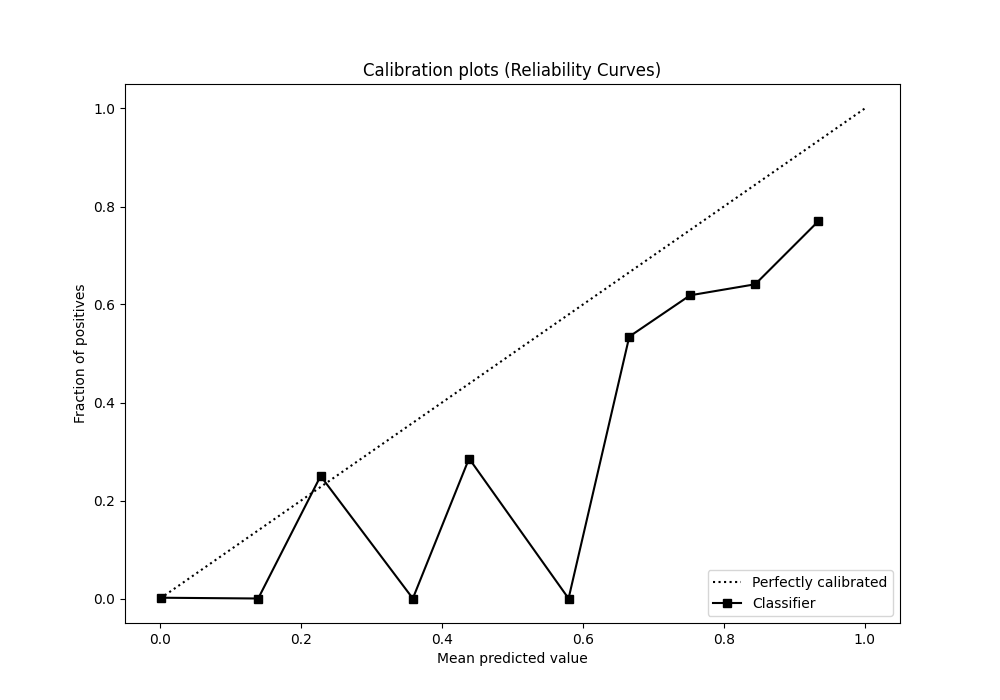
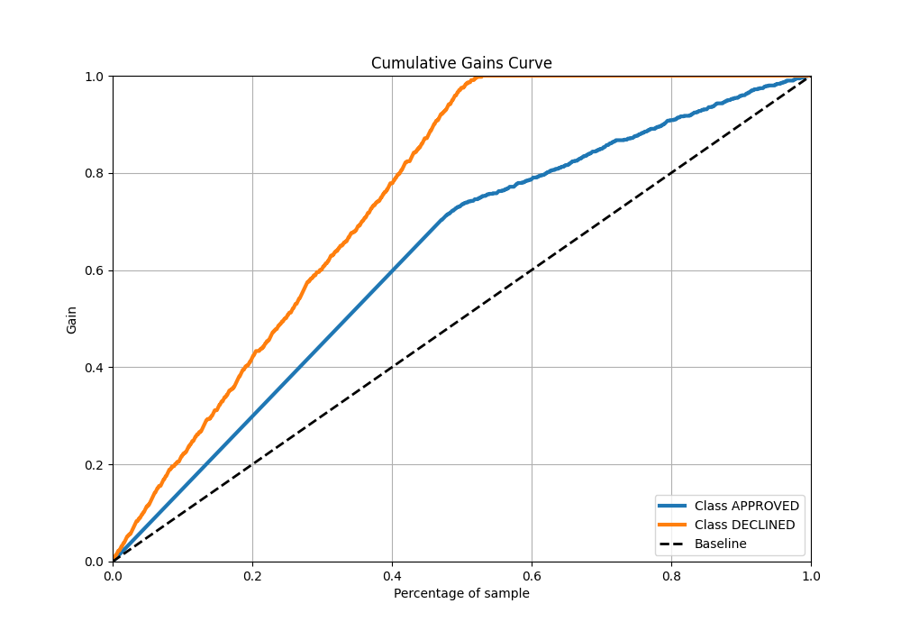
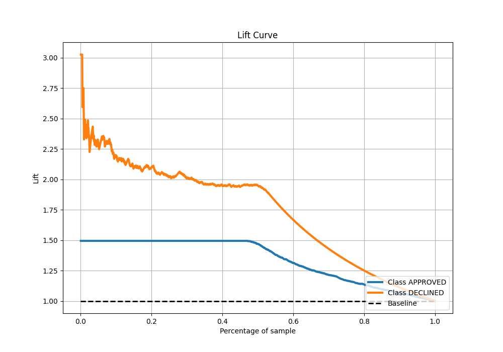

# Summary of 127_NeuralNetwork

[<< Go back](../README.md)

## Neural Network
- **n_jobs**: -1
- **dense_1_size**: 32
- **dense_2_size**: 32
- **learning_rate**: 0.01
- **explain_level**: 0

## Validation
 - **validation_type**: split
 - **train_ratio**: 0.8
 - **shuffle**: True
 - **stratify**: True

## Optimized metric
auc

## Training time

4.1 seconds

## Metric details
|           |    score |      threshold |
|:----------|---------:|---------------:|
| logloss   | 0.347366 | nan            |
| auc       | 0.8743   | nan            |
| f1        | 0.775693 |   0.564808     |
| accuracy  | 0.813433 |   0.582388     |
| precision | 0.769231 |   0.78834      |
| recall    | 1        |   3.68252e-129 |
| mcc       | 0.670408 |   0.505211     |

## Metric details with threshold from accuracy metric
|           |    score |   threshold |
|:----------|---------:|------------:|
| logloss   | 0.347366 |  nan        |
| auc       | 0.8743   |  nan        |
| f1        | 0.77396  |    0.582388 |
| accuracy  | 0.813433 |    0.582388 |
| precision | 0.645551 |    0.582388 |
| recall    | 0.96614  |    0.582388 |
| mcc       | 0.662545 |    0.582388 |

## Confusion matrix (at threshold=0.582388)
|                     |   Predicted as APPROVED |   Predicted as DECLINED |
|:--------------------|------------------------:|------------------------:|
| Labeled as APPROVED |                     662 |                     235 |
| Labeled as DECLINED |                      15 |                     428 |

## Learning curves

## Confusion Matrix

## Normalized Confusion Matrix

## ROC Curve

## Kolmogorov-Smirnov Statistic

## Precision-Recall Curve

## Calibration Curve

## Cumulative Gains Curve

## Lift Curve

[<< Go back](../README.md)
