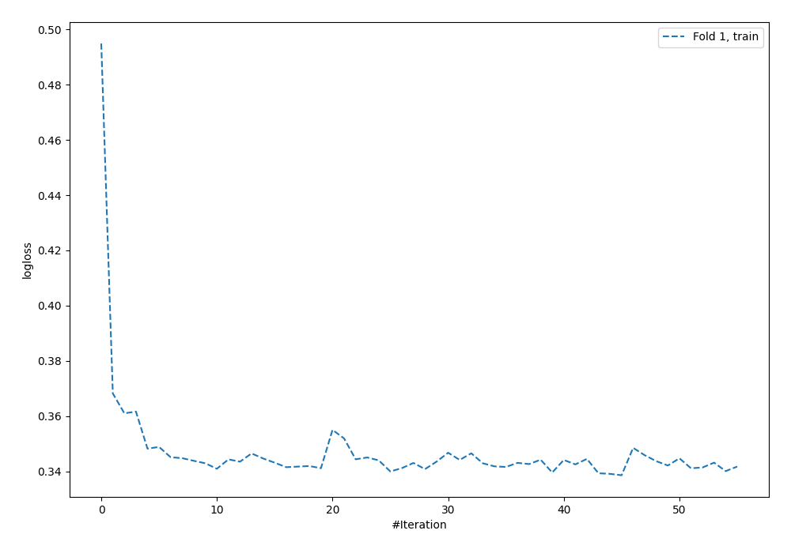
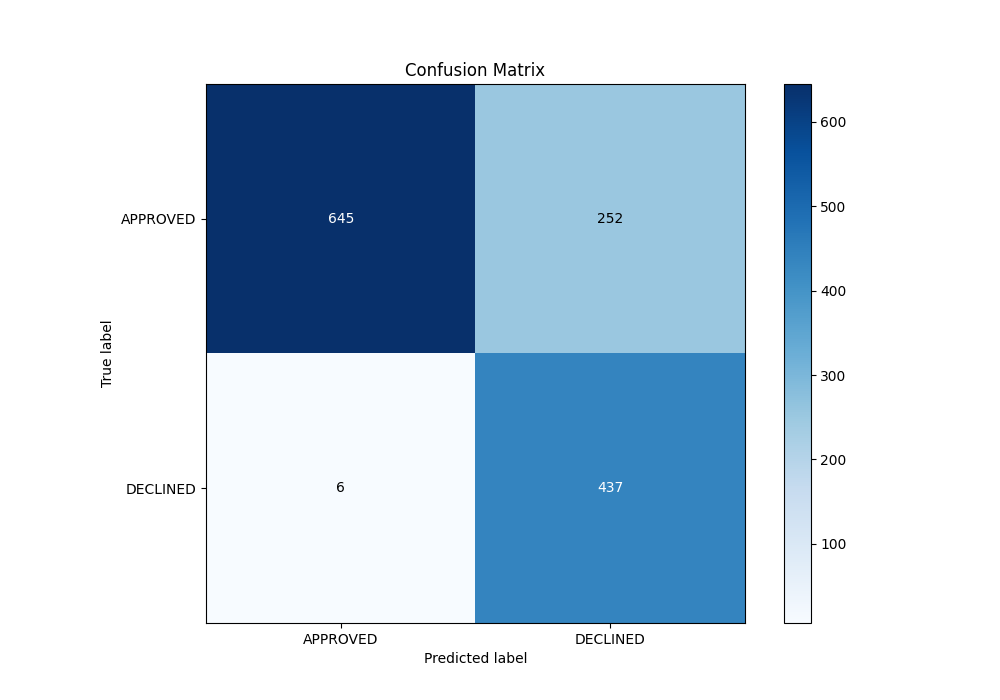
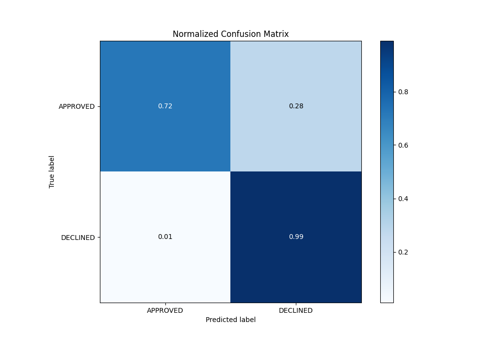
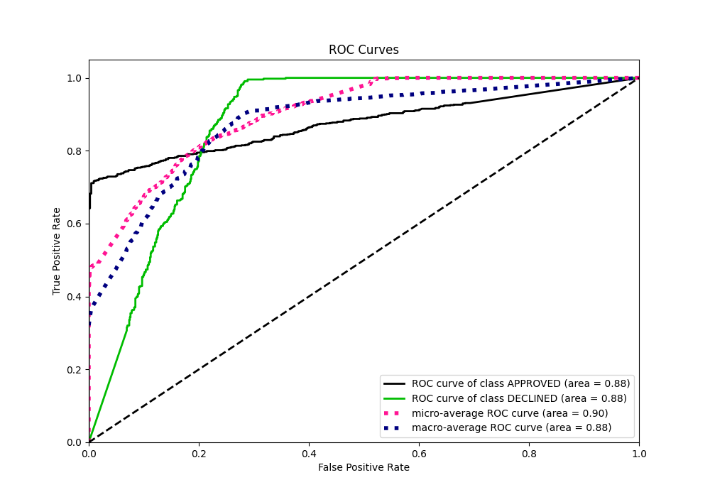
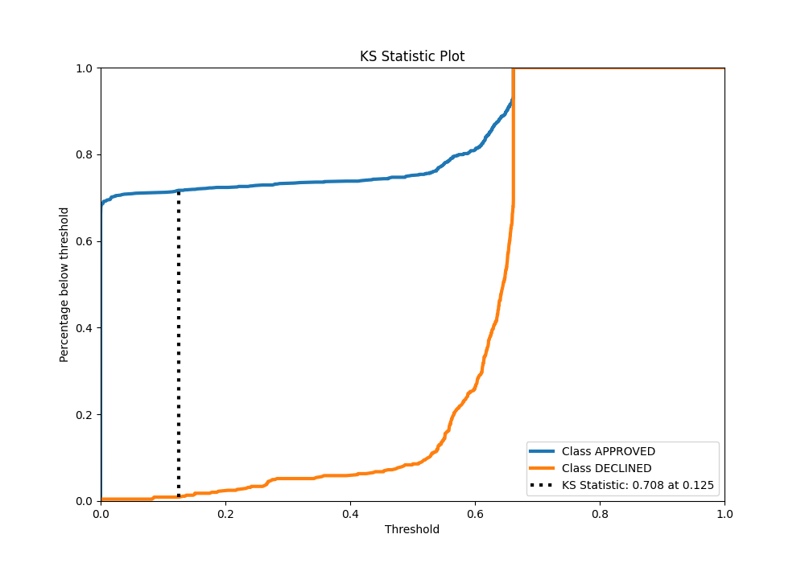
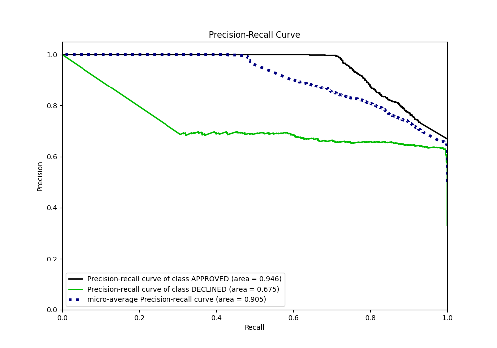
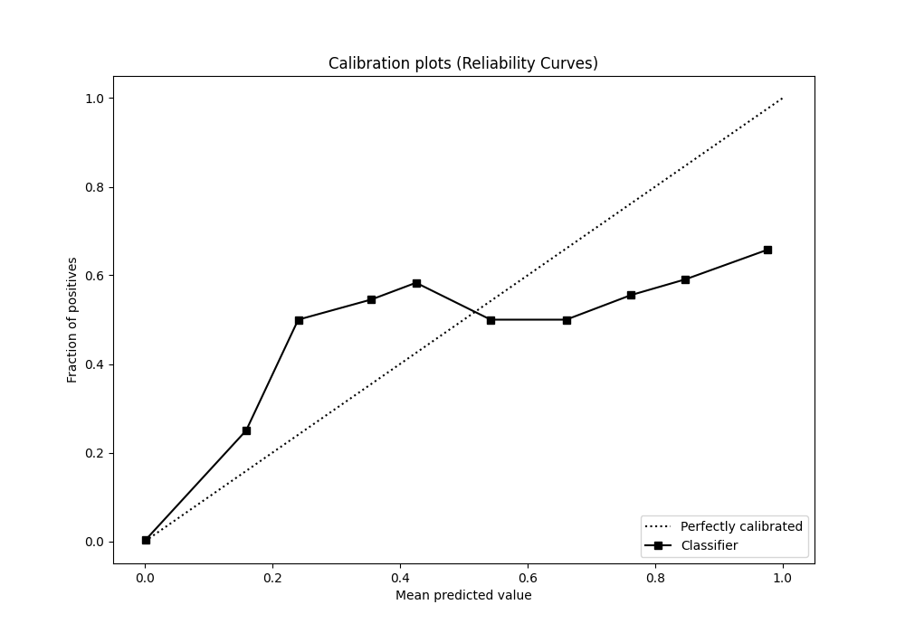
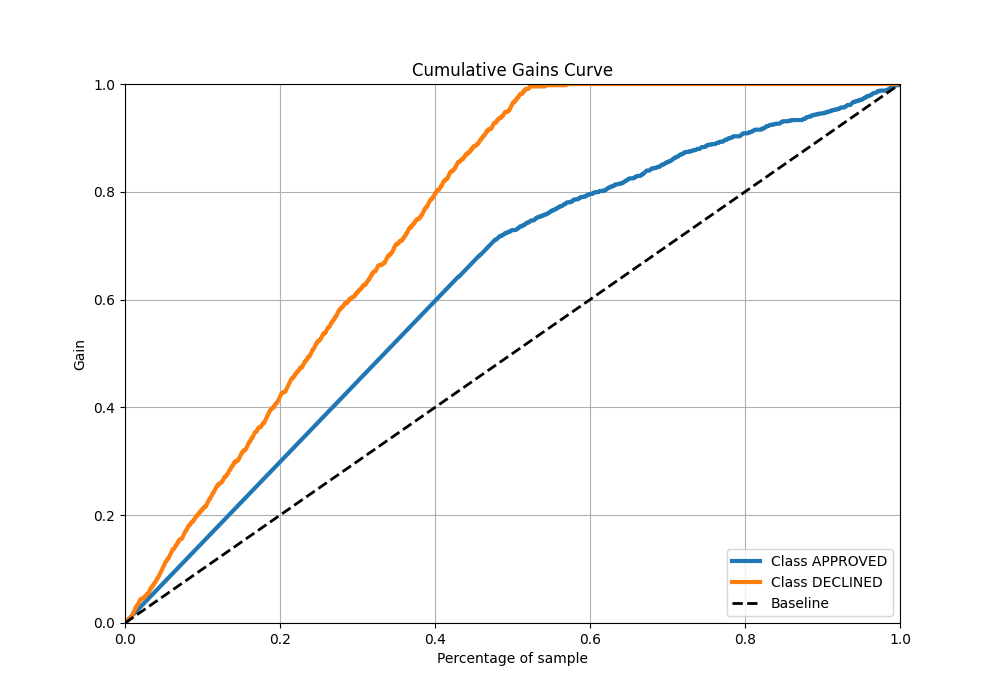
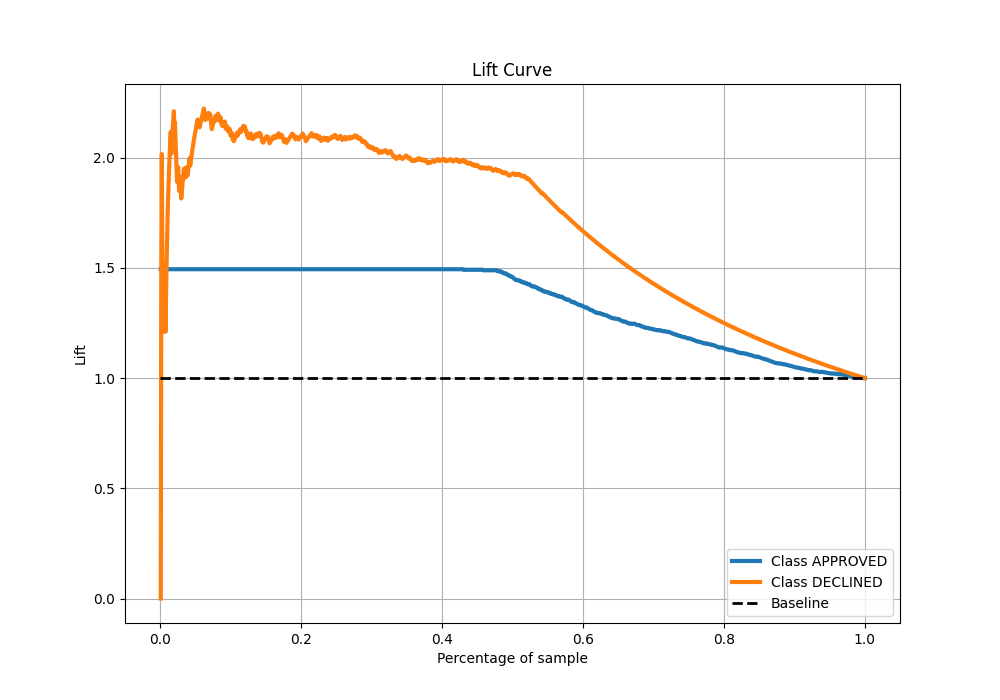

# Summary of 128_NeuralNetwork

[<< Go back](../README.md)

## Neural Network
- **n_jobs**: -1
- **dense_1_size**: 32
- **dense_2_size**: 32
- **learning_rate**: 0.08
- **explain_level**: 0

## Validation
 - **validation_type**: split
 - **train_ratio**: 0.8
 - **shuffle**: True
 - **stratify**: True

## Optimized metric
auc

## Training time

3.3 seconds

## Metric details
|           |    score |     threshold |
|:----------|---------:|--------------:|
| logloss   | 0.361363 | nan           |
| auc       | 0.875765 | nan           |
| f1        | 0.772085 |   0.149666    |
| accuracy  | 0.807463 |   0.149666    |
| precision | 0.695804 |   0.651757    |
| recall    | 1        |   3.24562e-70 |
| mcc       | 0.66406  |   0.149666    |

## Metric details with threshold from accuracy metric
|           |    score |   threshold |
|:----------|---------:|------------:|
| logloss   | 0.361363 |  nan        |
| auc       | 0.875765 |  nan        |
| f1        | 0.772085 |    0.149666 |
| accuracy  | 0.807463 |    0.149666 |
| precision | 0.634253 |    0.149666 |
| recall    | 0.986456 |    0.149666 |
| mcc       | 0.66406  |    0.149666 |

## Confusion matrix (at threshold=0.149666)
|                     |   Predicted as APPROVED |   Predicted as DECLINED |
|:--------------------|------------------------:|------------------------:|
| Labeled as APPROVED |                     645 |                     252 |
| Labeled as DECLINED |                       6 |                     437 |

## Learning curves

## Confusion Matrix

## Normalized Confusion Matrix

## ROC Curve

## Kolmogorov-Smirnov Statistic

## Precision-Recall Curve

## Calibration Curve

## Cumulative Gains Curve

## Lift Curve

[<< Go back](../README.md)
