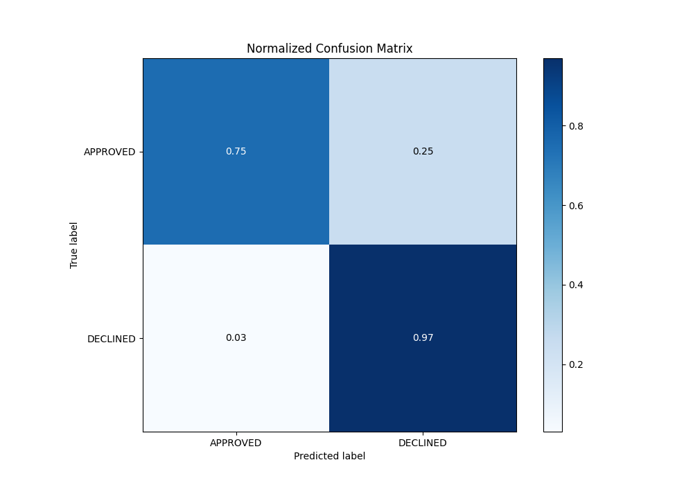

# Summary of 12_Xgboost

[<< Go back](../README.md)

## Extreme Gradient Boosting (Xgboost)
- **n_jobs**: -1
- **objective**: binary:logistic
- **eta**: 0.1
- **max_depth**: 5
- **min_child_weight**: 5
- **subsample**: 0.7
- **colsample_bytree**: 0.6
- **eval_metric**: auc
- **explain_level**: 0

## Validation
 - **validation_type**: split
 - **train_ratio**: 0.8
 - **shuffle**: True
 - **stratify**: True

## Optimized metric
auc

## Training time

1.6 seconds

## Metric details
|           |    score |     threshold |
|:----------|---------:|--------------:|
| logloss   | 0.322018 | nan           |
| auc       | 0.902065 | nan           |
| f1        | 0.783166 |   0.481413    |
| accuracy  | 0.823134 |   0.481413    |
| precision | 0.884615 |   0.775682    |
| recall    | 1        |   0.000781108 |
| mcc       | 0.683104 |   0.0962684   |

## Metric details with threshold from accuracy metric
|           |    score |   threshold |
|:----------|---------:|------------:|
| logloss   | 0.322018 |  nan        |
| auc       | 0.902065 |  nan        |
| f1        | 0.783166 |    0.481413 |
| accuracy  | 0.823134 |    0.481413 |
| precision | 0.658462 |    0.481413 |
| recall    | 0.96614  |    0.481413 |
| mcc       | 0.676446 |    0.481413 |

## Confusion matrix (at threshold=0.481413)
|                     |   Predicted as APPROVED |   Predicted as DECLINED |
|:--------------------|------------------------:|------------------------:|
| Labeled as APPROVED |                     675 |                     222 |
| Labeled as DECLINED |                      15 |                     428 |

## Learning curves

## Confusion Matrix

## Normalized Confusion Matrix

## ROC Curve

## Kolmogorov-Smirnov Statistic

## Precision-Recall Curve

## Calibration Curve

## Cumulative Gains Curve

## Lift Curve

[<< Go back](../README.md)
