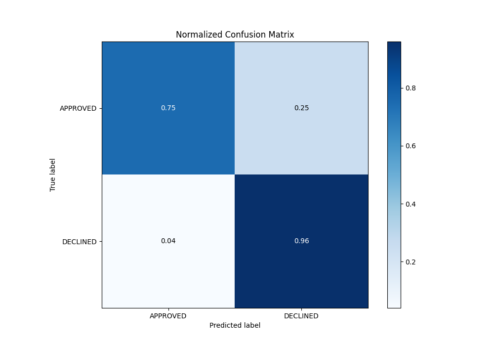

# Summary of 132_ExtraTrees

[<< Go back](../README.md)

## Extra Trees Classifier (Extra Trees)
- **n_jobs**: -1
- **criterion**: gini
- **max_features**: 0.9
- **min_samples_split**: 20
- **max_depth**: 6
- **eval_metric_name**: auc
- **explain_level**: 0

## Validation
 - **validation_type**: split
 - **train_ratio**: 0.8
 - **shuffle**: True
 - **stratify**: True

## Optimized metric
auc

## Training time

3.0 seconds

## Metric details
|           |    score |   threshold |
|:----------|---------:|------------:|
| logloss   | 0.382676 |  nan        |
| auc       | 0.875322 |  nan        |
| f1        | 0.784629 |    0.535318 |
| accuracy  | 0.821642 |    0.547167 |
| precision | 0.75     |    0.604206 |
| recall    | 1        |    0        |
| mcc       | 0.683801 |    0.535318 |

## Metric details with threshold from accuracy metric
|           |    score |   threshold |
|:----------|---------:|------------:|
| logloss   | 0.382676 |  nan        |
| auc       | 0.875322 |  nan        |
| f1        | 0.781336 |    0.547167 |
| accuracy  | 0.821642 |    0.547167 |
| precision | 0.656923 |    0.547167 |
| recall    | 0.963883 |    0.547167 |
| mcc       | 0.673272 |    0.547167 |

## Confusion matrix (at threshold=0.547167)
|                     |   Predicted as APPROVED |   Predicted as DECLINED |
|:--------------------|------------------------:|------------------------:|
| Labeled as APPROVED |                     674 |                     223 |
| Labeled as DECLINED |                      16 |                     427 |

## Learning curves

## Confusion Matrix

## Normalized Confusion Matrix

## ROC Curve

## Kolmogorov-Smirnov Statistic

## Precision-Recall Curve

## Calibration Curve

## Cumulative Gains Curve

## Lift Curve

[<< Go back](../README.md)
