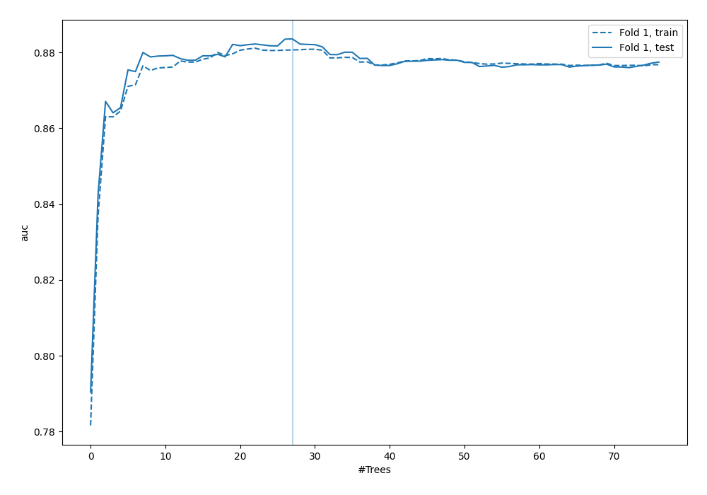
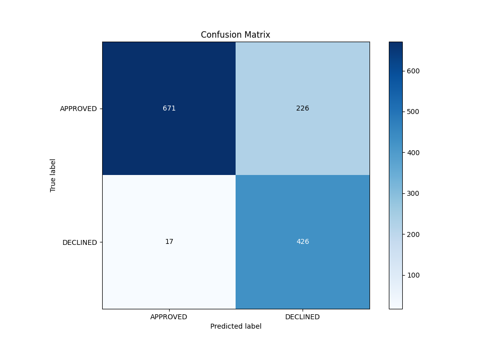
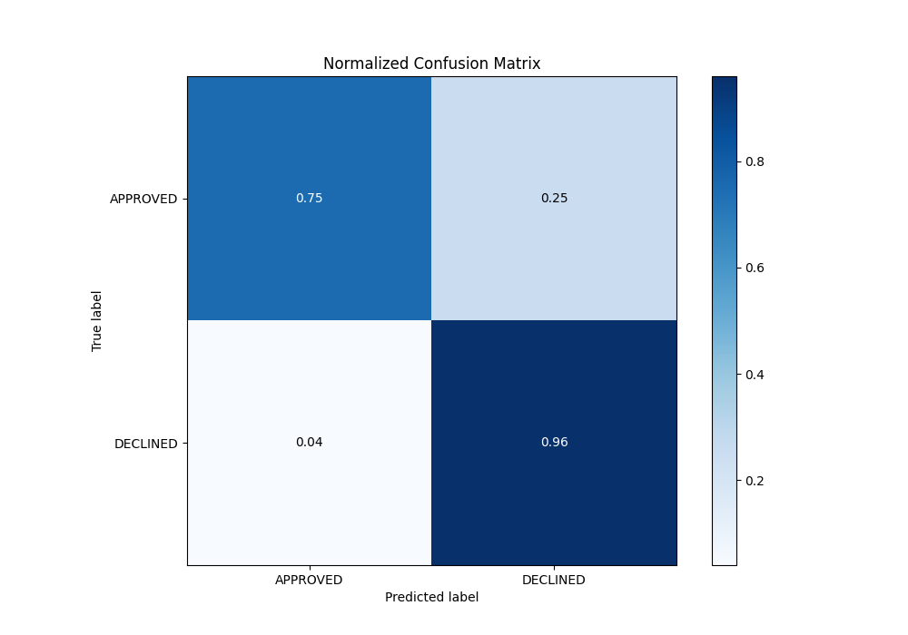
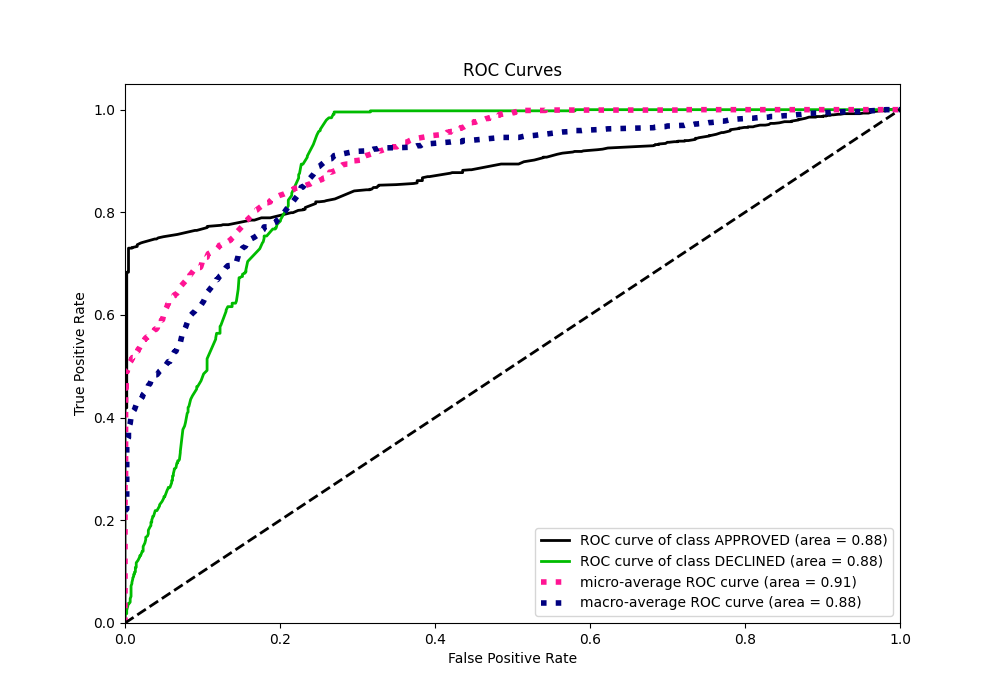
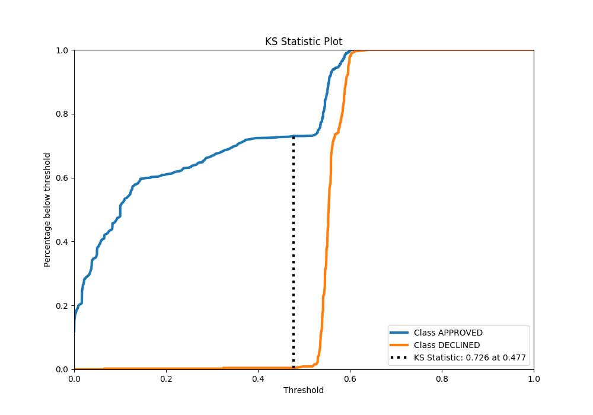
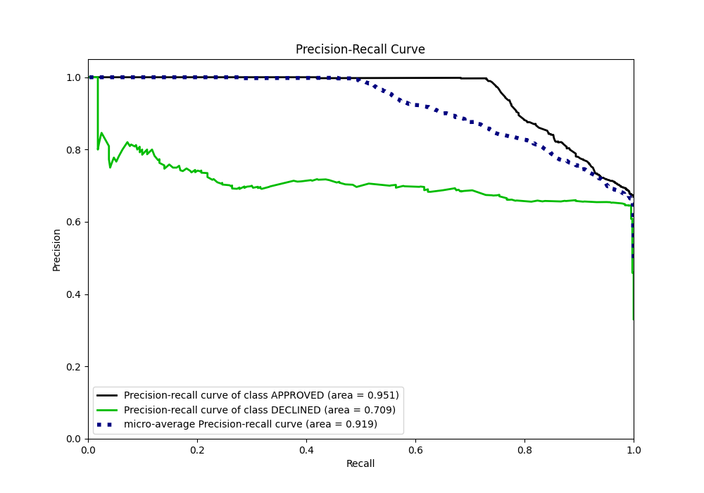
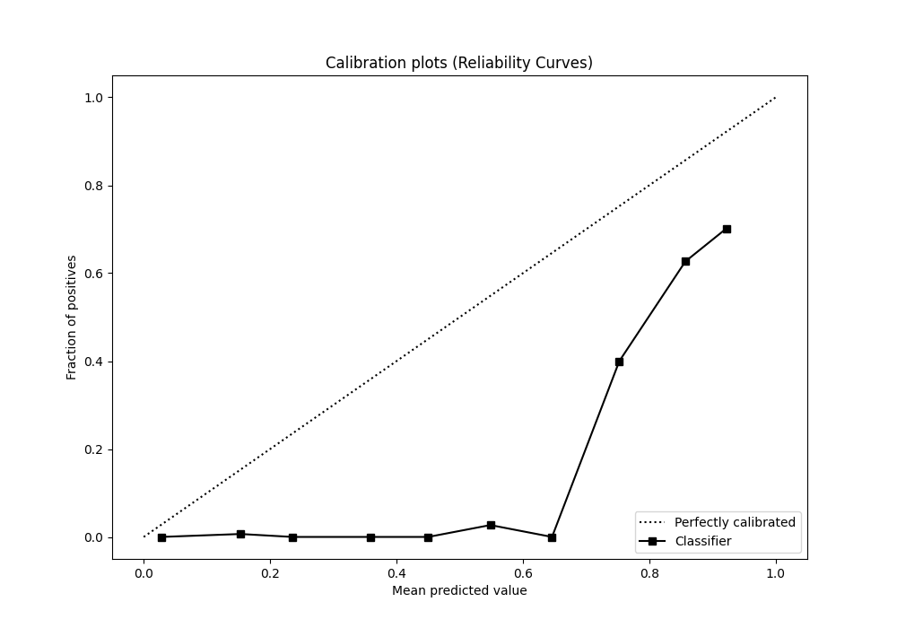
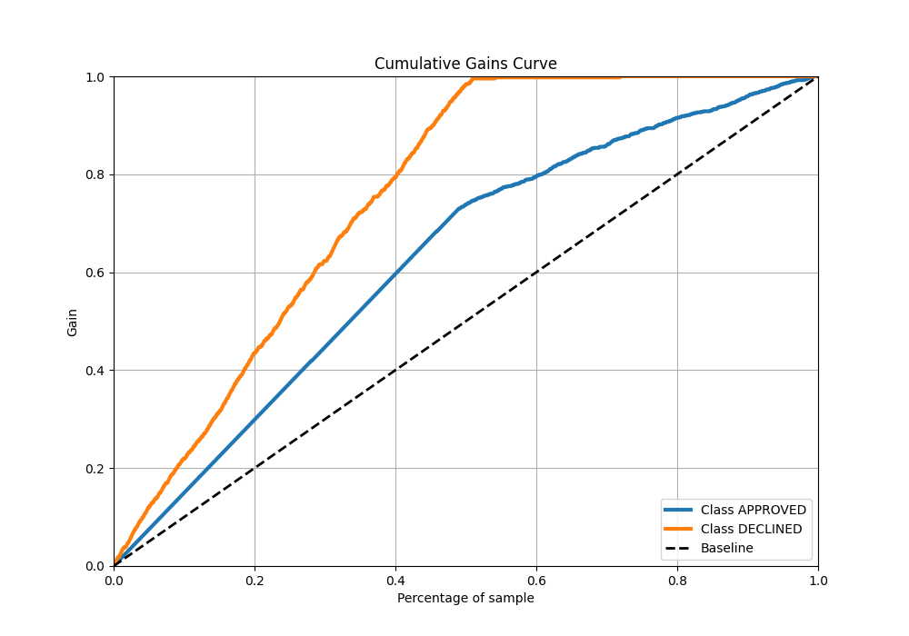
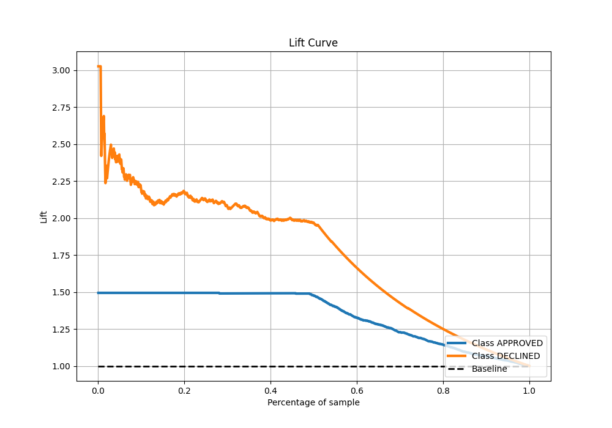

# Summary of 133_ExtraTrees

[<< Go back](../README.md)

## Extra Trees Classifier (Extra Trees)
- **n_jobs**: -1
- **criterion**: entropy
- **max_features**: 0.8
- **min_samples_split**: 50
- **max_depth**: 6
- **eval_metric_name**: auc
- **explain_level**: 0

## Validation
 - **validation_type**: split
 - **train_ratio**: 0.8
 - **shuffle**: True
 - **stratify**: True

## Optimized metric
auc

## Training time

3.0 seconds

## Metric details
|           |    score |   threshold |
|:----------|---------:|------------:|
| logloss   | 0.391115 |  nan        |
| auc       | 0.883558 |  nan        |
| f1        | 0.779964 |    0.523082 |
| accuracy  | 0.818657 |    0.530389 |
| precision | 0.807692 |    0.591956 |
| recall    | 1        |    0        |
| mcc       | 0.676756 |    0.408939 |

## Metric details with threshold from accuracy metric
|           |    score |   threshold |
|:----------|---------:|------------:|
| logloss   | 0.391115 |  nan        |
| auc       | 0.883558 |  nan        |
| f1        | 0.778082 |    0.530389 |
| accuracy  | 0.818657 |    0.530389 |
| precision | 0.653374 |    0.530389 |
| recall    | 0.961625 |    0.530389 |
| mcc       | 0.667943 |    0.530389 |

## Confusion matrix (at threshold=0.530389)
|                     |   Predicted as APPROVED |   Predicted as DECLINED |
|:--------------------|------------------------:|------------------------:|
| Labeled as APPROVED |                     671 |                     226 |
| Labeled as DECLINED |                      17 |                     426 |

## Learning curves

## Confusion Matrix

## Normalized Confusion Matrix

## ROC Curve

## Kolmogorov-Smirnov Statistic

## Precision-Recall Curve

## Calibration Curve

## Cumulative Gains Curve

## Lift Curve

[<< Go back](../README.md)
