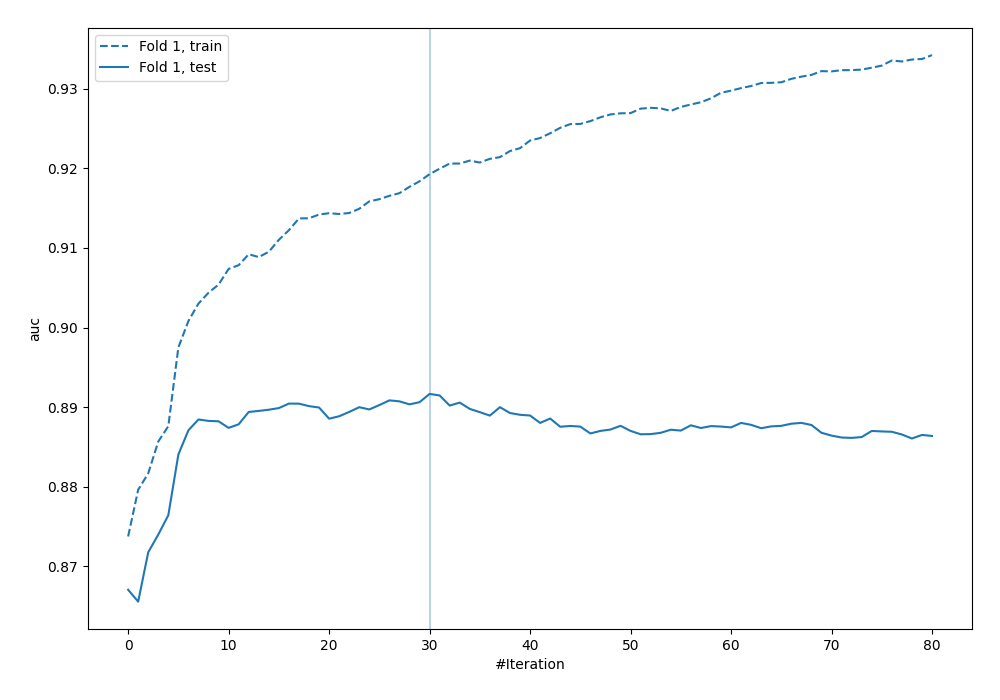
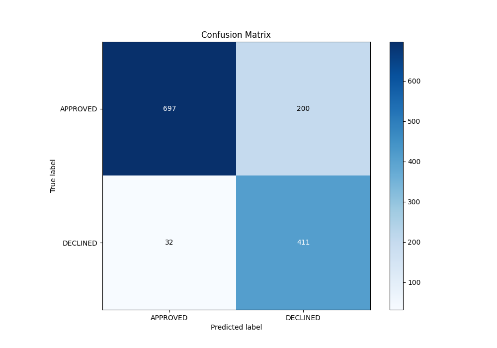
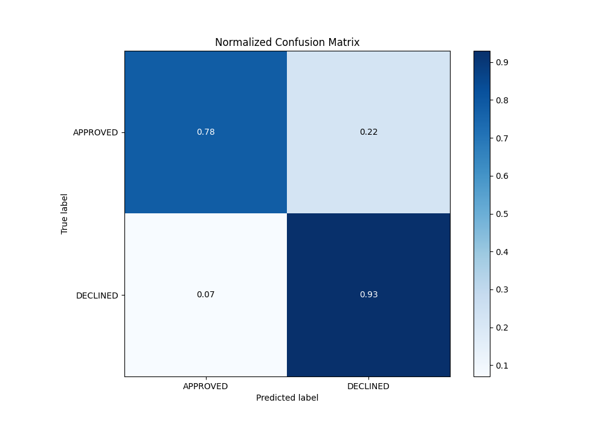
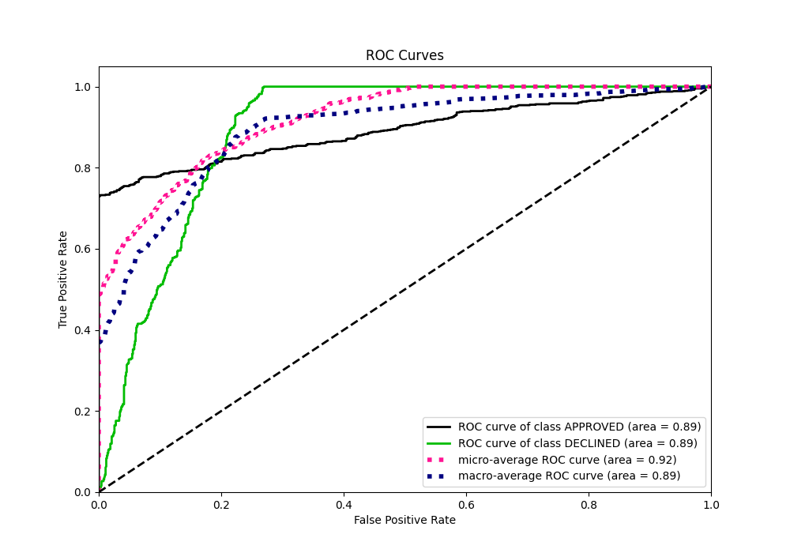
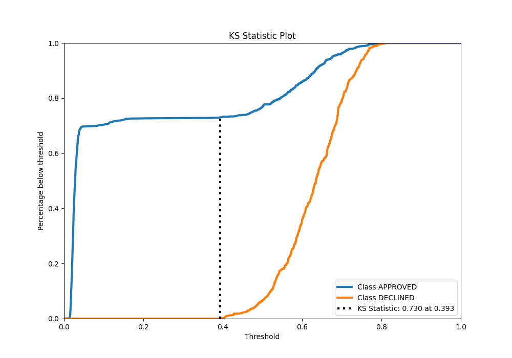
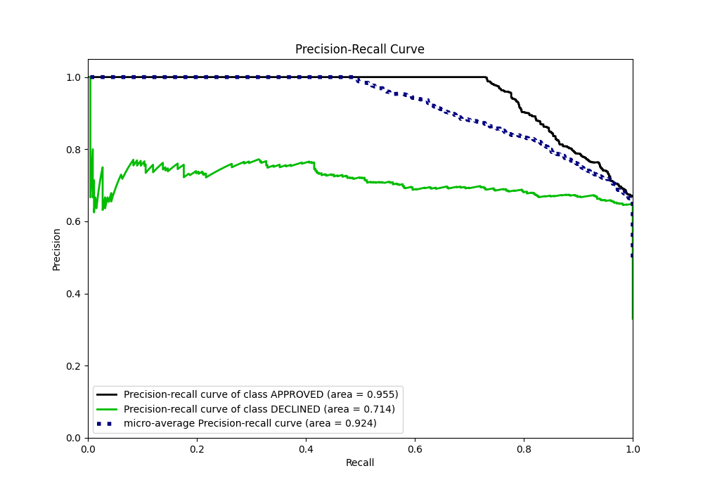
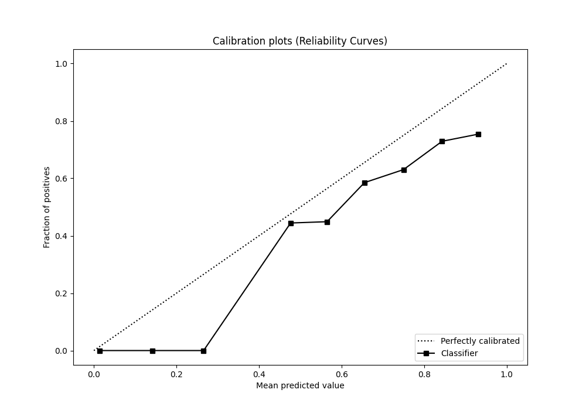
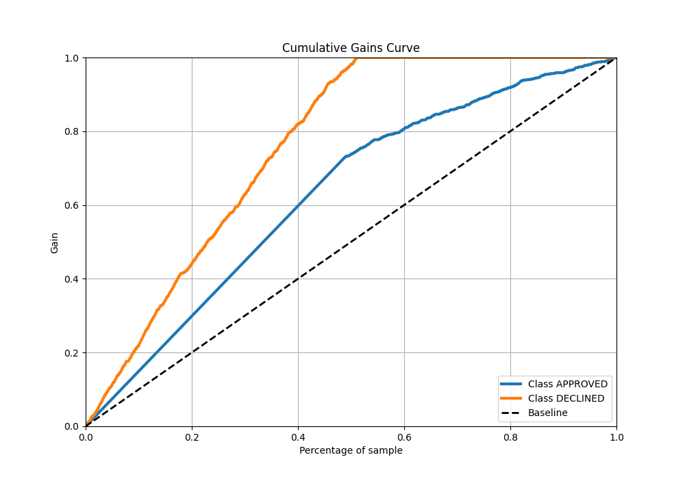
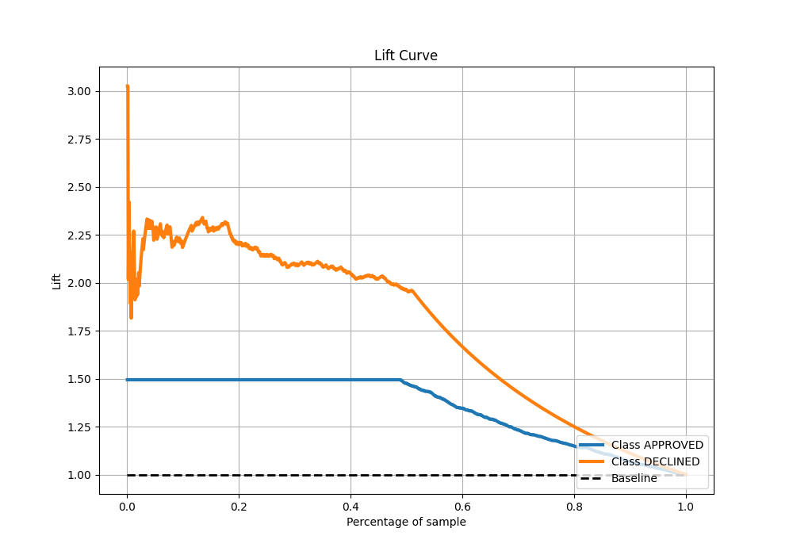

# Summary of 13_Xgboost

[<< Go back](../README.md)

## Extreme Gradient Boosting (Xgboost)
- **n_jobs**: -1
- **objective**: binary:logistic
- **eta**: 0.15
- **max_depth**: 7
- **min_child_weight**: 25
- **subsample**: 0.6
- **colsample_bytree**: 1.0
- **eval_metric**: auc
- **explain_level**: 0

## Validation
 - **validation_type**: split
 - **train_ratio**: 0.8
 - **shuffle**: True
 - **stratify**: True

## Optimized metric
auc

## Training time

1.5 seconds

## Metric details
|           |    score |   threshold |
|:----------|---------:|------------:|
| logloss   | 0.341834 | nan         |
| auc       | 0.89166  | nan         |
| f1        | 0.782686 |   0.197223  |
| accuracy  | 0.826866 |   0.505587  |
| precision | 0.769231 |   0.680212  |
| recall    | 1        |   0.0130685 |
| mcc       | 0.683104 |   0.197223  |

## Metric details with threshold from accuracy metric
|           |    score |   threshold |
|:----------|---------:|------------:|
| logloss   | 0.341834 |  nan        |
| auc       | 0.89166  |  nan        |
| f1        | 0.779886 |    0.505587 |
| accuracy  | 0.826866 |    0.505587 |
| precision | 0.672668 |    0.505587 |
| recall    | 0.927765 |    0.505587 |
| mcc       | 0.665701 |    0.505587 |

## Confusion matrix (at threshold=0.505587)
|                     |   Predicted as APPROVED |   Predicted as DECLINED |
|:--------------------|------------------------:|------------------------:|
| Labeled as APPROVED |                     697 |                     200 |
| Labeled as DECLINED |                      32 |                     411 |

## Learning curves

## Confusion Matrix

## Normalized Confusion Matrix

## ROC Curve

## Kolmogorov-Smirnov Statistic

## Precision-Recall Curve

## Calibration Curve

## Cumulative Gains Curve

## Lift Curve

[<< Go back](../README.md)
