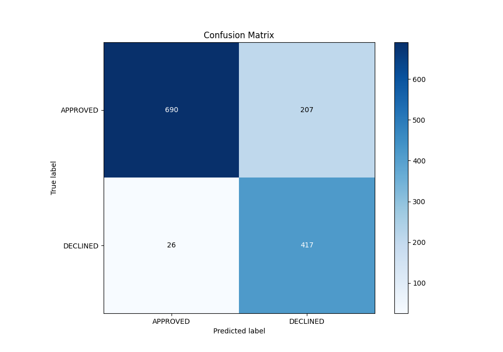

# Summary of 14_Xgboost

[<< Go back](../README.md)

## Extreme Gradient Boosting (Xgboost)
- **n_jobs**: -1
- **objective**: binary:logistic
- **eta**: 0.1
- **max_depth**: 8
- **min_child_weight**: 1
- **subsample**: 0.6
- **colsample_bytree**: 0.5
- **eval_metric**: auc
- **explain_level**: 0

## Validation
 - **validation_type**: split
 - **train_ratio**: 0.8
 - **shuffle**: True
 - **stratify**: True

## Optimized metric
auc

## Training time

1.6 seconds

## Metric details
|           |    score |    threshold |
|:----------|---------:|-------------:|
| logloss   | 0.33455  | nan          |
| auc       | 0.892853 | nan          |
| f1        | 0.784629 |   0.355276   |
| accuracy  | 0.826119 |   0.474352   |
| precision | 0.826923 |   0.754603   |
| recall    | 1        |   0.00348661 |
| mcc       | 0.683801 |   0.355276   |

## Metric details with threshold from accuracy metric
|           |    score |   threshold |
|:----------|---------:|------------:|
| logloss   | 0.33455  |  nan        |
| auc       | 0.892853 |  nan        |
| f1        | 0.781631 |    0.474352 |
| accuracy  | 0.826119 |    0.474352 |
| precision | 0.668269 |    0.474352 |
| recall    | 0.941309 |    0.474352 |
| mcc       | 0.670097 |    0.474352 |

## Confusion matrix (at threshold=0.474352)
|                     |   Predicted as APPROVED |   Predicted as DECLINED |
|:--------------------|------------------------:|------------------------:|
| Labeled as APPROVED |                     690 |                     207 |
| Labeled as DECLINED |                      26 |                     417 |

## Learning curves

## Confusion Matrix

## Normalized Confusion Matrix

## ROC Curve

## Kolmogorov-Smirnov Statistic

## Precision-Recall Curve

## Calibration Curve

## Cumulative Gains Curve

## Lift Curve

[<< Go back](../README.md)
