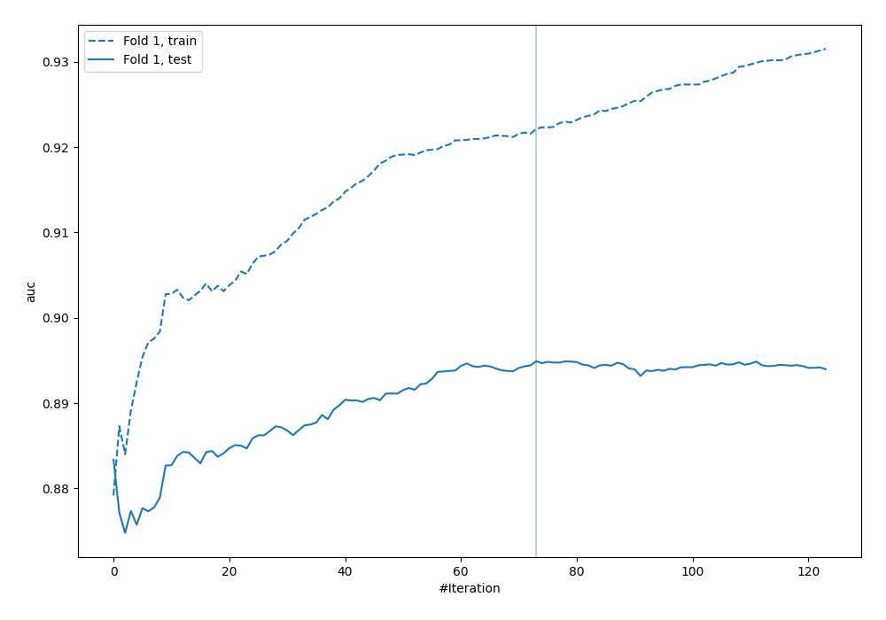

# Summary of 15_Xgboost

[<< Go back](../README.md)

## Extreme Gradient Boosting (Xgboost)
- **n_jobs**: -1
- **objective**: binary:logistic
- **eta**: 0.05
- **max_depth**: 6
- **min_child_weight**: 10
- **subsample**: 0.6
- **colsample_bytree**: 0.6
- **eval_metric**: auc
- **explain_level**: 0

## Validation
 - **validation_type**: split
 - **train_ratio**: 0.8
 - **shuffle**: True
 - **stratify**: True

## Optimized metric
auc

## Training time

1.7 seconds

## Metric details
|           |    score |    threshold |
|:----------|---------:|-------------:|
| logloss   | 0.335895 | nan          |
| auc       | 0.894904 | nan          |
| f1        | 0.786416 |   0.437082   |
| accuracy  | 0.823881 |   0.562455   |
| precision | 0.846154 |   0.720411   |
| recall    | 1        |   0.00750422 |
| mcc       | 0.686974 |   0.437082   |

## Metric details with threshold from accuracy metric
|           |    score |   threshold |
|:----------|---------:|------------:|
| logloss   | 0.335895 |  nan        |
| auc       | 0.894904 |  nan        |
| f1        | 0.770428 |    0.562455 |
| accuracy  | 0.823881 |    0.562455 |
| precision | 0.676923 |    0.562455 |
| recall    | 0.893905 |    0.562455 |
| mcc       | 0.648032 |    0.562455 |

## Confusion matrix (at threshold=0.562455)
|                     |   Predicted as APPROVED |   Predicted as DECLINED |
|:--------------------|------------------------:|------------------------:|
| Labeled as APPROVED |                     708 |                     189 |
| Labeled as DECLINED |                      47 |                     396 |

## Learning curves

## Confusion Matrix

## Normalized Confusion Matrix

## ROC Curve

## Kolmogorov-Smirnov Statistic

## Precision-Recall Curve

## Calibration Curve

## Cumulative Gains Curve

## Lift Curve

[<< Go back](../README.md)
