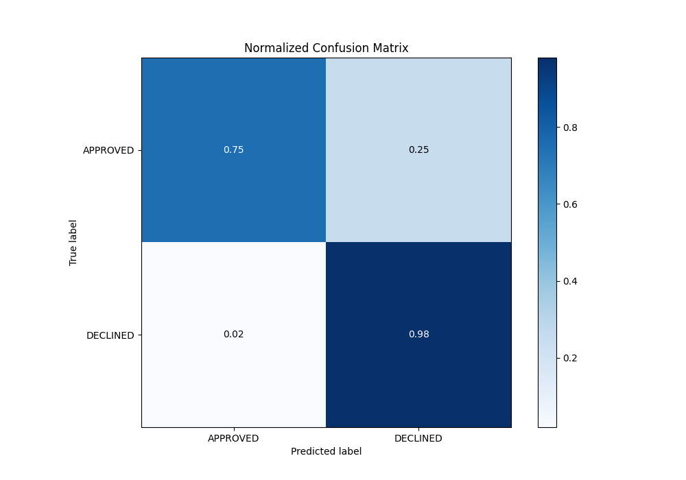

# Summary of 16_LightGBM

[<< Go back](../README.md)

## LightGBM
- **n_jobs**: -1
- **objective**: binary
- **num_leaves**: 95
- **learning_rate**: 0.1
- **feature_fraction**: 0.5
- **bagging_fraction**: 0.8
- **min_data_in_leaf**: 50
- **metric**: auc
- **custom_eval_metric_name**: None
- **explain_level**: 0

## Validation
 - **validation_type**: split
 - **train_ratio**: 0.8
 - **shuffle**: True
 - **stratify**: True

## Optimized metric
auc

## Training time

1.0 seconds

## Metric details
|           |    score |    threshold |
|:----------|---------:|-------------:|
| logloss   | 0.327018 | nan          |
| auc       | 0.897262 | nan          |
| f1        | 0.786618 |   0.409166   |
| accuracy  | 0.823881 |   0.409166   |
| precision | 0.884615 |   0.801606   |
| recall    | 1        |   0.00547518 |
| mcc       | 0.686974 |   0.352595   |

## Metric details with threshold from accuracy metric
|           |    score |   threshold |
|:----------|---------:|------------:|
| logloss   | 0.327018 |  nan        |
| auc       | 0.897262 |  nan        |
| f1        | 0.786618 |    0.409166 |
| accuracy  | 0.823881 |    0.409166 |
| precision | 0.656109 |    0.409166 |
| recall    | 0.981941 |    0.409166 |
| mcc       | 0.684756 |    0.409166 |

## Confusion matrix (at threshold=0.409166)
|                     |   Predicted as APPROVED |   Predicted as DECLINED |
|:--------------------|------------------------:|------------------------:|
| Labeled as APPROVED |                     669 |                     228 |
| Labeled as DECLINED |                       8 |                     435 |

## Learning curves

## Confusion Matrix

## Normalized Confusion Matrix

## ROC Curve

## Kolmogorov-Smirnov Statistic

## Precision-Recall Curve

## Calibration Curve

## Cumulative Gains Curve

## Lift Curve

[<< Go back](../README.md)
