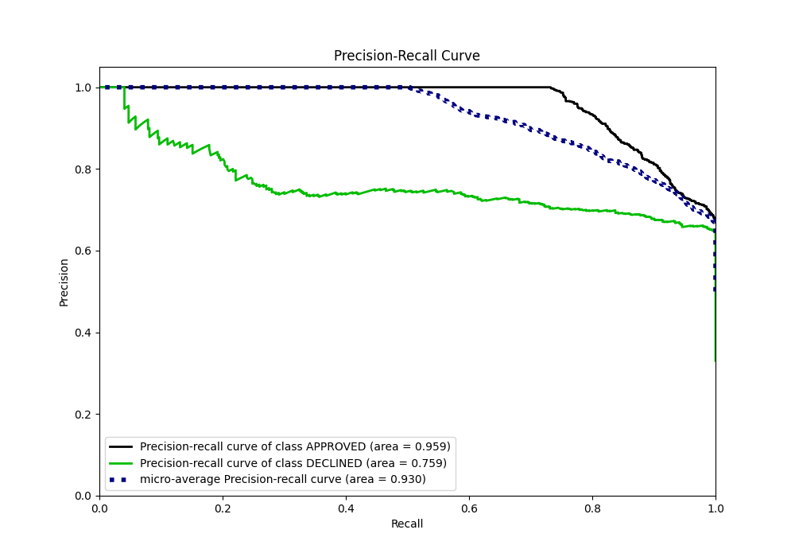

# Summary of 17_LightGBM

[<< Go back](../README.md)

## LightGBM
- **n_jobs**: -1
- **objective**: binary
- **num_leaves**: 15
- **learning_rate**: 0.1
- **feature_fraction**: 0.8
- **bagging_fraction**: 0.5
- **min_data_in_leaf**: 5
- **metric**: auc
- **custom_eval_metric_name**: None
- **explain_level**: 0

## Validation
 - **validation_type**: split
 - **train_ratio**: 0.8
 - **shuffle**: True
 - **stratify**: True

## Optimized metric
auc

## Training time

1.1 seconds

## Metric details
|           |    score |    threshold |
|:----------|---------:|-------------:|
| logloss   | 0.318507 | nan          |
| auc       | 0.901415 | nan          |
| f1        | 0.788427 |   0.426544   |
| accuracy  | 0.827612 |   0.560617   |
| precision | 0.865385 |   0.773219   |
| recall    | 1        |   0.00135032 |
| mcc       | 0.687928 |   0.426544   |

## Metric details with threshold from accuracy metric
|           |    score |   threshold |
|:----------|---------:|------------:|
| logloss   | 0.318507 |  nan        |
| auc       | 0.901415 |  nan        |
| f1        | 0.772414 |    0.560617 |
| accuracy  | 0.827612 |    0.560617 |
| precision | 0.685315 |    0.560617 |
| recall    | 0.884876 |    0.560617 |
| mcc       | 0.650739 |    0.560617 |

## Confusion matrix (at threshold=0.560617)
|                     |   Predicted as APPROVED |   Predicted as DECLINED |
|:--------------------|------------------------:|------------------------:|
| Labeled as APPROVED |                     717 |                     180 |
| Labeled as DECLINED |                      51 |                     392 |

## Learning curves

## Confusion Matrix

## Normalized Confusion Matrix

## ROC Curve

## Kolmogorov-Smirnov Statistic

## Precision-Recall Curve

## Calibration Curve

## Cumulative Gains Curve

## Lift Curve

[<< Go back](../README.md)
