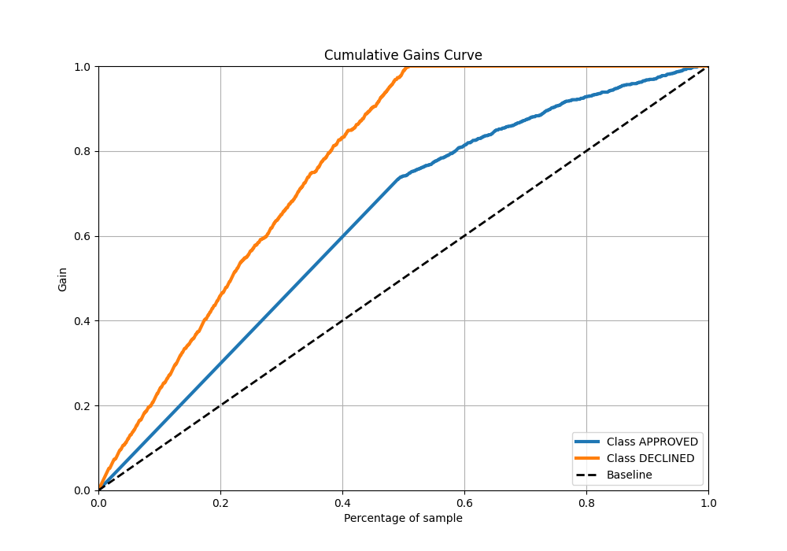

# Summary of 18_LightGBM

[<< Go back](../README.md)

## LightGBM
- **n_jobs**: -1
- **objective**: binary
- **num_leaves**: 31
- **learning_rate**: 0.05
- **feature_fraction**: 0.9
- **bagging_fraction**: 0.9
- **min_data_in_leaf**: 20
- **metric**: auc
- **custom_eval_metric_name**: None
- **explain_level**: 0

## Validation
 - **validation_type**: split
 - **train_ratio**: 0.8
 - **shuffle**: True
 - **stratify**: True

## Optimized metric
auc

## Training time

1.2 seconds

## Metric details
|           |    score |   threshold |
|:----------|---------:|------------:|
| logloss   | 0.351253 | nan         |
| auc       | 0.900115 | nan         |
| f1        | 0.788204 |   0.352158  |
| accuracy  | 0.823134 |   0.352158  |
| precision | 0.865385 |   0.706172  |
| recall    | 1        |   0.0487142 |
| mcc       | 0.690147 |   0.352158  |

## Metric details with threshold from accuracy metric
|           |    score |   threshold |
|:----------|---------:|------------:|
| logloss   | 0.351253 |  nan        |
| auc       | 0.900115 |  nan        |
| f1        | 0.788204 |    0.352158 |
| accuracy  | 0.823134 |    0.352158 |
| precision | 0.652367 |    0.352158 |
| recall    | 0.995485 |    0.352158 |
| mcc       | 0.690147 |    0.352158 |

## Confusion matrix (at threshold=0.352158)
|                     |   Predicted as APPROVED |   Predicted as DECLINED |
|:--------------------|------------------------:|------------------------:|
| Labeled as APPROVED |                     662 |                     235 |
| Labeled as DECLINED |                       2 |                     441 |

## Learning curves

## Confusion Matrix

## Normalized Confusion Matrix

## ROC Curve

## Kolmogorov-Smirnov Statistic

## Precision-Recall Curve

## Calibration Curve

## Cumulative Gains Curve

## Lift Curve

[<< Go back](../README.md)
