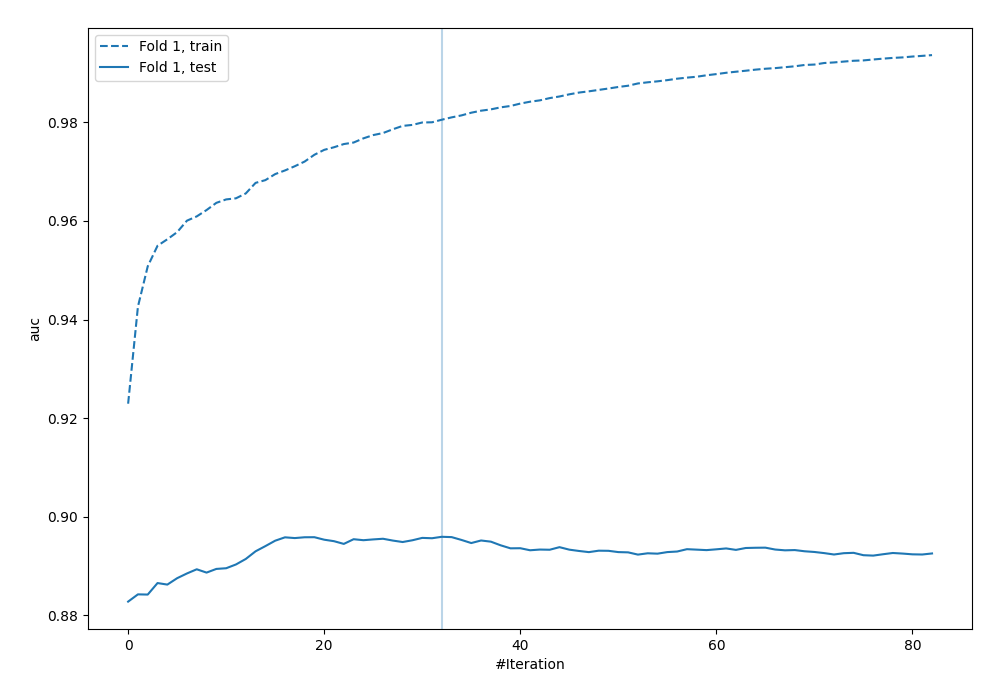
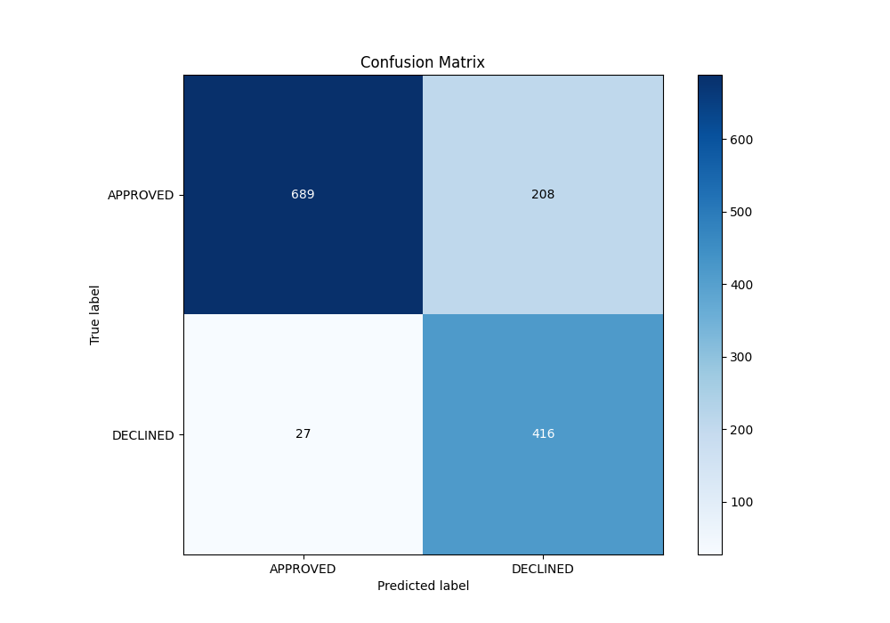
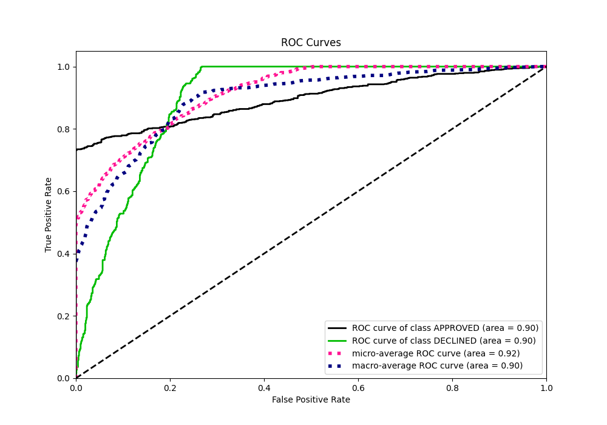
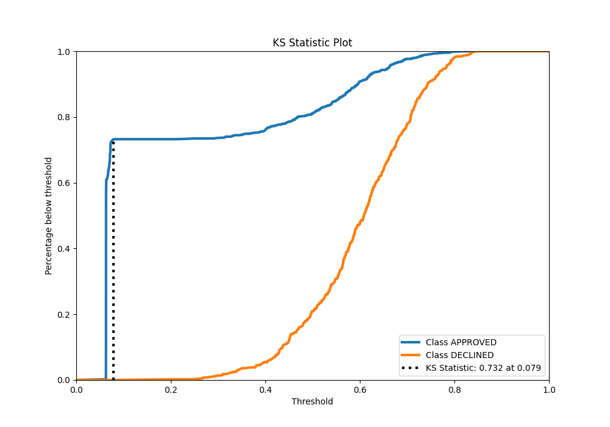
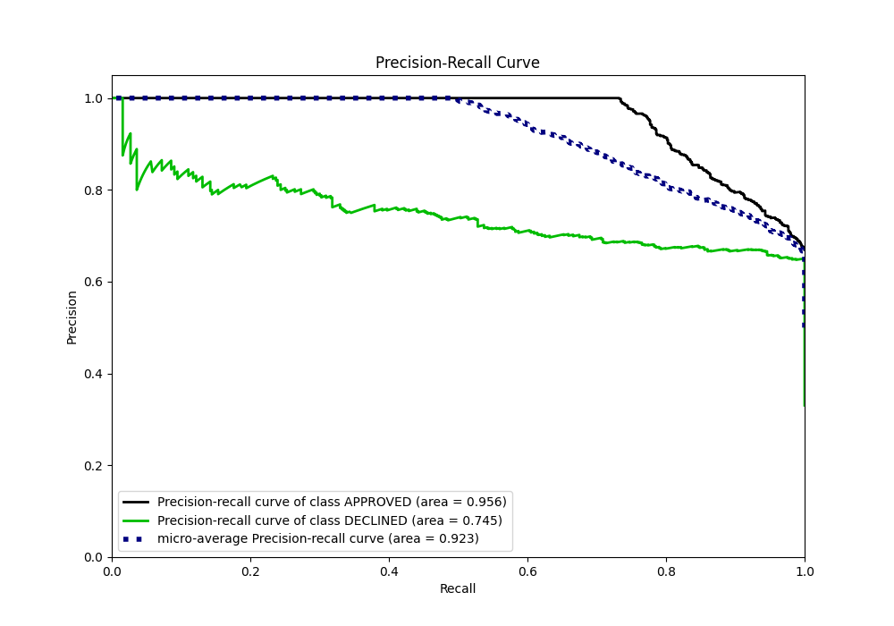
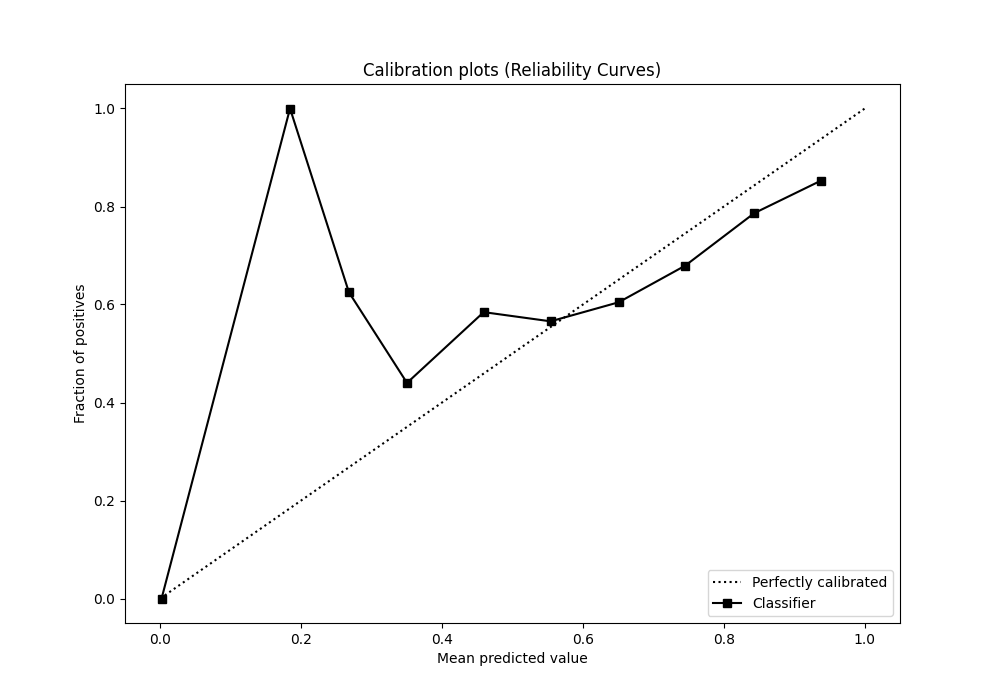
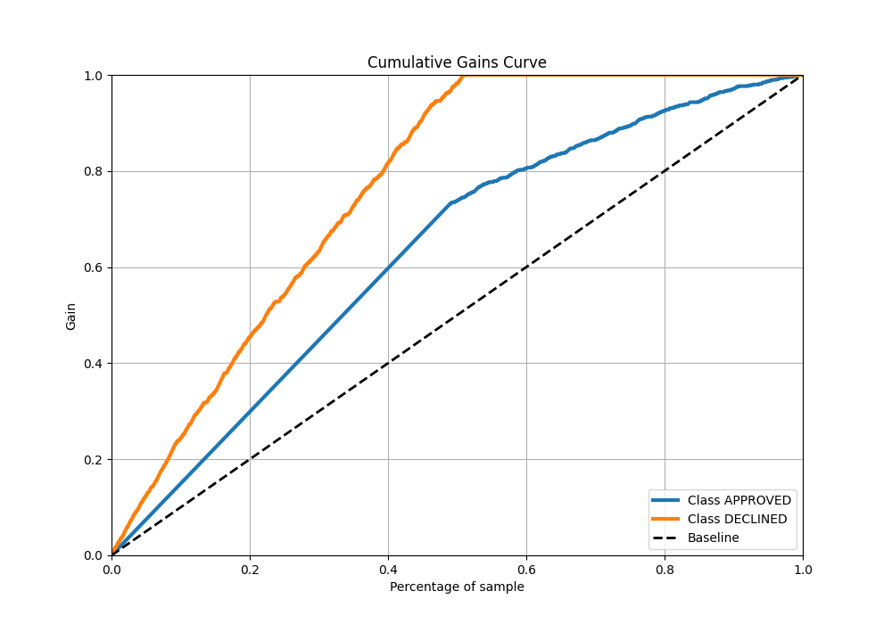
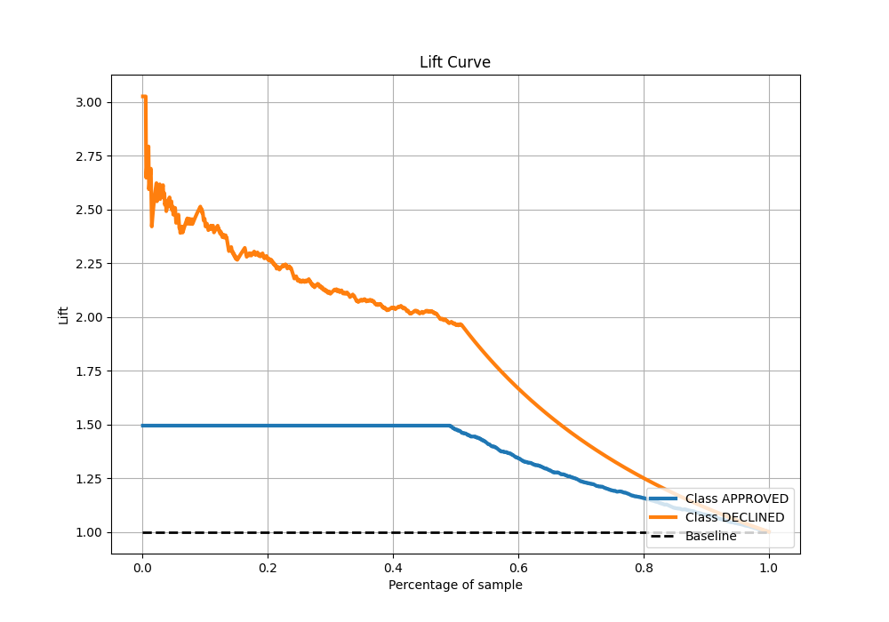

# Summary of 19_LightGBM

[<< Go back](../README.md)

## LightGBM
- **n_jobs**: -1
- **objective**: binary
- **num_leaves**: 95
- **learning_rate**: 0.05
- **feature_fraction**: 0.9
- **bagging_fraction**: 0.8
- **min_data_in_leaf**: 10
- **metric**: auc
- **custom_eval_metric_name**: None
- **explain_level**: 0

## Validation
 - **validation_type**: split
 - **train_ratio**: 0.8
 - **shuffle**: True
 - **stratify**: True

## Optimized metric
auc

## Training time

1.4 seconds

## Metric details
|           |    score |   threshold |
|:----------|---------:|------------:|
| logloss   | 0.360064 | nan         |
| auc       | 0.895918 | nan         |
| f1        | 0.783378 |   0.0753301 |
| accuracy  | 0.824627 |   0.40932   |
| precision | 0.830769 |   0.733314  |
| recall    | 1        |   0.0565106 |
| mcc       | 0.684125 |   0.0753301 |

## Metric details with threshold from accuracy metric
|           |    score |   threshold |
|:----------|---------:|------------:|
| logloss   | 0.360064 |   nan       |
| auc       | 0.895918 |   nan       |
| f1        | 0.779756 |     0.40932 |
| accuracy  | 0.824627 |     0.40932 |
| precision | 0.666667 |     0.40932 |
| recall    | 0.939052 |     0.40932 |
| mcc       | 0.666917 |     0.40932 |

## Confusion matrix (at threshold=0.40932)
|                     |   Predicted as APPROVED |   Predicted as DECLINED |
|:--------------------|------------------------:|------------------------:|
| Labeled as APPROVED |                     689 |                     208 |
| Labeled as DECLINED |                      27 |                     416 |

## Learning curves

## Confusion Matrix

## Normalized Confusion Matrix

## ROC Curve

## Kolmogorov-Smirnov Statistic

## Precision-Recall Curve

## Calibration Curve

## Cumulative Gains Curve

## Lift Curve

[<< Go back](../README.md)
