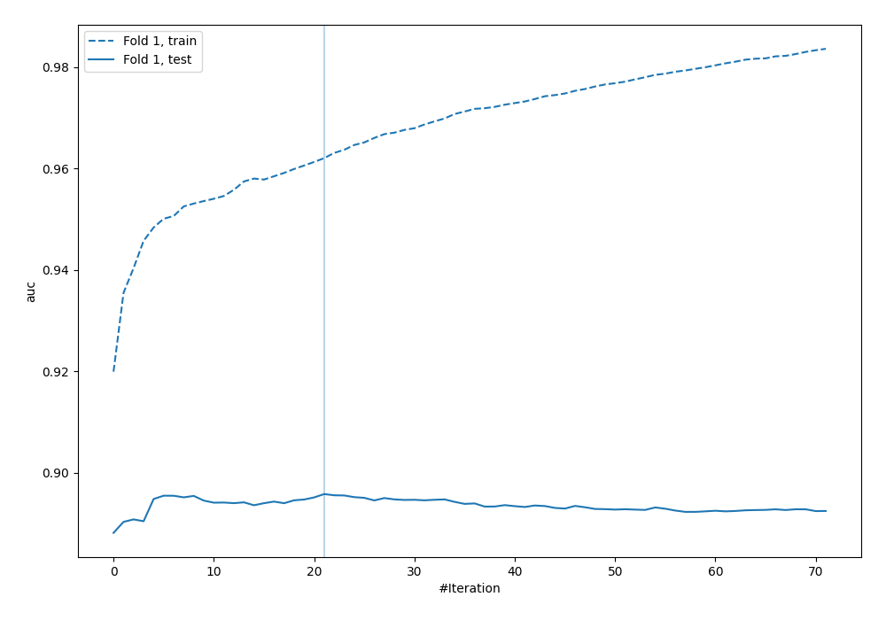
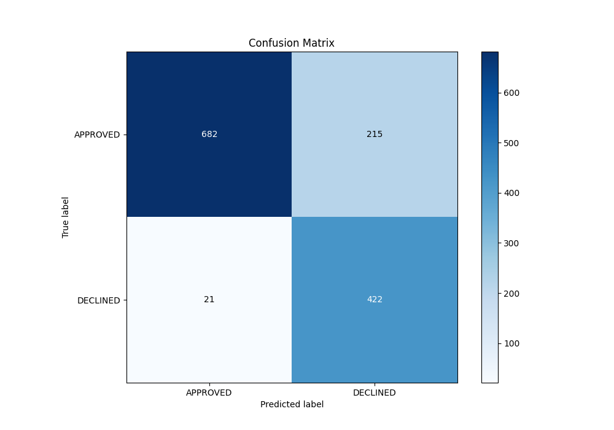
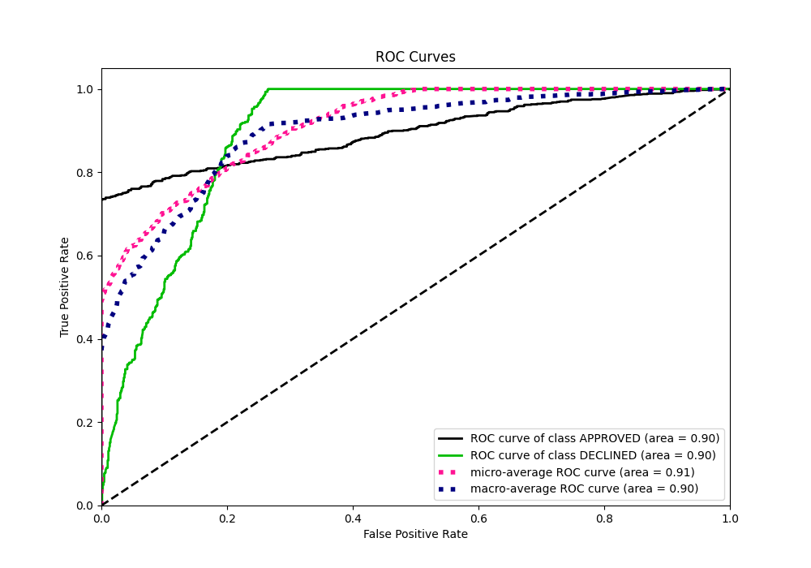
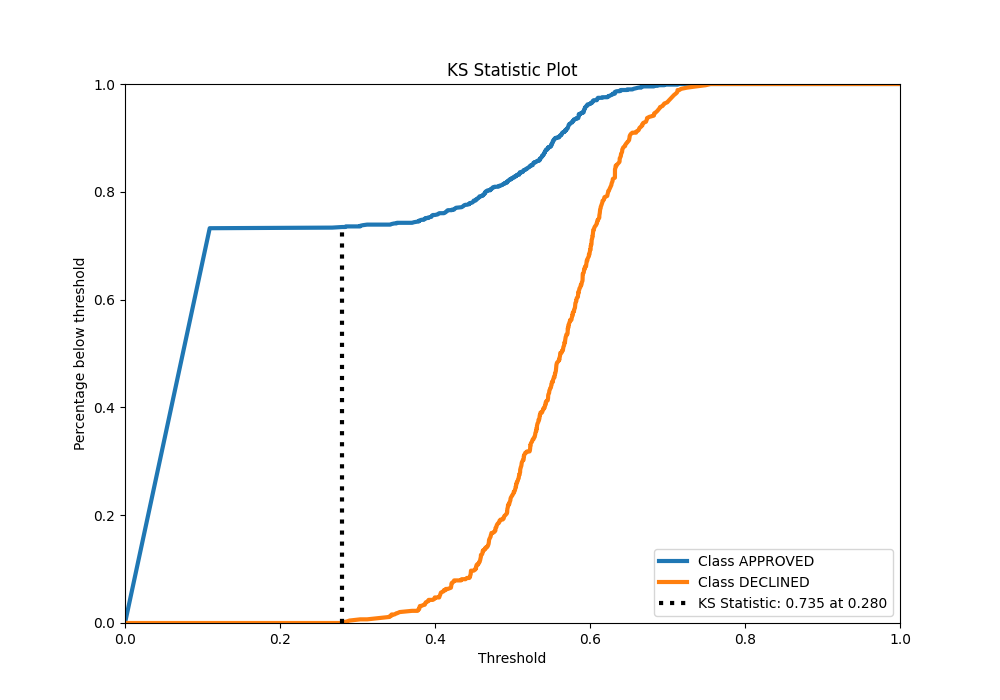
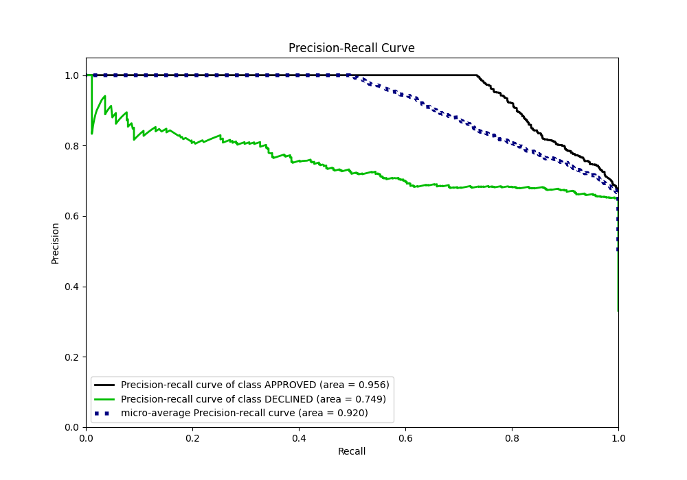
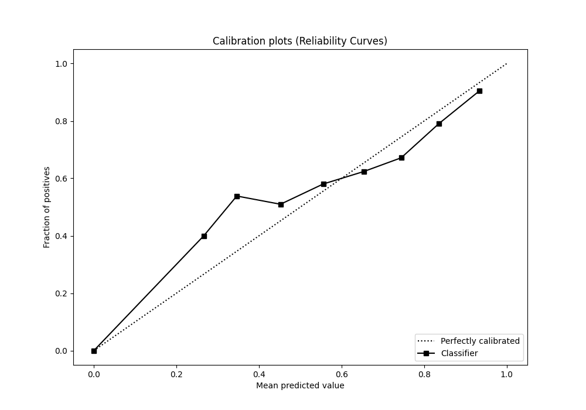
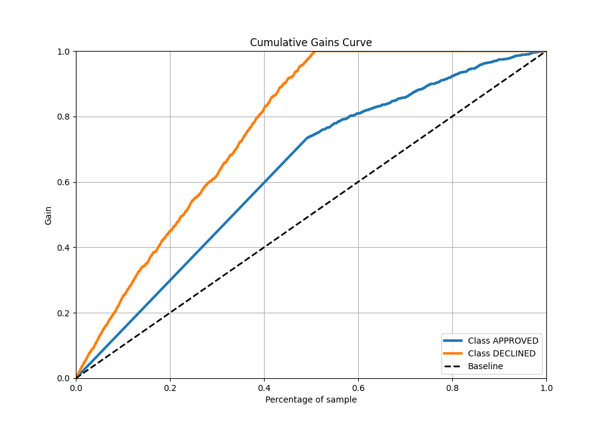
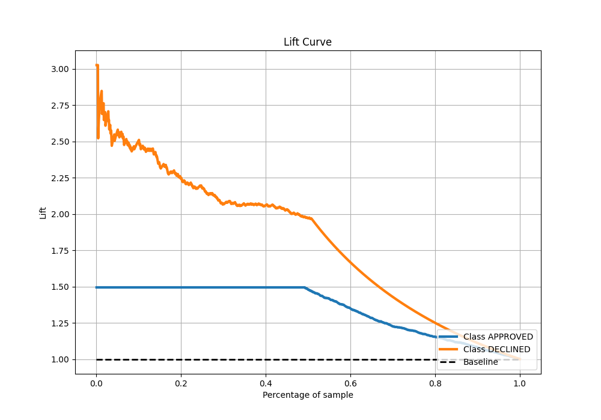

# Summary of 1_Default_LightGBM

[<< Go back](../README.md)

## LightGBM
- **n_jobs**: -1
- **objective**: binary
- **num_leaves**: 63
- **learning_rate**: 0.05
- **feature_fraction**: 0.9
- **bagging_fraction**: 0.9
- **min_data_in_leaf**: 10
- **metric**: auc
- **custom_eval_metric_name**: None
- **explain_level**: 0

## Validation
 - **validation_type**: split
 - **train_ratio**: 0.8
 - **shuffle**: True
 - **stratify**: True

## Optimized metric
auc

## Training time

4.2 seconds

## Metric details
|           |    score |   threshold |
|:----------|---------:|------------:|
| logloss   | 0.390303 | nan         |
| auc       | 0.895769 | nan         |
| f1        | 0.786856 |   0.109314  |
| accuracy  | 0.823881 |   0.405627  |
| precision | 0.846154 |   0.635983  |
| recall    | 1        |   0.0983822 |
| mcc       | 0.689252 |   0.109314  |

## Metric details with threshold from accuracy metric
|           |    score |   threshold |
|:----------|---------:|------------:|
| logloss   | 0.390303 |  nan        |
| auc       | 0.895769 |  nan        |
| f1        | 0.781481 |    0.405627 |
| accuracy  | 0.823881 |    0.405627 |
| precision | 0.66248  |    0.405627 |
| recall    | 0.952596 |    0.405627 |
| mcc       | 0.671559 |    0.405627 |

## Confusion matrix (at threshold=0.405627)
|                     |   Predicted as APPROVED |   Predicted as DECLINED |
|:--------------------|------------------------:|------------------------:|
| Labeled as APPROVED |                     682 |                     215 |
| Labeled as DECLINED |                      21 |                     422 |

## Learning curves

## Confusion Matrix

## Normalized Confusion Matrix

## ROC Curve

## Kolmogorov-Smirnov Statistic

## Precision-Recall Curve

## Calibration Curve

## Cumulative Gains Curve

## Lift Curve

[<< Go back](../README.md)
