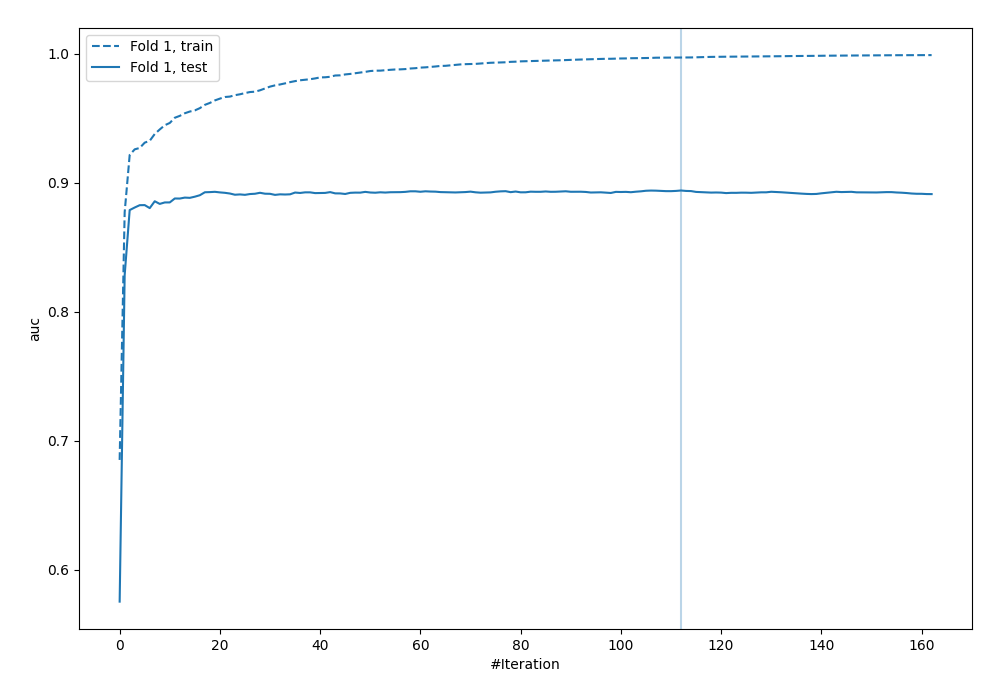
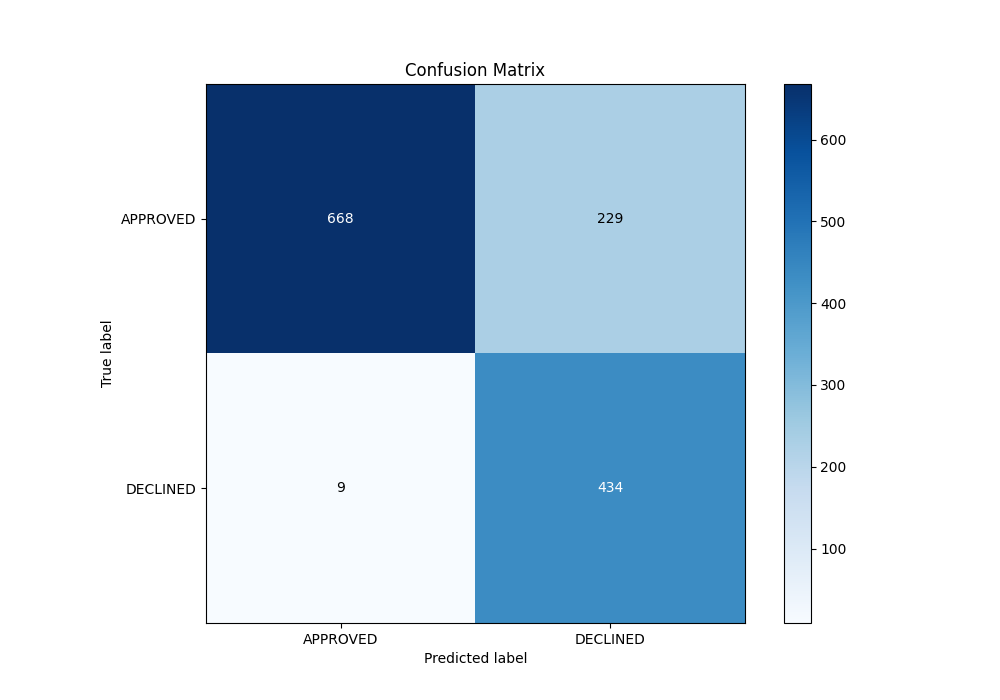
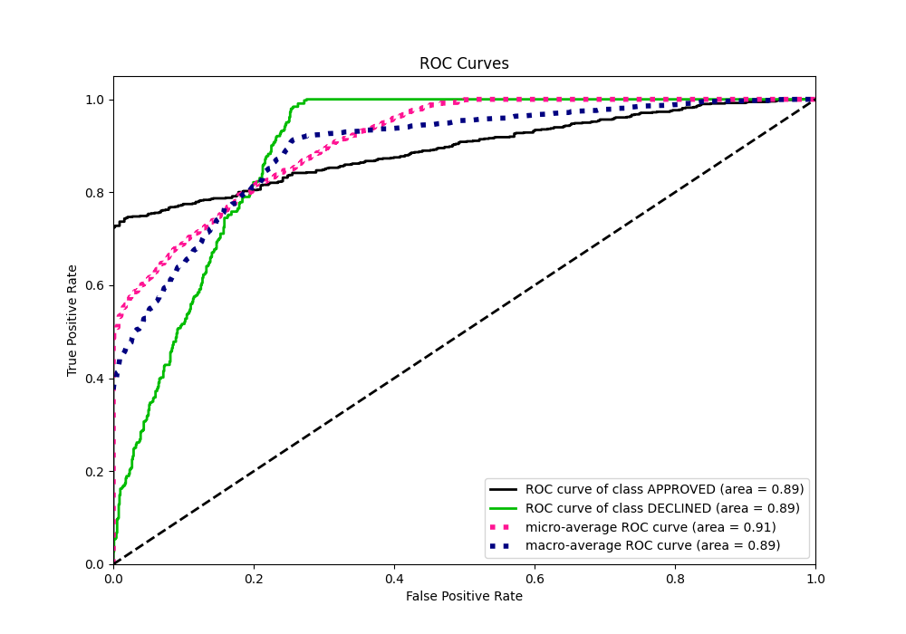
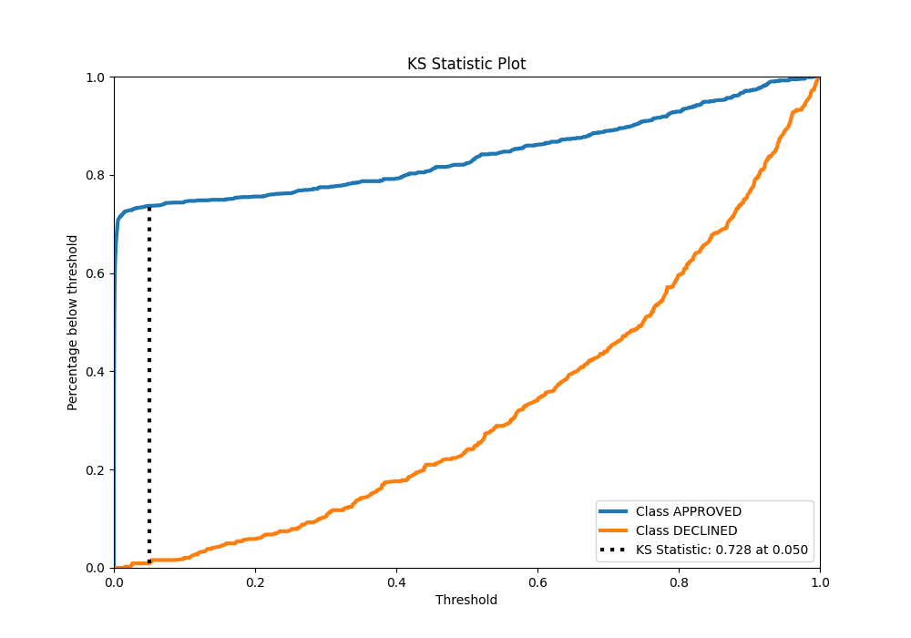
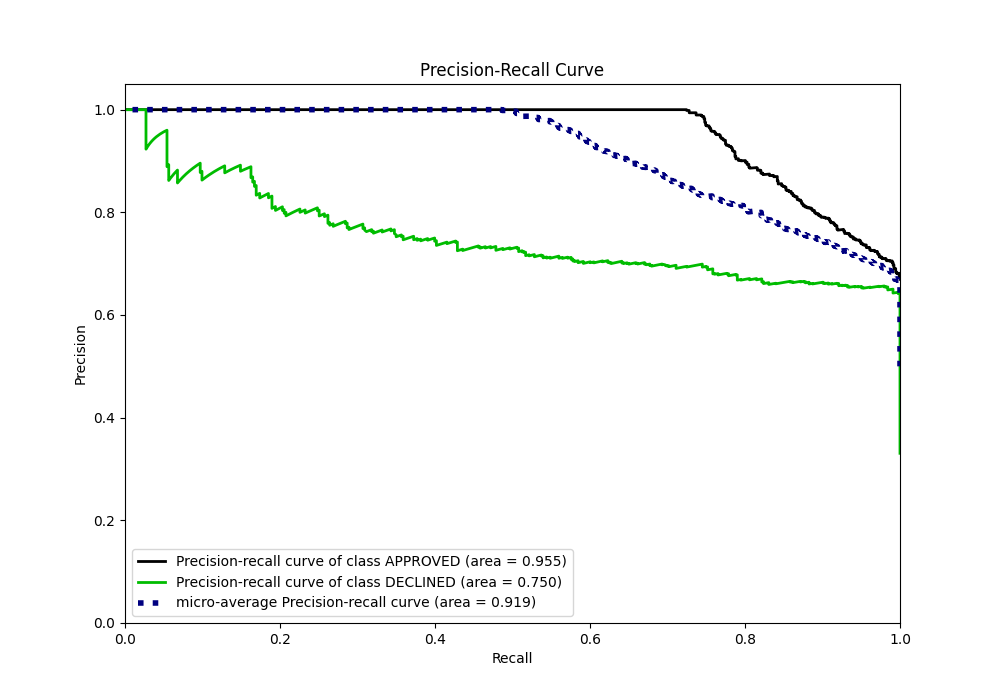
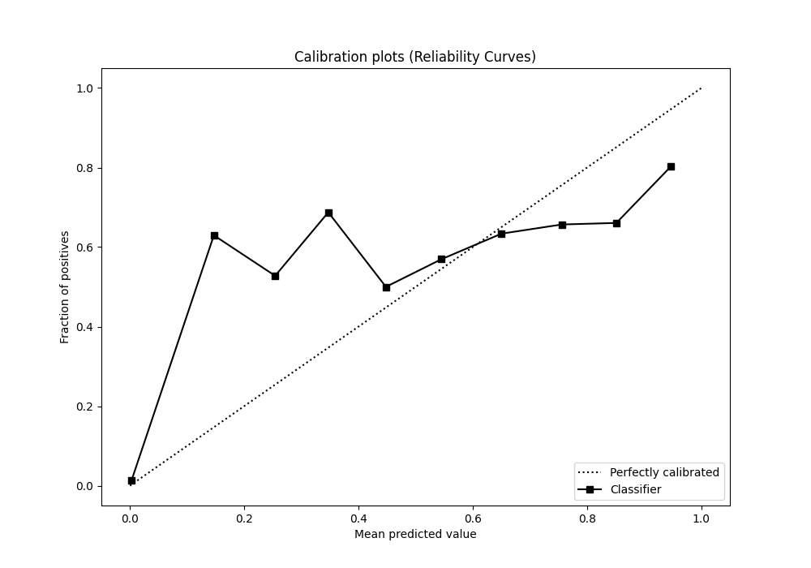
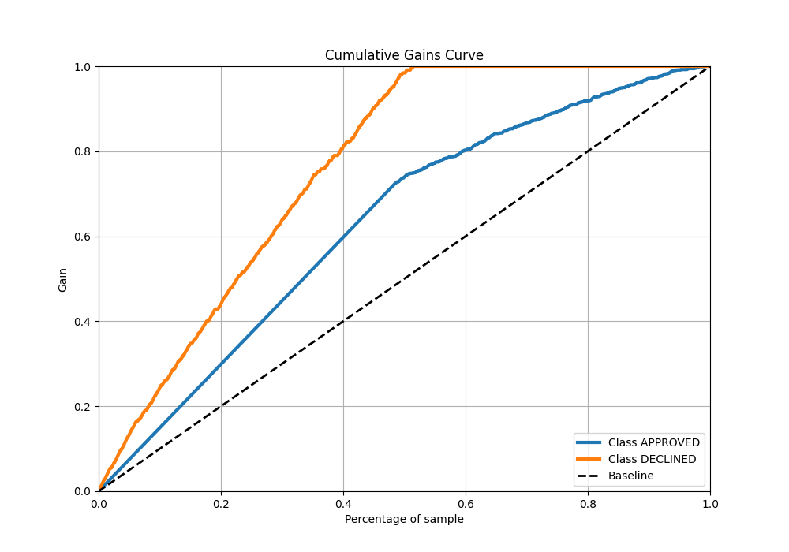
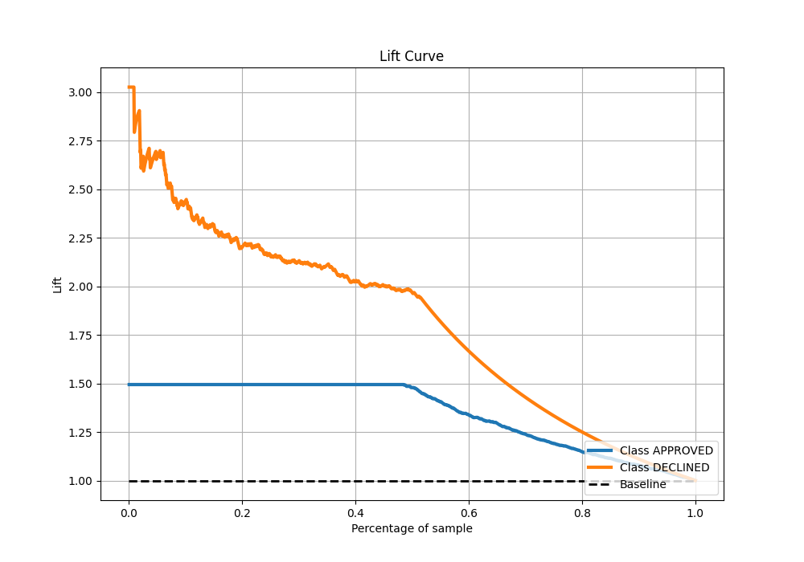

# Summary of 20_LightGBM

[<< Go back](../README.md)

## LightGBM
- **n_jobs**: -1
- **objective**: binary
- **num_leaves**: 63
- **learning_rate**: 0.2
- **feature_fraction**: 0.5
- **bagging_fraction**: 0.8
- **min_data_in_leaf**: 30
- **metric**: auc
- **custom_eval_metric_name**: None
- **explain_level**: 0

## Validation
 - **validation_type**: split
 - **train_ratio**: 0.8
 - **shuffle**: True
 - **stratify**: True

## Optimized metric
auc

## Training time

1.6 seconds

## Metric details
|           |    score |     threshold |
|:----------|---------:|--------------:|
| logloss   | 0.380541 | nan           |
| auc       | 0.894012 | nan           |
| f1        | 0.78481  |   0.100292    |
| accuracy  | 0.822388 |   0.100292    |
| precision | 0.884615 |   0.93475     |
| recall    | 1        |   1.06889e-06 |
| mcc       | 0.683801 |   0.0472782   |

## Metric details with threshold from accuracy metric
|           |    score |   threshold |
|:----------|---------:|------------:|
| logloss   | 0.380541 |  nan        |
| auc       | 0.894012 |  nan        |
| f1        | 0.78481  |    0.100292 |
| accuracy  | 0.822388 |    0.100292 |
| precision | 0.6546   |    0.100292 |
| recall    | 0.979684 |    0.100292 |
| mcc       | 0.681583 |    0.100292 |

## Confusion matrix (at threshold=0.100292)
|                     |   Predicted as APPROVED |   Predicted as DECLINED |
|:--------------------|------------------------:|------------------------:|
| Labeled as APPROVED |                     668 |                     229 |
| Labeled as DECLINED |                       9 |                     434 |

## Learning curves

## Confusion Matrix

## Normalized Confusion Matrix

## ROC Curve

## Kolmogorov-Smirnov Statistic

## Precision-Recall Curve

## Calibration Curve

## Cumulative Gains Curve

## Lift Curve

[<< Go back](../README.md)
