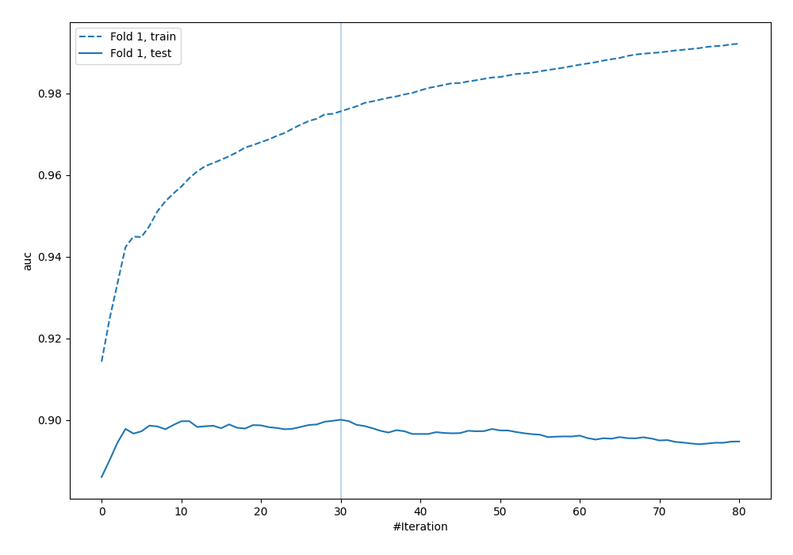
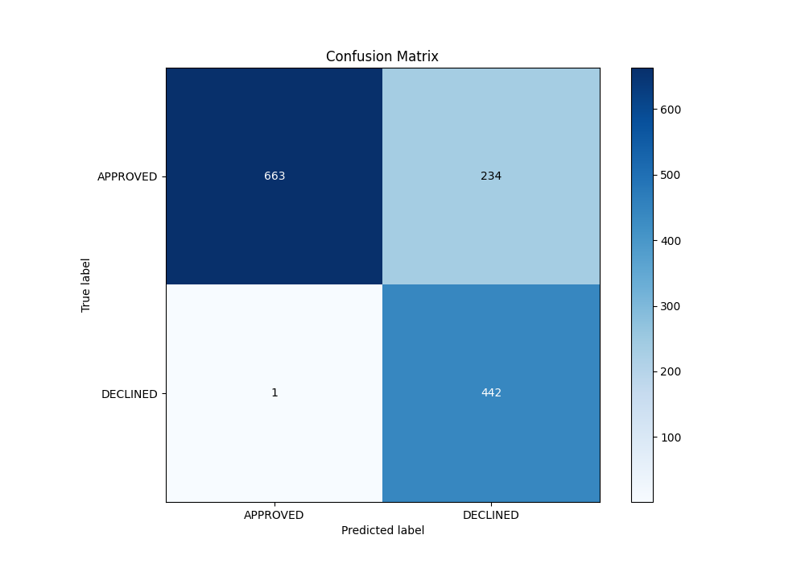
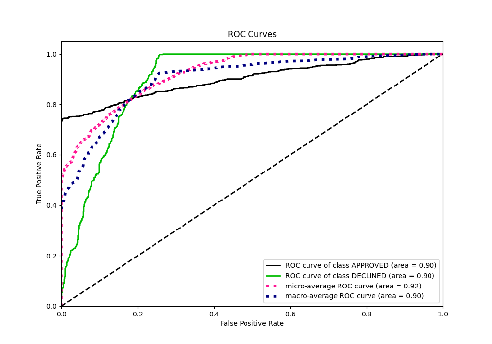
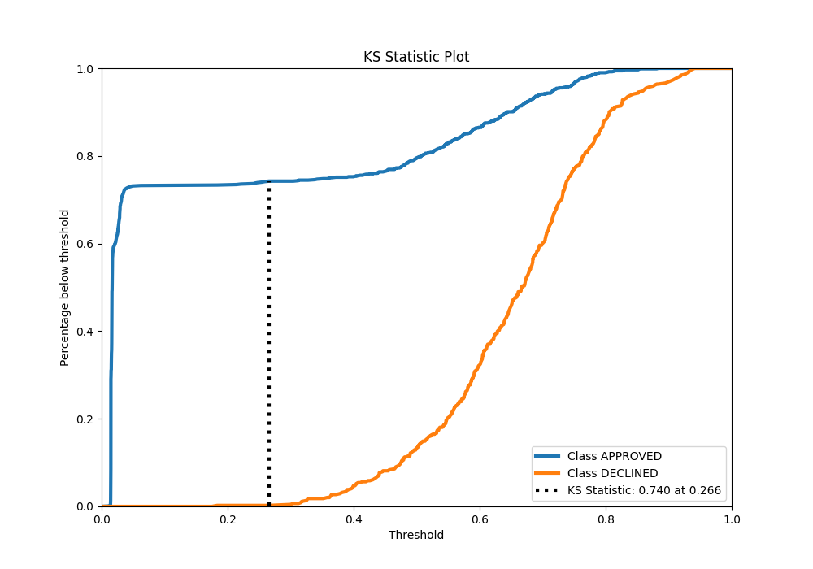
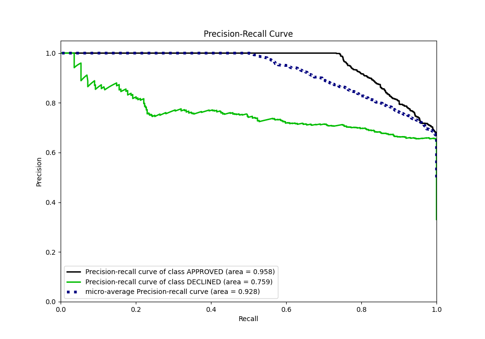
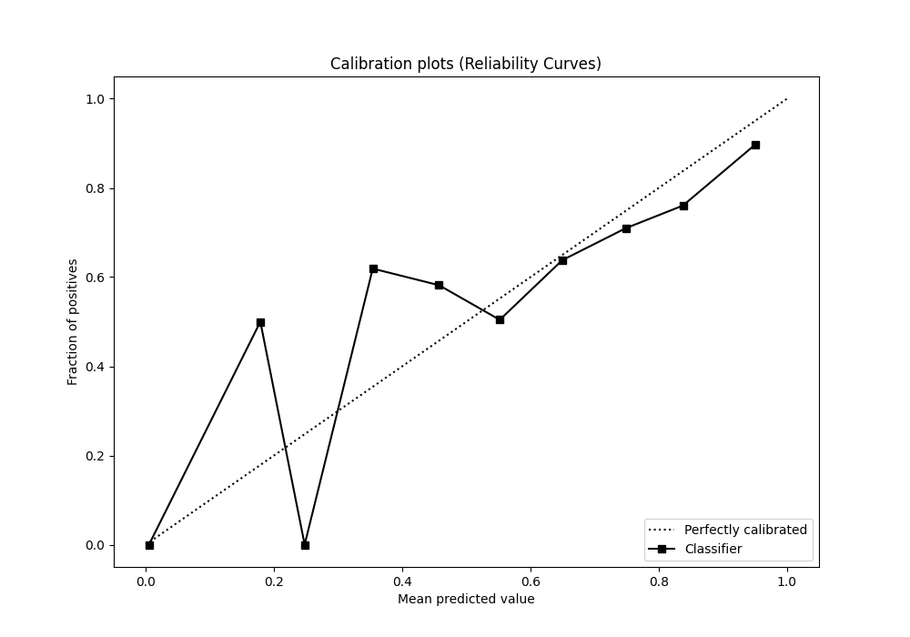
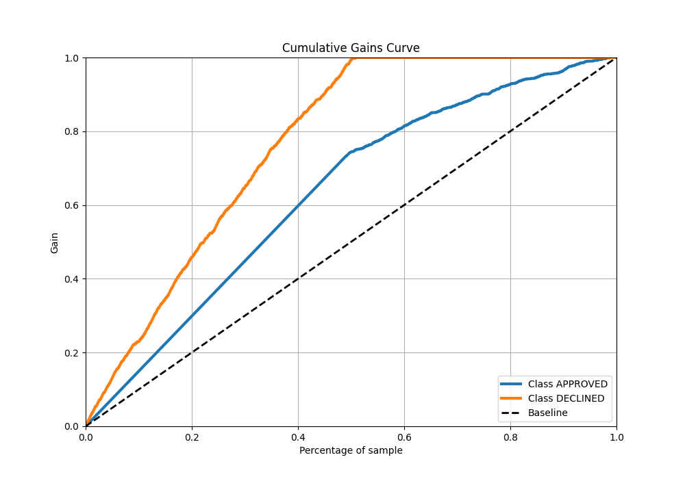
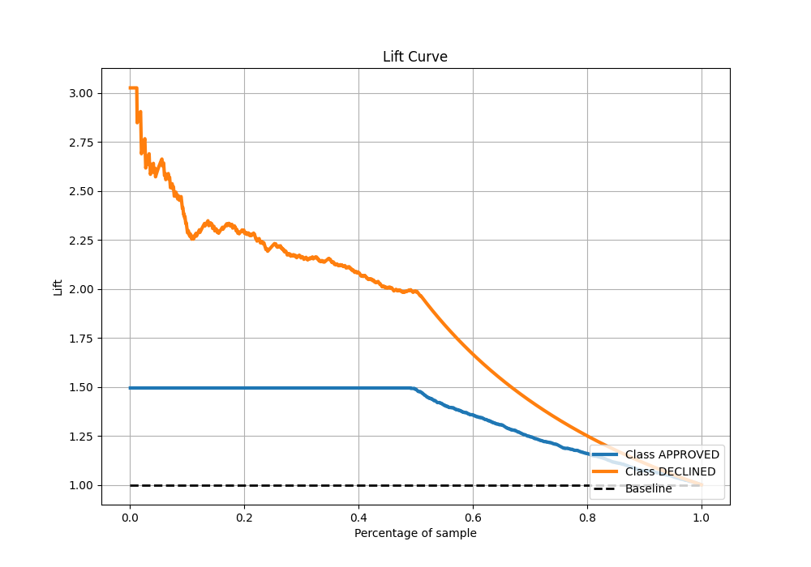

# Summary of 21_LightGBM

[<< Go back](../README.md)

## LightGBM
- **n_jobs**: -1
- **objective**: binary
- **num_leaves**: 63
- **learning_rate**: 0.1
- **feature_fraction**: 0.8
- **bagging_fraction**: 0.8
- **min_data_in_leaf**: 15
- **metric**: auc
- **custom_eval_metric_name**: None
- **explain_level**: 0

## Validation
 - **validation_type**: split
 - **train_ratio**: 0.8
 - **shuffle**: True
 - **stratify**: True

## Optimized metric
auc

## Training time

1.5 seconds

## Metric details
|           |    score |   threshold |
|:----------|---------:|------------:|
| logloss   | 0.328046 | nan         |
| auc       | 0.900102 | nan         |
| f1        | 0.789991 |   0.251252  |
| accuracy  | 0.824627 |   0.251252  |
| precision | 0.871795 |   0.787457  |
| recall    | 1        |   0.0121356 |
| mcc       | 0.693319 |   0.251252  |

## Metric details with threshold from accuracy metric
|           |    score |   threshold |
|:----------|---------:|------------:|
| logloss   | 0.328046 |  nan        |
| auc       | 0.900102 |  nan        |
| f1        | 0.789991 |    0.251252 |
| accuracy  | 0.824627 |    0.251252 |
| precision | 0.653846 |    0.251252 |
| recall    | 0.997743 |    0.251252 |
| mcc       | 0.693319 |    0.251252 |

## Confusion matrix (at threshold=0.251252)
|                     |   Predicted as APPROVED |   Predicted as DECLINED |
|:--------------------|------------------------:|------------------------:|
| Labeled as APPROVED |                     663 |                     234 |
| Labeled as DECLINED |                       1 |                     442 |

## Learning curves

## Confusion Matrix

## Normalized Confusion Matrix

## ROC Curve

## Kolmogorov-Smirnov Statistic

## Precision-Recall Curve

## Calibration Curve

## Cumulative Gains Curve

## Lift Curve

[<< Go back](../README.md)
