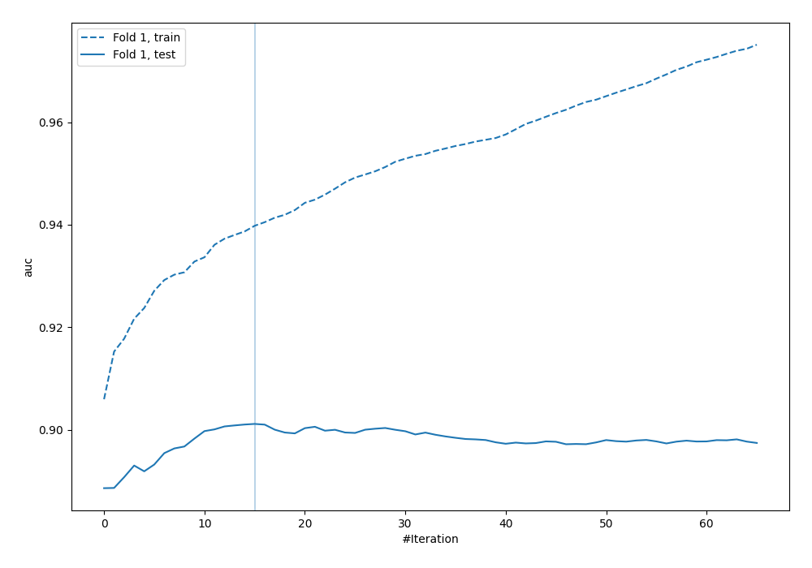
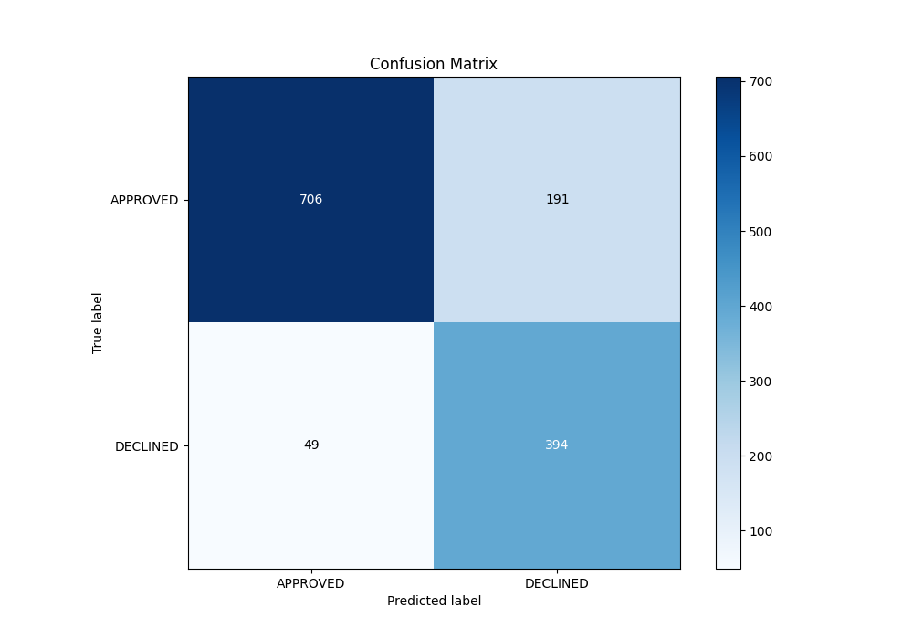
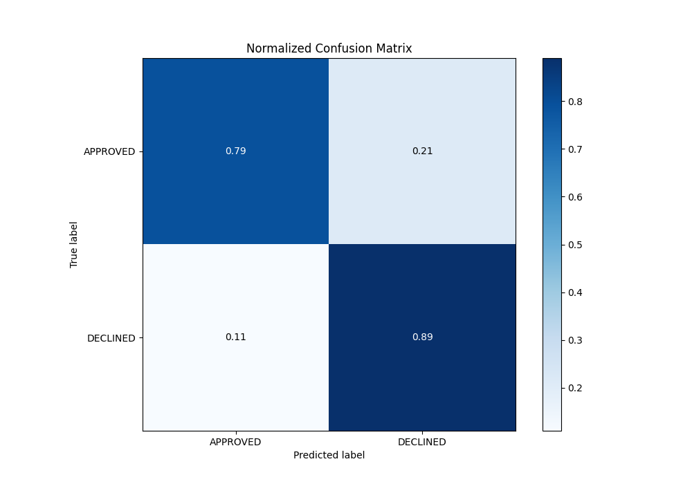
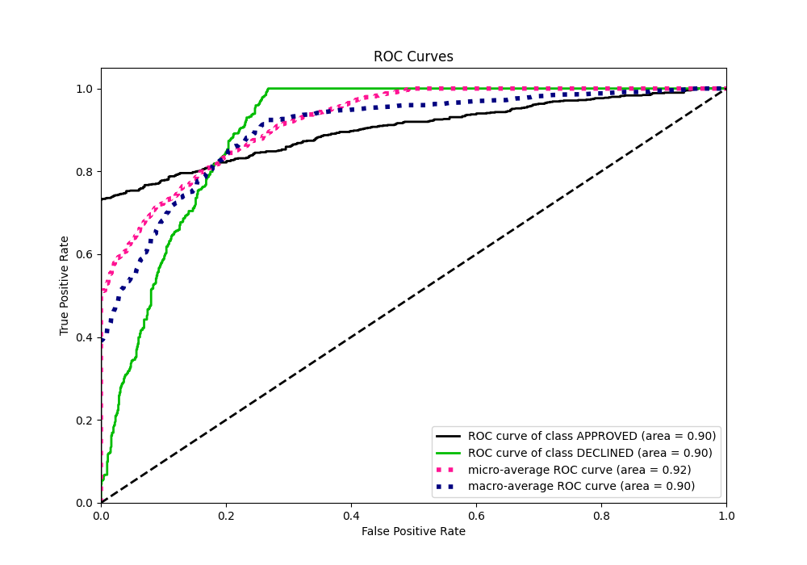
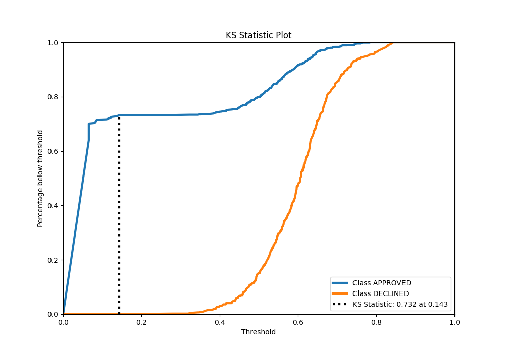
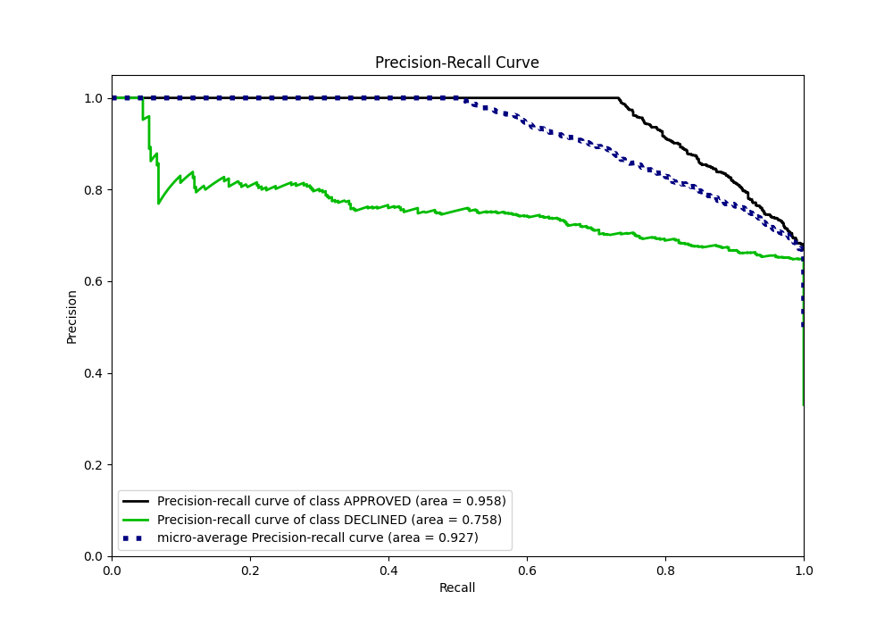
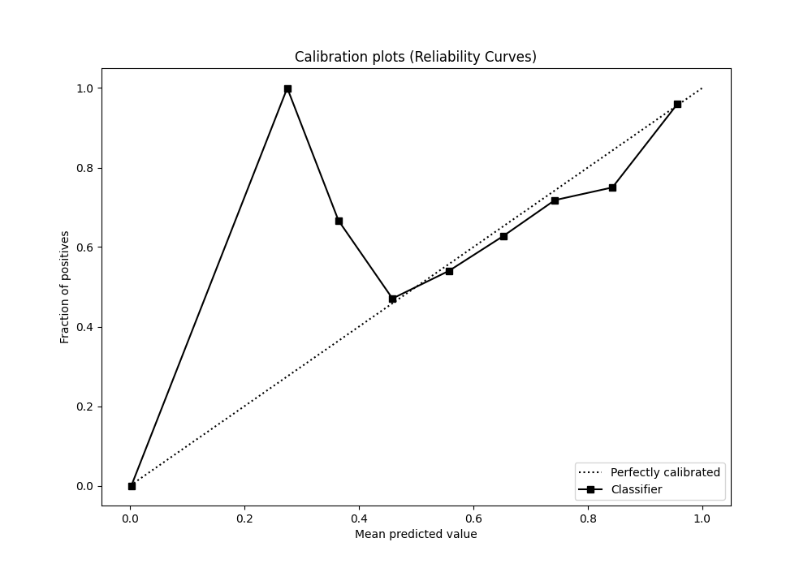
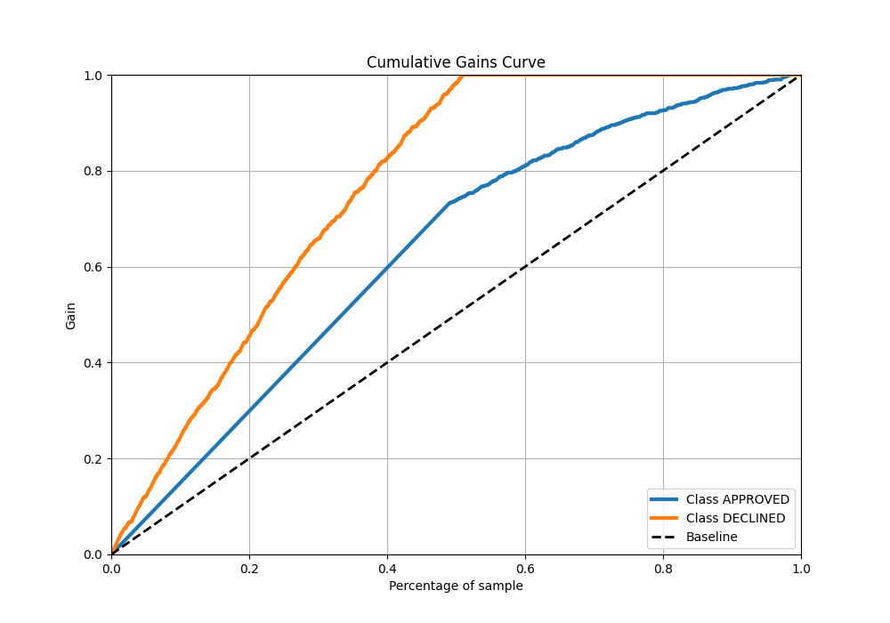
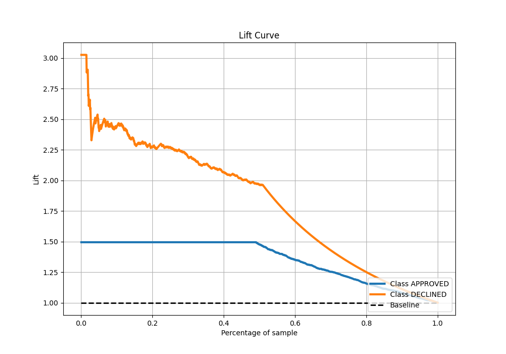

# Summary of 22_LightGBM

[<< Go back](../README.md)

## LightGBM
- **n_jobs**: -1
- **objective**: binary
- **num_leaves**: 127
- **learning_rate**: 0.1
- **feature_fraction**: 1.0
- **bagging_fraction**: 1.0
- **min_data_in_leaf**: 50
- **metric**: auc
- **custom_eval_metric_name**: None
- **explain_level**: 0

## Validation
 - **validation_type**: split
 - **train_ratio**: 0.8
 - **shuffle**: True
 - **stratify**: True

## Optimized metric
auc

## Training time

1.5 seconds

## Metric details
|           |    score |   threshold |
|:----------|---------:|------------:|
| logloss   | 0.357294 |  nan        |
| auc       | 0.901144 |  nan        |
| f1        | 0.784629 |    0.358701 |
| accuracy  | 0.820896 |    0.48185  |
| precision | 0.826923 |    0.727269 |
| recall    | 1        |    0.059085 |
| mcc       | 0.683801 |    0.358701 |

## Metric details with threshold from accuracy metric
|           |    score |   threshold |
|:----------|---------:|------------:|
| logloss   | 0.357294 |   nan       |
| auc       | 0.901144 |   nan       |
| f1        | 0.766537 |     0.48185 |
| accuracy  | 0.820896 |     0.48185 |
| precision | 0.673504 |     0.48185 |
| recall    | 0.889391 |     0.48185 |
| mcc       | 0.641635 |     0.48185 |

## Confusion matrix (at threshold=0.48185)
|                     |   Predicted as APPROVED |   Predicted as DECLINED |
|:--------------------|------------------------:|------------------------:|
| Labeled as APPROVED |                     706 |                     191 |
| Labeled as DECLINED |                      49 |                     394 |

## Learning curves

## Confusion Matrix

## Normalized Confusion Matrix

## ROC Curve

## Kolmogorov-Smirnov Statistic

## Precision-Recall Curve

## Calibration Curve

## Cumulative Gains Curve

## Lift Curve

[<< Go back](../README.md)
