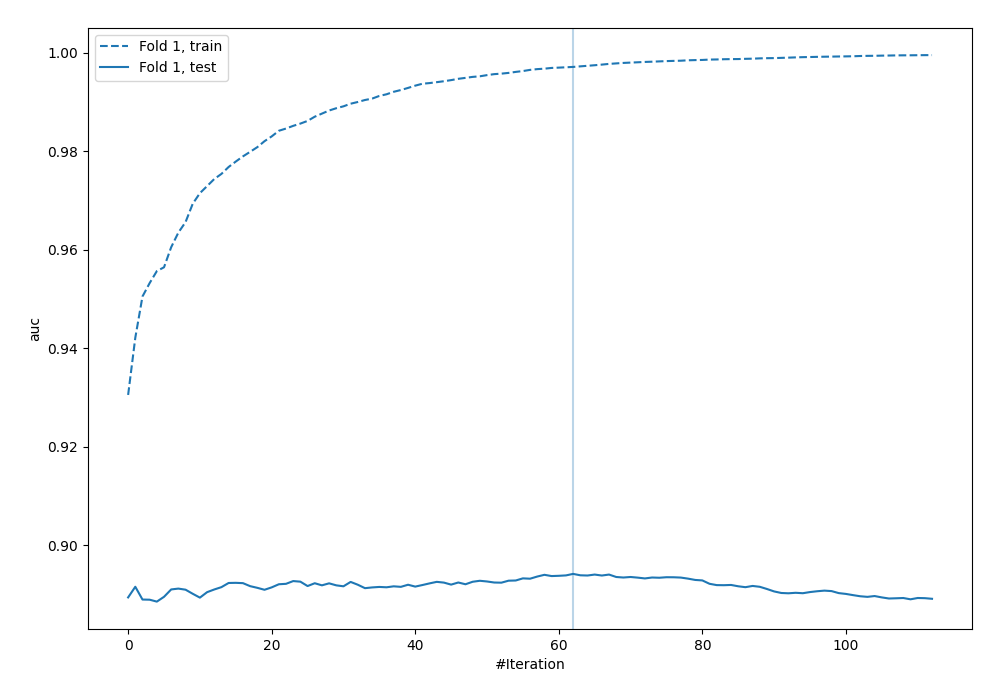
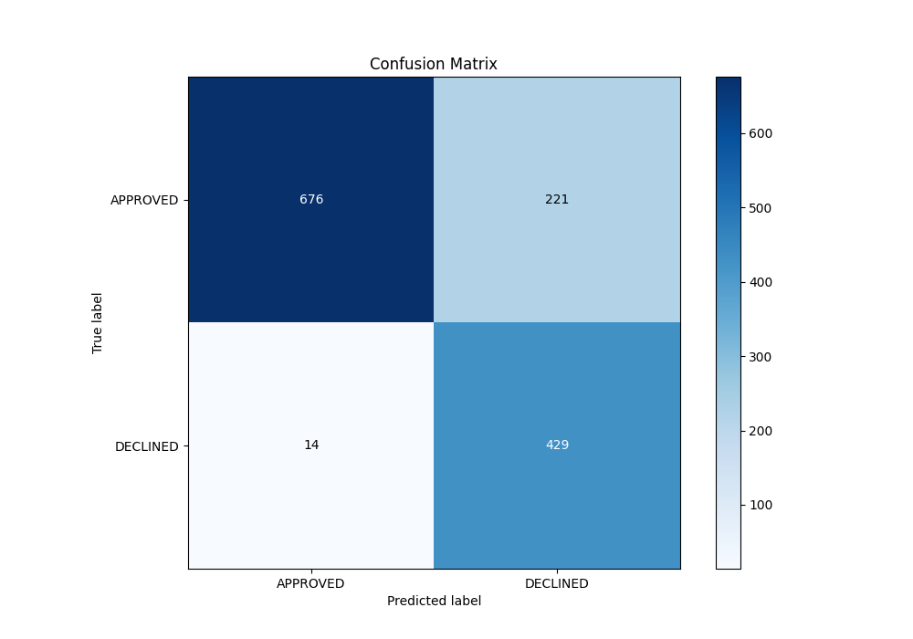
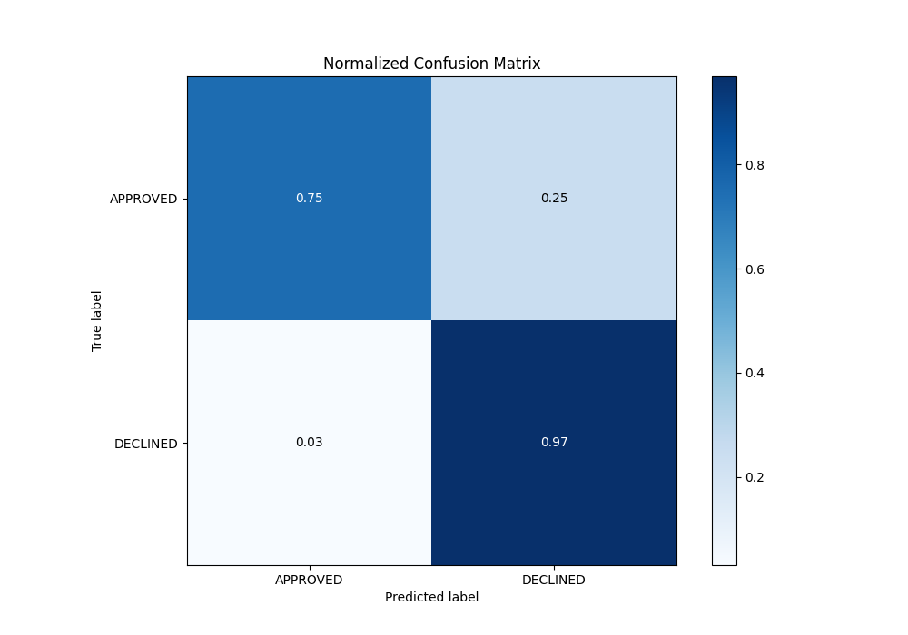
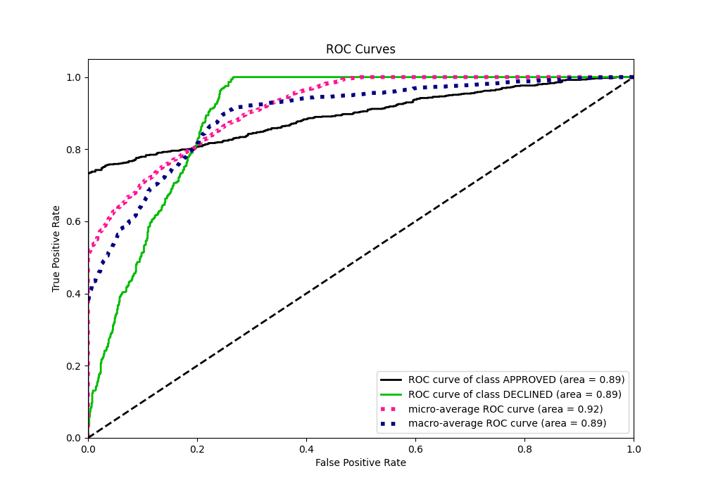
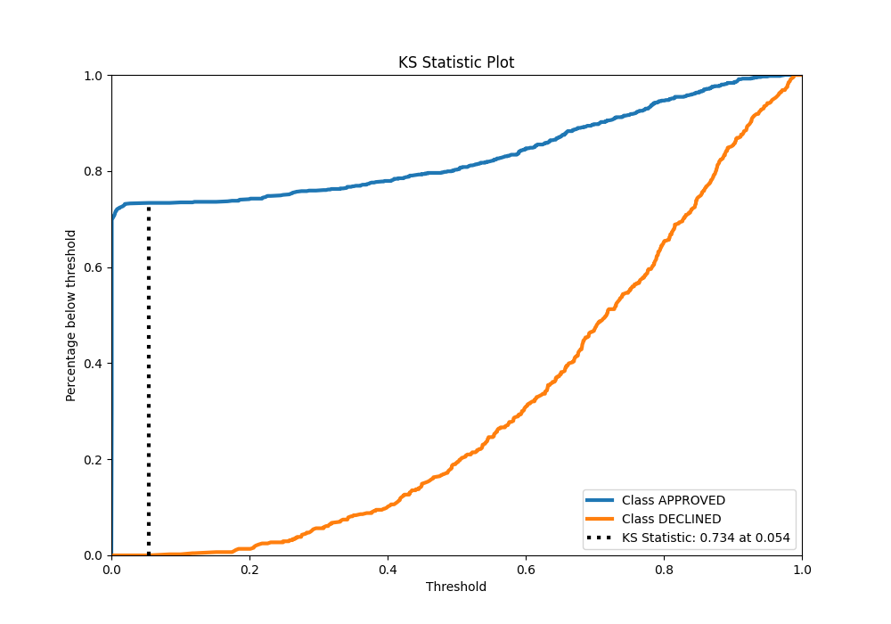
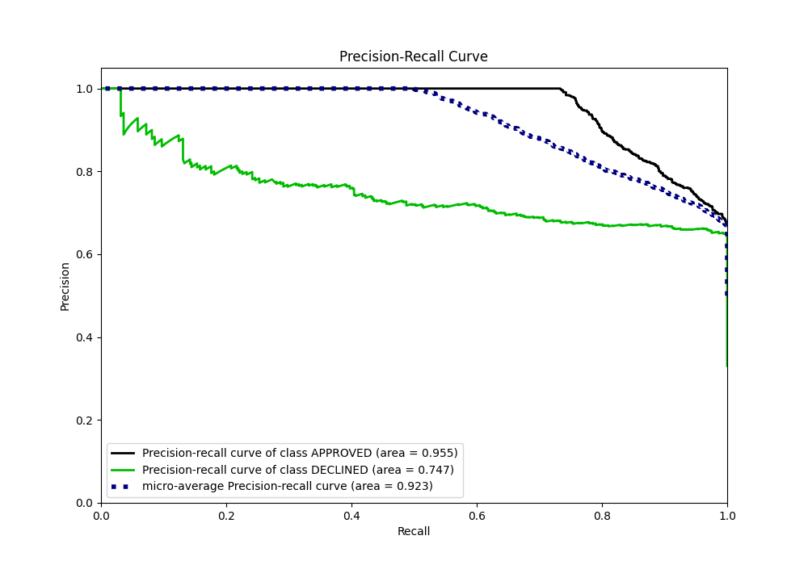
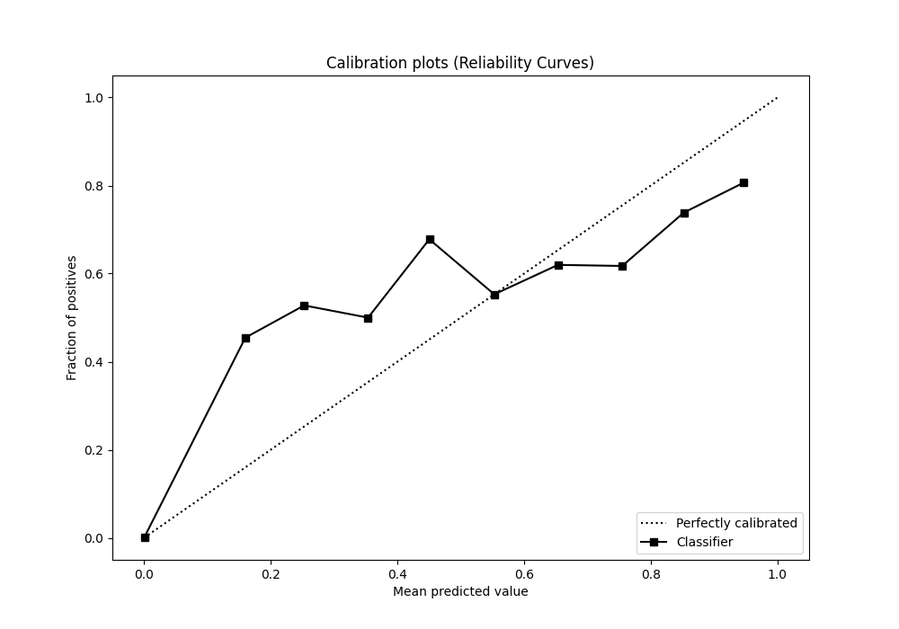
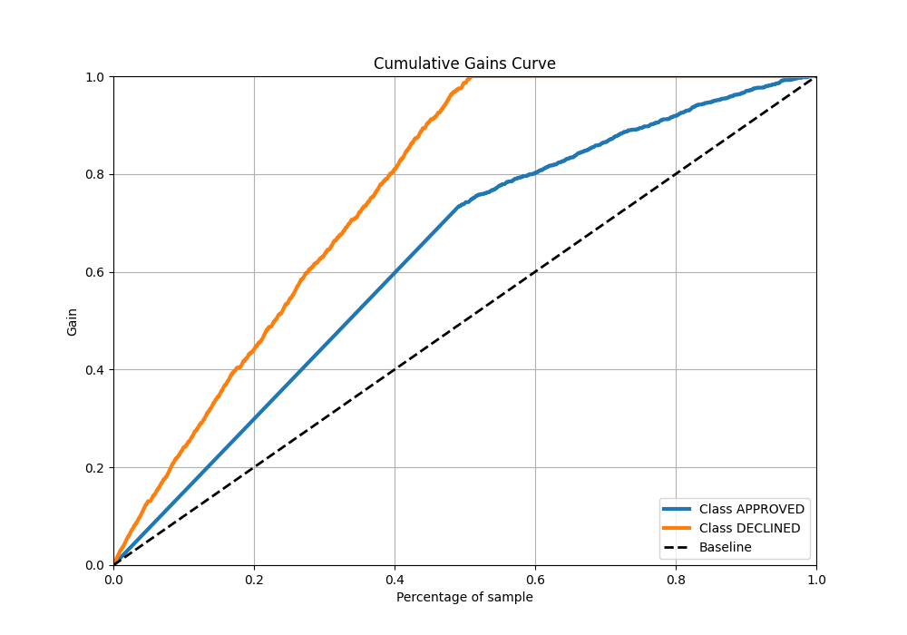
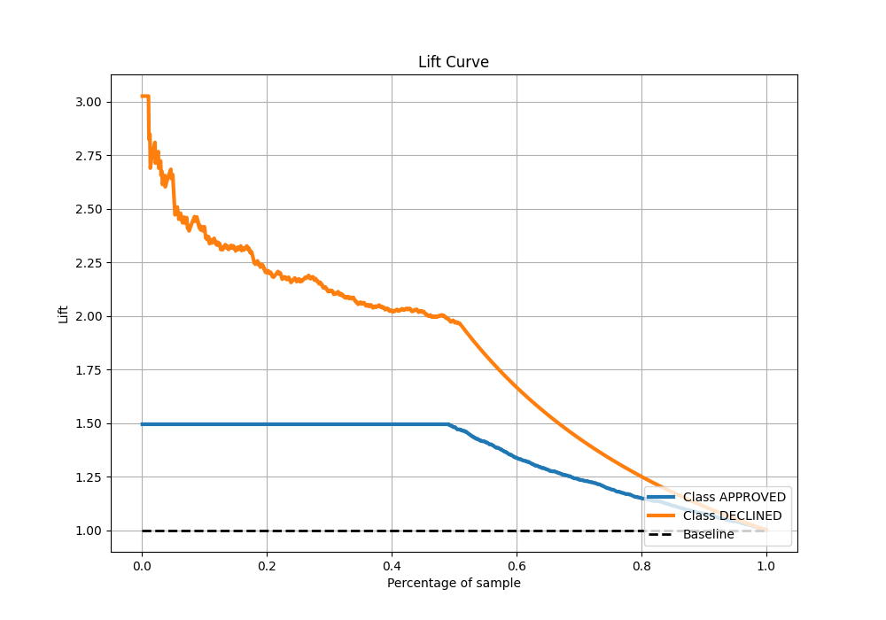

# Summary of 23_LightGBM

[<< Go back](../README.md)

## LightGBM
- **n_jobs**: -1
- **objective**: binary
- **num_leaves**: 95
- **learning_rate**: 0.1
- **feature_fraction**: 1.0
- **bagging_fraction**: 0.5
- **min_data_in_leaf**: 10
- **metric**: auc
- **custom_eval_metric_name**: None
- **explain_level**: 0

## Validation
 - **validation_type**: split
 - **train_ratio**: 0.8
 - **shuffle**: True
 - **stratify**: True

## Optimized metric
auc

## Training time

1.7 seconds

## Metric details
|           |    score |     threshold |
|:----------|---------:|--------------:|
| logloss   | 0.346698 | nan           |
| auc       | 0.894138 | nan           |
| f1        | 0.786416 |   0.171533    |
| accuracy  | 0.824627 |   0.26211     |
| precision | 0.876923 |   0.911507    |
| recall    | 1        |   0.000532822 |
| mcc       | 0.686974 |   0.171533    |

## Metric details with threshold from accuracy metric
|           |    score |   threshold |
|:----------|---------:|------------:|
| logloss   | 0.346698 |   nan       |
| auc       | 0.894138 |   nan       |
| f1        | 0.784995 |     0.26211 |
| accuracy  | 0.824627 |     0.26211 |
| precision | 0.66     |     0.26211 |
| recall    | 0.968397 |     0.26211 |
| mcc       | 0.67962  |     0.26211 |

## Confusion matrix (at threshold=0.26211)
|                     |   Predicted as APPROVED |   Predicted as DECLINED |
|:--------------------|------------------------:|------------------------:|
| Labeled as APPROVED |                     676 |                     221 |
| Labeled as DECLINED |                      14 |                     429 |

## Learning curves

## Confusion Matrix

## Normalized Confusion Matrix

## ROC Curve

## Kolmogorov-Smirnov Statistic

## Precision-Recall Curve

## Calibration Curve

## Cumulative Gains Curve

## Lift Curve

[<< Go back](../README.md)
