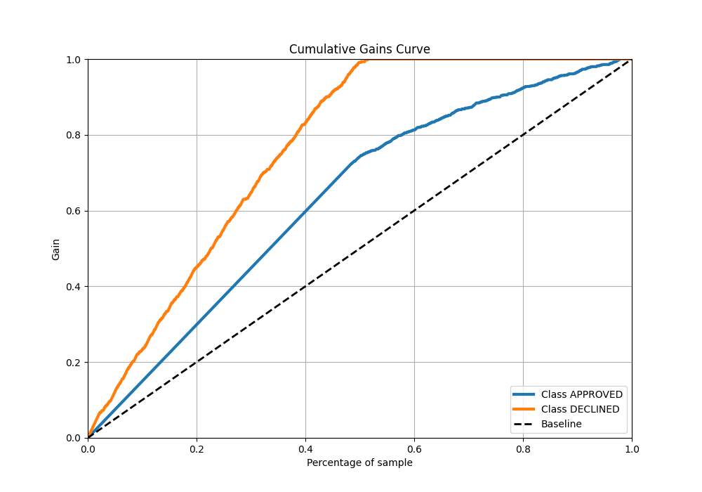

# Summary of 25_CatBoost

[<< Go back](../README.md)

## CatBoost
- **n_jobs**: -1
- **learning_rate**: 0.1
- **depth**: 7
- **rsm**: 0.8
- **loss_function**: Logloss
- **eval_metric**: AUC
- **explain_level**: 0

## Validation
 - **validation_type**: split
 - **train_ratio**: 0.8
 - **shuffle**: True
 - **stratify**: True

## Optimized metric
auc

## Training time

1.2 seconds

## Metric details
|           |    score |     threshold |
|:----------|---------:|--------------:|
| logloss   | 0.330283 | nan           |
| auc       | 0.898782 | nan           |
| f1        | 0.788427 |   0.578501    |
| accuracy  | 0.826119 |   0.60928     |
| precision | 0.807692 |   0.671013    |
| recall    | 1        |   0.000765481 |
| mcc       | 0.687928 |   0.578501    |

## Metric details with threshold from accuracy metric
|           |    score |   threshold |
|:----------|---------:|------------:|
| logloss   | 0.330283 |   nan       |
| auc       | 0.898782 |   nan       |
| f1        | 0.770443 |     0.60928 |
| accuracy  | 0.826119 |     0.60928 |
| precision | 0.683566 |     0.60928 |
| recall    | 0.882619 |     0.60928 |
| mcc       | 0.647532 |     0.60928 |

## Confusion matrix (at threshold=0.60928)
|                     |   Predicted as APPROVED |   Predicted as DECLINED |
|:--------------------|------------------------:|------------------------:|
| Labeled as APPROVED |                     716 |                     181 |
| Labeled as DECLINED |                      52 |                     391 |

## Learning curves

## Confusion Matrix

## Normalized Confusion Matrix

## ROC Curve

## Kolmogorov-Smirnov Statistic

## Precision-Recall Curve

## Calibration Curve

## Cumulative Gains Curve

## Lift Curve

[<< Go back](../README.md)
