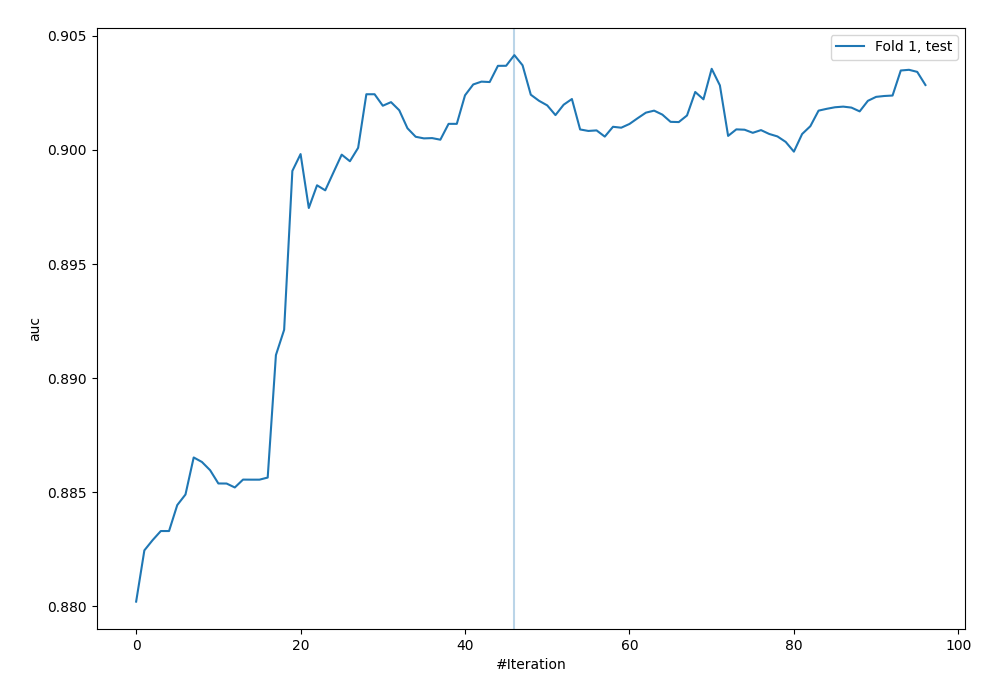
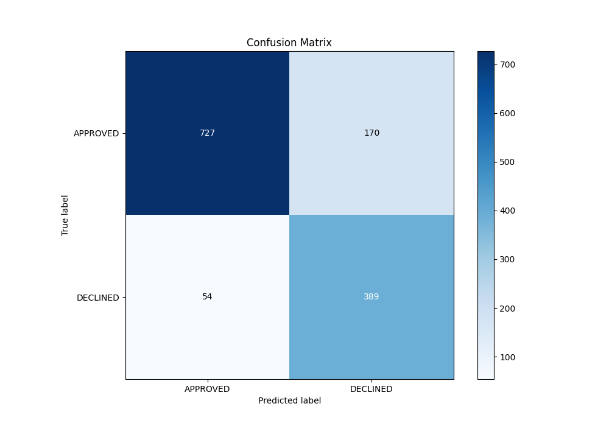
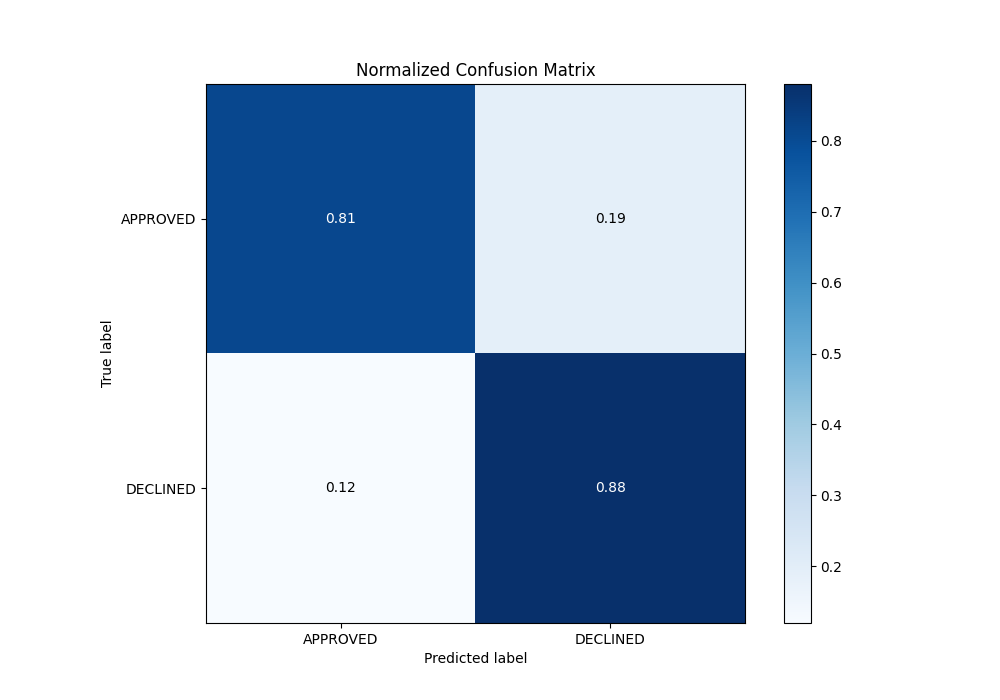
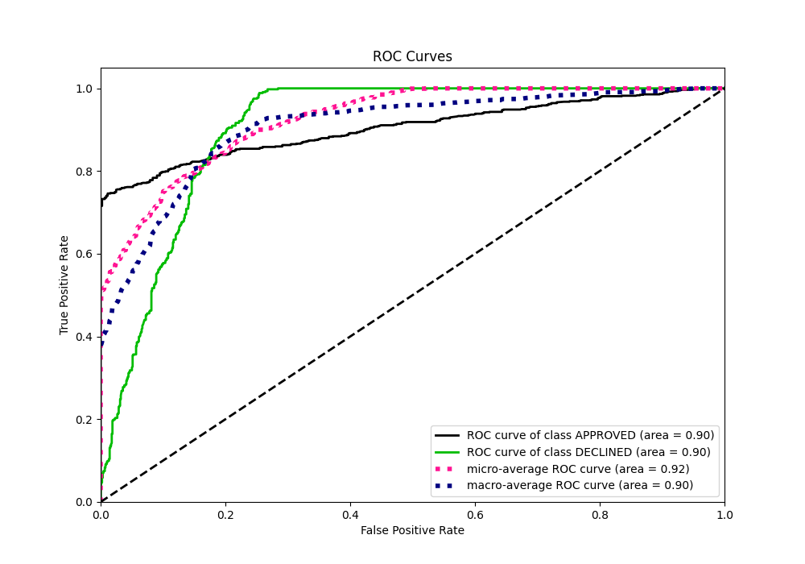
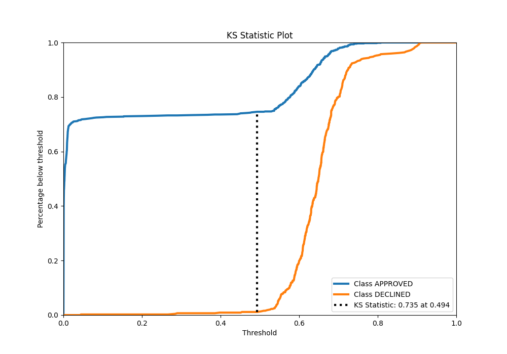
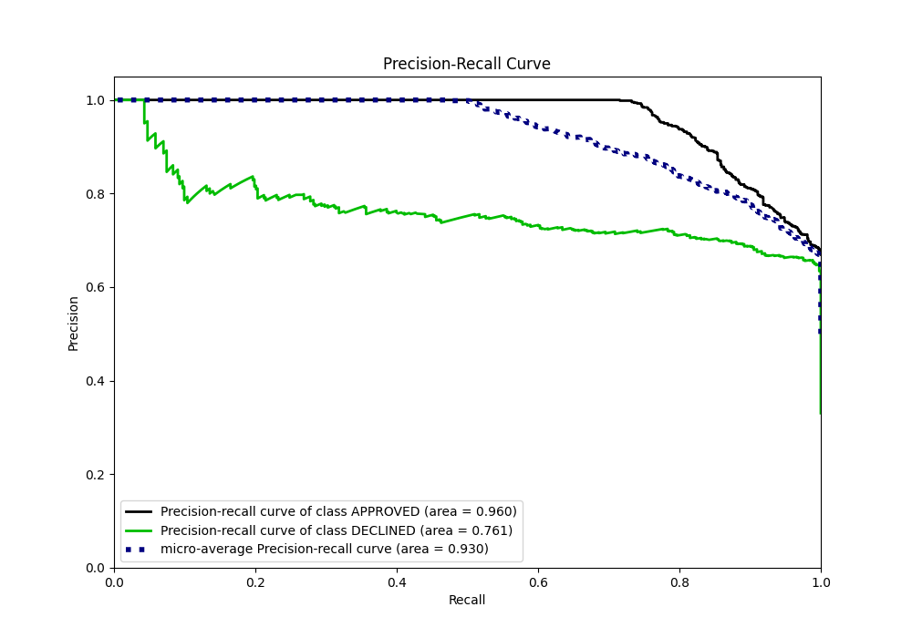
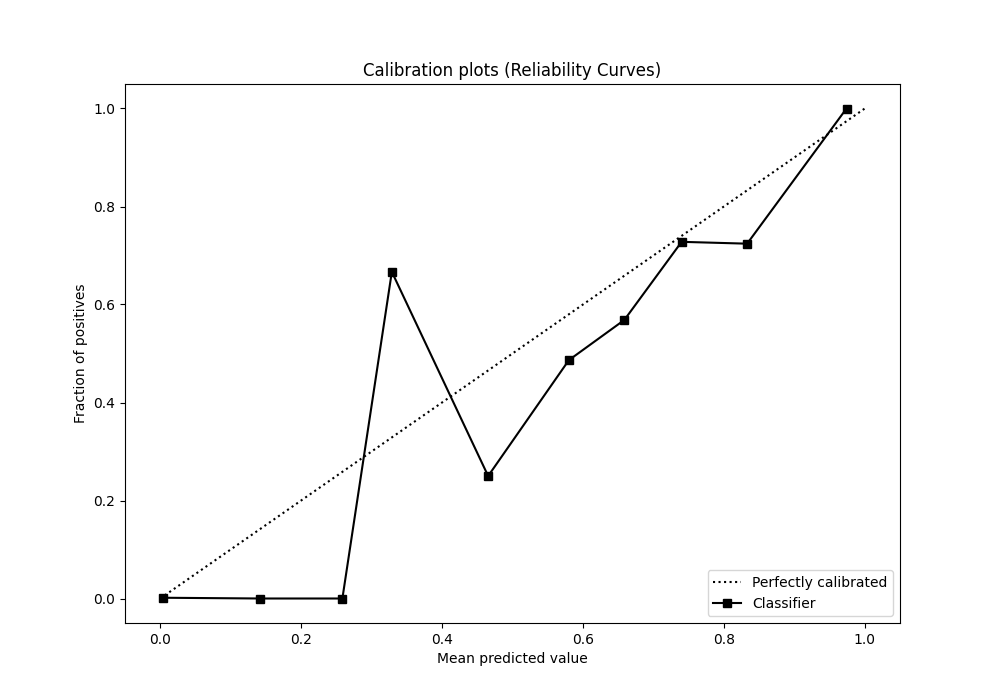
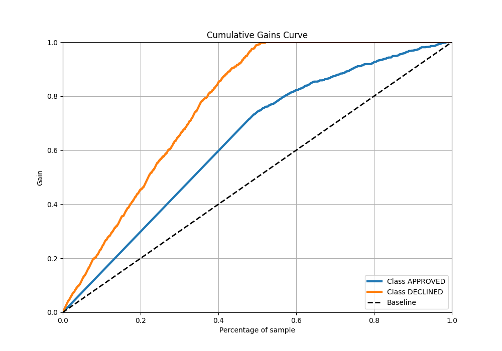
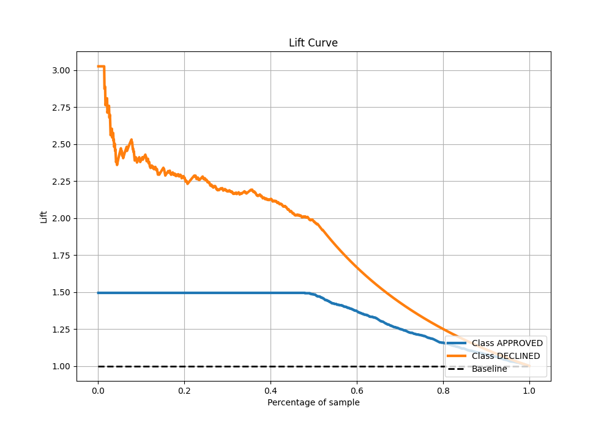

# Summary of 26_CatBoost

[<< Go back](../README.md)

## CatBoost
- **n_jobs**: -1
- **learning_rate**: 0.2
- **depth**: 6
- **rsm**: 0.8
- **loss_function**: Logloss
- **eval_metric**: AUC
- **explain_level**: 0

## Validation
 - **validation_type**: split
 - **train_ratio**: 0.8
 - **shuffle**: True
 - **stratify**: True

## Optimized metric
auc

## Training time

1.4 seconds

## Metric details
|           |    score |     threshold |
|:----------|---------:|--------------:|
| logloss   | 0.322096 | nan           |
| auc       | 0.904154 | nan           |
| f1        | 0.788655 |   0.538556    |
| accuracy  | 0.832836 |   0.583043    |
| precision | 0.836538 |   0.703409    |
| recall    | 1        |   0.000111523 |
| mcc       | 0.687928 |   0.515961    |

## Metric details with threshold from accuracy metric
|           |    score |   threshold |
|:----------|---------:|------------:|
| logloss   | 0.322096 |  nan        |
| auc       | 0.904154 |  nan        |
| f1        | 0.776447 |    0.583043 |
| accuracy  | 0.832836 |    0.583043 |
| precision | 0.695886 |    0.583043 |
| recall    | 0.878104 |    0.583043 |
| mcc       | 0.656936 |    0.583043 |

## Confusion matrix (at threshold=0.583043)
|                     |   Predicted as APPROVED |   Predicted as DECLINED |
|:--------------------|------------------------:|------------------------:|
| Labeled as APPROVED |                     727 |                     170 |
| Labeled as DECLINED |                      54 |                     389 |

## Learning curves

## Confusion Matrix

## Normalized Confusion Matrix

## ROC Curve

## Kolmogorov-Smirnov Statistic

## Precision-Recall Curve

## Calibration Curve

## Cumulative Gains Curve

## Lift Curve

[<< Go back](../README.md)
