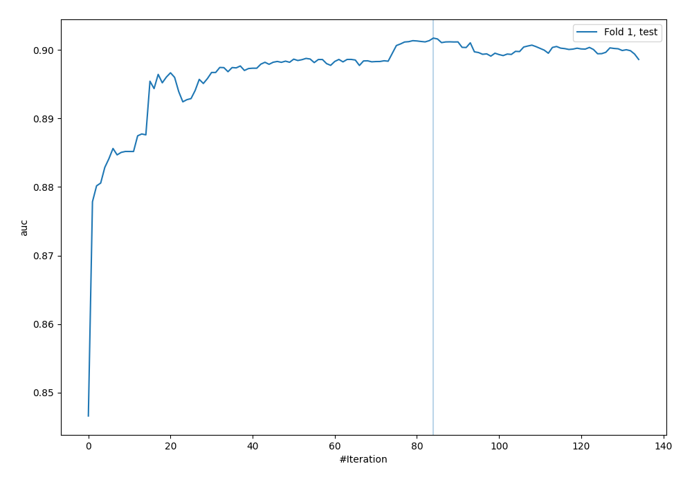
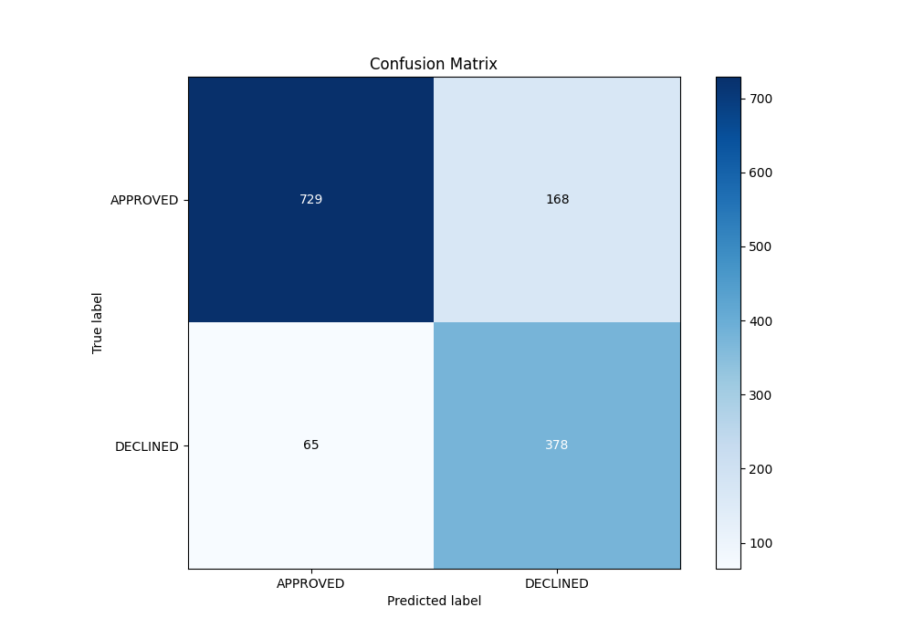
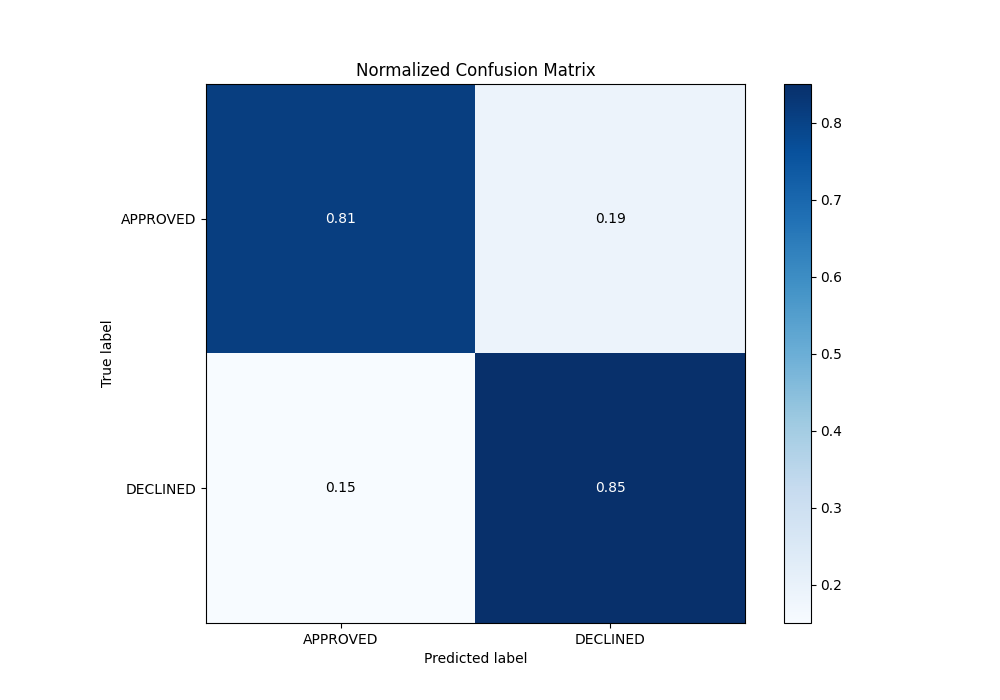
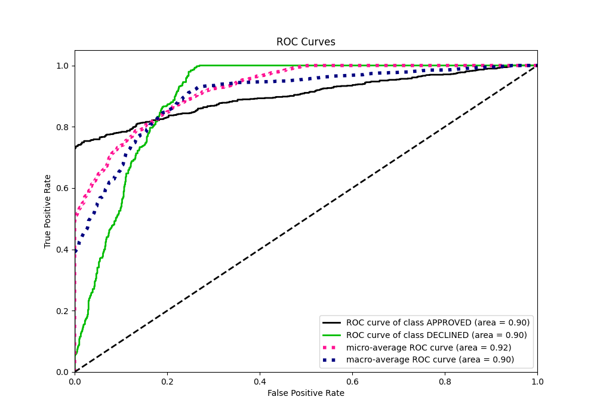
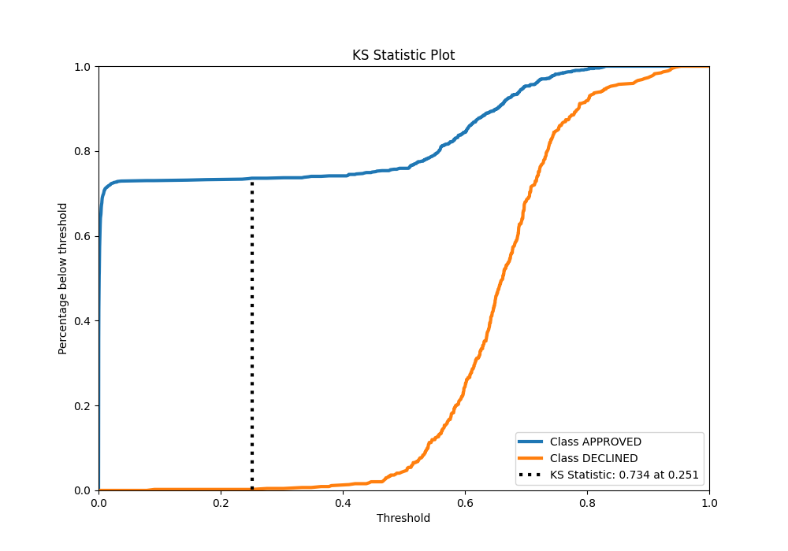
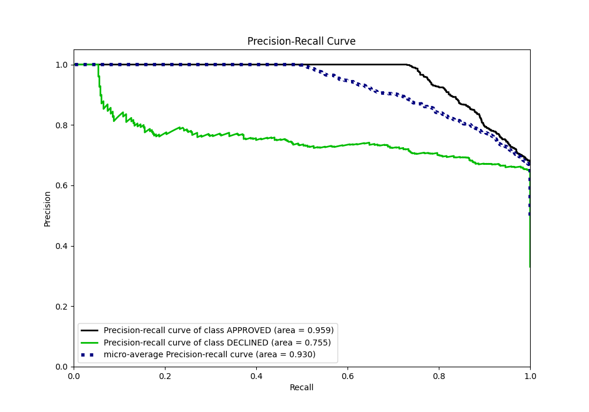
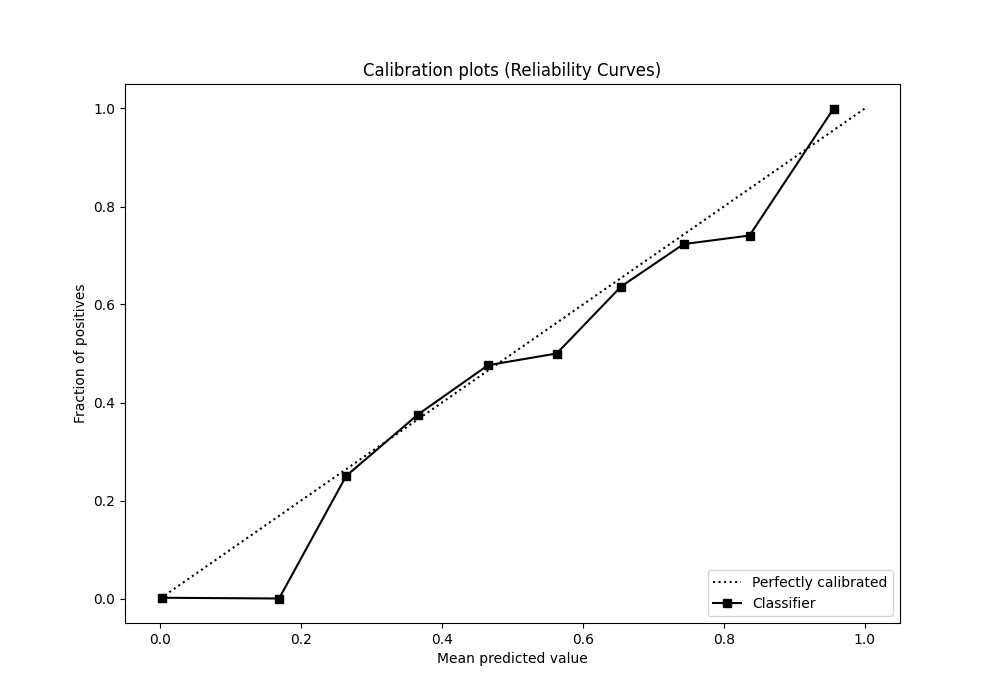
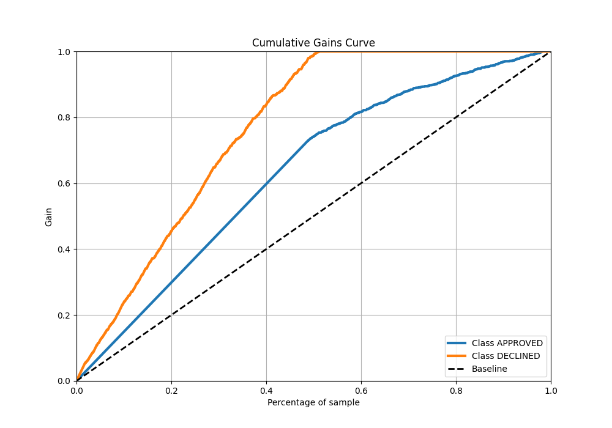
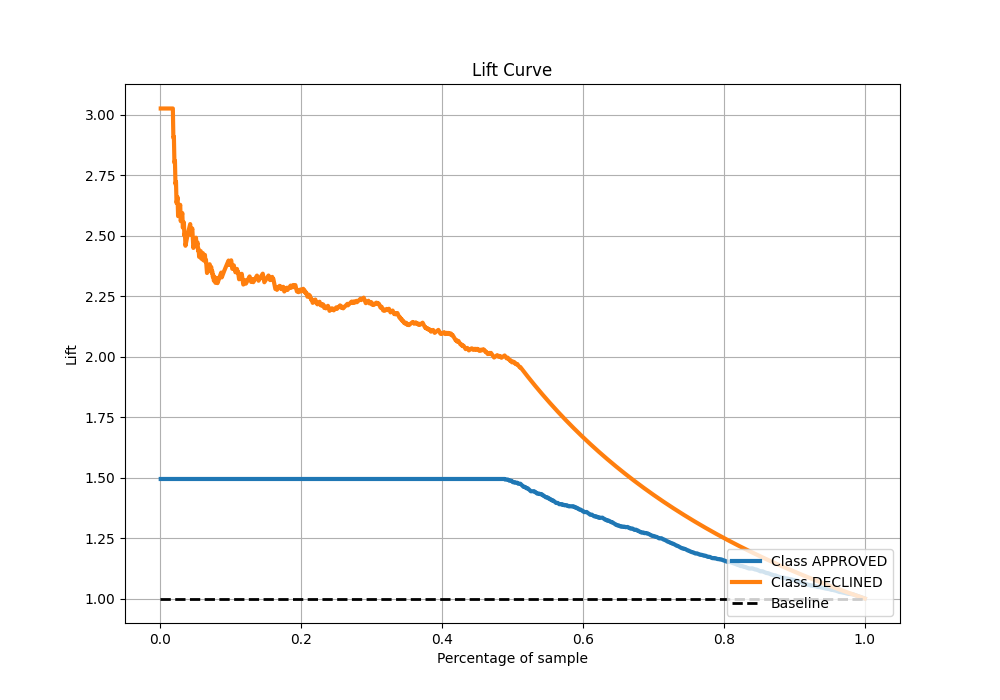

# Summary of 26_CatBoost_GoldenFeatures

[<< Go back](../README.md)

## CatBoost
- **n_jobs**: -1
- **learning_rate**: 0.2
- **depth**: 6
- **rsm**: 0.8
- **loss_function**: Logloss
- **eval_metric**: AUC
- **explain_level**: 0

## Validation
 - **validation_type**: split
 - **train_ratio**: 0.8
 - **shuffle**: True
 - **stratify**: True

## Optimized metric
auc

## Training time

2.4 seconds

## Metric details
|           |    score |     threshold |
|:----------|---------:|--------------:|
| logloss   | 0.318288 | nan           |
| auc       | 0.901705 | nan           |
| f1        | 0.788427 |   0.43393     |
| accuracy  | 0.826119 |   0.5653      |
| precision | 0.826923 |   0.787039    |
| recall    | 1        |   3.12969e-05 |
| mcc       | 0.687928 |   0.43393     |

## Metric details with threshold from accuracy metric
|           |    score |   threshold |
|:----------|---------:|------------:|
| logloss   | 0.318288 |    nan      |
| auc       | 0.901705 |    nan      |
| f1        | 0.764408 |      0.5653 |
| accuracy  | 0.826119 |      0.5653 |
| precision | 0.692308 |      0.5653 |
| recall    | 0.853273 |      0.5653 |
| mcc       | 0.637609 |      0.5653 |

## Confusion matrix (at threshold=0.5653)
|                     |   Predicted as APPROVED |   Predicted as DECLINED |
|:--------------------|------------------------:|------------------------:|
| Labeled as APPROVED |                     729 |                     168 |
| Labeled as DECLINED |                      65 |                     378 |

## Learning curves

## Confusion Matrix

## Normalized Confusion Matrix

## ROC Curve

## Kolmogorov-Smirnov Statistic

## Precision-Recall Curve

## Calibration Curve

## Cumulative Gains Curve

## Lift Curve

[<< Go back](../README.md)
