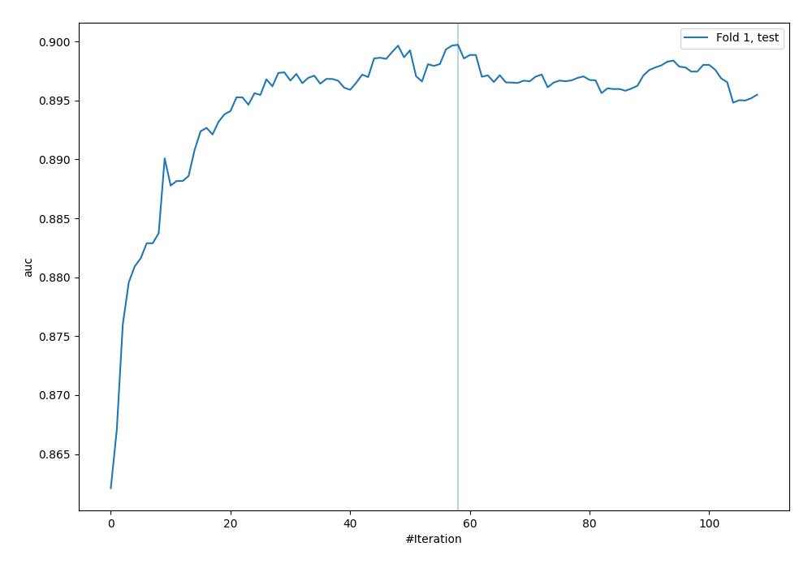
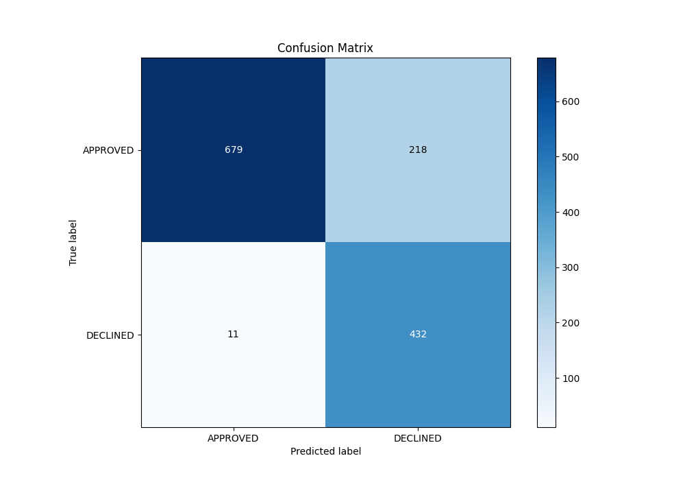
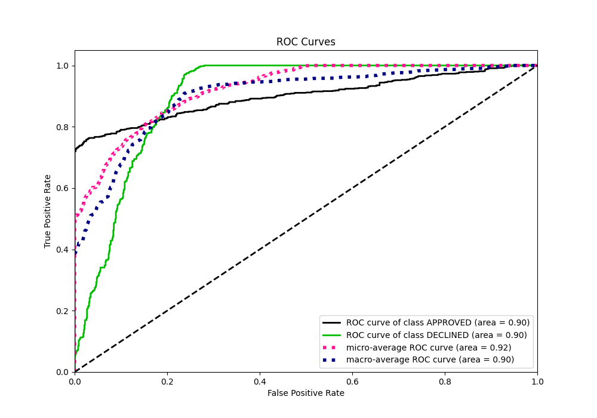
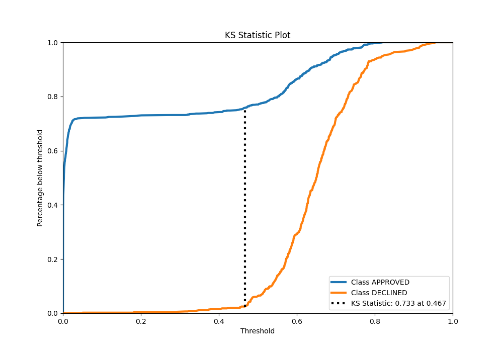
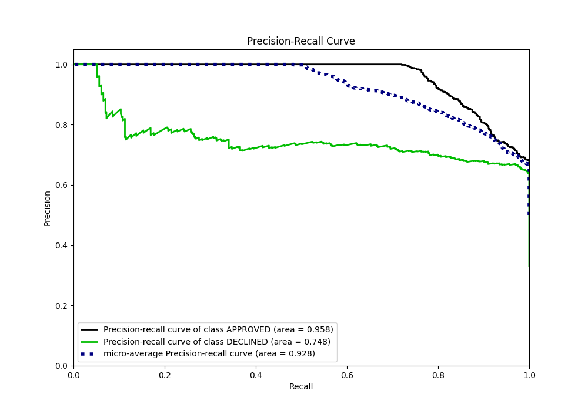
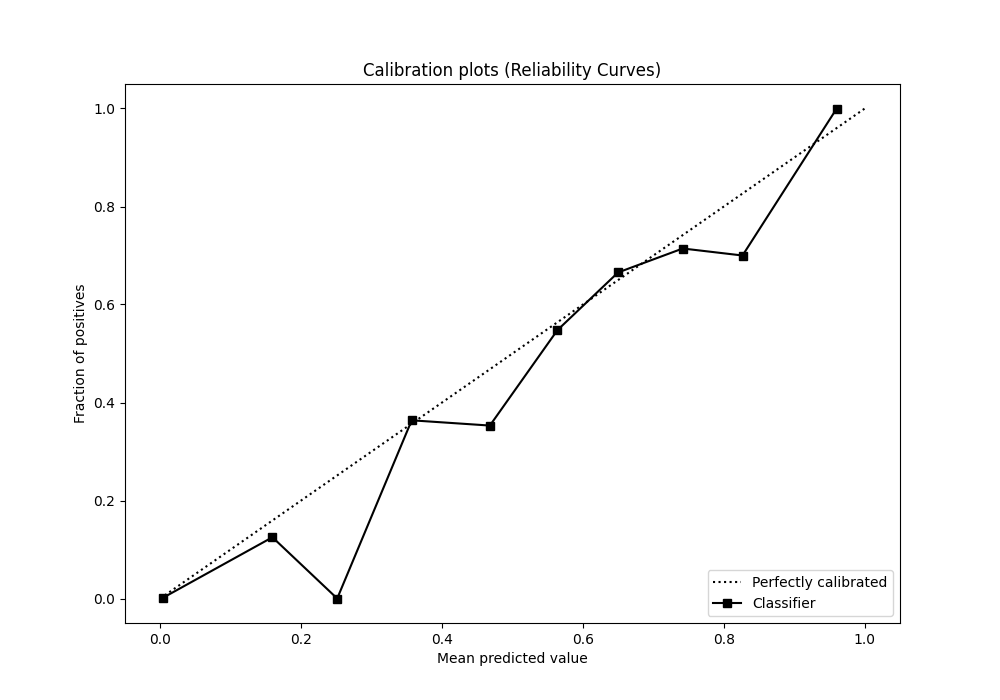
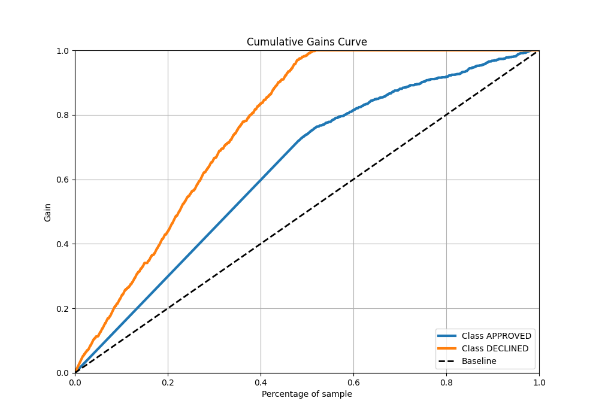
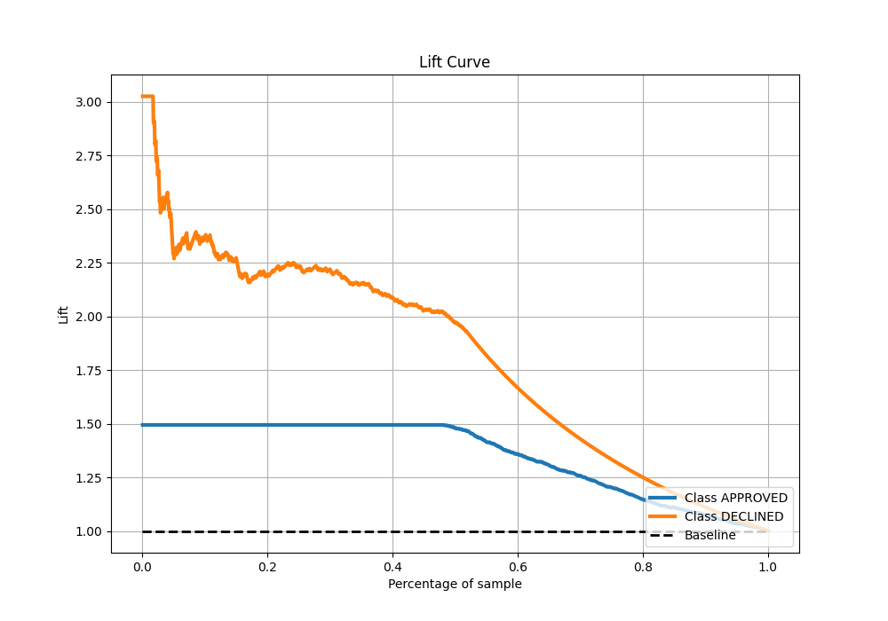

# Summary of 26_CatBoost_KMeansFeatures

[<< Go back](../README.md)

## CatBoost
- **n_jobs**: -1
- **learning_rate**: 0.2
- **depth**: 6
- **rsm**: 0.8
- **loss_function**: Logloss
- **eval_metric**: AUC
- **explain_level**: 0

## Validation
 - **validation_type**: split
 - **train_ratio**: 0.8
 - **shuffle**: True
 - **stratify**: True

## Optimized metric
auc

## Training time

2.5 seconds

## Metric details
|           |    score |     threshold |
|:----------|---------:|--------------:|
| logloss   | 0.323268 | nan           |
| auc       | 0.899726 | nan           |
| f1        | 0.790485 |   0.46541     |
| accuracy  | 0.829104 |   0.46541     |
| precision | 0.846154 |   0.775854    |
| recall    | 1        |   6.07137e-05 |
| mcc       | 0.689143 |   0.46541     |

## Metric details with threshold from accuracy metric
|           |    score |   threshold |
|:----------|---------:|------------:|
| logloss   | 0.323268 |   nan       |
| auc       | 0.899726 |   nan       |
| f1        | 0.790485 |     0.46541 |
| accuracy  | 0.829104 |     0.46541 |
| precision | 0.664615 |     0.46541 |
| recall    | 0.975169 |     0.46541 |
| mcc       | 0.689143 |     0.46541 |

## Confusion matrix (at threshold=0.46541)
|                     |   Predicted as APPROVED |   Predicted as DECLINED |
|:--------------------|------------------------:|------------------------:|
| Labeled as APPROVED |                     679 |                     218 |
| Labeled as DECLINED |                      11 |                     432 |

## Learning curves

## Confusion Matrix

## Normalized Confusion Matrix

## ROC Curve

## Kolmogorov-Smirnov Statistic

## Precision-Recall Curve

## Calibration Curve

## Cumulative Gains Curve

## Lift Curve

[<< Go back](../README.md)
