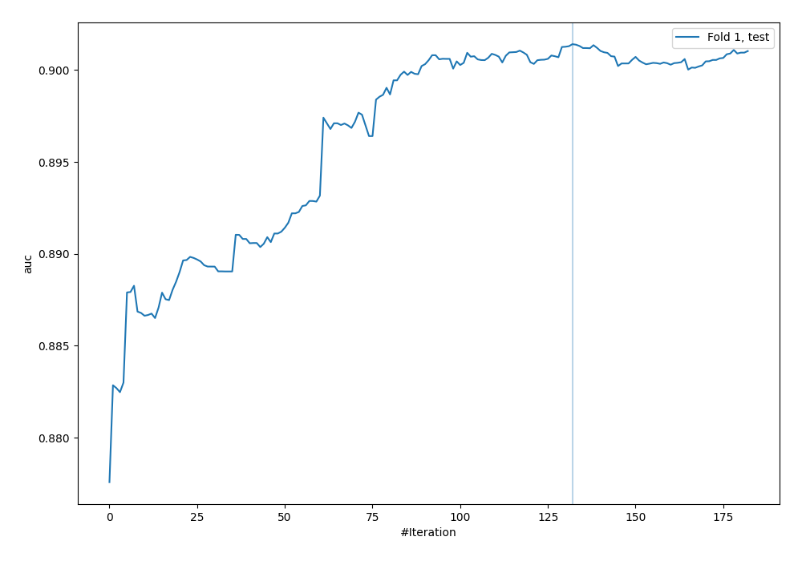
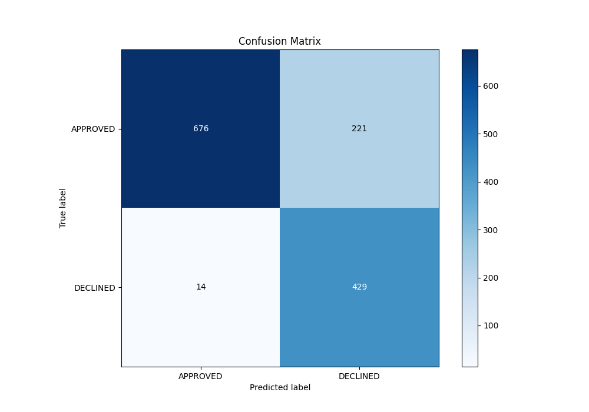
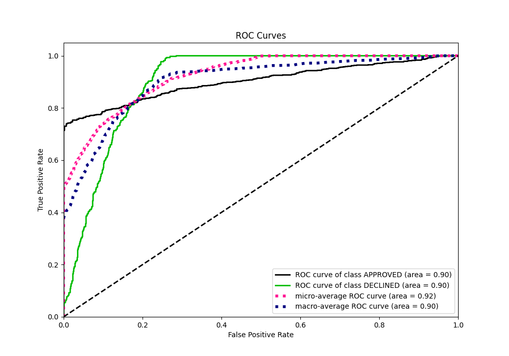
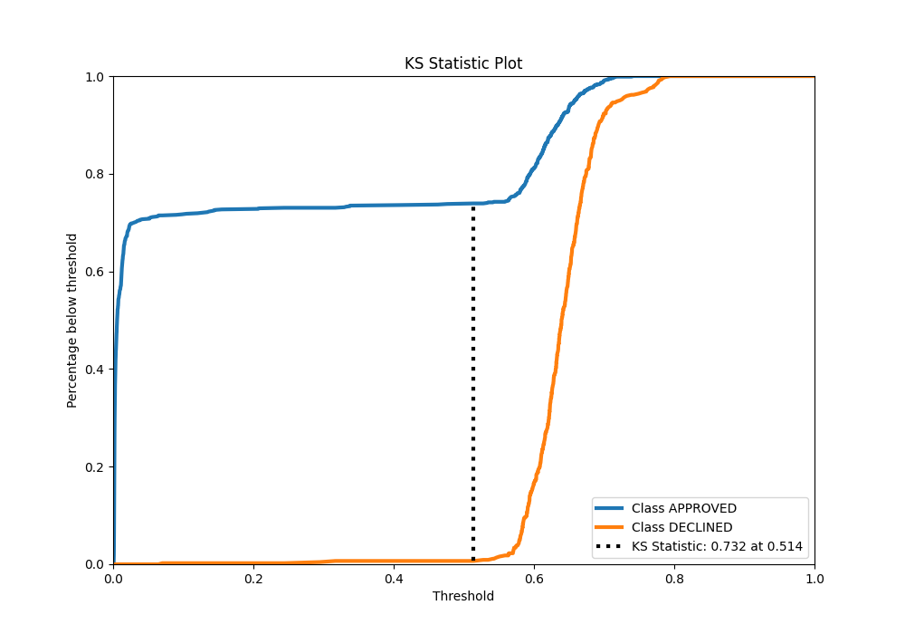
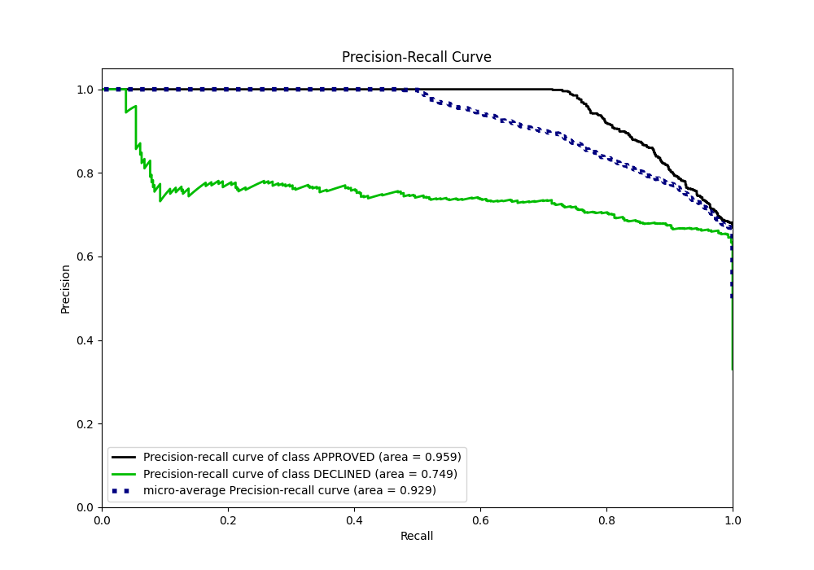
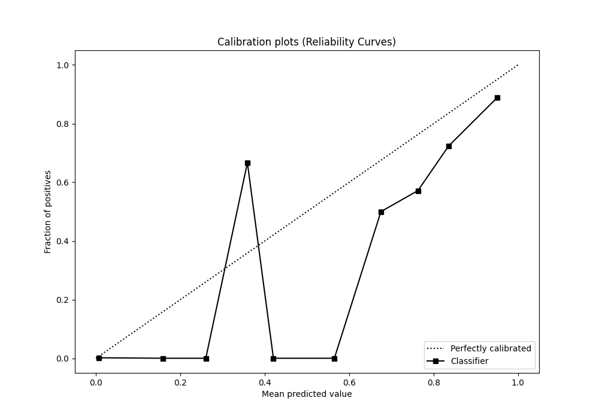
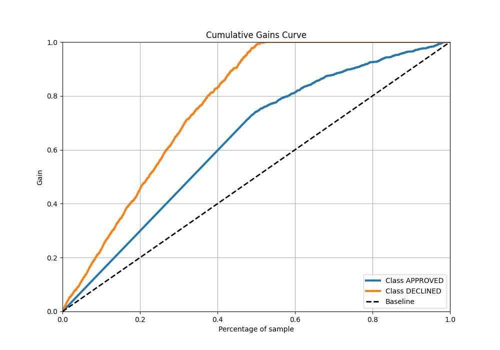
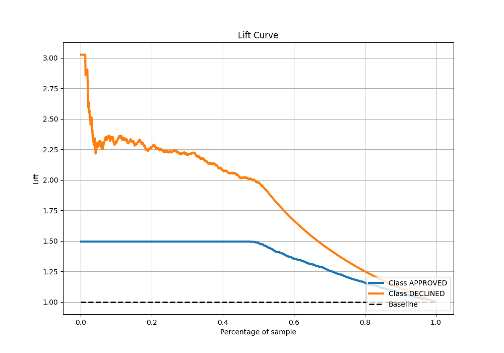

# Summary of 27_CatBoost

[<< Go back](../README.md)

## CatBoost
- **n_jobs**: -1
- **learning_rate**: 0.025
- **depth**: 9
- **rsm**: 0.9
- **loss_function**: Logloss
- **eval_metric**: AUC
- **explain_level**: 0

## Validation
 - **validation_type**: split
 - **train_ratio**: 0.8
 - **shuffle**: True
 - **stratify**: True

## Optimized metric
auc

## Training time

2.6 seconds

## Metric details
|           |    score |     threshold |
|:----------|---------:|--------------:|
| logloss   | 0.329094 | nan           |
| auc       | 0.901408 | nan           |
| f1        | 0.786618 |   0.56365     |
| accuracy  | 0.824627 |   0.571606    |
| precision | 0.778846 |   0.678386    |
| recall    | 1        |   0.000626239 |
| mcc       | 0.686974 |   0.469615    |

## Metric details with threshold from accuracy metric
|           |    score |   threshold |
|:----------|---------:|------------:|
| logloss   | 0.329094 |  nan        |
| auc       | 0.901408 |  nan        |
| f1        | 0.784995 |    0.571606 |
| accuracy  | 0.824627 |    0.571606 |
| precision | 0.66     |    0.571606 |
| recall    | 0.968397 |    0.571606 |
| mcc       | 0.67962  |    0.571606 |

## Confusion matrix (at threshold=0.571606)
|                     |   Predicted as APPROVED |   Predicted as DECLINED |
|:--------------------|------------------------:|------------------------:|
| Labeled as APPROVED |                     676 |                     221 |
| Labeled as DECLINED |                      14 |                     429 |

## Learning curves

## Confusion Matrix

## Normalized Confusion Matrix

## ROC Curve

## Kolmogorov-Smirnov Statistic

## Precision-Recall Curve

## Calibration Curve

## Cumulative Gains Curve

## Lift Curve

[<< Go back](../README.md)
