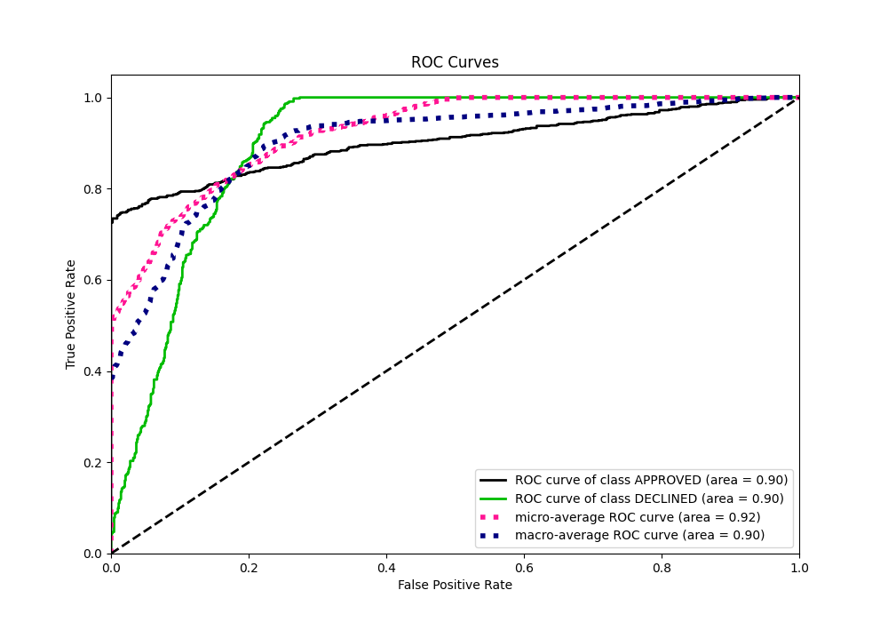

# Summary of 28_CatBoost

[<< Go back](../README.md)

## CatBoost
- **n_jobs**: -1
- **learning_rate**: 0.1
- **depth**: 4
- **rsm**: 0.9
- **loss_function**: Logloss
- **eval_metric**: AUC
- **explain_level**: 0

## Validation
 - **validation_type**: split
 - **train_ratio**: 0.8
 - **shuffle**: True
 - **stratify**: True

## Optimized metric
auc

## Training time

2.0 seconds

## Metric details
|           |    score |     threshold |
|:----------|---------:|--------------:|
| logloss   | 0.321337 | nan           |
| auc       | 0.901874 | nan           |
| f1        | 0.788427 |   0.488707    |
| accuracy  | 0.829851 |   0.562313    |
| precision | 0.823529 |   0.728294    |
| recall    | 1        |   8.12443e-05 |
| mcc       | 0.687928 |   0.488707    |

## Metric details with threshold from accuracy metric
|           |    score |   threshold |
|:----------|---------:|------------:|
| logloss   | 0.321337 |  nan        |
| auc       | 0.901874 |  nan        |
| f1        | 0.783681 |    0.562313 |
| accuracy  | 0.829851 |    0.562313 |
| precision | 0.675941 |    0.562313 |
| recall    | 0.93228  |    0.562313 |
| mcc       | 0.672072 |    0.562313 |

## Confusion matrix (at threshold=0.562313)
|                     |   Predicted as APPROVED |   Predicted as DECLINED |
|:--------------------|------------------------:|------------------------:|
| Labeled as APPROVED |                     699 |                     198 |
| Labeled as DECLINED |                      30 |                     413 |

## Learning curves

## Confusion Matrix

## Normalized Confusion Matrix

## ROC Curve

## Kolmogorov-Smirnov Statistic

## Precision-Recall Curve

## Calibration Curve

## Cumulative Gains Curve

## Lift Curve

[<< Go back](../README.md)
