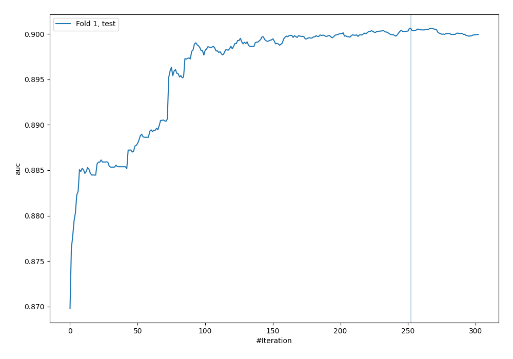
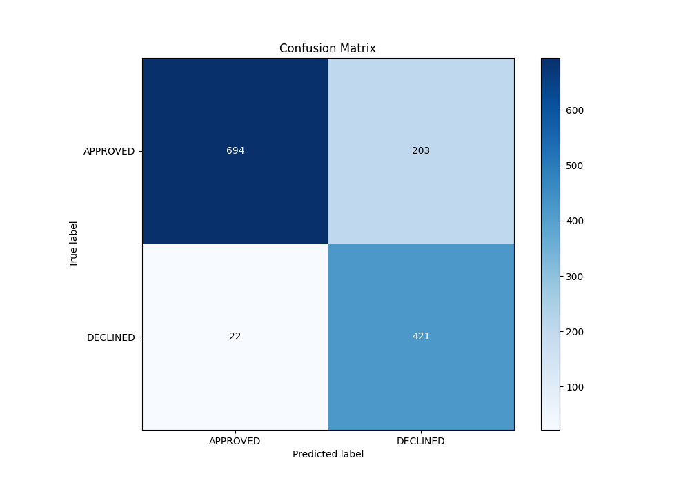
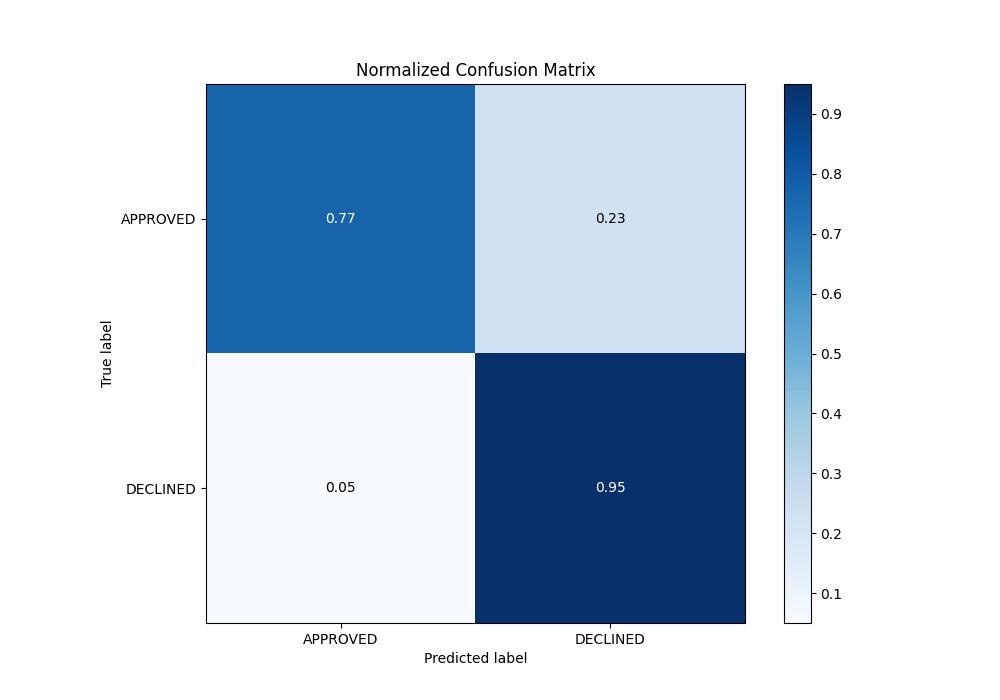
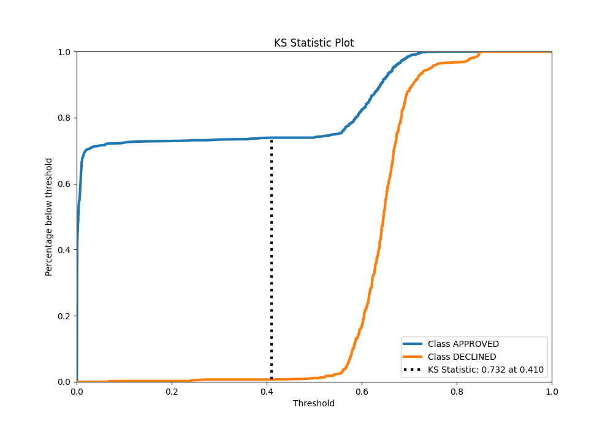
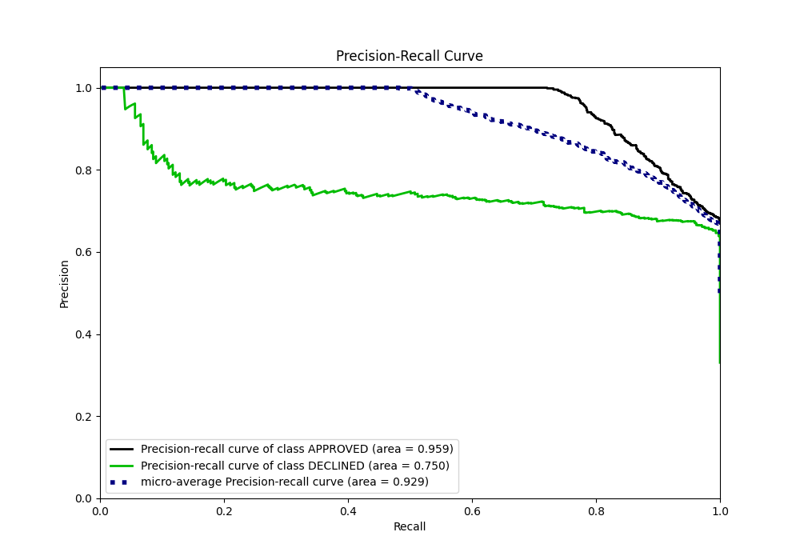
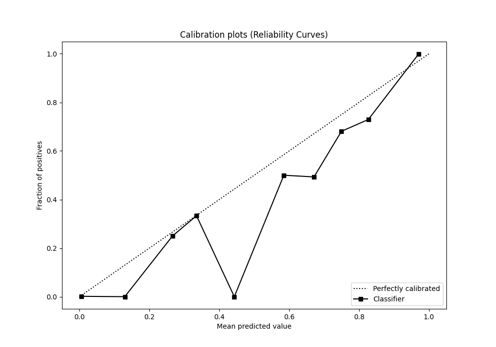
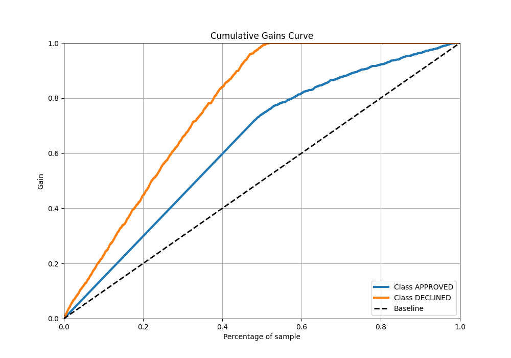
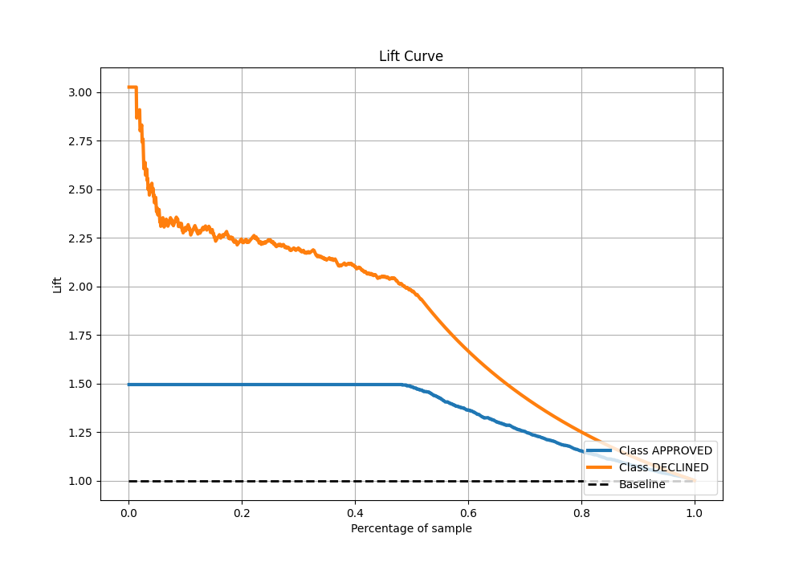

# Summary of 29_CatBoost

[<< Go back](../README.md)

## CatBoost
- **n_jobs**: -1
- **learning_rate**: 0.025
- **depth**: 6
- **rsm**: 0.9
- **loss_function**: Logloss
- **eval_metric**: AUC
- **explain_level**: 0

## Validation
 - **validation_type**: split
 - **train_ratio**: 0.8
 - **shuffle**: True
 - **stratify**: True

## Optimized metric
auc

## Training time

2.8 seconds

## Metric details
|           |    score |    threshold |
|:----------|---------:|-------------:|
| logloss   | 0.325047 | nan          |
| auc       | 0.900621 | nan          |
| f1        | 0.789128 |   0.569627   |
| accuracy  | 0.83209  |   0.569627   |
| precision | 0.826923 |   0.709265   |
| recall    | 1        |   0.00024974 |
| mcc       | 0.686974 |   0.384337   |

## Metric details with threshold from accuracy metric
|           |    score |   threshold |
|:----------|---------:|------------:|
| logloss   | 0.325047 |  nan        |
| auc       | 0.900621 |  nan        |
| f1        | 0.789128 |    0.569627 |
| accuracy  | 0.83209  |    0.569627 |
| precision | 0.674679 |    0.569627 |
| recall    | 0.950339 |    0.569627 |
| mcc       | 0.682818 |    0.569627 |

## Confusion matrix (at threshold=0.569627)
|                     |   Predicted as APPROVED |   Predicted as DECLINED |
|:--------------------|------------------------:|------------------------:|
| Labeled as APPROVED |                     694 |                     203 |
| Labeled as DECLINED |                      22 |                     421 |

## Learning curves

## Confusion Matrix

## Normalized Confusion Matrix

## ROC Curve

## Kolmogorov-Smirnov Statistic

## Precision-Recall Curve

## Calibration Curve

## Cumulative Gains Curve

## Lift Curve

[<< Go back](../README.md)
