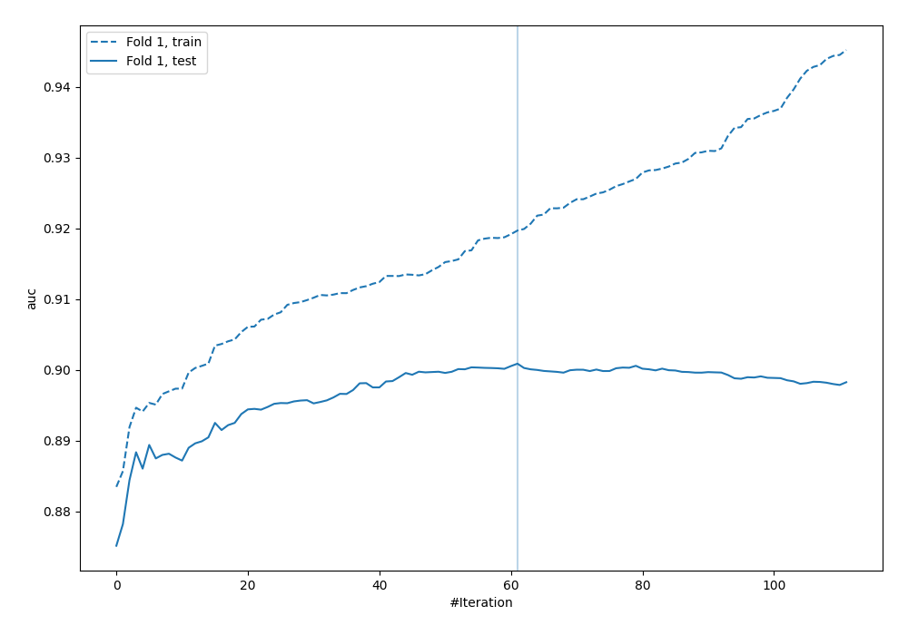
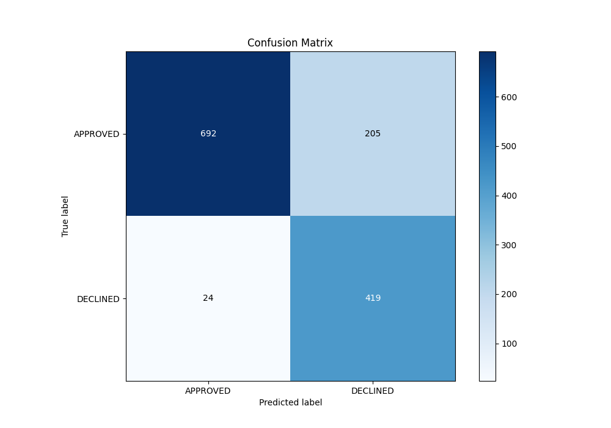
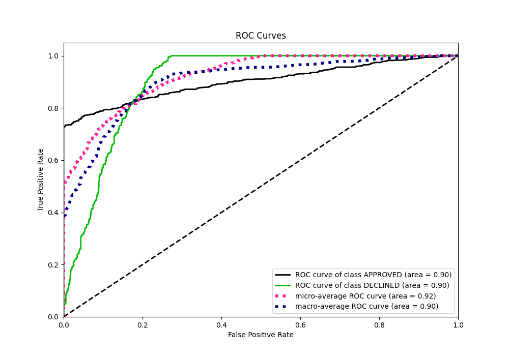
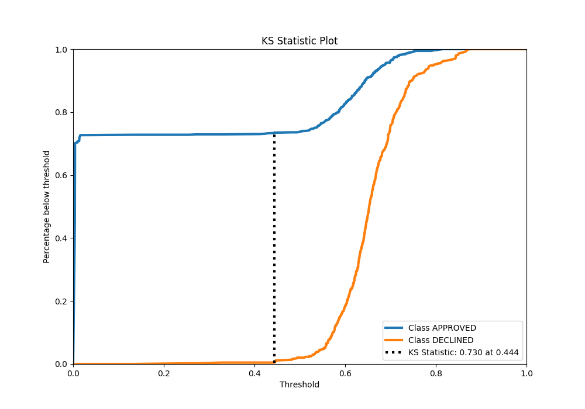
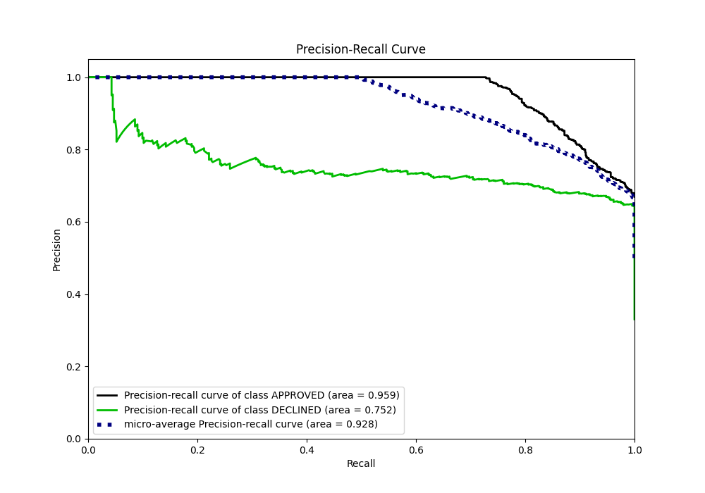
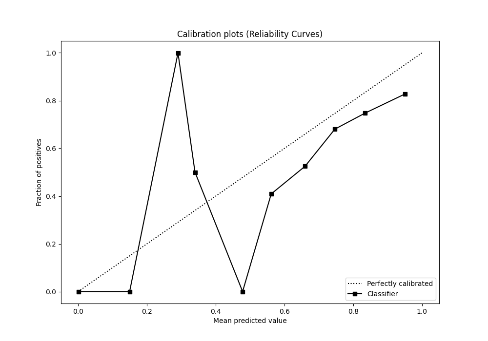
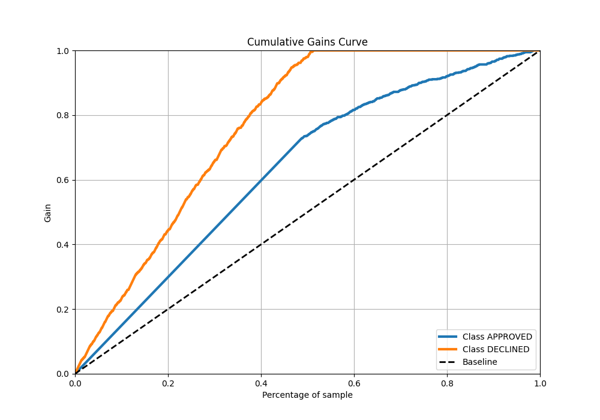
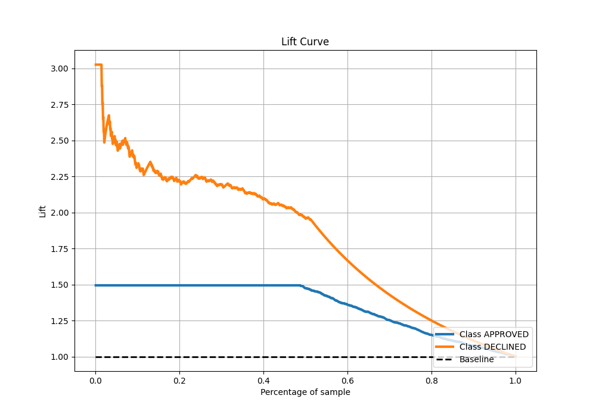

# Summary of 2_Default_Xgboost

[<< Go back](../README.md)

## Extreme Gradient Boosting (Xgboost)
- **n_jobs**: -1
- **objective**: binary:logistic
- **eta**: 0.075
- **max_depth**: 6
- **min_child_weight**: 1
- **subsample**: 1.0
- **colsample_bytree**: 1.0
- **eval_metric**: auc
- **explain_level**: 0

## Validation
 - **validation_type**: split
 - **train_ratio**: 0.8
 - **shuffle**: True
 - **stratify**: True

## Optimized metric
auc

## Training time

0.9 seconds

## Metric details
|           |    score |    threshold |
|:----------|---------:|-------------:|
| logloss   | 0.323725 | nan          |
| auc       | 0.90088  | nan          |
| f1        | 0.78538  |   0.556825   |
| accuracy  | 0.829104 |   0.556825   |
| precision | 0.846154 |   0.748485   |
| recall    | 1        |   0.00335551 |
| mcc       | 0.683104 |   0.0162009  |

## Metric details with threshold from accuracy metric
|           |    score |   threshold |
|:----------|---------:|------------:|
| logloss   | 0.323725 |  nan        |
| auc       | 0.90088  |  nan        |
| f1        | 0.78538  |    0.556825 |
| accuracy  | 0.829104 |    0.556825 |
| precision | 0.671474 |    0.556825 |
| recall    | 0.945824 |    0.556825 |
| mcc       | 0.676458 |    0.556825 |

## Confusion matrix (at threshold=0.556825)
|                     |   Predicted as APPROVED |   Predicted as DECLINED |
|:--------------------|------------------------:|------------------------:|
| Labeled as APPROVED |                     692 |                     205 |
| Labeled as DECLINED |                      24 |                     419 |

## Learning curves

## Confusion Matrix

## Normalized Confusion Matrix

## ROC Curve

## Kolmogorov-Smirnov Statistic

## Precision-Recall Curve

## Calibration Curve

## Cumulative Gains Curve

## Lift Curve

[<< Go back](../README.md)
