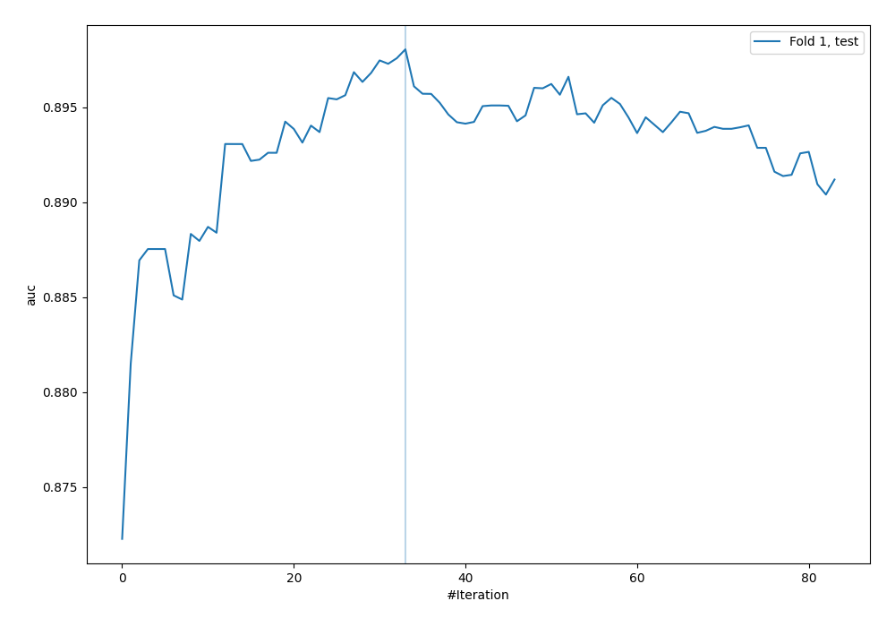
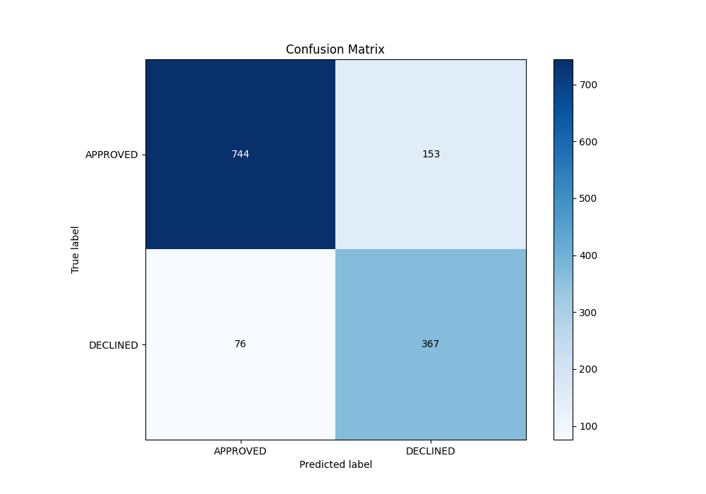
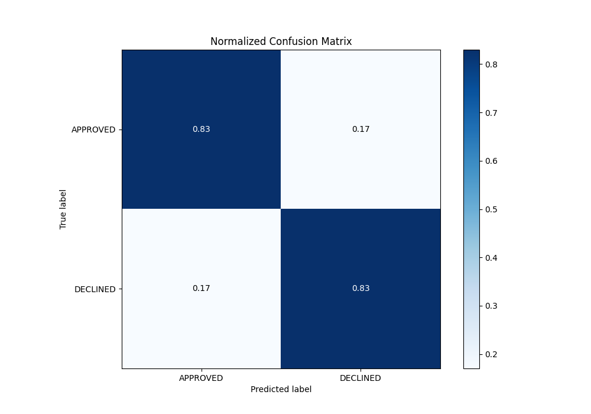
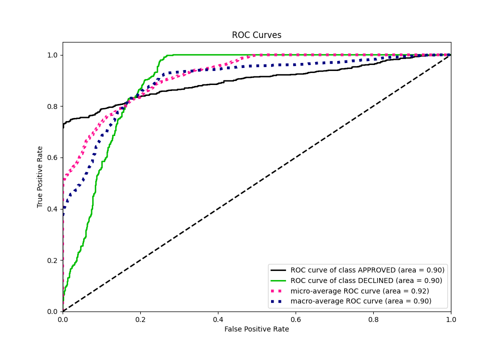
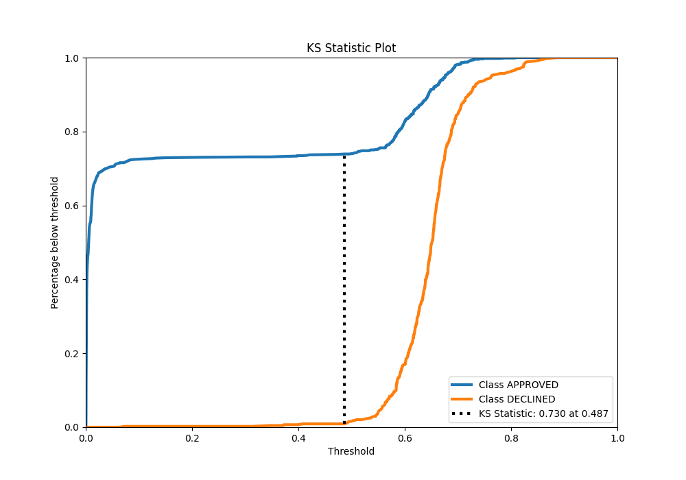
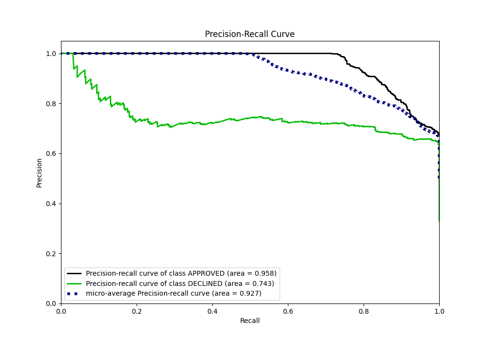
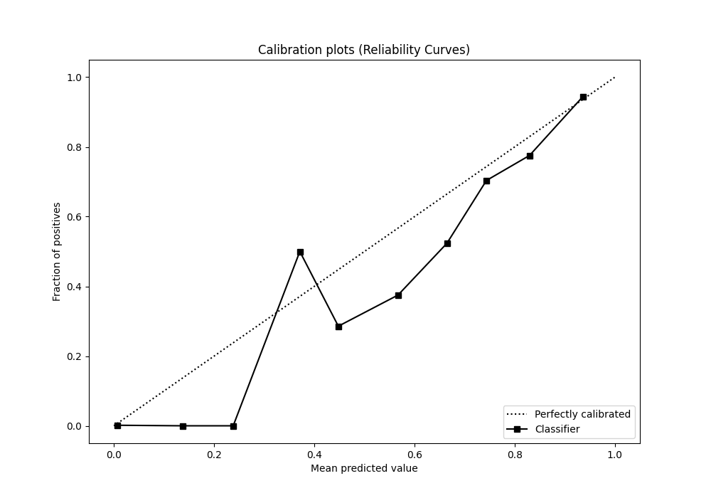
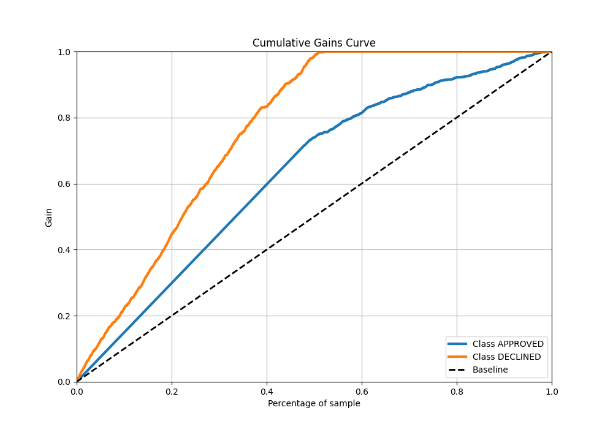
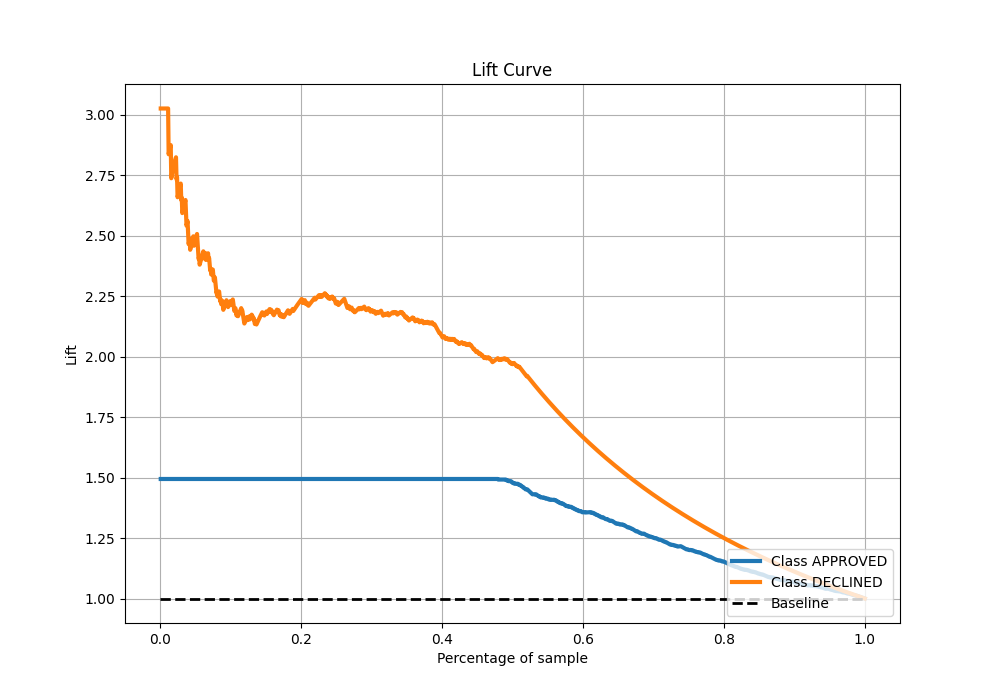

# Summary of 31_CatBoost

[<< Go back](../README.md)

## CatBoost
- **n_jobs**: -1
- **learning_rate**: 0.2
- **depth**: 7
- **rsm**: 1.0
- **loss_function**: Logloss
- **eval_metric**: AUC
- **explain_level**: 0

## Validation
 - **validation_type**: split
 - **train_ratio**: 0.8
 - **shuffle**: True
 - **stratify**: True

## Optimized metric
auc

## Training time

1.9 seconds

## Metric details
|           |    score |     threshold |
|:----------|---------:|--------------:|
| logloss   | 0.327026 | nan           |
| auc       | 0.898057 | nan           |
| f1        | 0.78481  |   0.51154     |
| accuracy  | 0.829104 |   0.601121    |
| precision | 0.846154 |   0.722517    |
| recall    | 1        |   0.000293347 |
| mcc       | 0.683801 |   0.418695    |

## Metric details with threshold from accuracy metric
|           |    score |   threshold |
|:----------|---------:|------------:|
| logloss   | 0.327026 |  nan        |
| auc       | 0.898057 |  nan        |
| f1        | 0.762201 |    0.601121 |
| accuracy  | 0.829104 |    0.601121 |
| precision | 0.705769 |    0.601121 |
| recall    | 0.828442 |    0.601121 |
| mcc       | 0.635085 |    0.601121 |

## Confusion matrix (at threshold=0.601121)
|                     |   Predicted as APPROVED |   Predicted as DECLINED |
|:--------------------|------------------------:|------------------------:|
| Labeled as APPROVED |                     744 |                     153 |
| Labeled as DECLINED |                      76 |                     367 |

## Learning curves

## Confusion Matrix

## Normalized Confusion Matrix

## ROC Curve

## Kolmogorov-Smirnov Statistic

## Precision-Recall Curve

## Calibration Curve

## Cumulative Gains Curve

## Lift Curve

[<< Go back](../README.md)
