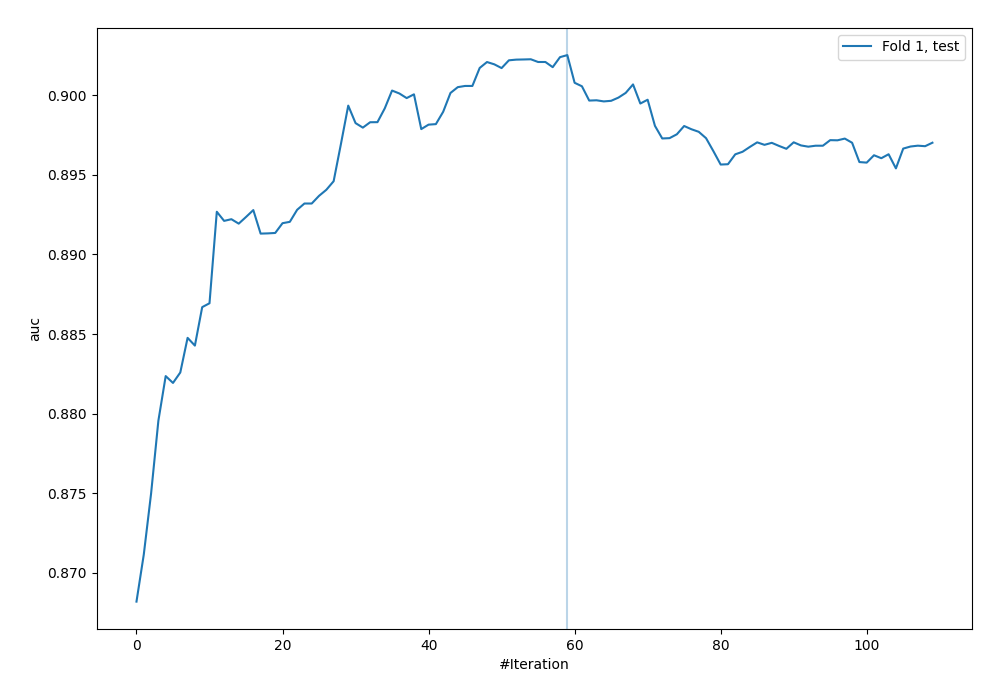
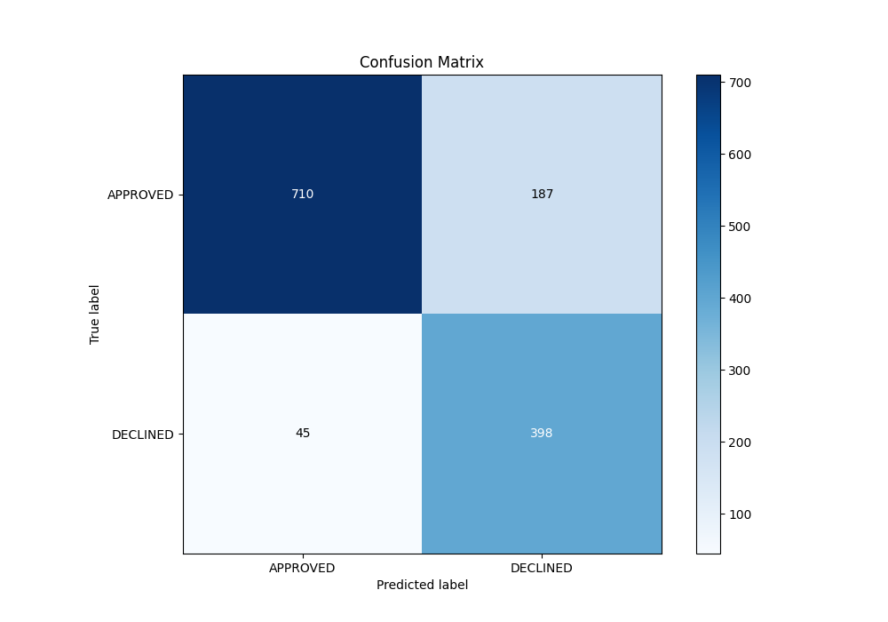
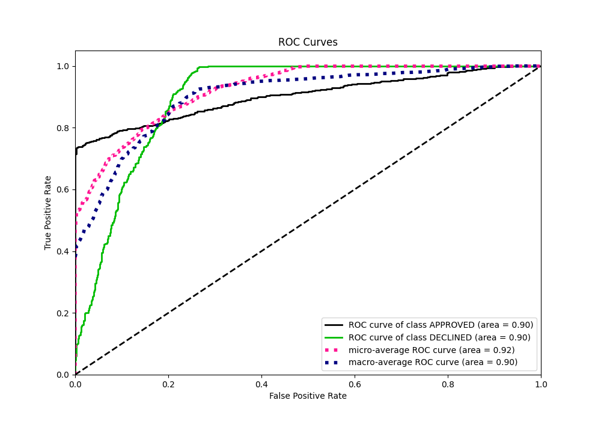
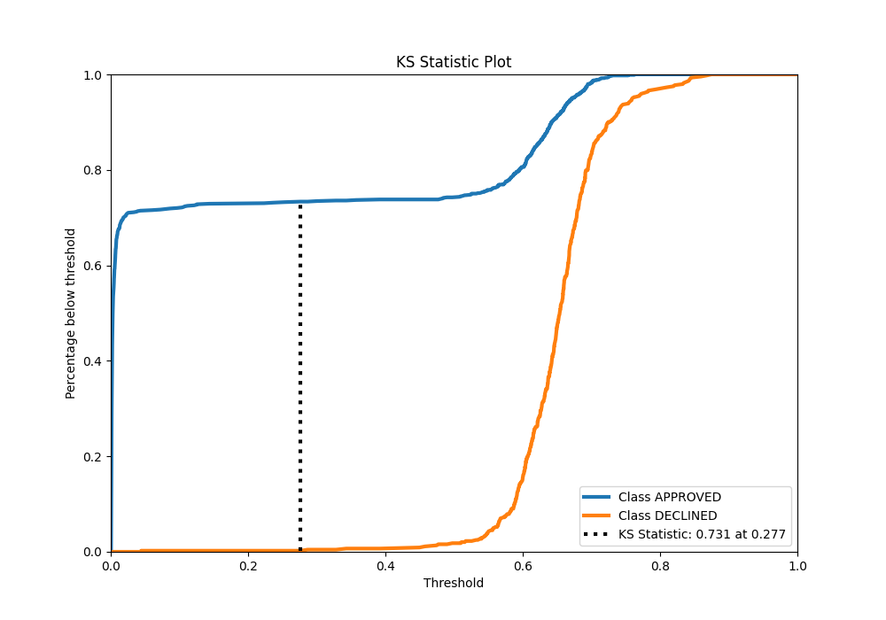
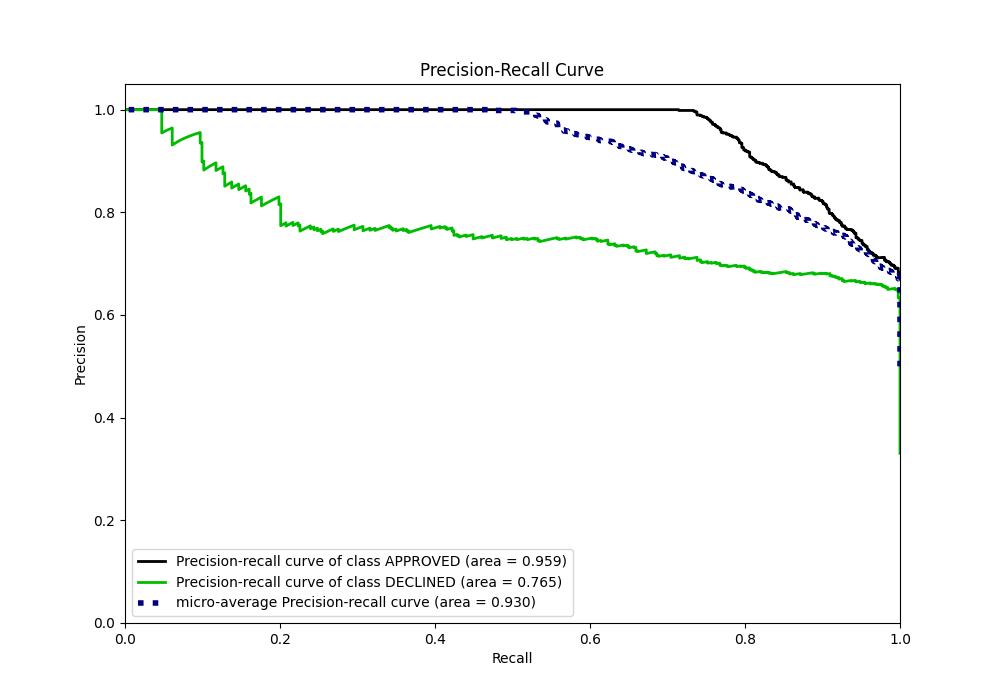
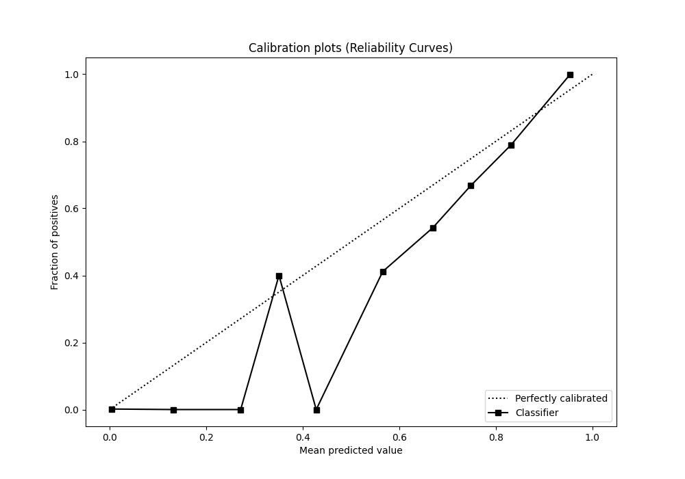
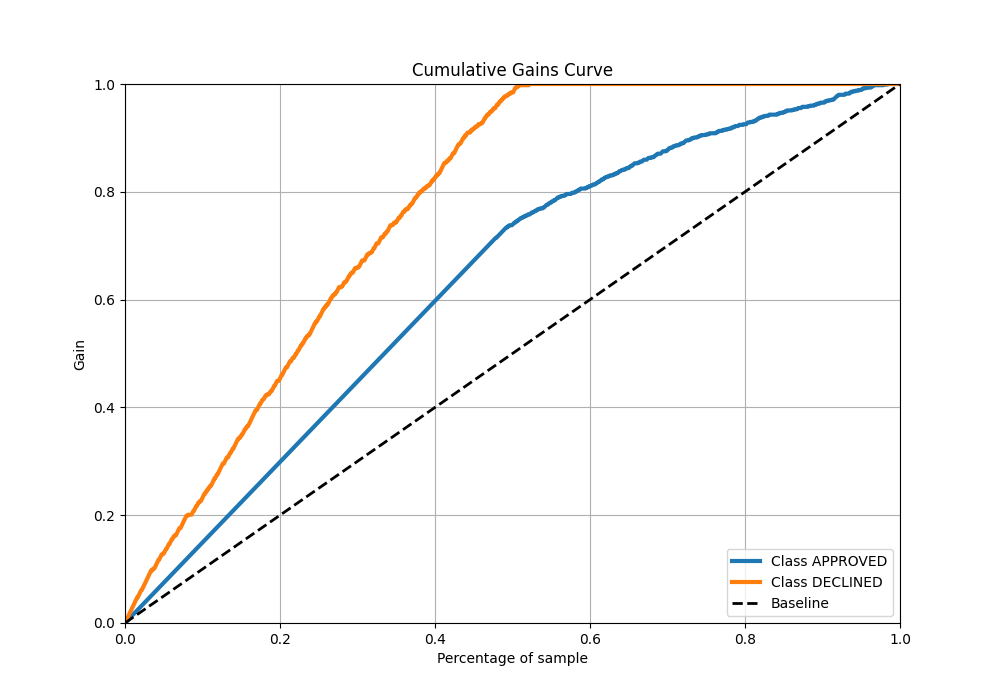
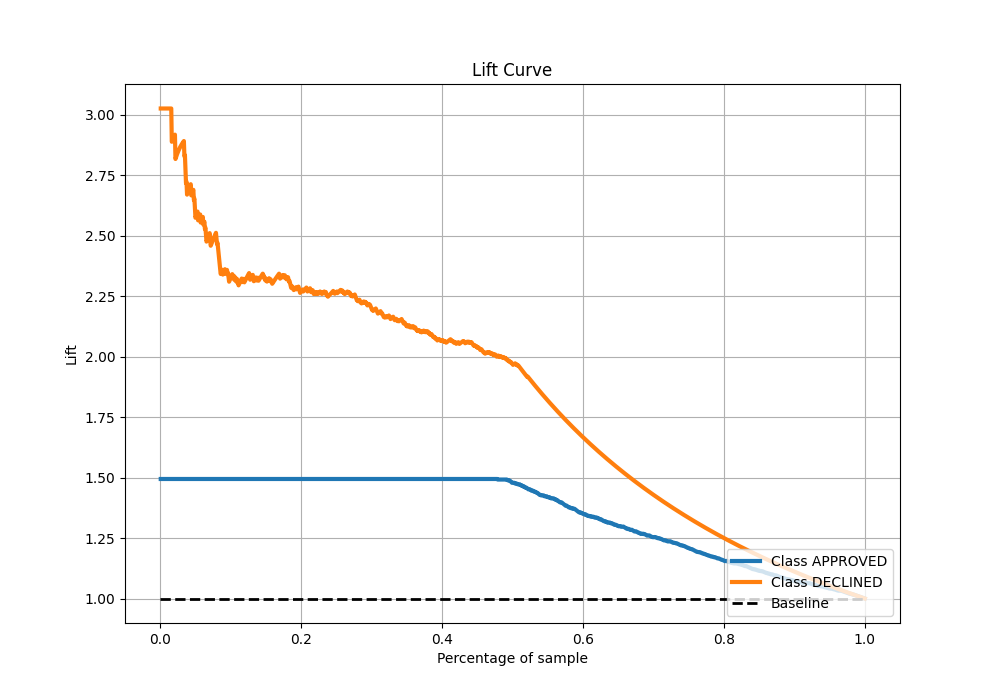

# Summary of 32_CatBoost_RandomFeature

[<< Go back](../README.md)

## CatBoost
- **n_jobs**: -1
- **learning_rate**: 0.1
- **depth**: 8
- **rsm**: 1.0
- **loss_function**: Logloss
- **eval_metric**: AUC
- **explain_level**: 1

## Validation
 - **validation_type**: split
 - **train_ratio**: 0.8
 - **shuffle**: True
 - **stratify**: True

## Optimized metric
auc

## Training time

2.4 seconds

## Metric details
|           |    score |     threshold |
|:----------|---------:|--------------:|
| logloss   | 0.323785 | nan           |
| auc       | 0.902524 | nan           |
| f1        | 0.786416 |   0.37447     |
| accuracy  | 0.826866 |   0.588002    |
| precision | 0.884615 |   0.723007    |
| recall    | 1        |   0.000260074 |
| mcc       | 0.686974 |   0.37447     |

## Metric details with threshold from accuracy metric
|           |    score |   threshold |
|:----------|---------:|------------:|
| logloss   | 0.323785 |  nan        |
| auc       | 0.902524 |  nan        |
| f1        | 0.774319 |    0.588002 |
| accuracy  | 0.826866 |    0.588002 |
| precision | 0.680342 |    0.588002 |
| recall    | 0.89842  |    0.588002 |
| mcc       | 0.654429 |    0.588002 |

## Confusion matrix (at threshold=0.588002)
|                     |   Predicted as APPROVED |   Predicted as DECLINED |
|:--------------------|------------------------:|------------------------:|
| Labeled as APPROVED |                     710 |                     187 |
| Labeled as DECLINED |                      45 |                     398 |

## Learning curves

## Confusion Matrix

## Normalized Confusion Matrix

## ROC Curve

## Kolmogorov-Smirnov Statistic

## Precision-Recall Curve

## Calibration Curve

## Cumulative Gains Curve

## Lift Curve

[<< Go back](../README.md)
