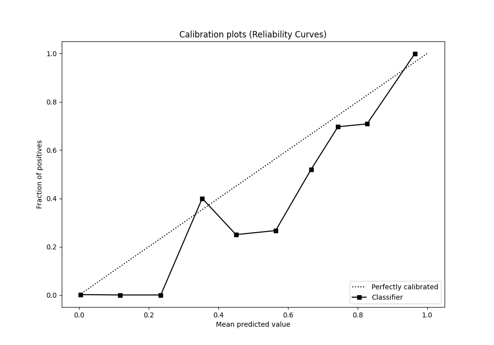

# Summary of 33_CatBoost

[<< Go back](../README.md)

## CatBoost
- **n_jobs**: -1
- **learning_rate**: 0.025
- **depth**: 6
- **rsm**: 1.0
- **loss_function**: Logloss
- **eval_metric**: AUC
- **explain_level**: 0

## Validation
 - **validation_type**: split
 - **train_ratio**: 0.8
 - **shuffle**: True
 - **stratify**: True

## Optimized metric
auc

## Training time

3.0 seconds

## Metric details
|           |    score |     threshold |
|:----------|---------:|--------------:|
| logloss   | 0.323337 | nan           |
| auc       | 0.905454 | nan           |
| f1        | 0.792315 |   0.543366    |
| accuracy  | 0.830597 |   0.543366    |
| precision | 0.785714 |   0.667718    |
| recall    | 1        |   0.000189986 |
| mcc       | 0.692317 |   0.543366    |

## Metric details with threshold from accuracy metric
|           |    score |   threshold |
|:----------|---------:|------------:|
| logloss   | 0.323337 |  nan        |
| auc       | 0.905454 |  nan        |
| f1        | 0.792315 |    0.543366 |
| accuracy  | 0.830597 |    0.543366 |
| precision | 0.666154 |    0.543366 |
| recall    | 0.977427 |    0.543366 |
| mcc       | 0.692317 |    0.543366 |

## Confusion matrix (at threshold=0.543366)
|                     |   Predicted as APPROVED |   Predicted as DECLINED |
|:--------------------|------------------------:|------------------------:|
| Labeled as APPROVED |                     680 |                     217 |
| Labeled as DECLINED |                      10 |                     433 |

## Learning curves

## Confusion Matrix

## Normalized Confusion Matrix

## ROC Curve

## Kolmogorov-Smirnov Statistic

## Precision-Recall Curve

## Calibration Curve

## Cumulative Gains Curve

## Lift Curve

[<< Go back](../README.md)
