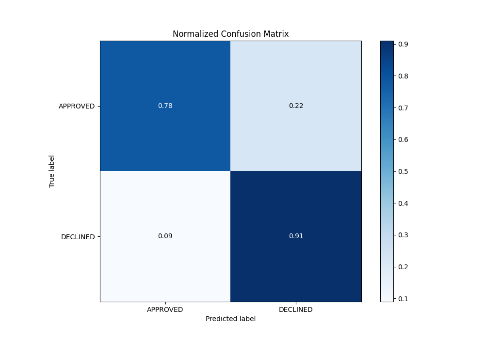
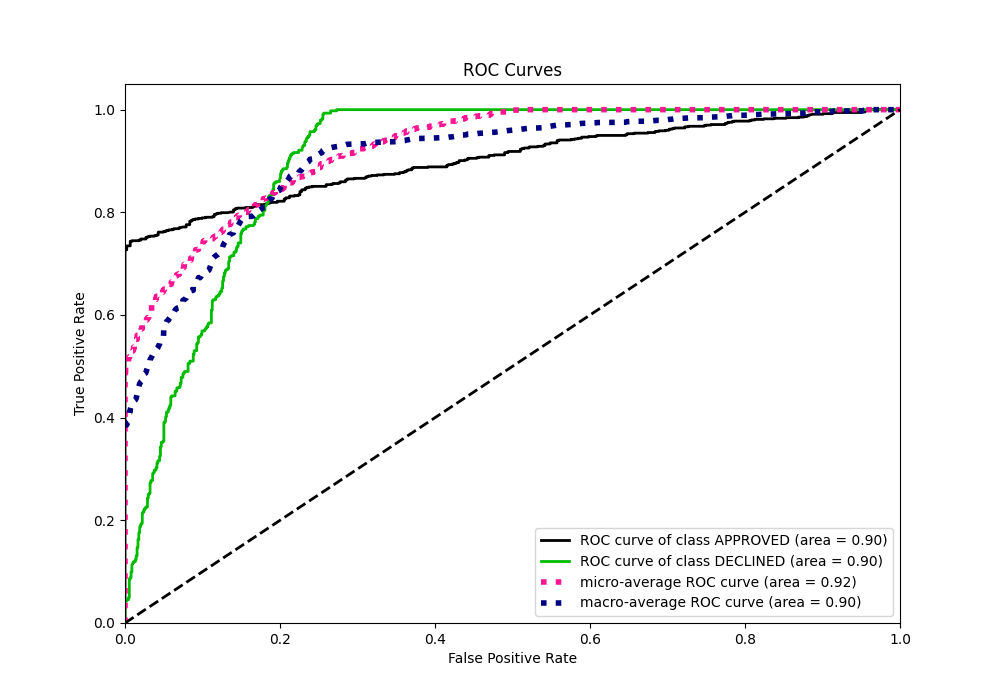
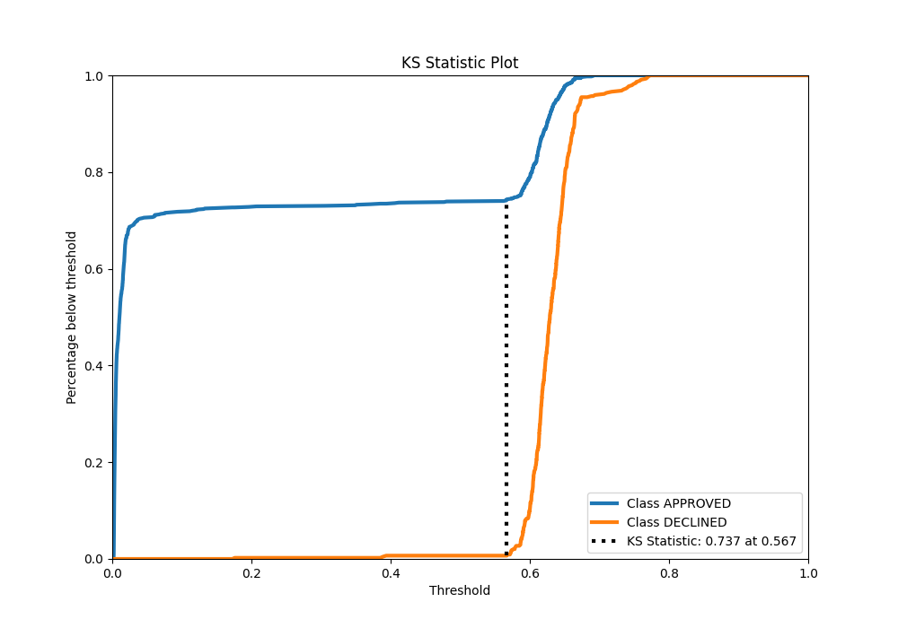
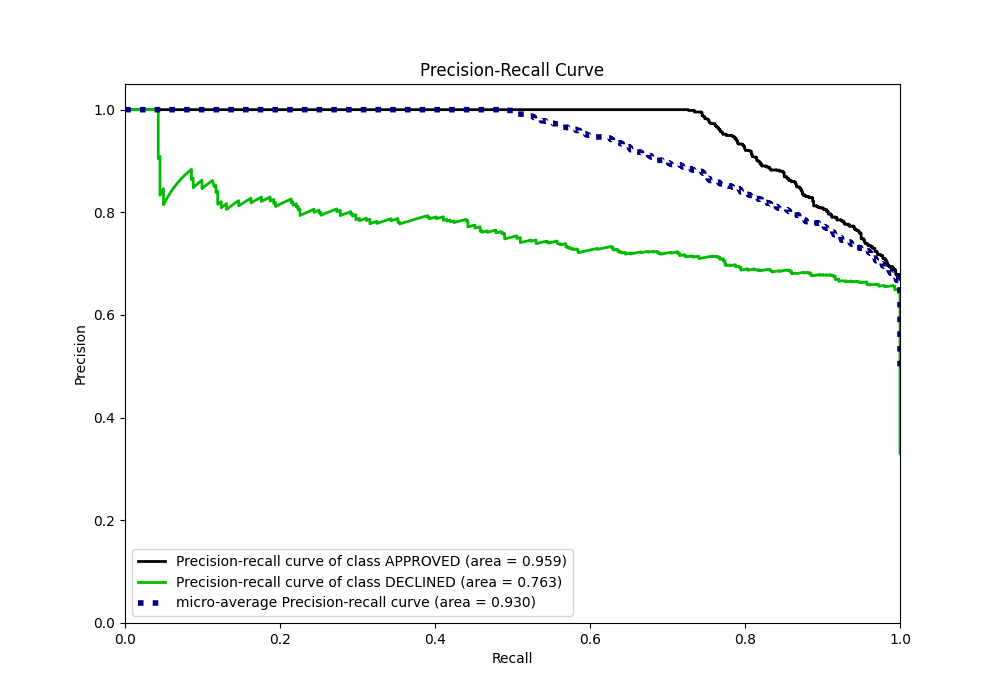
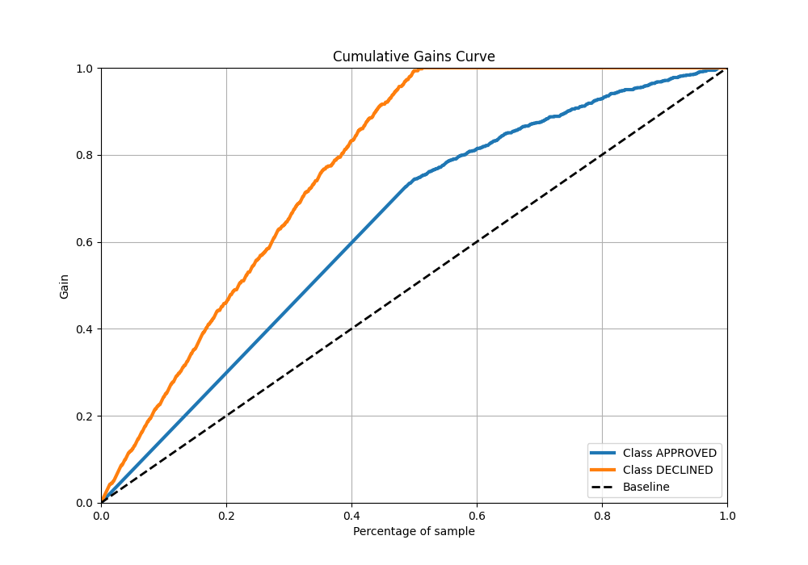
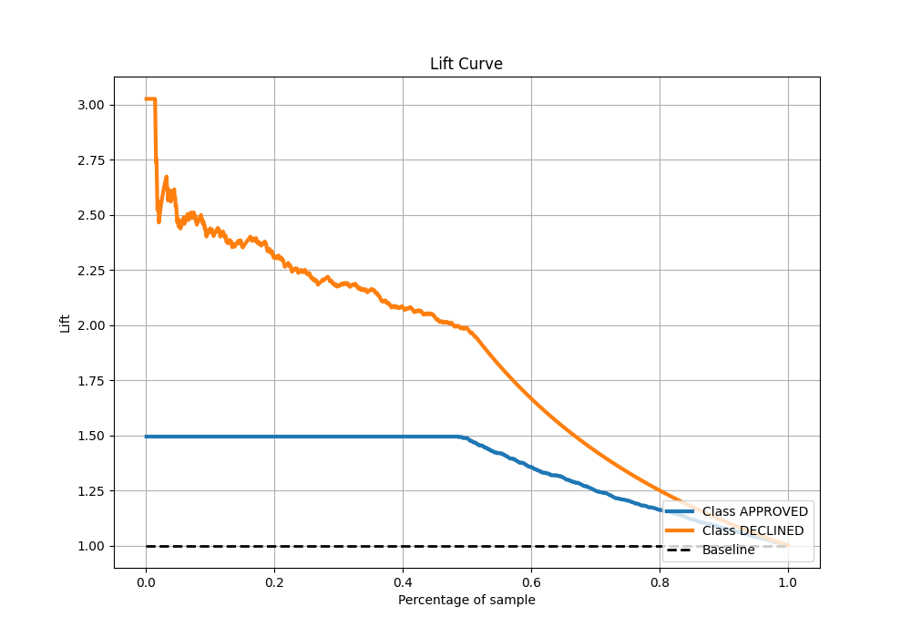

# Summary of 33_CatBoost_KMeansFeatures

[<< Go back](../README.md)

## CatBoost
- **n_jobs**: -1
- **learning_rate**: 0.025
- **depth**: 6
- **rsm**: 1.0
- **loss_function**: Logloss
- **eval_metric**: AUC
- **explain_level**: 0

## Validation
 - **validation_type**: split
 - **train_ratio**: 0.8
 - **shuffle**: True
 - **stratify**: True

## Optimized metric
auc

## Training time

2.7 seconds

## Metric details
|           |    score |   threshold |
|:----------|---------:|------------:|
| logloss   | 0.331207 | nan         |
| auc       | 0.903435 | nan         |
| f1        | 0.786618 |   0.575234  |
| accuracy  | 0.827612 |   0.59807   |
| precision | 0.846154 |   0.664034  |
| recall    | 1        |   0.0016918 |
| mcc       | 0.686974 |   0.444271  |

## Metric details with threshold from accuracy metric
|           |    score |   threshold |
|:----------|---------:|------------:|
| logloss   | 0.331207 |   nan       |
| auc       | 0.903435 |   nan       |
| f1        | 0.778098 |     0.59807 |
| accuracy  | 0.827612 |     0.59807 |
| precision | 0.677258 |     0.59807 |
| recall    | 0.914221 |     0.59807 |
| mcc       | 0.661546 |     0.59807 |

## Confusion matrix (at threshold=0.59807)
|                     |   Predicted as APPROVED |   Predicted as DECLINED |
|:--------------------|------------------------:|------------------------:|
| Labeled as APPROVED |                     704 |                     193 |
| Labeled as DECLINED |                      38 |                     405 |

## Learning curves

## Confusion Matrix

## Normalized Confusion Matrix

## ROC Curve

## Kolmogorov-Smirnov Statistic

## Precision-Recall Curve

## Calibration Curve

## Cumulative Gains Curve

## Lift Curve

[<< Go back](../README.md)
