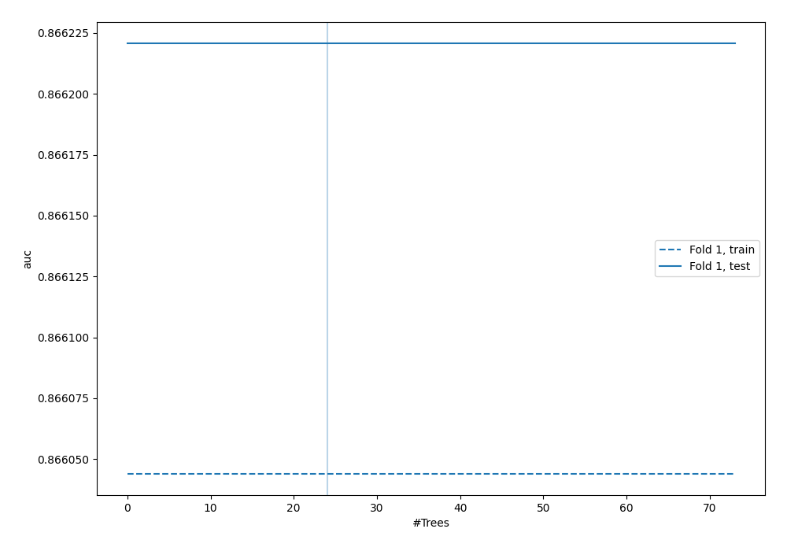
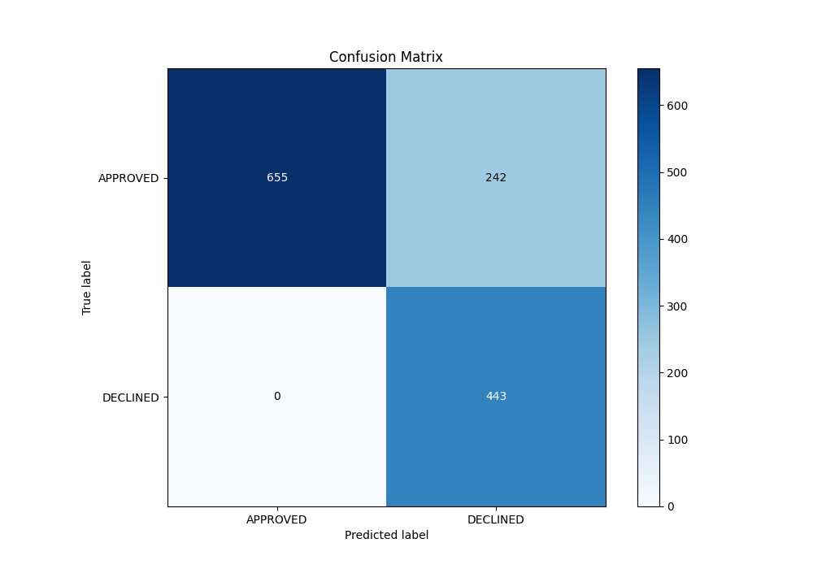
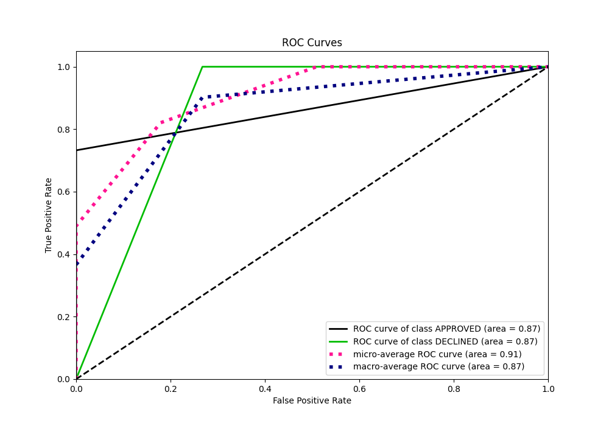
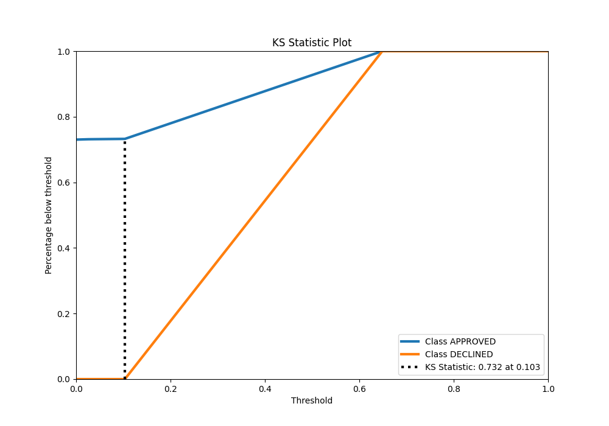
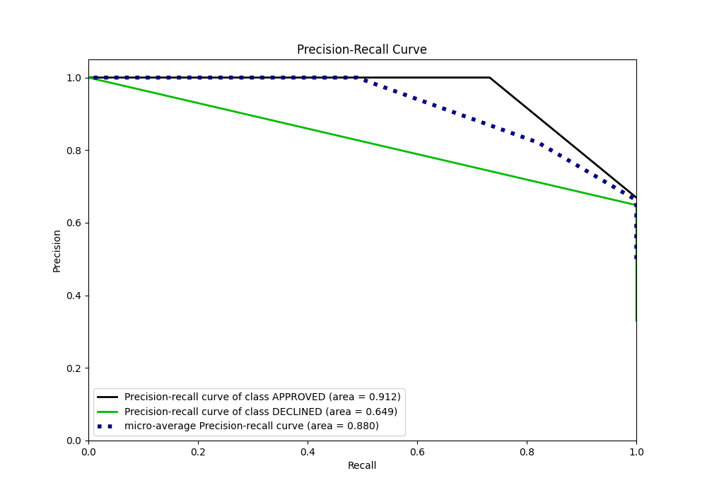
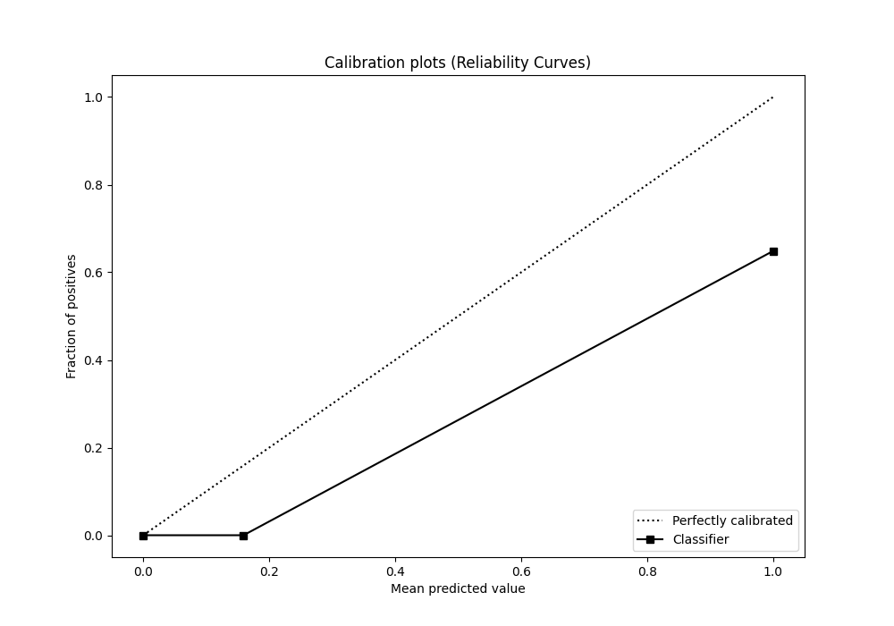
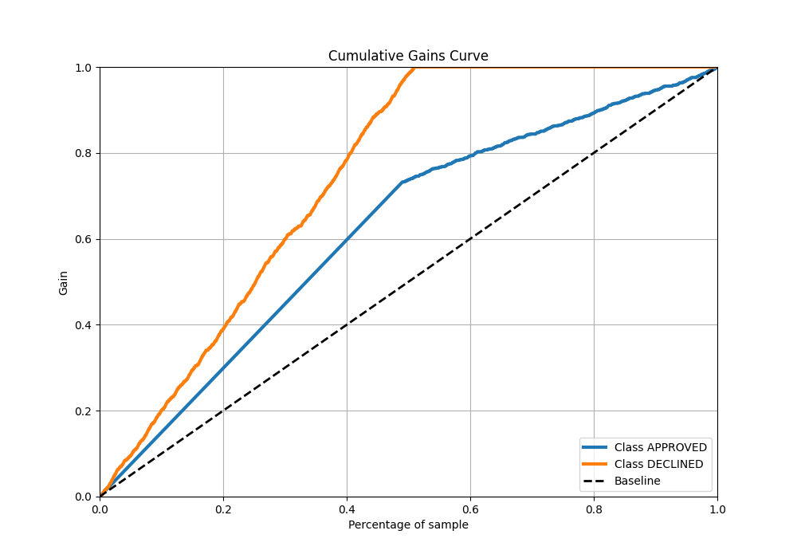
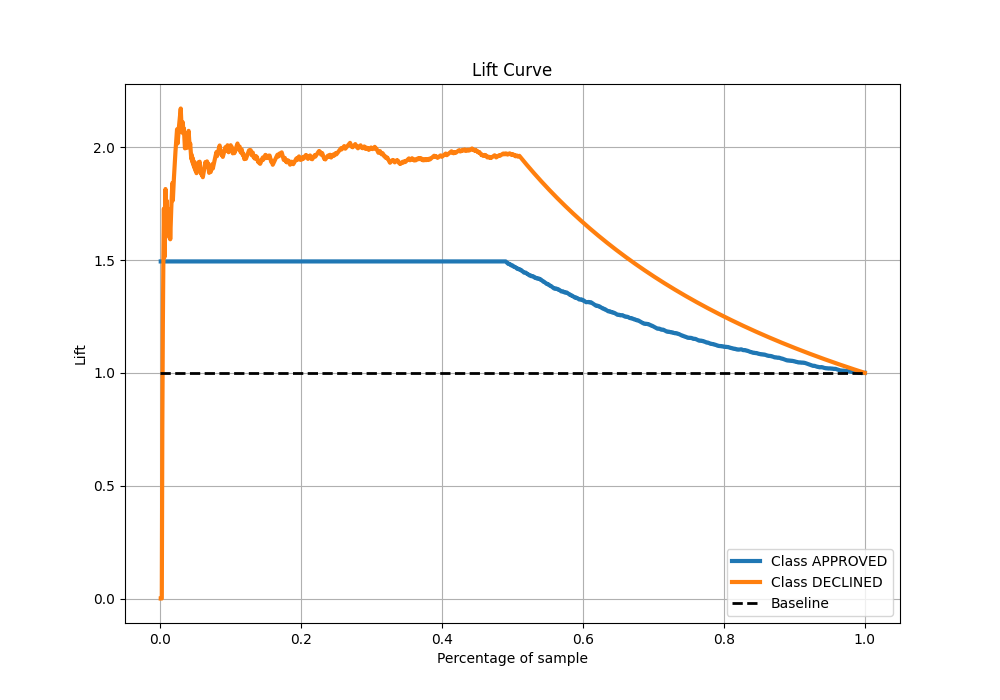

# Summary of 35_RandomForest

[<< Go back](../README.md)

## Random Forest
- **n_jobs**: -1
- **criterion**: entropy
- **max_features**: 1.0
- **min_samples_split**: 20
- **max_depth**: 3
- **eval_metric_name**: auc
- **explain_level**: 0

## Validation
 - **validation_type**: split
 - **train_ratio**: 0.8
 - **shuffle**: True
 - **stratify**: True

## Optimized metric
auc

## Training time

1.5 seconds

## Metric details
|           |    score |   threshold |
|:----------|---------:|------------:|
| logloss   | 0.330542 |         nan |
| auc       | 0.866221 |         nan |
| f1        | 0.785461 |           0 |
| accuracy  | 0.819403 |           0 |
| precision | 0.646715 |           0 |
| recall    | 1        |           0 |
| mcc       | 0.687197 |           0 |

## Metric details with threshold from accuracy metric
|           |    score |   threshold |
|:----------|---------:|------------:|
| logloss   | 0.330542 |         nan |
| auc       | 0.866221 |         nan |
| f1        | 0.785461 |           0 |
| accuracy  | 0.819403 |           0 |
| precision | 0.646715 |           0 |
| recall    | 1        |           0 |
| mcc       | 0.687197 |           0 |

## Confusion matrix (at threshold=0.0)
|                     |   Predicted as APPROVED |   Predicted as DECLINED |
|:--------------------|------------------------:|------------------------:|
| Labeled as APPROVED |                     655 |                     242 |
| Labeled as DECLINED |                       0 |                     443 |

## Learning curves

## Confusion Matrix

## Normalized Confusion Matrix

## ROC Curve

## Kolmogorov-Smirnov Statistic

## Precision-Recall Curve

## Calibration Curve

## Cumulative Gains Curve

## Lift Curve

[<< Go back](../README.md)
