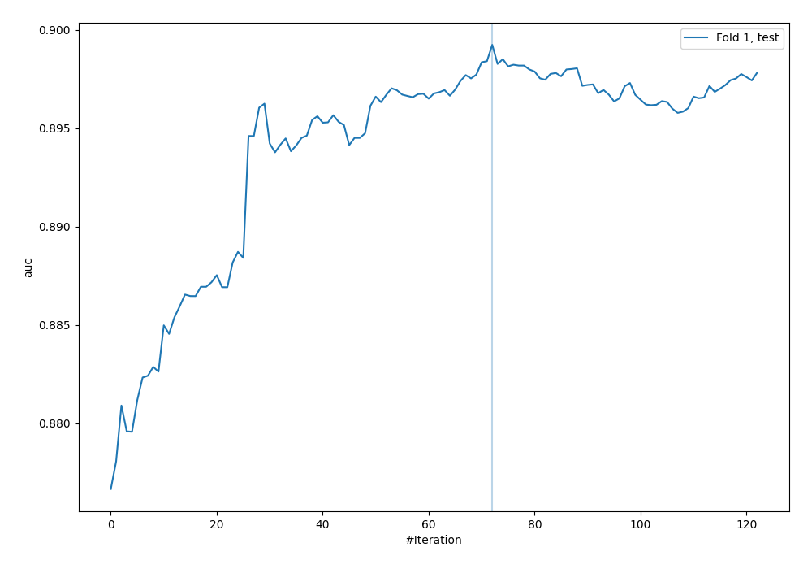
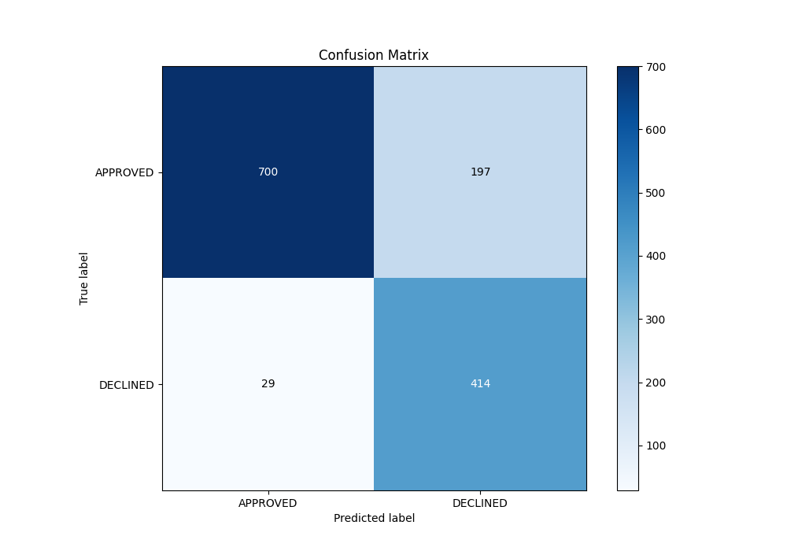
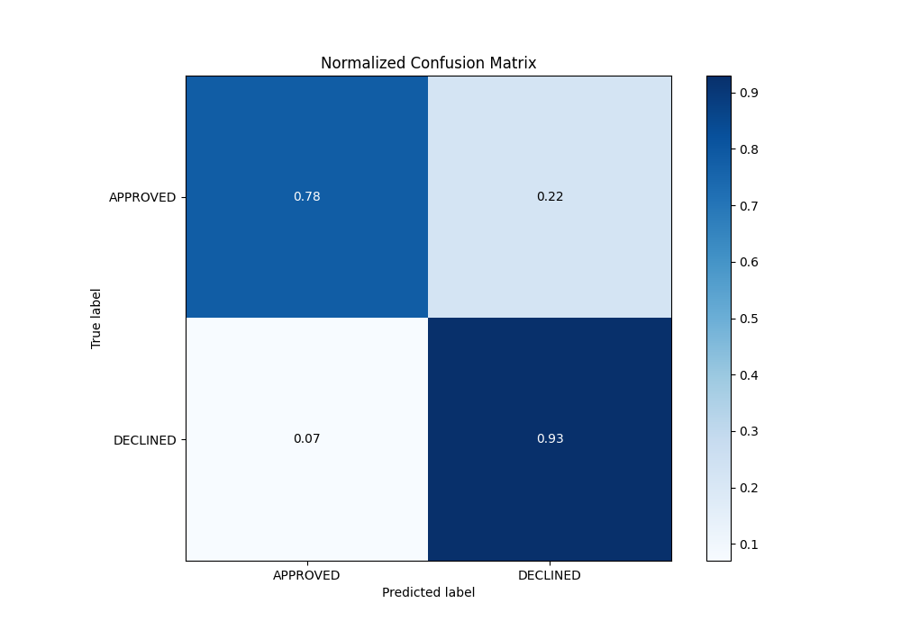
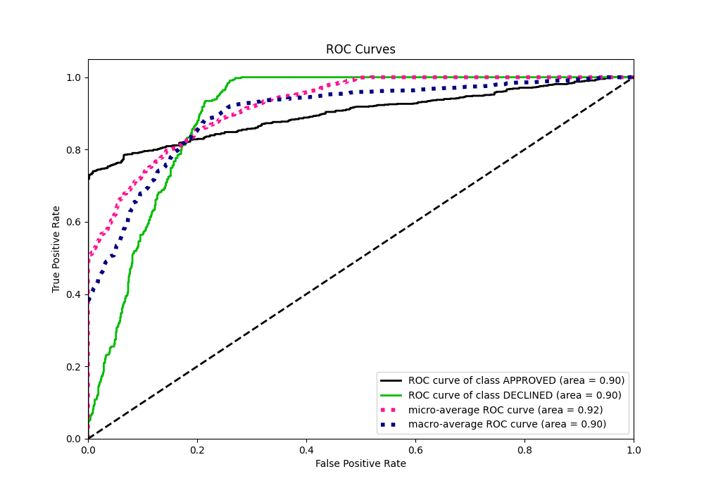
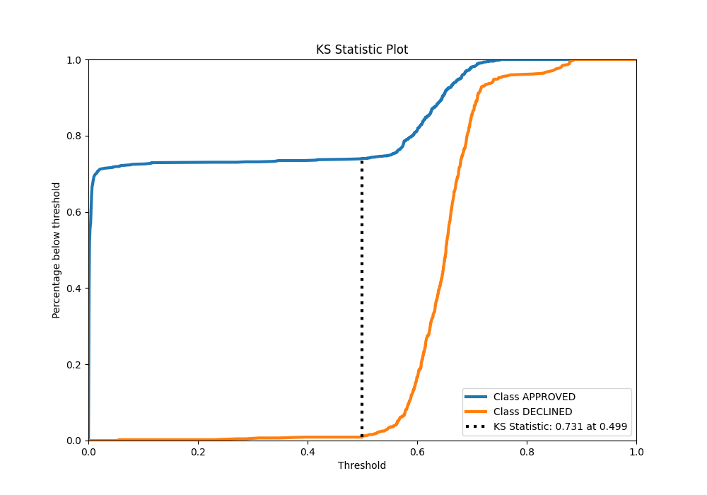
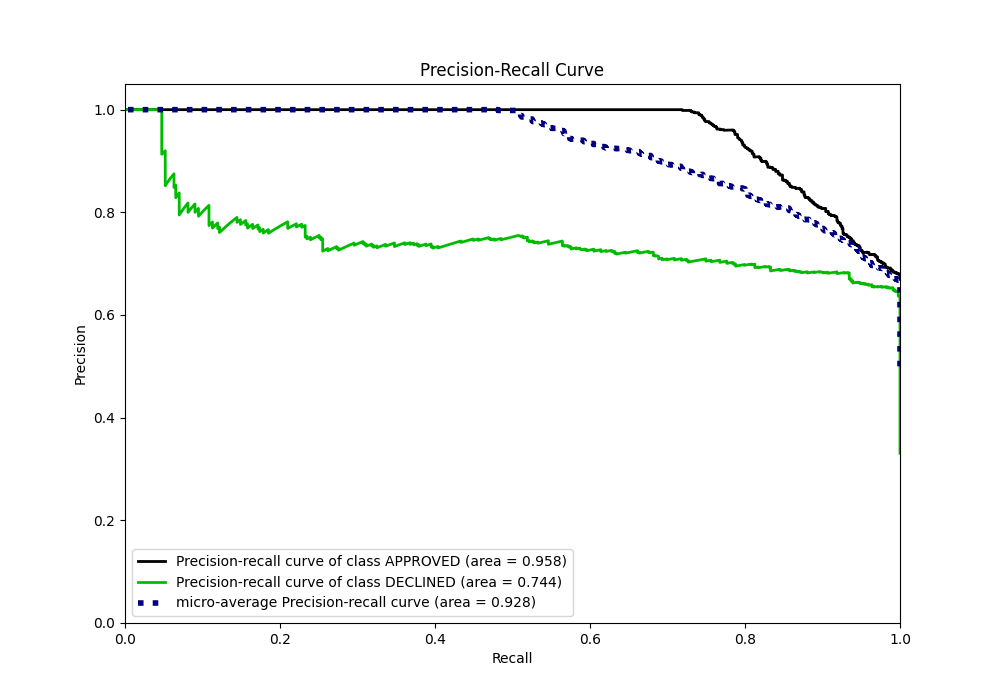
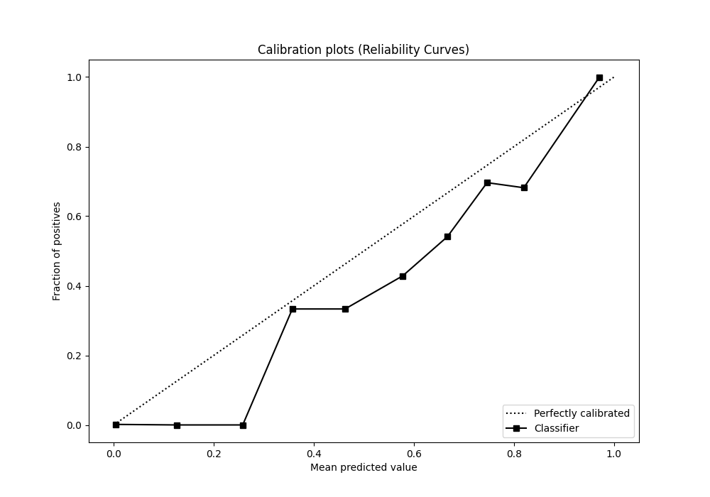
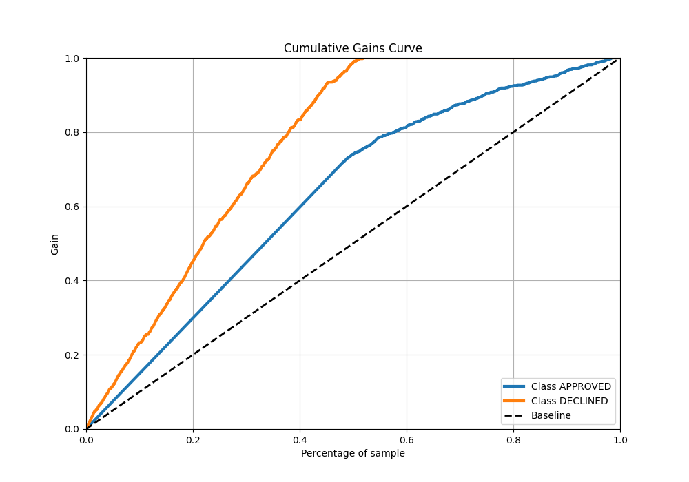
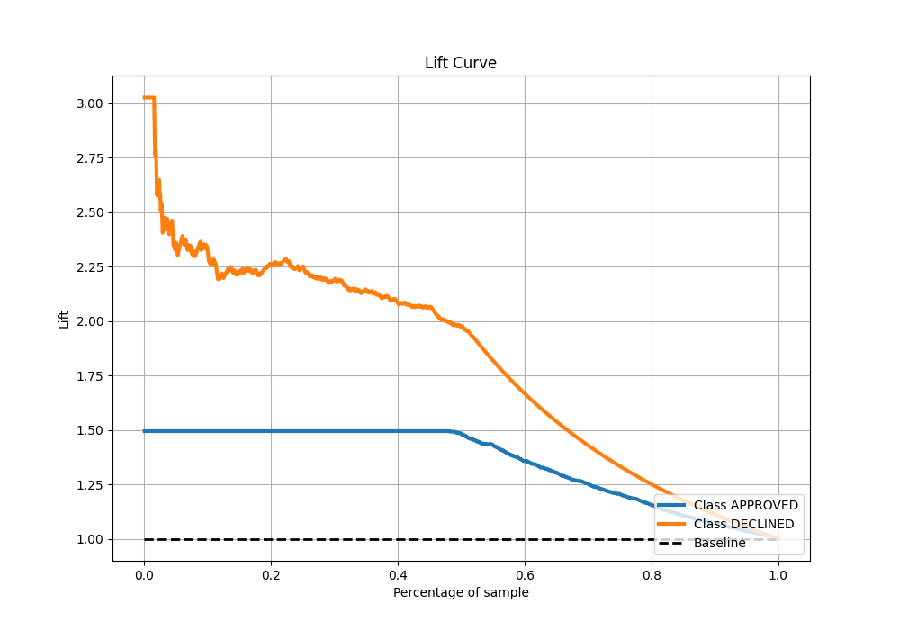

# Summary of 3_Default_CatBoost

[<< Go back](../README.md)

## CatBoost
- **n_jobs**: -1
- **learning_rate**: 0.1
- **depth**: 6
- **rsm**: 1
- **loss_function**: Logloss
- **eval_metric**: AUC
- **explain_level**: 0

## Validation
 - **validation_type**: split
 - **train_ratio**: 0.8
 - **shuffle**: True
 - **stratify**: True

## Optimized metric
auc

## Training time

1.3 seconds

## Metric details
|           |    score |     threshold |
|:----------|---------:|--------------:|
| logloss   | 0.324859 | nan           |
| auc       | 0.899233 | nan           |
| f1        | 0.785579 |   0.57565     |
| accuracy  | 0.831343 |   0.57565     |
| precision | 0.807692 |   0.710717    |
| recall    | 1        |   0.000119401 |
| mcc       | 0.683801 |   0.417287    |

## Metric details with threshold from accuracy metric
|           |    score |   threshold |
|:----------|---------:|------------:|
| logloss   | 0.324859 |   nan       |
| auc       | 0.899233 |   nan       |
| f1        | 0.785579 |     0.57565 |
| accuracy  | 0.831343 |     0.57565 |
| precision | 0.677578 |     0.57565 |
| recall    | 0.934537 |     0.57565 |
| mcc       | 0.675257 |     0.57565 |

## Confusion matrix (at threshold=0.57565)
|                     |   Predicted as APPROVED |   Predicted as DECLINED |
|:--------------------|------------------------:|------------------------:|
| Labeled as APPROVED |                     700 |                     197 |
| Labeled as DECLINED |                      29 |                     414 |

## Learning curves

## Confusion Matrix

## Normalized Confusion Matrix

## ROC Curve

## Kolmogorov-Smirnov Statistic

## Precision-Recall Curve

## Calibration Curve

## Cumulative Gains Curve

## Lift Curve

[<< Go back](../README.md)
