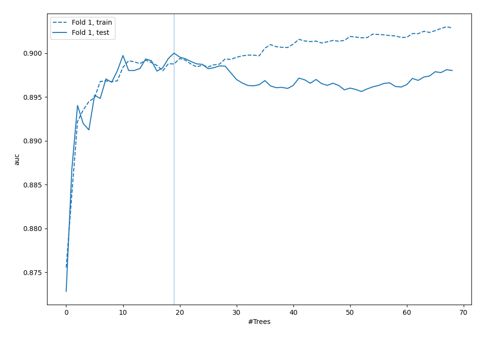
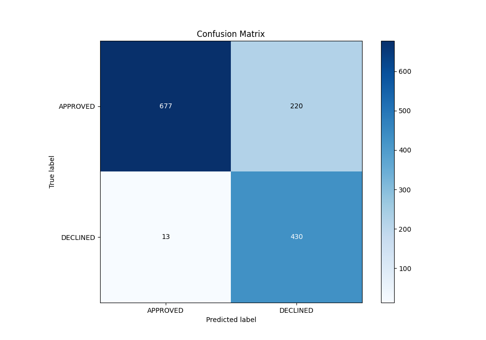
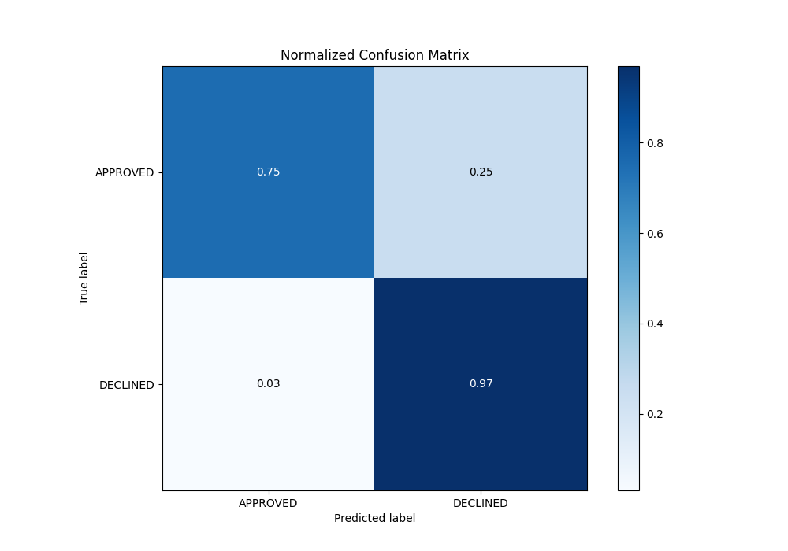
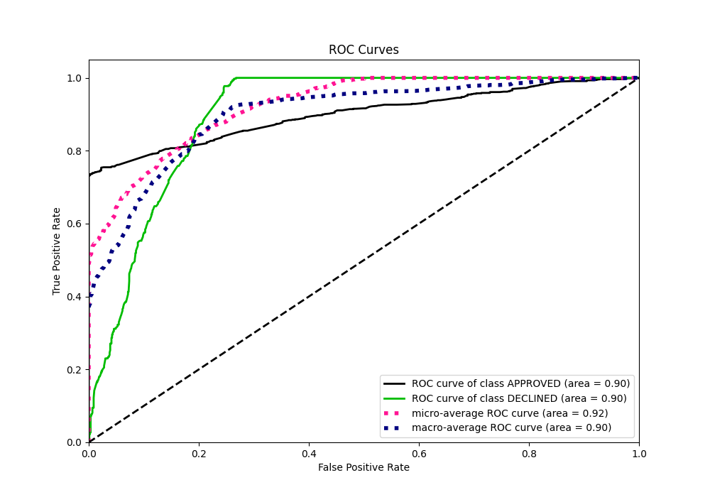
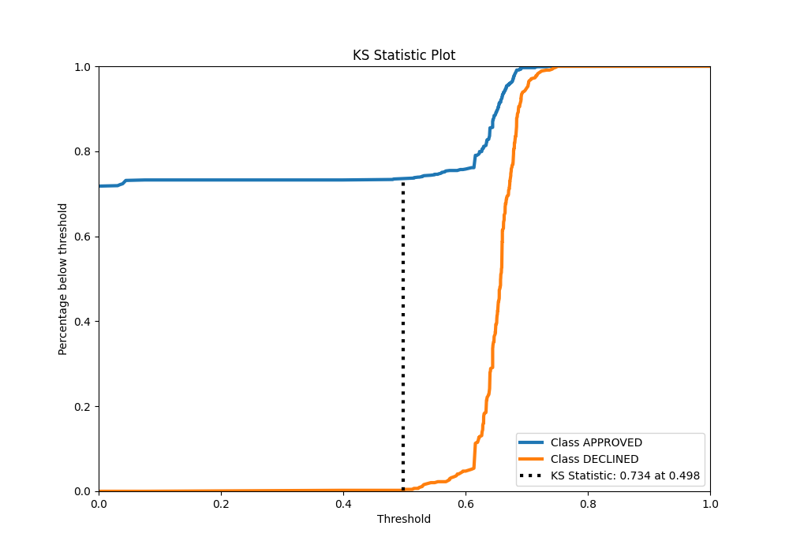
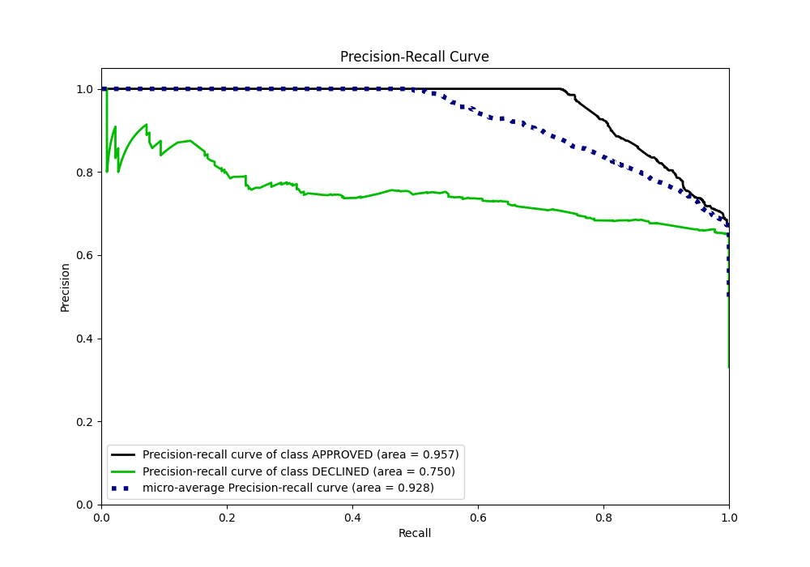
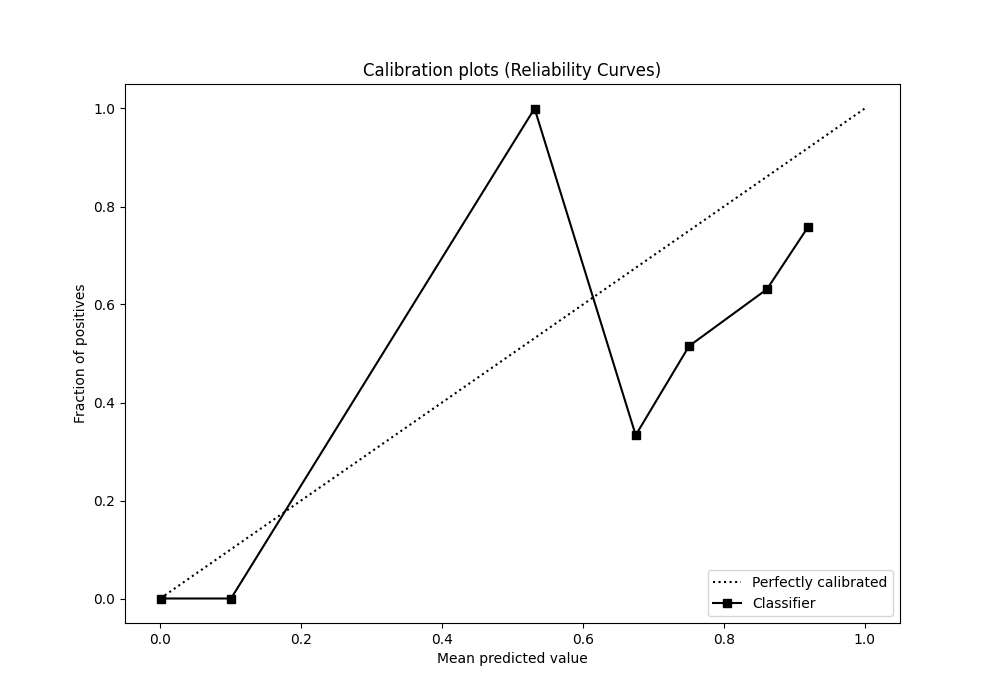
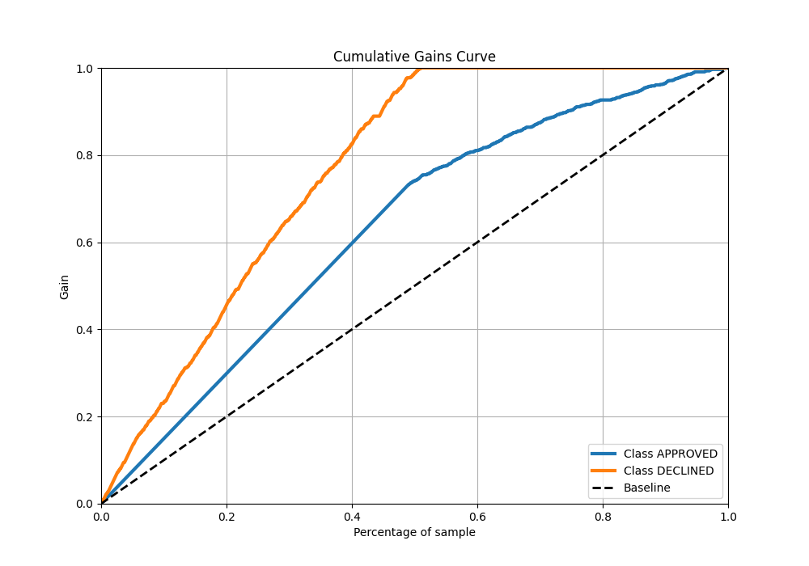
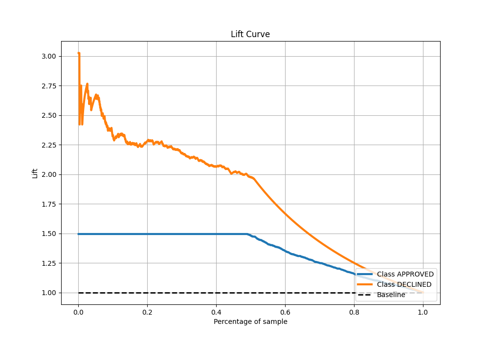

# Summary of 40_RandomForest

[<< Go back](../README.md)

## Random Forest
- **n_jobs**: -1
- **criterion**: entropy
- **max_features**: 0.8
- **min_samples_split**: 40
- **max_depth**: 6
- **eval_metric_name**: auc
- **explain_level**: 0

## Validation
 - **validation_type**: split
 - **train_ratio**: 0.8
 - **shuffle**: True
 - **stratify**: True

## Optimized metric
auc

## Training time

2.3 seconds

## Metric details
|           |    score |   threshold |
|:----------|---------:|------------:|
| logloss   | 0.324815 | nan         |
| auc       | 0.900007 | nan         |
| f1        | 0.786825 |   0.575033  |
| accuracy  | 0.826119 |   0.575033  |
| precision | 0.875    |   0.683488  |
| recall    | 1        |   0         |
| mcc       | 0.688224 |   0.0444733 |

## Metric details with threshold from accuracy metric
|           |    score |   threshold |
|:----------|---------:|------------:|
| logloss   | 0.324815 |  nan        |
| auc       | 0.900007 |  nan        |
| f1        | 0.786825 |    0.575033 |
| accuracy  | 0.826119 |    0.575033 |
| precision | 0.661538 |    0.575033 |
| recall    | 0.970655 |    0.575033 |
| mcc       | 0.682794 |    0.575033 |

## Confusion matrix (at threshold=0.575033)
|                     |   Predicted as APPROVED |   Predicted as DECLINED |
|:--------------------|------------------------:|------------------------:|
| Labeled as APPROVED |                     677 |                     220 |
| Labeled as DECLINED |                      13 |                     430 |

## Learning curves

## Confusion Matrix

## Normalized Confusion Matrix

## ROC Curve

## Kolmogorov-Smirnov Statistic

## Precision-Recall Curve

## Calibration Curve

## Cumulative Gains Curve

## Lift Curve

[<< Go back](../README.md)
