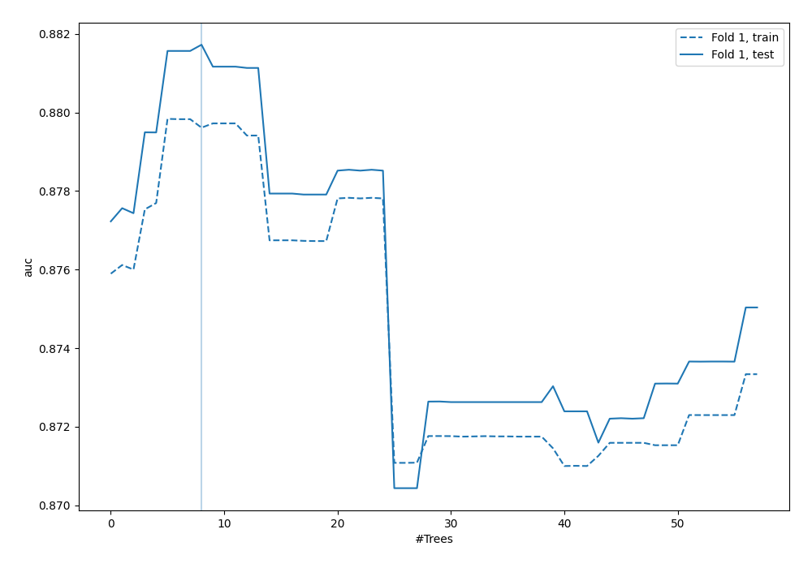
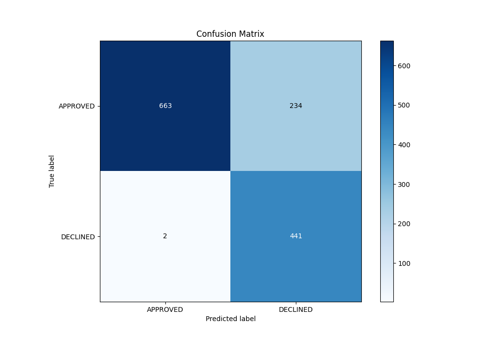
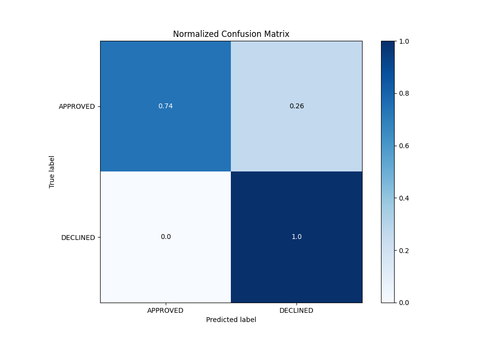
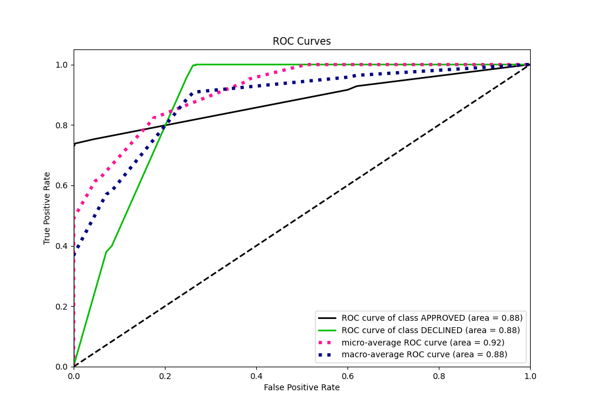
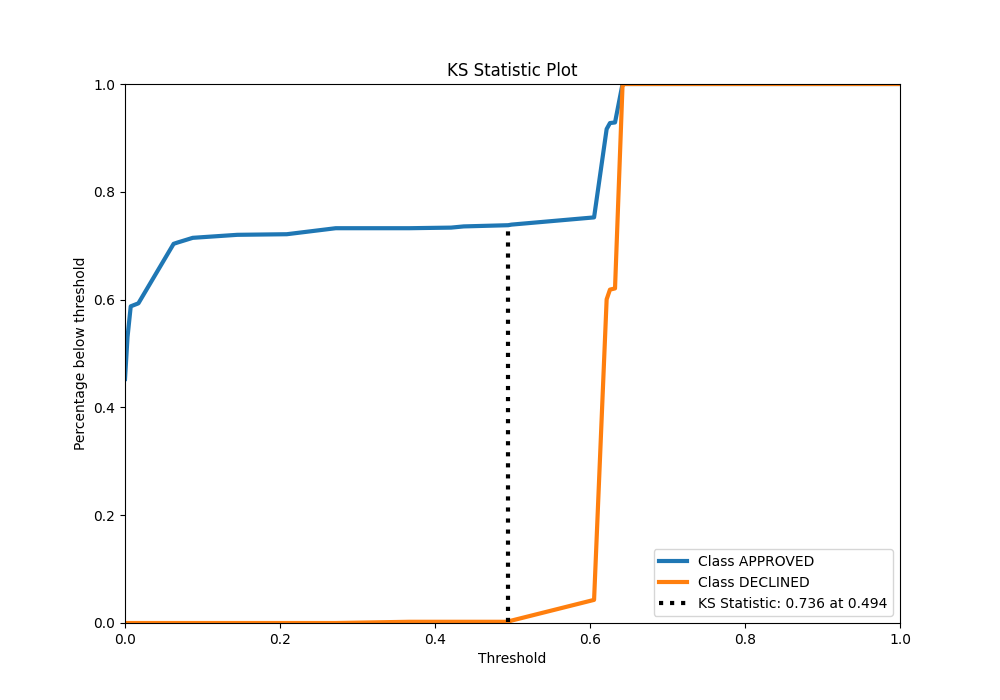
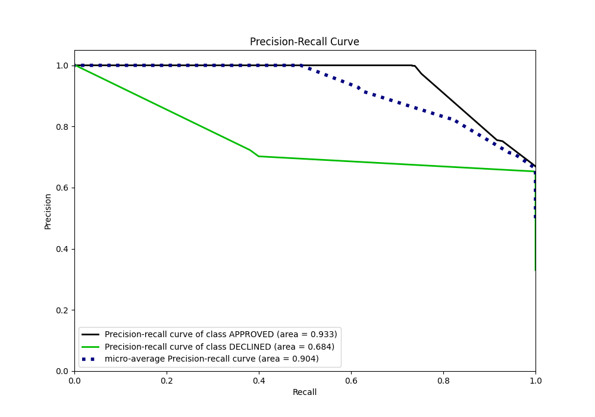
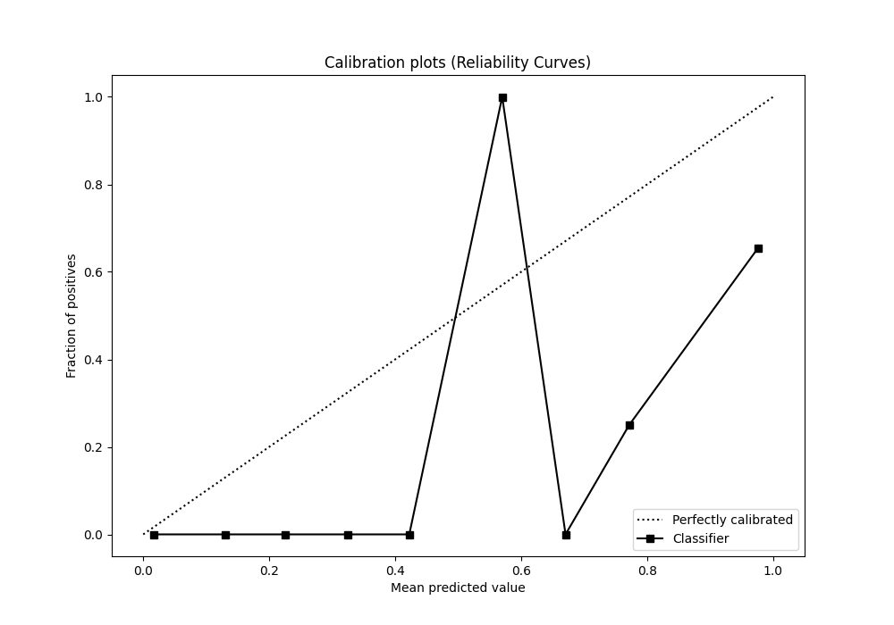
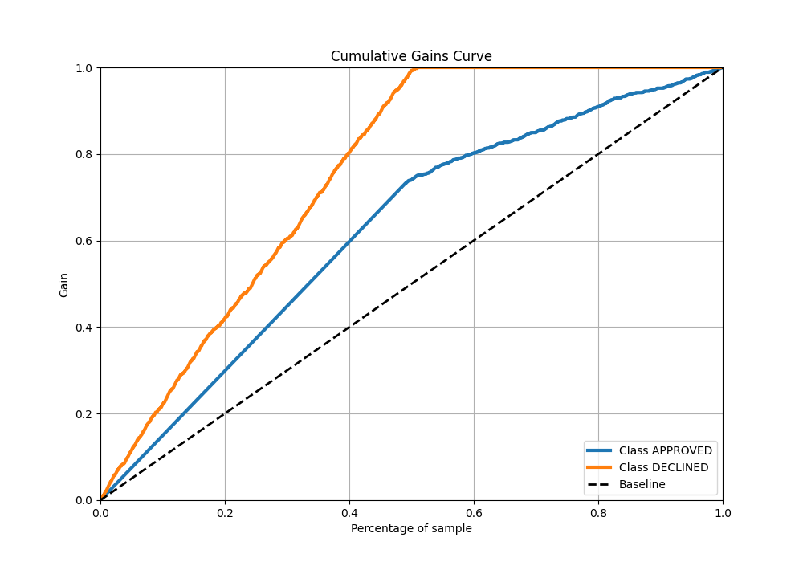
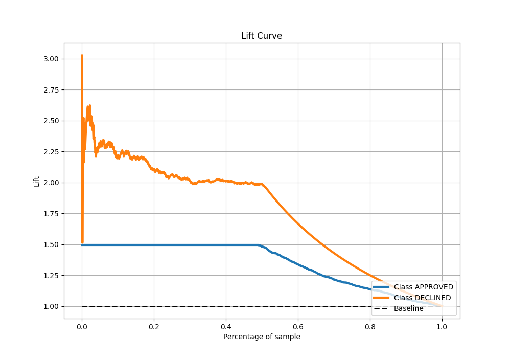

# Summary of 41_RandomForest

[<< Go back](../README.md)

## Random Forest
- **n_jobs**: -1
- **criterion**: entropy
- **max_features**: 0.7
- **min_samples_split**: 40
- **max_depth**: 3
- **eval_metric_name**: auc
- **explain_level**: 0

## Validation
 - **validation_type**: split
 - **train_ratio**: 0.8
 - **shuffle**: True
 - **stratify**: True

## Optimized metric
auc

## Training time

2.2 seconds

## Metric details
|           |    score |   threshold |
|:----------|---------:|------------:|
| logloss   | 0.337897 |  nan        |
| auc       | 0.881726 |  nan        |
| f1        | 0.788909 |    0.498759 |
| accuracy  | 0.823881 |    0.498759 |
| precision | 1        |    0.641974 |
| recall    | 1        |    0        |
| mcc       | 0.691187 |    0.498759 |

## Metric details with threshold from accuracy metric
|           |    score |   threshold |
|:----------|---------:|------------:|
| logloss   | 0.337897 |  nan        |
| auc       | 0.881726 |  nan        |
| f1        | 0.788909 |    0.498759 |
| accuracy  | 0.823881 |    0.498759 |
| precision | 0.653333 |    0.498759 |
| recall    | 0.995485 |    0.498759 |
| mcc       | 0.691187 |    0.498759 |

## Confusion matrix (at threshold=0.498759)
|                     |   Predicted as APPROVED |   Predicted as DECLINED |
|:--------------------|------------------------:|------------------------:|
| Labeled as APPROVED |                     663 |                     234 |
| Labeled as DECLINED |                       2 |                     441 |

## Learning curves

## Confusion Matrix

## Normalized Confusion Matrix

## ROC Curve

## Kolmogorov-Smirnov Statistic

## Precision-Recall Curve

## Calibration Curve

## Cumulative Gains Curve

## Lift Curve

[<< Go back](../README.md)
