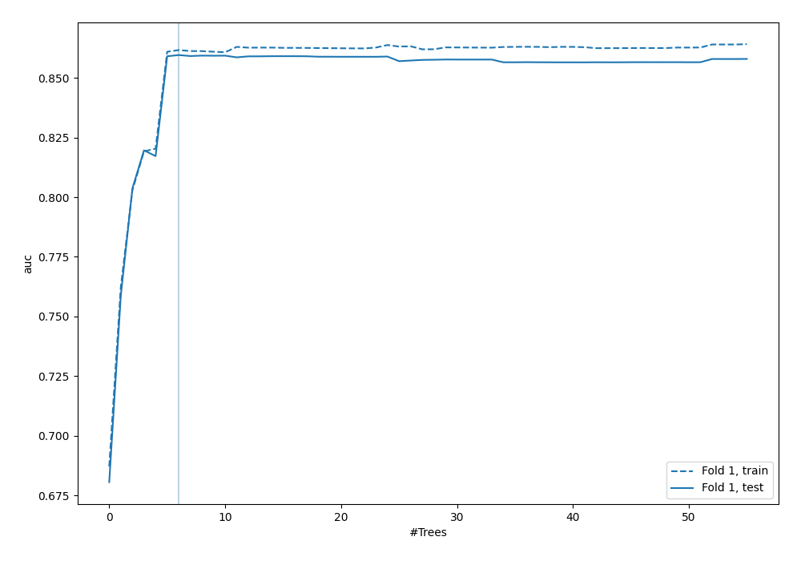
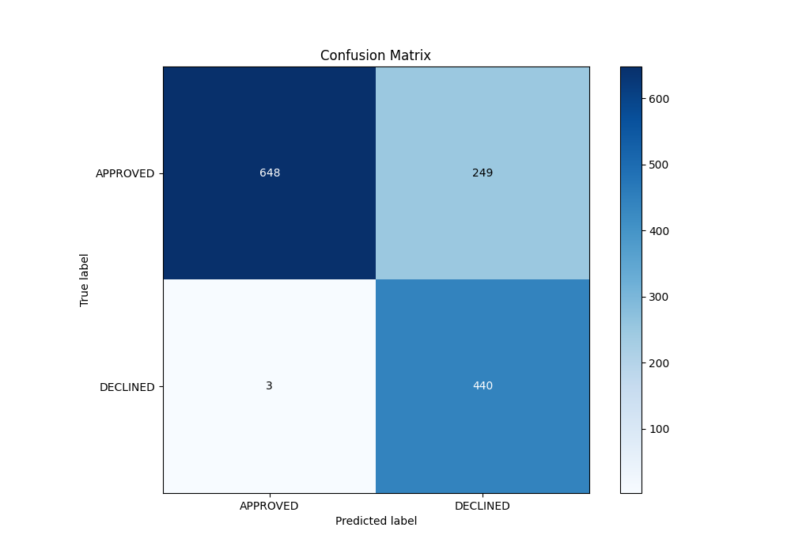
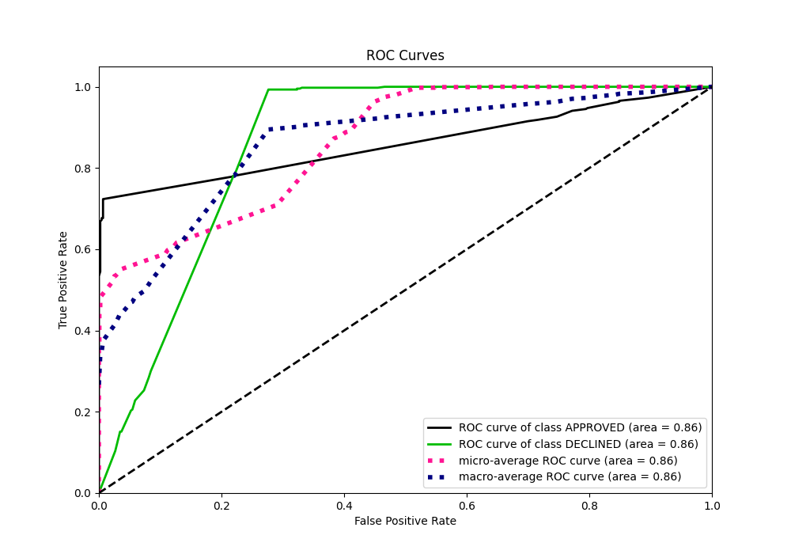
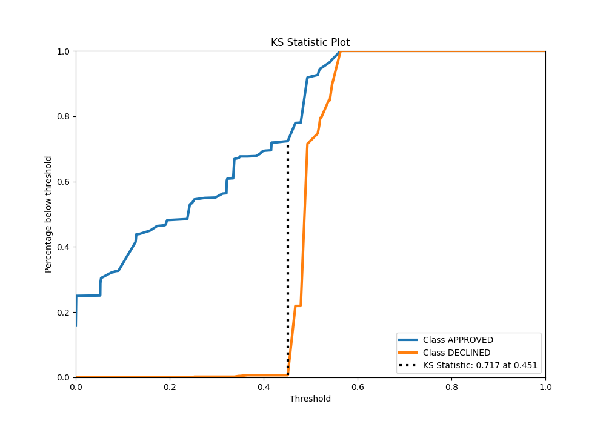
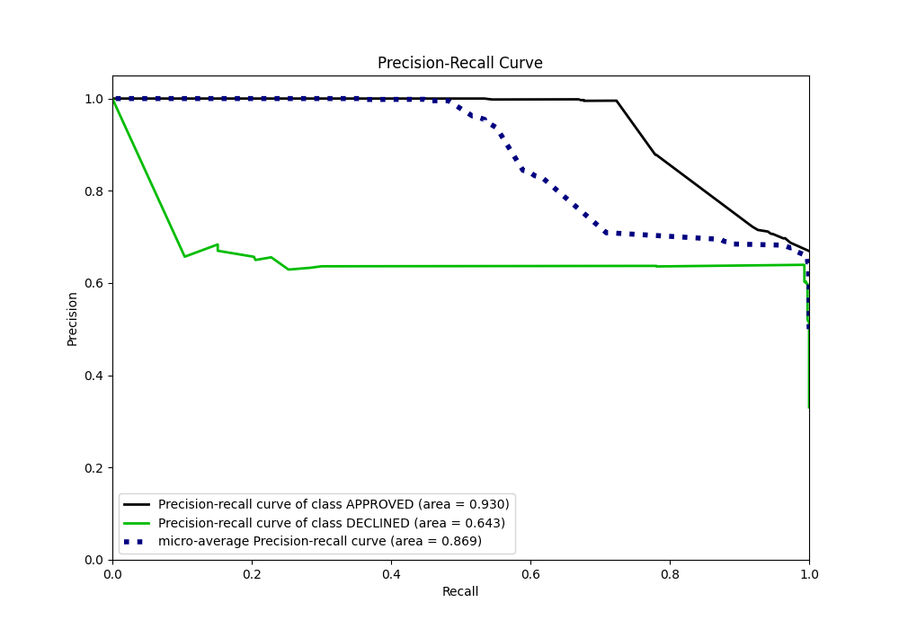
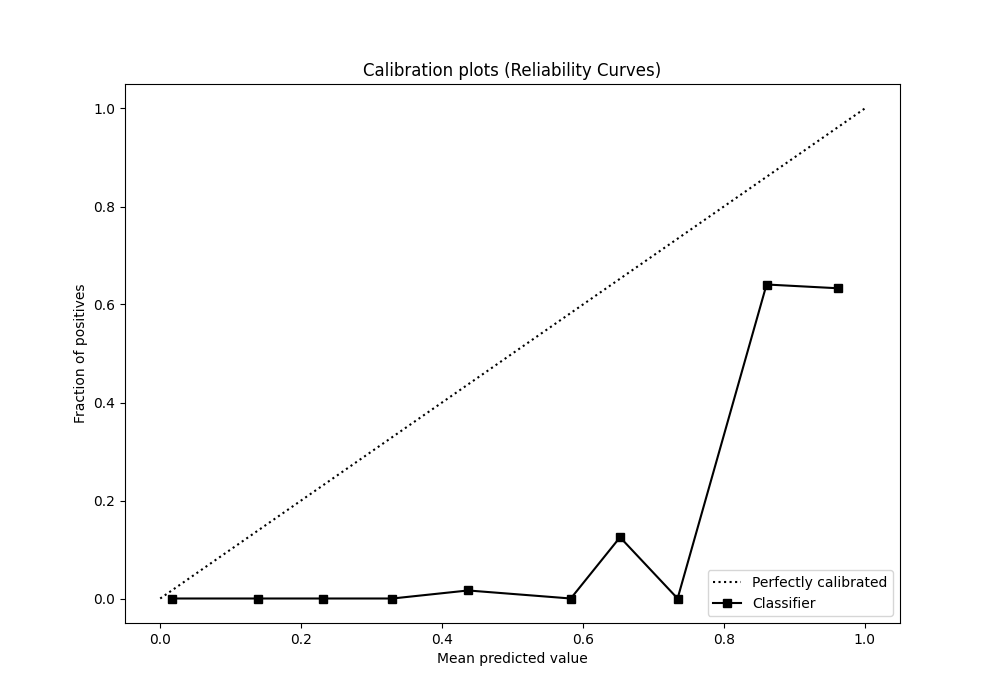
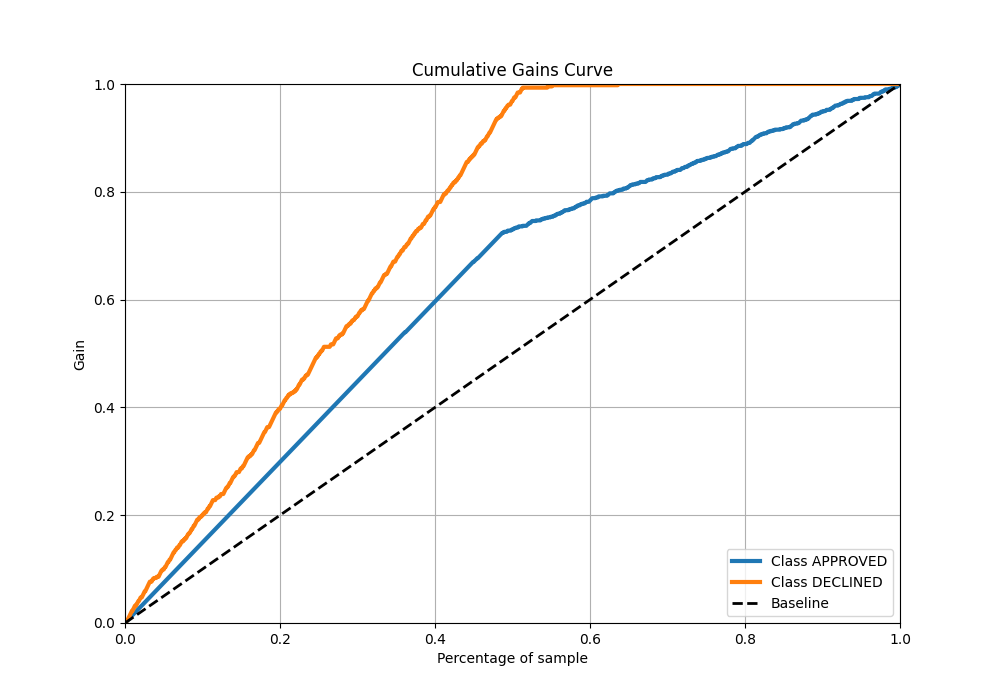
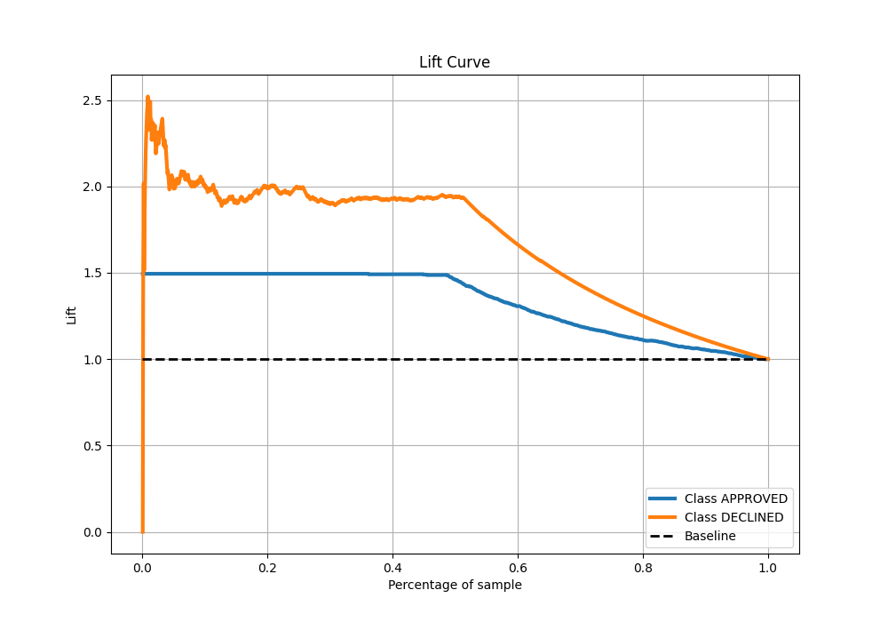

# Summary of 44_ExtraTrees

[<< Go back](../README.md)

## Extra Trees Classifier (Extra Trees)
- **n_jobs**: -1
- **criterion**: entropy
- **max_features**: 1.0
- **min_samples_split**: 20
- **max_depth**: 3
- **eval_metric_name**: auc
- **explain_level**: 0

## Validation
 - **validation_type**: split
 - **train_ratio**: 0.8
 - **shuffle**: True
 - **stratify**: True

## Optimized metric
auc

## Training time

1.6 seconds

## Metric details
|           |    score |   threshold |
|:----------|---------:|------------:|
| logloss   | 0.441362 |  nan        |
| auc       | 0.859598 |  nan        |
| f1        | 0.777385 |    0.44702  |
| accuracy  | 0.81194  |    0.44702  |
| precision | 0.67     |    0.538797 |
| recall    | 1        |    0        |
| mcc       | 0.673582 |    0.44702  |

## Metric details with threshold from accuracy metric
|           |    score |   threshold |
|:----------|---------:|------------:|
| logloss   | 0.441362 |   nan       |
| auc       | 0.859598 |   nan       |
| f1        | 0.777385 |     0.44702 |
| accuracy  | 0.81194  |     0.44702 |
| precision | 0.638607 |     0.44702 |
| recall    | 0.993228 |     0.44702 |
| mcc       | 0.673582 |     0.44702 |

## Confusion matrix (at threshold=0.44702)
|                     |   Predicted as APPROVED |   Predicted as DECLINED |
|:--------------------|------------------------:|------------------------:|
| Labeled as APPROVED |                     648 |                     249 |
| Labeled as DECLINED |                       3 |                     440 |

## Learning curves

## Confusion Matrix

## Normalized Confusion Matrix

## ROC Curve

## Kolmogorov-Smirnov Statistic

## Precision-Recall Curve

## Calibration Curve

## Cumulative Gains Curve

## Lift Curve

[<< Go back](../README.md)
