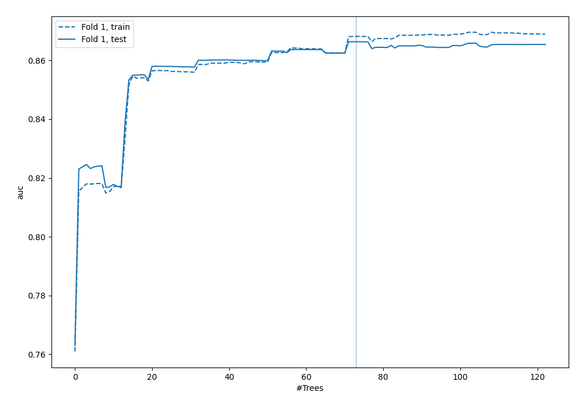
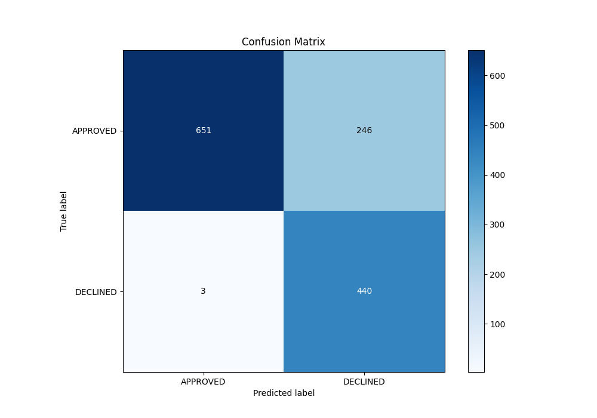
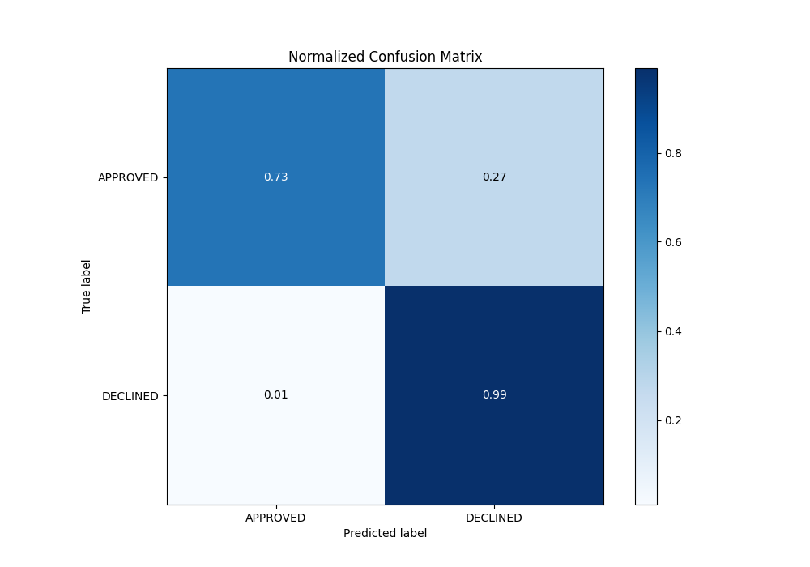
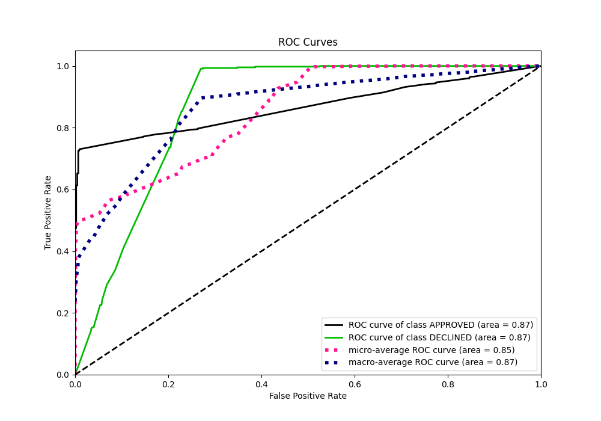
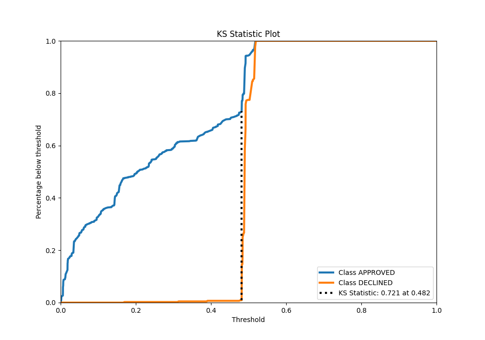
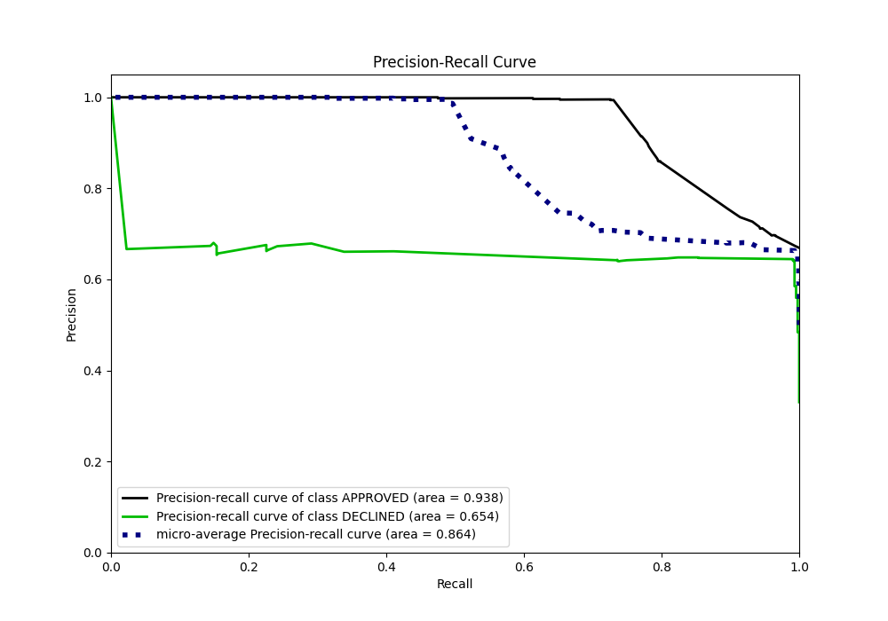
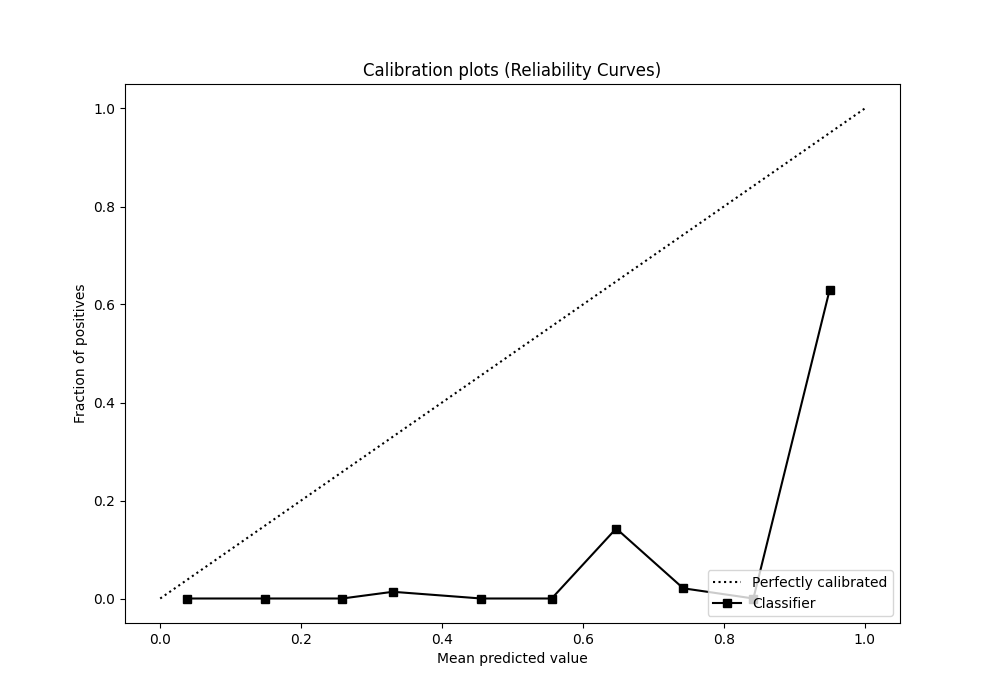
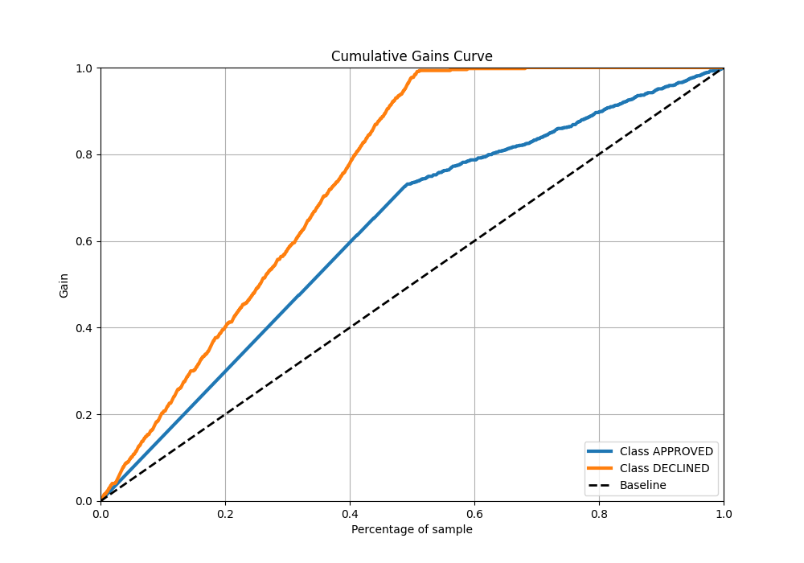
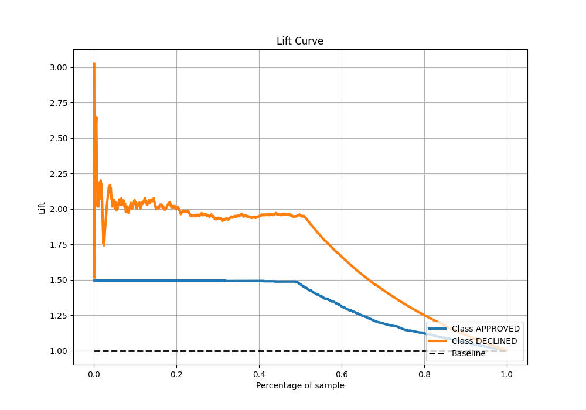

# Summary of 45_ExtraTrees

[<< Go back](../README.md)

## Extra Trees Classifier (Extra Trees)
- **n_jobs**: -1
- **criterion**: gini
- **max_features**: 1.0
- **min_samples_split**: 30
- **max_depth**: 3
- **eval_metric_name**: auc
- **explain_level**: 0

## Validation
 - **validation_type**: split
 - **train_ratio**: 0.8
 - **shuffle**: True
 - **stratify**: True

## Optimized metric
auc

## Training time

2.5 seconds

## Metric details
|           |    score |     threshold |
|:----------|---------:|--------------:|
| logloss   | 0.448072 | nan           |
| auc       | 0.866364 | nan           |
| f1        | 0.779451 |   0.475028    |
| accuracy  | 0.814179 |   0.475028    |
| precision | 0.678947 |   0.492086    |
| recall    | 1        |   0.000620555 |
| mcc       | 0.67665  |   0.475028    |

## Metric details with threshold from accuracy metric
|           |    score |   threshold |
|:----------|---------:|------------:|
| logloss   | 0.448072 |  nan        |
| auc       | 0.866364 |  nan        |
| f1        | 0.779451 |    0.475028 |
| accuracy  | 0.814179 |    0.475028 |
| precision | 0.641399 |    0.475028 |
| recall    | 0.993228 |    0.475028 |
| mcc       | 0.67665  |    0.475028 |

## Confusion matrix (at threshold=0.475028)
|                     |   Predicted as APPROVED |   Predicted as DECLINED |
|:--------------------|------------------------:|------------------------:|
| Labeled as APPROVED |                     651 |                     246 |
| Labeled as DECLINED |                       3 |                     440 |

## Learning curves

## Confusion Matrix

## Normalized Confusion Matrix

## ROC Curve

## Kolmogorov-Smirnov Statistic

## Precision-Recall Curve

## Calibration Curve

## Cumulative Gains Curve

## Lift Curve

[<< Go back](../README.md)
