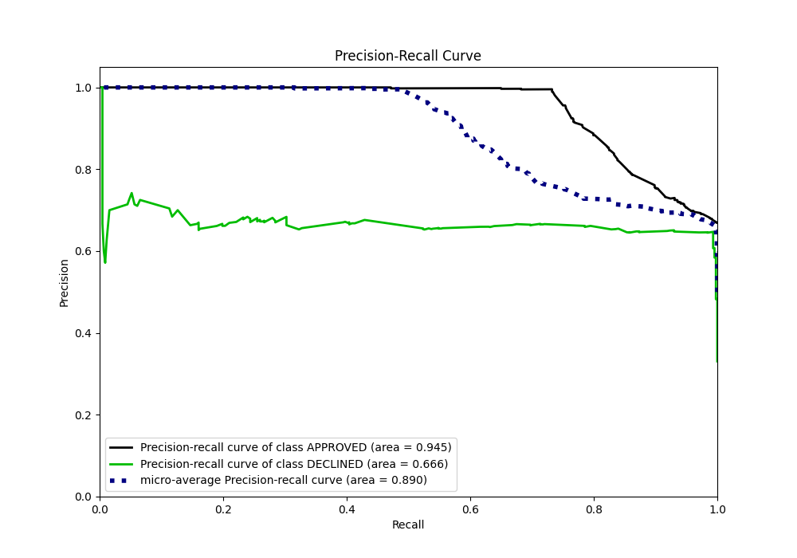

# Summary of 46_ExtraTrees

[<< Go back](../README.md)

## Extra Trees Classifier (Extra Trees)
- **n_jobs**: -1
- **criterion**: gini
- **max_features**: 0.8
- **min_samples_split**: 50
- **max_depth**: 4
- **eval_metric_name**: auc
- **explain_level**: 0

## Validation
 - **validation_type**: split
 - **train_ratio**: 0.8
 - **shuffle**: True
 - **stratify**: True

## Optimized metric
auc

## Training time

2.2 seconds

## Metric details
|           |    score |     threshold |
|:----------|---------:|--------------:|
| logloss   | 0.436375 | nan           |
| auc       | 0.871274 | nan           |
| f1        | 0.779267 |   0.482756    |
| accuracy  | 0.815672 |   0.482756    |
| precision | 0.725    |   0.53843     |
| recall    | 1        |   8.98443e-05 |
| mcc       | 0.674282 |   0.482756    |

## Metric details with threshold from accuracy metric
|           |    score |   threshold |
|:----------|---------:|------------:|
| logloss   | 0.436375 |  nan        |
| auc       | 0.871274 |  nan        |
| f1        | 0.779267 |    0.482756 |
| accuracy  | 0.815672 |    0.482756 |
| precision | 0.64497  |    0.482756 |
| recall    | 0.984199 |    0.482756 |
| mcc       | 0.674282 |    0.482756 |

## Confusion matrix (at threshold=0.482756)
|                     |   Predicted as APPROVED |   Predicted as DECLINED |
|:--------------------|------------------------:|------------------------:|
| Labeled as APPROVED |                     657 |                     240 |
| Labeled as DECLINED |                       7 |                     436 |

## Learning curves

## Confusion Matrix

## Normalized Confusion Matrix

## ROC Curve

## Kolmogorov-Smirnov Statistic

## Precision-Recall Curve

## Calibration Curve

## Cumulative Gains Curve

## Lift Curve

[<< Go back](../README.md)
